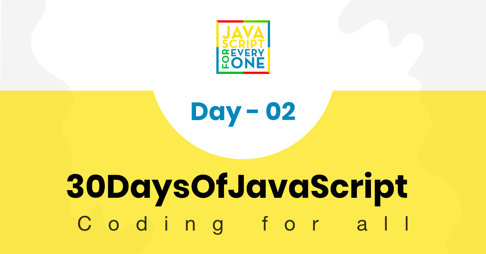

##  Table of Contents

[<< Day 1](https://github.com/Asabeneh/30DaysOfJavaScript/blob/master/readMe.md) | [Day 3 >>](https://github.com/Asabeneh/30DaysOfJavaScript/blob/master/03_Day/03_booleans_operators_date.md)
--



- [📔 Day 2](#%f0%9f%93%94-day-2)
  - [Data types](#data-types)
    - [Primitive Data Types](#primitive-data-types)
    - [Non-Primitive Data Types](#non-primitive-data-types)
  - [Numbers](#numbers)
    - [Declaring number data types](#declaring-number-data-types)
    - [Math Object](#math-object)
      - [Random number generator](#random-number-generator)
  - [Strings](#strings)
    - [String Concatenation](#string-concatenation)
      - [Concatenating using addition operator](#concatenating-using-addition-operator)
      - [Long Literal Strings](#long-literal-strings)
      - [Escape Sequences in string](#escape-sequences-in-string)
      - [Template Literals(Template Strings)](#template-literalstemplate-strings)
    - [String Methods](#string-methods)
  - [Checking Data types and Casting](#checking-data-types-and-casting)
    - [Checking data types](#checking-data-types)
    - [Changing data type(Casting)](#changing-data-typecasting)
      - [String to Int](#string-to-int)
      - [String to Float](#string-to-float)
      - [Float to Int](#float-to-int)
- [💻 Day 2: Exercises](#%f0%9f%92%bb-day-2-exercises)

# 📔 Day 2

## Data types

In the previous section, we mentioned a little bit about data types. Data or values have data types. Data types describe the characteristics of data. Data types can be divided into two

1. Primitive data types
2. Non-primitive data types(Object References)

### Primitive Data Types

Primitive data types in JavaScript includes:

 1. Numbers - Integers, floats
 2. Strings - Any data under single or double quote
 3. Booleans - true or false value
 4. Null - empty value or no value
 5. Undefined - a declared variable without a value

Non-primitive data types in JavaScript includes:

1. Objects
2. Functions
3. Arrays

Now, let us see what exactly mean primitive and non-primitive data types.
*Primitive* data types are immutable(non-modifiable) data types. Once a primitive data type is created we can not modify it.
**Example:**

```js
let word = 'JavaScript'
```

If we try to modify the string stored in variable *word*, JavaScript will raise an error. Any data type under a single quote, double-quote, or backtick is a string data type.

```js
word[0] = 'Y'
```

This expression does not change the string stored in the variable *word*. So, we can say that strings are not modifiable or immutable.
Primitive data types are compared by its values. Let us compare different data values. See the example below:

```js
let numOne = 3
let numTwo = 3
console.log(numOne == numTwo)      // true

let js = 'JavaScript'
let py = 'Python'
console.log(js == py)             //false 

let lightOn = true
let lightOff = false
console.log(lightOn == lightOff) // false
```

### Non-Primitive Data Types

*Non-primitive* data types are modifiable or mutable. We can modify the value of non-primitive data types after it gets created.
Let us see by creating an array. An array is a list of data values in a square bracket. Arrays can contain the same or different data types. Array values are referenced by their index. In JavaScript array index starts at zero. I.e., the first element of an array is found at index zero, the second element at index one, and the third element at index two, etc.

```js
let nums = [1, 2, 3]
nums[0] = 10
console.log(nums)  // [10, 2, 3]
```

As you can see, an array in which a non-primitive data type is mutable. Non-primitive data types can not be compared by value. Even if two non-primitive data types have the same properties and values, they are not strictly equal.

```js
let nums = [1, 2, 3]
let numbers = [1, 2, 3]
console.log(nums == numbers)  // false

let userOne = {
name:'Asabeneh',
role:'teaching',
country:'Finland'
}
let userTwo = {
name:'Asabeneh',
role:'teaching',
country:'Finland'
}
console.log(userOne == userTwo)
```

Rule of thumb, we do not compare non-primitive data types. Do not compare array, function, or object.
Non-primitive values are referred to as reference types because they are being compared by reference instead of value. Two objects are only strictly equal if they refer to the same underlying object.

```js
let nums = [1, 2, 3]
let numbers = nums
console.log(nums == numbers)  // true

let userOne = {
name:'Asabeneh',
role:'teaching',
country:'Finland'
}
let userTwo = userOne
console.log(userOne == userTwo)  // true
```

If you have a hard time understanding the difference between primitive data types and non-primitive data types, you are not the only one. Calm down and just go to the next section and try to come back after some time. Now let us start the data types by number type.

## Numbers

Numbers are integers and decimal values which can do all the arithmetic operations.
Lets' see some examples of Numbers.

### Declaring number data types

```js
let age = 35
const gravity = 9.81 //we use const for non-changing values, gravitational constant in  m/s2
let mass = 72 // mass in Kilogram
const PI = 3.14 // pi a geometrical constant

//More Examples
const boilingPoint = 100 // temperature in oC, boiling point of water which is a constant
const bodyTemp = 37 // oC average human body temperature, which is a constant
console.log(age, gravity, mass, PI, boilingPoint, bodyTemp)
```

### Math Object

In JavaScript the Math Object provides a lots of methods to work with numbers.

```js
const PI = Math.PI

console.log(PI)                           // 3.141592653589793
// Rounding to the closest number
// if above .5 up if less 0.5 down rounding
console.log(Math.round(PI))               // 3; to round values to the nearest number
console.log(Math.round(9.81))             // 10

console.log(Math.floor(PI))               // 3; rounding down

console.log(Math.ceil(PI))                // 4; rounding up

console.log(Math.min(-5, 3, 20, 4,5, 10)) // -5, returns the minimum value

console.log(Math.max(-5, 3, 20, 4,5, 10)) // 20, returns the maximum value

const randNum = Math.random() // creates random number between 0 to 0.999999
console.log(randNum)
// Let create random number between 0 to 10
const num = Math.floor(Math.random () * 11) // creates random number between 0 and 10
console.log(num)

//Absolute value
console.log(Math.abs(-10))    //10
//Square root
console.log(Math.sqrt(100))     // 10
console.log(Math.sqrt(2))      //1.4142135623730951
// Power
console.log(Math.pow(3, 2)) // 9
console.log(Math.E) // 2.718

// Logarithm
//Returns the natural logarithm of base E of x, Math.log(x)
console.log(Math.log(2))    // 0.6931471805599453
console.log(Math.log(10))   // 2.302585092994046

// Trigonometry
Math.sin(0)
Math.sin(60)

Math.cos(0)
Math.cos(60)
```

#### Random number generator

The JavaScript Math Object has a random() method number generator which generates number from 0 to 0.999999999...

```js
let randomNum = Math.random() // generates 0 to 0.999
```

Now, let us see how we can use random() method to generate a random number between 0 and 10 inclusive.

```js
let randomNum = Math.random()         // generates 0 to 0.999
let numBtnZeroAndTen = randomNum * 11
console.log(numBtnZeroAndTen)         // this gives: min 0 and max 10.99
let randomNumRoundToFloor = Math.floor(numBtnZeroAndTen)
console.log(randomNumRoundToFloor)    // this gives between 0 and 10
```

## Strings

Strings are texts, which are under **_single_** or **_double_** quote. To declare a string, we need a variable name, assignment operator, a value under a single quote, double-quote, or backtick.
Lets' see some examples of string:

```js
let space = ' '           // an empty space string
let firstName = 'Asabeneh'
let lastName = 'Yetayeh'
let country = 'Finland'
let city = 'Helsinki'
let language = 'JavaScript'
let job = 'teacher'
```

### String Concatenation

Connect two or more strings together is called concatenation.

```js
// Declaring different variables of different data types
let space = ' '
let firstName = 'Asabeneh'
let lastName = 'Yetayeh'
let country = 'Finland'
let city = 'Helsinki'
let language = 'JavaScript'
let job = 'teacher'
```

```js
let fullName = firstName + space + lastName; // concatenation, merging two string together.
console.log(fullName);
```

```sh
// out
Asabeneh Yetayeh
```

We can concatenate string in different ways.

#### Concatenating using addition operator

Concatenating using the addition operator is an old way. This way of concatenating is tedious and error-prone. It is good to know how to concatenate this way, but I strongly suggest to use the second way.

```js
// Declaring different variables of different data types
let space = ' '
let firstName = 'Asabeneh'
let lastName = 'Yetayeh'
let country = 'Finland'
let city = 'Helsinki'
let language = 'JavaScript'
let job = 'teacher'
let age = 250
let fullName = firstName + space + lastName
let personInfoOne = fullName + '. I am ' + age + '. I live in ' + country; // ES5
console.log(personInfoOne)
```

```sh
Asabeneh Yetayeh. I am 250. I live in Finland
```

#### Long Literal Strings

A string could be a single character or paragraph or a page. If the string length is too big it does not fit in one line. We can use the backslash character (\) at the end of each line to indicate that the string will continue on the next line.
**Example:**

```js
const paragraph = "My name is Asabeneh Yetayeh. I live in Finland, Helsinki.\
I am a teacher and I love teaching. I teach HTML, CSS, JavaScript, React, Redux, \
Node.js, Python, Data Analysis and D3.js for anyone who is interested to learn. \
In the end of 2019, I was thinking to expand my teaching and to reach \
to global audience and I started a Python challenge from November 20 - December 19.\
It was one of the most rewarding and inspiring experience.\
Now, we are in 2020. I am enjoying preparing the 30DaysOfJavaScript challenge and \
I hope you are enjoying too."
console.log(paragraph)
```

#### Escape Sequences in string

In JavaScript and other programming language \ followed by some characters is  an escape sequence. Let's see the most common escape characters:

- \n: new line
- \t: Tab means(8 spaces)
- \\\\: Back slash
- \\': Single quote (')
- \\":Double quote (")
  
```js
console.log('I hope every one is enjoying the 30 Days Of JavaScript challenge.\nDo you ?') // line break
console.log('Days\tTopics\tExercises')
console.log('Day 1\t3\t5')
console.log('Day 2\t3\t5')
console.log('Day 3\t3\t5')
console.log('Day 4\t3\t5')
console.log('This is a back slash  symbol (\\)') // To write a back slash
console.log('In every programming language it starts with \"Hello, World!\"')
console.log("In every programming language it starts with \'Hello, World!\'")
console.log('The saying \'Seeing is Believing\' is\'t correct in 2020')
```

#### Template Literals(Template Strings)

To create a template string, we use two backticks. We can inject data as expression inside a template string. To inject data, we enclose the expression with a curly bracket({}) followed by a $ sign. See the syntax below.

```js
//Syntax
`String literal text`
`String literal text ${expression}`
```

**Example: 1**

```js
console.log(`The sum of 2 and 3 is 5`)
let a = 2
let b = 3
console.log(`The sum of ${a} and ${b} is ${a + b}`)
```

**Example:2**

```js
let firstName = 'Asabeneh'
let lastName = 'Yetayeh'
let country = 'Finland'
let city = 'Helsinki'
let language = 'JavaScript'
let job = 'teacher'
let age = 250
let fullName = firstName + ' ' + lastName

let personInfoTwo = `I am ${fullName}. I am ${age}. I live in ${country}.` //ES6 - String interpolation method
let personInfoThree = `I am ${fullName}. I live in ${city}, ${country}. I am a ${job}. I teach ${language}.`
console.log(personInfoTwo)
console.log(personInfoThree)
```

```sh
I am Asabeneh Yetayeh. I am 250. I live in Finland.
I am Asabeneh Yetayeh. I live in Helsinki, Finland. I am a teacher. I teach JavaScript.
```

Using a string template or string interpolation method, we can add expression, which could be a value or some operations(comparison, arithmetic operations, ternary operation).

```js
let a = 2
let b = 3
console.log(`${a} is greater than ${b}: ${a > b}`)
```

```sh
2 is greater than 3: false
```

### String Methods

Everything in JavaScript is an object. A string is a primitive data type that means we can not modify once it is created. The string object has many string methods. There are different string methods that can help us to work with strings.

1. *length*: The string *length* method returns the number of characters in a string included empty space.
  **Example:**

   ```js
   let js = 'JavaScript'
   console.log(js.length)        // 10
   let firstName = 'Asabeneh'
   console.log(firstName.length) // 8
   ```

2. *Accessing characters in a string*: We can access each character in a string using its index. In programming, counting starts from 0. The first index of the string is zero, and the last index is one minus the length of the string.

  
  
Let us access different characters in 'JavaScript' string.

```js
let string = 'JavaScript'
let firstLetter = string[0]

console.log(firstLetter)        // J

let secondLetter = string[1]    // a
let thirdLetter = string[2]
let lastLetter = string[9]

console.log(lastLetter)          // t

let lastIndex = string.length - 1

console.log(lastIndex)  // 9
console.log(string[lastIndex])   // t
```

1. *toUpperCase()*: this method changes the string to uppercase letters.

```js
let string = 'JavaScript'

console.log(string.toUpperCase())     // JAVASCRIPT

let firstName = 'Asabeneh'

console.log(firstName.toUpperCase())  // ASABENEH

let country = 'Finland'

console.log(country.toUpperCase())    // FINLAND
```

4. *toLowerCase()*: this method changes the string to lowercase letters.

```js
let string = 'JavasCript'

console.log(string.toLowerCase())     // javascript

let firstName = 'Asabeneh'

console.log(firstName.toLowerCase())  // asabeneh

let country = 'Finland'

console.log(country.toLowerCase())   // finland
```

5. *substr()*: It takes two arguments, the starting index and number of characters to slice.

```js
let string = 'JavaScript'
console.log(string.substr(4,6))    // Script

let country = 'Finland'
console.log(country.substr(3, 4))   // land
```

6. *substring()*: It takes two arguments, the starting index and the stopping index but it doesn't include the stopping index.

```js
let string = 'JavaScript'

console.log(string.substring(0,4))     // Java
console.log(string.substring(4,10))    // Script
console.log(string.substring(4))       // Script

let country = 'Finland'

console.log(country.substring(0, 3))   // Fin
console.log(country.substring(3, 7))   // land
console.log(country.substring(3))      // land
```

7. *split()*: The split method splits a string at a specified place.

```js
let string = '30 Days Of JavaScipt'

console.log(string.split())     // ["30 Days Of JavaScript"]
console.log(string.split(' '))  // ["30", "Days", "Of", "JavaScript"]

let firstName = 'Asabeneh'

console.log(firstName.split())    // ["Asabeneh"]
console.log(firstName.split(''))  // ["A", "s", "a", "b", "e", "n", "e", "h"]

let countries = 'Finland, Sweden, Norway, Denmark, and Iceland'

console.log(countries.split(','))  // ["Finland", " Sweden", " Norway", " Denmark", " and Iceland"]
console.log(countries.split(', ')) //  ["Finland", "Sweden", "Norway", "Denmark", "and Iceland"]
```

8. *trim()*: Removes trailing space in the beginning or the end of a string.

```js
let string = '   30 Days Of JavaScript   '

console.log(string)     
console.log(string.trim(' '))

let firstName = ' Asabeneh '

console.log(firstName)
console.log(firstName.trim())
```

```sh
   30 Days Of JavasCript   
30 Days Of JavasCript
  Asabeneh 
Asabeneh
```

9. *includes()*: It takes a substring argument and it check if substring argument exists in the string. *includes()* returns a boolean. It checks if a substring exist in a string and it returns true if it exists and false if it doesn't exist.

```js
let string = '30 Days Of JavaScript'

console.log(string.includes('Days'))     // true
console.log(string.includes('days'))     // false
console.log(string.includes('Script'))   // true
console.log(string.includes('script'))   // false
console.log(string.includes('java'))     // false
console.log(string.includes('Java'))     // true

let country = 'Finland'

console.log(country.includes('fin'))     // false
console.log(country.includes('Fin'))     // true
console.log(country.includes('land'))    // true
console.log(country.includes('Land'))    // false
```

10. *replace()*: takes to parameter the old substring and new substring.

```js
string.replace(oldsubstring, newsubstring)
```

```js
let string = '30 Days Of JavaScript'
console.log(string.replace('JavaScript', 'Python')) // 30 Days Of Python

let country = 'Finland'
console.log(country.replace('Fin', 'Noman'))       // Nomanland
```

11. *charAt()*: Takes index and it returns the value at that index

```js
string.charAt(index)
```

```js
let string = '30 Days Of JavaScript'
console.log(string.charAt(0))        // 3

let lastIndex = string.length - 1
console.log(string.charAt(lastIndex)) // t
```

12. *charCodeAt()*: Takes index and it returns char code(ASCII number) of the value at that index

```js
string.charCodeAt(index)
```

```js
let string = '30 Days Of JavaScript'
console.log(string.charCodeAt(3))        // D ASCII number is 51

let lastIndex = string.length - 1
console.log(string.charCodeAt(lastIndex)) // t ASCII is 116

```

13. *indexOf()*: Takes takes a substring and if the substring exists in a string it returns the first position of the substring if does not exist it returns -1

```js
string.indexOf(substring)
```

```js
let string = '30 Days Of JavaScript'

console.log(string.indexOf('D'))          // 3
console.log(string.indexOf('Days'))       // 3
console.log(string.indexOf('days'))       // -1
console.log(string.indexOf('a'))          // 4
console.log(string.indexOf('JavaScript')) // 11
console.log(string.indexOf('Script'))     //15
console.log(string.indexOf('script'))     // -1
```

14. *lastIndexOf()*: Takes takes a substring and if the substring exists in a string it returns the last position of the substring if it does not exist it returns -1

```js
string.lastIndexOf(index)
```

```js
let string = 'I love JavaScript. If you do not love JavaScript what else can you love.'

console.log(string.lastIndexOf('love'))       // 67
console.log(string.lastIndexOf('you'))        // 63
console.log(string.lastIndexOf('JavaScript')) // 38
```

15. *concat()*: it takes many substrings and creates concatenation.

```js
string.concat(substring, substring, substring)
```

```js
let string = '30'
console.log(string.concat("Days", "Of", "JavaScript")) // 30DaysOfJavaScript

let country = 'Fin'
console.log(country.concat("land")) // Finland
```

16. *startsWith*: it takes a substring as an argument and it checks if the string starts with that specified substring. It returns a boolean(true or false).

```js
//syntax
string.startsWith(substring)
```

```js
let string = 'Love is the best to in this world'

console.log(string.startsWith('Love'))   // true
console.log(string.startsWith('love'))   // false
console.log(string.startsWith('world'))  // false

let country = 'Finland'

console.log(country.startsWith('Fin'))   // true
console.log(country.startsWith('fin'))   // false
console.log(country.startsWith('land'))  //  false
```

17. *endsWith*: it takes a substring as an argument and it checks if the string starts with that specified substring. It returns a boolean(true or false).

```js
string.endsWith(substring)
```

```js
let string = 'Love is the best to in this world'

console.log(string.endsWith('world'))         // true
console.log(string.endsWith('love'))          // false
console.log(string.endsWith('in this world')) // true

let country = 'Finland'

console.log(country.endsWith('land'))         // true
console.log(country.endsWith('fin'))          // false
console.log(country.endsWith('Fin'))          //  false
```

18. *search*: it takes a substring as an argument and it returns the index of the first match.

```js
string.search(substring)
```

```js
let string = 'I love JavaScript. If you do not love JavaScript what else can you love.'
console.log(string.search('love')) // 2
```

19. *match*: it takes a substring or regular expression pattern as an argument and it returns an array if there is match if not it returns null. Let us see how a regular expression pattern looks like. It starts with / sign and ends with / sign.

```js
let string = 'love'
let patternOne = /love/     // with out any flag
let patternTwo = /love/gi   // g-means to search in the whole text, i - case insensitive
```

```js
string.match(substring)
```

```js
let string = 'I love JavaScript. If you do not love JavaScript what else can you love.'
console.log(string.match('love'))
```

```sh
//output

["love", index: 2, input: "I love JavaScript. If you do not love JavaScript what else can you love.", groups: undefined]
```

```js
let pattern = /love/gi
console.log(string.match(pattern))   // ["love", "love", "love"]
```

Let us extract numbers from text using regular expression. This is not regular expression section, no panic.

```js
let txt = 'In 2019, I run 30 Days of Python. Now, in 2020 I super exited to start this challenge'
let regEx = /\d+/

// d with escape character means d not a normal d instead acts a digit
// + means one or more digit numbers,
// if there is g after that it means global, search everywhere.

console.log(txt.match(regEx))  // ["2", "0", "1", "9", "3", "0", "2", "0", "2", "0"]
console.log(txt.match(/\d+/g)) // ["2019", "30", "2020"]
```

20.  *repeat()*: it takes a number argument and it returned the repeated version of the string.

```js
string.repeat(n)
```

```js
let string = 'love'
console.log(string.repeat(10)) // lovelovelovelovelovelovelovelovelovelove
```

## Checking Data types and Casting

### Checking data types

- Check Data types: To check the data type of a certain data type we use the _typeof_ and we also change one data type to another.
  **Example:**

```js
// Different python data types
// Let's declare different data types

let firstName = 'Asabeneh'      // string
let lastName = 'Yetayeh'        // string
let country = 'Finland'         // string
let city = 'Helsinki'           // string
let age = 250                   // number, it is not my real age, do not worry about it
let job                         // undefined, because a value was not assigned

console.log(typeof 'Asabeneh')  // string
console.log(typeof firstName)   // string
console.log(typeof 10)          // number
console.log(typeof 3.14)        // number
console.log(typeof true)        // boolean
console.log(typeof false)       // boolean
console.log(typeof NaN)         // number
console.log(typeof job)         // undefined
console.log(typeof undefined)   // undefined
console.log(typeof null)        // object
```

### Changing data type(Casting)

- Casting: Converting one data type to another data type. We use _parseInt()_, _parsefloat()_,_Number()_, _+ sign_, _str()_
  When we do arithmetic operations string numbers should be first converted to integer or float if not it returns an error.

#### String to Int

We can convert string number to a number. Any number inside a quote is a string number.  An example of a string number: '10', '5', etc.
We can convert string to number using the following methods:

- parseInt()
- Number()
- Plus sign(+)

```js
let num = '10'
let numInt = parseInt(num)
console.log(numInt) // 10
```

```js
let num = '10'
let numInt = Number(num)

console.log(numInt) // 10
```

```js
let num = '10'
let numInt = +num

console.log(numInt) // 10
```

#### String to Float

We can convert string float number to a float number. Any  float number inside a quote is a string float number.  An example of a string float number: '9.81', '3.14', '1.44', etc.
We can convert string float to number using the following methods:

- parseFloat()
- Number()
- Plus sign(+)

```js
let num = '9.81'
let numFloat = parseFloat(num)

console.log(numFloat) // 9.81
```

```js
let num = '9.81'
let numFloat = Number(num)

console.log(numFloat) // 9.81
```

```js
let num = '9.81'
let numFloat = +num

console.log(numInt) // 9.81
```

#### Float to Int

We can convert float numbers to integers.
We use the following method to convert float to int:

- parseInt()
  
```js
let num = 9.81
let numInt = parseInt(num)

console.log(numInt) // 9
```

🌕  You are awesome. You have just completed day 2 challenge and you are two steps a head in to your way to greatness. Now do some exercises for your brain and for your muscle.  

# 💻 Day 2: Exercises

1. Declare a variable name challenge and assign it to an initial value **'30 Days Of JavaScript'**.
2. Print the string on the browser console using __console.log()__
3. Print the __length__ of the string on the browser console using _console.log()_
4. Change all the string to capital letters using __toUpperCase()__ method
5. Change all the string to lowercase letters using __toLowerCase()__ method
6. Cut(slice) out the first word of the string using __substr()__ or __substring()__ method
7. Slice out the phrase *Days Of JavaScript* from *30 Days Of JavaScript*.
8. Use __substr__ to slice out the phase __because because because__ in the following sentence:__'You cannot end a sentence with because because because is a conjunction'__
9. Check if the string contains a word __Script__ using __includes()__ method
10. Split the __string__ into __array__ using __split()__ method
11. Split the string 30 Days Of JavaScript at the space using __split()__ method
12. 'Facebook, Google, Microsoft, Apple, IBM, Oracle, Amazon' __split__ the string at the comma and change it to an array.
13. Change 30 Days Of JavaScript to 30 Days Of Python using __replace()__ method.
14. What is character at index 15 in '30 Days Of JavaScript' string use __charAt()__ method.
15. What is the character code of J in '30 Days Of JavaScript' string using __charCodeAt()__
16. Use __indexOf__ to determine the position of the first occurrence of a in 30 Days Of JavaScript
17. Use __lastIndexOf__ to determine the position of the last occurrence of a in 30 Days Of JavaScript.
18. Use __indexOf__ to find the position of the first occurrence of the word __because__ in the following sentence:__'You cannot end a sentence with because because because is a conjunction'__
19. Use __lastIndexOf__ to find the position of the last occurrence of the word __because__ in the following sentence:__'You cannot end a sentence with because because because is a conjunction'__
20. Use __search__ to find the position of the first occurrence of the word __because__ in the following sentence:__'You cannot end a sentence with because because because is a conjunction'__
21. Use __trim()__ to remove if there is trailing whitespace at the beginning and the end of a string.E.g ' 30 Days Of JavaScript '.
22. Use __startsWith()__ method with the string *30 Days Of JavaScript* make the result true
23. Use __endsWith()__ method with the string *30 Days Of JavaScript* make the result true
24. Use __match()__ method to find all the a’s in 30 Days Of JavaScript
25. Use __match()__ to count the number all because's in the following sentence:__'You cannot end a sentence with because because because is a conjunction'__
26. Use __concat()__ and merge '30 Days of' and 'JavaScript' to a single string, '30 Days Of JavaScript'
27. Use __repeat()__ method to print 30 Days Of JavaScript 2 times
28. ** 'Love is the best thing in this world. Some found their love and some are still looking for their love.' Count the number of word love in this sentence.
29. ** Calculate the total annual income of the person by extract the numbers from the following text. 'He earns 5000 euro from salary per month, 10000 euro annual bonus, 15000 euro online courses per month.'
30. ** Clean the following text and find the most frequent word(hint, use replace and regular express).

```js
    const sentence = '%I $am@% a %tea@cher%, &and& I lo%#ve %tea@ching%;. There $is nothing; &as& mo@re rewarding as educa@ting &and& @emp%o@wering peo@ple. ;I found tea@ching m%o@re interesting tha@n any other %jo@bs. %Do@es thi%s mo@tivate yo@u to be a tea@cher!? %Th#is 30#Days&OfJavaScript &is also $the $result of &love& of tea&ching'
```

31. Using console.log() print out the following statement.

```sh
The quote 'There is no exercise better for the heart than reaching down and lifting people up.' by John Holmes teaches us to help to one another.
```

32. Using console.log() print out the following quote by Mother Teresa.

```sh
"Love is not patronizing and charity isn't about pity, it is about love. Charity and love are the same -- with charity you give love, so don't just give money but reach out your hand instead."
```

33. Check if 'on' is found in both python and jargon
34. _I hope this course is not full of jargon_. Check if _jargon_ is in the sentence.
35. Generate a random number between 0 and 100 inclusive.
36. Generate a random number between 50 and 100 inclusive.
37. Generate a random number between 0 and 255 inclusive.
38. Access the 'JavaScript' string characters using a random number.
39. Use console.log() and escape characters to print the following pattern.

  ```js
  1 1 1 1 1
  2 1 2 4 8
  3 1 3 9 27
  4 1 4 16 64
  5 1 5 25 125
  ```

40. Check if typeof '10' is exactly equal to 10. If not make it exactly equal.
41. Check if parseInt('9.8') is equal to 10 if not make it exactly equal with 10.

🎉 CONGRATULATIONS ! 🎉

[<< Day 1](https://github.com/Asabeneh/30DaysOfJavaScript/blob/master/readMe.md) | [Day 3 >>](https://github.com/Asabeneh/30DaysOfJavaScript/blob/master/03_Day/03_booleans_operators_date.md)
