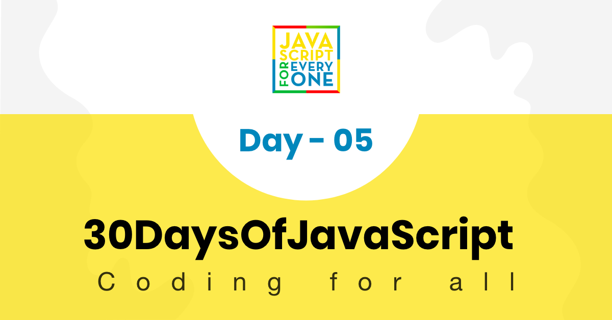

## Table of Contents

[<< Day 5](https://github.com/Asabeneh/30DaysOfJavaScript/blob/master/05_Day/05_day_arrays.md) | [Day 7 >>](#)



- [📔 Day 6](#%f0%9f%93%94-day-6)
  - [Loops](#loops)
    - [for Loop](#for-loop)
    - [while loop](#while-loop)
    - [do while loop](#do-while-loop)
    - [for of loop](#for-of-loop)
  - [💻 Exercises:Day 6](#%f0%9f%92%bb-exercisesday-6)

# 📔 Day 6

## Loops

Most of the activities we do in life are full of repetitions. Imagine if I ask you to print out from 0 to 100 using console.log(). To implement this simple task it may take you 2 to 5 minutes, such kind of tedious and repetitive task can be carried out using loop.

In programming languages to carry out repetitive task we use different kinds of loop. The following examples are the commonly used loops.

### for Loop

```js
//For loop structure
for(initialization, condition, increment/decrement){
  // code goes here
}
for(let i = 0; i <= 5; i++){
  console.log(i)
}
// 0 1 2 3 4 5

for(let i = 5; i >= 0; i--){
  console.log(i)
}
// 5  4  3  2  1  0

for(let i = 0; i <= 5; i++){
  console.log(`${i} * ${i} = ${i * i}`)
}
// 0 1 4 9 16 25

```

Adding all elements in the array

```js
const numbers = [1, 2, 3, 4, 5]
let sum = 0
for(let i = 0; i < numbers.length; i++){
  sum  = sum + numbers[i]  // can be shorten, sum += numbers[i]

}

console.log(sum)  // 15
```

Creating a new are based on the existing array

```js
const numbers = [1, 2, 3, 4, 5]
const newArr = []
let sum = 0
for(let i = 0; i < numbers.length; i++){
  newArr.push(i * i)

}

console.log(newArr)  // [1, 4, 9, 16, 25]
```

### while loop

```js
let i = 0
while (i <= 5) {
  console.log(i)
  i++
}
```

### do while loop

```js
let i = 0
do {
  console.log(i)
  i++
} while (i <= 5)
```

### for of loop

We use for of loop for arrays. It is very hand way to iterate through an array if we are not interested in the index.

```js
for (const element of arr) {
  // code goes here
}
```

```js

const numbers = [1, 2, 3, 4, 5]

for (const num of numbers) {
  console.log(num) //1 2 3 4 5
}

for (const num of numbers) {
  console.log(num * num) //1 4 9 16 25
}

// adding all the numbers in the array
let sum = 0
for (const num of numbers) {
  sum += sum + num  // can be also shorten like this, sum += num
}
console.log(sum) // 15


const webTechs = [
  'HTML',
  'CSS',
  'JavaScript',
  'React',
  'Redux',
  'Node',
  'MongoDB'
]

for (const tech of webTechs) {
  console.log(tech.toUpperCase()) // HTML CSS JAVASCRIPT REACT NODE MONGODB
}

for (const tech of webTechs) {
  console.log(tech[0]) //get only the first letter of each element,  H C J R N M
}

```

🌕 You are so brave, you made to this far. You have just completed day 6 challenges and you are 6 steps a head in to your way to greatness. Now do some exercises for your brain and for your muscle.

## 💻 Exercises:Day 6

```js
const countries = [
  'Albania',
  'Bolivia',
  'Canada',
  'Denmark',
  'Ethiopia',
  'Finland',
  'Germany',
  'Hungary',
  'Ireland',
  'Japan',
  'Kenya'
]

const webTechs = [
  'HTML',
  'CSS',
  'JavaScript',
  'React',
  'Redux',
  'Node',
  'MongoDB'
]

const mernStack = ['MongoDB', 'Express', 'React', 'Node']
```

1. Iterate 0 to 10 using for loop, do the same using while and do while loop
2. Iterate 10 to 0 using for loop, do the same using while and do while loop
3. Iterate 0 to n using for loop
4. Write a loop that makes the following pattern using console.log():

   ```js
       #
       ##
       ###
       ####
       #####
       ######
       #######
   ```

5. Use loop to print the following pattern:

   ```sh
   0 x 0 = 0
   1 x 1 = 1
   2 x 2 = 4
   3 x 3 = 9
   4 x 4 = 16
   5 x 5 = 25
   6 x 6 = 36
   7 x 7 = 49
   8 x 8 = 64
   9 x 9 = 81
   10 x 10 = 100
   ```

6. Using loop print the following pattern

   ```sh
    i    i^2   i^3
    0    0     0
    1    1     1
    2    4     8
    3    9     27
    4    16    64
    5    25    125
    6    36    216
    7    49    343
    8    64    512
    9    81    729
    10   100   1000
   ```

7. Use for loop to iterate from 0 to 100 and print only even numbers
8. Use for loop to iterate from 0 to 100 and print only odd numbers
9. Use for loop to iterate from 0 to 100 and print only prime numbers
10. Use for loop to iterate from 0 to 100 and print and print the sum of all numbers.

    ```sh
    The sum all numbers is 5050.
    ```

11. Use for loop to iterate from 0 to 100 and print the sum of all evens and the sum of all odds.

    ```sh
    The sum of all evens is 2550. And the sum of all odds is 2500.
    ```

12. Use for loop to iterate from 0 to 100 and print the sum of all evens and the sum of all odds. Print sum of evens and sum of odds as array

    ```sh
      [2550, 2500]
    ```

13. Develop a small script which generate array of 5 random numbers
14. Develop a small script which generate array of 5 random numbers and the numbers must be unique
15. Develop a small script which generate a six characters random id:

    ```sh
    5j2khz
    ```

16. Develop a small script which generate a any number of characters random id:

    ```sh
    fe3jo1gl124g
    ```

    ```sh
    xkqci4utda1lmbelpkm03rba
    ```

17. Using the above countries array, create the following new array.

    ```sh
    ["ALBANIA", "BOLIVIA", "CANADA", "DENMARK", "ETHIOPIA", "FINLAND", "GERMANY", "HUNGARY", "IRELAND", "JAPAN", "KENYA"]
    ```

18. Use the countries array to create the following array of arrays:

    ```sh
      [
      ['Albania', 'ALB', 7],
      ['Bolivia', 'BOL', 7],
      ['Canada', 'CAN', 6],
      ['Denmark', 'DEN', 7],
      ['Ethiopia', 'ETH', 8],
      ['Finland', 'FIN', 7],
      ['Germany', 'GER', 7],
      ['Hungary', 'HUN', 7],
      ['Ireland', 'IRE', 7],
      ['Japan', 'JAP', 5],
      ['Kenya', 'KEN', 5]
    ]
    ```

19. In above countries array, check if there is a country or countries containing the word 'land'. If there are countries containing 'land', print it as array. If there is no country containing the word 'land', print 'These are countries without land'.

    ```sh
    ['Finland', 'Iceland']
    ```

20. In above countries array, check if there a country or countries end with a substring 'ia'. If there are countries end with, print it as array. If there is no country containing the word 'land', print 'These are countries ends without ia'.

    ```sh
    ['Albania', 'Bolivia','Ethiopia']
    ```

21. Using the above countries array, create an array for countries length'.

    ```sh
    [7, 7, 6, 7, 8, 7, 7, 7, 7, 5, 5]
    ```

22. Using the above countries array, find the country containing the biggest number of characters.

    ```sh
    Ethiopia
    ```

23. Using the above countries array, find the country containing only 5 characters.

    ```sh
    ['Japan', 'Kenya']
    ```

24. Find the longest word in the webTechs array
25. Use the webTechs are to create the following array of arrays:

    ```sh
    [["HTML", 4], ["CSS", 3],["JavaScript", 10],["React", 5],["Redux", 5],["Node", 4],["MongoDB", 7]]
    ```

26. An application created using MongoDB, Express, React and Node is called a MERN stack. Create the acronym MERN by using the array mernStack

27. Iterate through the array, ["HTML", "CSS", "JS", "React", "Redux", "Node", "Express", "MongoDB"] using a for loop or for of loop and print out the items.
28. This is a fruit array , ['banana', 'orange', 'mango', 'lemon'] reverse the order using loop without using a reverse method.

29. Extract all the countries contain the word 'land' from the [countries array](https://github.com/Asabeneh/30DaysOfJavaScript/tree/master/data/countries.js) and print it as array
30. Find the country containing the hightest number of characters in the [countries array](https://github.com/Asabeneh/30DaysOfJavaScript/tree/master/data/countries.js)
31. Extract all the countries contain the word 'land' from the [countries array](https://github.com/Asabeneh/30DaysOfJavaScript/tree/master/data/countries.js) and print it as array
32. Extract all the countries containing only four characters from the [countries array](https://github.com/Asabeneh/30DaysOfJavaScript/tree/master/data/countries.js) and print it as array
33. Extract all the countries containing two or more words from the [countries array](https://github.com/Asabeneh/30DaysOfJavaScript/tree/master/data/countries.js) and print it as array

🎉 CONGRATULATIONS ! 🎉

[<< Day 5](https://github.com/Asabeneh/30DaysOfJavaScript/blob/master/05_Day/05_day_arrays.md) | [Day 7 >>](#)
