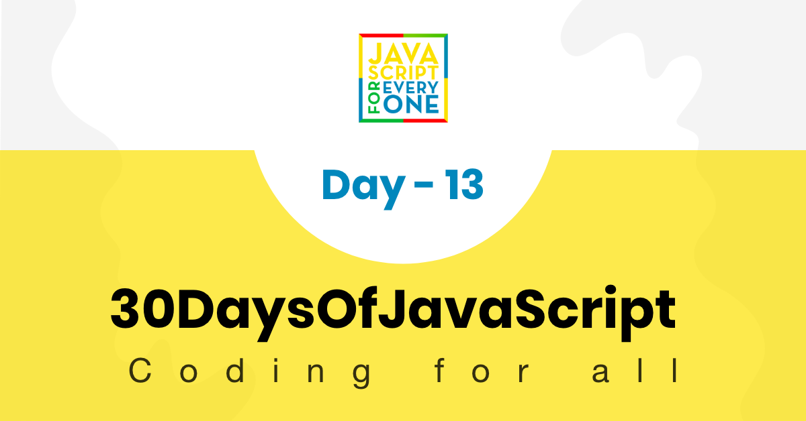

<div align="center">
  <h1> 30 Days Of JavaScript: Console Object Methods</h1>
  <a class="header-badge" target="_blank" href="https://www.linkedin.com/in/asabeneh/">
  
  </a>
  <a class="header-badge" target="_blank" href="https://twitter.com/Asabeneh">
  
  </a>

<sub>Author:
<a href="https://www.linkedin.com/in/asabeneh/" target="_blank">Asabeneh Yetayeh</a><br>
<small> January, 2020</small>
</sub>

</div>

[<< Day 12](../12_Day_Regular_expressions/12_day_regular_expressions.md) | [Day 14>>](../14_Day_Error_handling/14_day_error_handling.md)



- [Day 13](#day-13)
  - [Console Object Methods](#console-object-methods)
    - [console.log()](#consolelog)
    - [console.warn()](#consolewarn)
    - [console.error()](#consoleerror)
    - [console.table()](#consoletable)
    - [console.time()](#consoletime)
    - [console.info()](#consoleinfo)
    - [console.assert()](#consoleassert)
    - [console.group()](#consolegroup)
    - [console.count()](#consolecount)
    - [console.clear()](#consoleclear)
  - [Exercises](#exercises)
    - [Exercises:Level 1](#exerciseslevel-1)
    - [Exercises:Level 2](#exerciseslevel-2)
    - [Exercises:Level 3](#exerciseslevel-3)

# Day 13

## Console Object Methods

In this section, we will cover about console and console object methods. Absolute beginners usually do not know which to use: console.log(), document.write() or document.getElementById.

We use console object methods to show output on the browser console and we use document.write to show output on the browser document(view port). Both methods used only for testing and debugging purposes. The console method is the most popular testing and debugging tool on the browser. We use document.getElementById() when we like to interact with DOM try using JavaScript. We will cover DOM in another section.

In addition to the famous, console.log() method, the console provides other more methods methods.

### console.log()

We use console.log() to show output on the browser console. We can substitute values and also we can style the logging out put using %c.

- Showing output on browser console

```js
console.log('30 Days of JavaScript')
```

```sh
30 Days of JavaScript
```

- Substitution

```js
console.log('%d %s of JavaScript', 30, 'Days')
```

```sh
30 Days of JavaScript
```

- CSS

We can style logging message using css. Copy the following code and paste it on browser console to see the result.

```js
console.log('%c30 Days Of JavaScript', 'color:green') // log output is green
console.log(
  '%c30 Days%c %cOf%c %cJavaScript%c',
  'color:green',
  '',
  'color:red',
  '',
  'color:yellow'
) // log output green red and yellow text
```

### console.warn()

We use console.warn() to give warning on browser. For instance to inform or warn deprecation of version of a package or bad practices. Copy the following code and paste it on browser console to see warning messages.

```js
console.warn('This is a warning')
console.warn(
  'You are using React. Do not touch the DOM. Virtual DOM will take care of handling the DOM!'
)
console.warn('Warning is different from error')
```

### console.error()

The console.error() methods shows an error messages.

```js
console.error('This is an error message')
console.error('We all make mistakes')
```

### console.table()

The console.table() method display data as a table on the console. Displays tabular data as a table. The console.table() takes one required argument data, which must be an array or an object, and one additional optional parameter columns.

Let us first start with a simple array. The code below displays a table with two columns. An index column to display the index and value column to display the names

```js
const names = ['Asabeneh', 'Brook', 'David', 'John']
console.table(names)
```

Let us also check the result of an object. This creates table with two columns:an index column containing the keys and a value column contain the values of the object.

```js
const user = {
  name: 'Asabeneh',
  title: 'Programmer',
  country: 'Finland',
  city: 'Helsinki',
  age: 250
}
console.table(user)
```

Check the rest of the examples by copying and paste on the browser console.

```js
const countries = [
  ['Finland', 'Helsinki'],
  ['Sweden', 'Stockholm'],
  ['Norway', 'Oslo']
]
console.table(countries)
```

```js
const users = [
  {
    name: 'Asabeneh',
    title: 'Programmer',
    country: 'Finland',
    city: 'Helsinki',
    age: 250
  },
  {
    name: 'Eyob',
    title: 'Teacher',
    country: 'Sweden',
    city: 'London',
    age: 25
  },
  {
    name: 'Asab',
    title: 'Instructor',
    country: 'Norway',
    city: 'Oslo',
    age: 22
  },
  {
    name: 'Matias',
    title: 'Developer',
    country: 'Denmark',
    city: 'Copenhagen',
    age: 28
  }
]
console.table(users)
```

### console.time()

Starts a timer you can use to track how long an operation takes. You give each timer a unique name, and may have up to 10,000 timers running on a given page. When you call console.timeEnd() with the same name, the browser will output the time, in milliseconds, that elapsed since the timer was started.

```js
const countries = [
  ['Finland', 'Helsinki'],
  ['Sweden', 'Stockholm'],
  ['Norway', 'Oslo']
]

console.time('Regular for loop')
for (let i = 0; i < countries.length; i++) {
  console.log(countries[i][0], countries[i][1])
}
console.timeEnd('Regular for loop')

console.time('for of loop')
for (const [name, city] of countries) {
  console.log(name, city)
}
console.timeEnd('for of loop')

console.time('forEach loop')
countries.forEach(([name, city]) => {
  console.log(name, city)
})
console.timeEnd('forEach loop')
```

```sh
Finland Helsinki
Sweden Stockholm
Norway Oslo
Regular for loop: 0.34716796875ms
Finland Helsinki
Sweden Stockholm
Norway Oslo
for of loop: 0.26806640625ms
Finland Helsinki
Sweden Stockholm
Norway Oslo
forEach loop: 0.358154296875ms
```

According the above output the regular for loop is slower than for of or forEach loop.

### console.info()

It display information message on browser console.

```js
console.info('30 Days Of JavaScript challenge is trending on Github')
console.info('30 Days Of fullStack challenge might be released')
console.info('30 Days Of HTML and CSS challenge might be released')
```

### console.assert()

The console.assert() methods writes an error message to the console if the assertion is false. If the assertion is true, nothing happens. The first parameter is an assertion expression. If this expression is false, an Assertion failed error message will be displayed.

```js
console.assert(4 > 3, '4 is greater than 3') // no result
console.assert(3 > 4, '3 is not greater than 4') // Assertion failed: 3 is not greater than 4

for (let i = 0; i <= 10; i += 1) {
  let errorMessage = `${i} is not even`
  console.log('the # is ' + i)
  console.assert(i % 2 === 0, { number: i, errorMessage: errorMessage })
}
```

### console.group()

The console.group() can help to group different log groups. Copy the following code and paste it on browser console to the groups.

```js
const names = ['Asabeneh', 'Brook', 'David', 'John']
const countries = [
  ['Finland', 'Helsinki'],
  ['Sweden', 'Stockholm'],
  ['Norway', 'Oslo']
]
const user = {
  name: 'Asabeneh',
  title: 'Programmer',
  country: 'Finland',
  city: 'Helsinki',
  age: 250
}
const users = [
  {
    name: 'Asabeneh',
    title: 'Programmer',
    country: 'Finland',
    city: 'Helsinki',
    age: 250
  },
  {
    name: 'Eyob',
    title: 'Teacher',
    country: 'Sweden',
    city: 'London',
    age: 25
  },
  {
    name: 'Asab',
    title: 'Instructor',
    country: 'Norway',
    city: 'Oslo',
    age: 22
  },
  {
    name: 'Matias',
    title: 'Developer',
    country: 'Denmark',
    city: 'Copenhagen',
    age: 28
  }
]

console.group('Names')
console.log(names)
console.groupEnd()

console.group('Countries')
console.log(countries)
console.groupEnd()

console.group('Users')
console.log(user)
console.log(users)
console.groupEnd()
```

### console.count()

It prints the number of time this console.count() is called. It takes a string label parameter. It is very helpful to count the number of times a function is called. In the following example, the console.count() method will run three times

```js
const func = () => {
  console.count('Function has been called')
}
func()
func()
func()
```

```sh
Function has been called: 1
Function has been called: 2
Function has been called: 3
```

### console.clear()

The console.clear() cleans the browser console.

🌕 Keep up the good work. Keep pushing, the sky is the limit! You have just completed day 13 challenges and you are 13 steps a head in to your way to greatness. Now do some exercises for your brain and for your muscle.

## Exercises

### Exercises:Level 1

1.  Display the countries array as a table
2.  Display the countries object as a table
3.  Use console.group() to group logs

### Exercises:Level 2

1. 10 > 2 \* 10 use console.assert()
2. Write a warning message using console.warn()
3. Write an error message using console.error()

### Exercises:Level 3

1. Check the speed difference among the following loops: while, for, for of, forEach

🎉 CONGRATULATIONS ! 🎉

[<< Day 12](../12_Day_Regular_expressions/12_day_regular_expressions.md) | [Day 14>>](../14_Day_Error_handling/14_day_error_handling.md)
