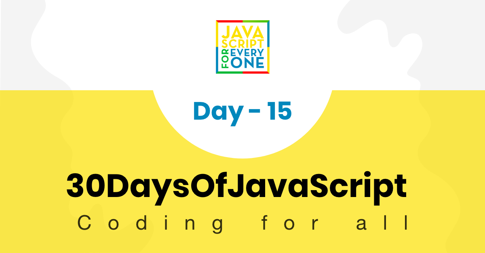

<div align="center">
  <h1> 30 Days Of JavaScript: Classes</h1>
  <a class="header-badge" target="_blank" href="https://www.linkedin.com/in/asabeneh/">
  
  </a>
  <a class="header-badge" target="_blank" href="https://twitter.com/Asabeneh">
  
  </a>

<sub>Author:
<a href="https://www.linkedin.com/in/asabeneh/" target="_blank">Asabeneh Yetayeh</a><br>
<small> January, 2020</small>
</sub>

</div>

[<< Day 14](../14_Day_Error_handling/14_day_error_handling.md) | [Day 16>>](../16_Day_JSON/16_day_json.md)



- [Day 15](#day-15)
	- [Classes](#classes)
		- [Defining a classes](#defining-a-classes)
		- [Class Instantiation](#class-instantiation)
		- [Class Constructor](#class-constructor)
		- [Default values with constructor](#default-values-with-constructor)
		- [Class methods](#class-methods)
		- [Properties with initial value](#properties-with-initial-value)
		- [getter](#getter)
		- [setter](#setter)
		- [Static method](#static-method)
	- [Inheritance](#inheritance)
		- [Overriding methods](#overriding-methods)
	- [Exercises](#exercises)
		- [Exercises Level 1](#exercises-level-1)
		- [Exercises Level 2](#exercises-level-2)
		- [Exercises Level 3](#exercises-level-3)

# Day 15

## Classes

JavaScript is an object oriented programming language. Everything in JavScript is an object, with its properties and methods. We create class to create an object. A Class is like an object constructor, or a "blueprint" for creating objects. We instantiate a class to create an object. The class defines attributes and the behavior of the object, while the object, on the other hand, represents the class.

Once we create a class we can create object from it whenever we want. Creating an object from a class is called class instantiation.

In the object section, we saw how to create an object literal. Object literal is a singleton. If we want to get a similar object , we have to write it. However, class allows to create many objects. This helps to reduce amount of code and repetition of code.

### Defining a classes

To define a class in JavaScript we need the keyword _class_ , the name of a class in **CamelCase** and block code(two curly brackets). Let us create a class name Person.

```sh
// syntax
class ClassName {
    //  code goes here
}

```

**Example:**

```js
class Person {
  // code goes here
}
```

We have created an Person class but it does not have any thing inside.

### Class Instantiation

Instantiation class means creating an object from a class. We need the keyword _new_ and we call the name of the class after the word new.

Let us create a dog object from our Person class.

```js
class Person {
  // code goes here
}
const person = new Person()
console.log(person)
```

```sh
Person {}
```

As you can see, we have created a person object. Since the class did not have any properties yet the object is also empty.

Let use the class constructor to pass different properties for the class.

### Class Constructor

The constructor is a builtin function which allows as to create a blueprint for our object. The constructor function starts with a keyword constructor followed by a parenthesis. Inside the parenthesis we pass the properties of the object as parameter. We use the _this_ keyword to attach the constructor parameters with the class.

The following Person class constructor has firstName and lastName property. These properties are attached to the Person class using _this_ keyword. _This_ refers to the class itself.

```js
class Person {
  constructor(firstName, lastName) {
    console.log(this) // Check the output from here
    this.firstName = firstName
    this.lastName = lastName
  }
}

const person = new Person()

console.log(person)
```

```sh
Person {firstName: undefined, lastName:undefined}
```

All the keys of the object are undefined. When ever we instantiate we should pass the value of the properties. Let us pass value at this time when we instantiate the class.

```js
class Person {
  constructor(firstName, lastName) {
    this.firstName = firstName
    this.lastName = lastName
  }
}

const person1 = new Person('Asabeneh', 'Yetayeh')

console.log(person1)
```

```sh
Person {firstName: "Asabeneh", lastName: "Yetayeh"}
```

As we have stated at the very beginning that once we create a class we can create many object using the class. Now, let us create many person objects using the Person class.

```js
class Person {
  constructor(firstName, lastName) {
    console.log(this) // Check the output from here
    this.firstName = firstName
    this.lastName = lastName
  }
}

const person1 = new Person('Asabeneh', 'Yetayeh')
const person2 = new Person('Lidiya', 'Tekle')
const person3 = new Person('Abraham', 'Yetayeh')

console.log(person1)
console.log(person2)
console.log(person3)
```

```sh
Person {firstName: "Asabeneh", lastName: "Yetayeh"}
Person {firstName: "Lidiya", lastName: "Tekle"}
Person {firstName: "Abraham", lastName: "Yetayeh"}
```

Using the class Person we created three persons object. As you can see our class did not many properties let us add more properties to the class.

```js
class Person {
  constructor(firstName, lastName, age, country, city) {
    console.log(this) // Check the output from here
    this.firstName = firstName
    this.lastName = lastName
    this.age = age
    this.country = country
    this.city = city
  }
}

const person1 = new Person('Asabeneh', 'Yetayeh', 250, 'Finland', 'Helsinki')

console.log(person1)
```

```sh
Person {firstName: "Asabeneh", lastName: "Yetayeh", age: 250, country: "Finland", city: "Helsinki"}
```

### Default values with constructor

The constructor function properties may have a default value like other regular functions.

```js
class Person {
  constructor(
    firstName = 'Asabeneh',
    lastName = 'Yetayeh',
    age = 250,
    country = 'Finland',
    city = 'Helsinki'
  ) {
    this.firstName = firstName
    this.lastName = lastName
    this.age = age
    this.country = country
    this.city = city
  }
}

const person1 = new Person() // it will take the default values
const person2 = new Person('Lidiya', 'Tekle', 28, 'Finland', 'Espoo')

console.log(person1)
console.log(person2)
```

```sh
Person {firstName: "Asabeneh", lastName: "Yetayeh", age: 250, country: "Finland", city: "Helsinki"}
Person {firstName: "Lidiya", lastName: "Tekle", age: 28, country: "Finland", city: "Espoo"}
```

### Class methods

The constructor inside a class is a builtin function which allow us to create a blueprint for the object. In a class we can create class methods. Methods are JavaScript functions inside the class. Let us create some class methods.

```js
class Person {
  constructor(firstName, lastName, age, country, city) {
    this.firstName = firstName
    this.lastName = lastName
    this.age = age
    this.country = country
    this.city = city
  }
  getFullName() {
    const fullName = this.firstName + ' ' + this.lastName
    return fullName
  }
}

const person1 = new Person('Asabeneh', 'Yetayeh', 250, 'Finland', 'Helsinki')
const person2 = new Person('Lidiya', 'Tekle', 28, 'Finland', 'Espoo')

console.log(person1.getFullName())
console.log(person2.getFullName())
```

```sh
Asabeneh Yetayeh
test.js:19 Lidiya Tekle
```

### Properties with initial value

When we create a class for some properties we may have an initial value. For instance if you are playing a game, you starting score will be zero. So, we may have a starting score or score which is zero. In other way, we may have an initial skill and we will acquire some skill after some time.

```js
class Person {
  constructor(firstName, lastName, age, country, city) {
    this.firstName = firstName
    this.lastName = lastName
    this.age = age
    this.country = country
    this.city = city
    this.score = 0
    this.skills = []
  }
  getFullName() {
    const fullName = this.firstName + ' ' + this.lastName
    return fullName
  }
}

const person1 = new Person('Asabeneh', 'Yetayeh', 250, 'Finland', 'Helsinki')
const person2 = new Person('Lidiya', 'Tekle', 28, 'Finland', 'Espoo')

console.log(person1.score)
console.log(person2.score)

console.log(person1.skills)
console.log(person2.skills)
```

```sh
0
0
[]
[]
```

A method could be regular method or a getter or a setter. Let us see, getter and setter.

### getter

The get method allow us to access value from the object. We write a get method using keyword _get_ followed by a function. Instead of accessing properties directly from the object we use getter to get the value. See the example bellow

```js
class Person {
  constructor(firstName, lastName, age, country, city) {
    this.firstName = firstName
    this.lastName = lastName
    this.age = age
    this.country = country
    this.city = city
    this.score = 0
    this.skills = []
  }
  getFullName() {
    const fullName = this.firstName + ' ' + this.lastName
    return fullName
  }
  get getScore() {
    return this.score
  }
  get getSkills() {
    return this.skills
  }
}

const person1 = new Person('Asabeneh', 'Yetayeh', 250, 'Finland', 'Helsinki')
const person2 = new Person('Lidiya', 'Tekle', 28, 'Finland', 'Espoo')

console.log(person1.getScore) // We do not need parenthesis to call a getter method
console.log(person2.getScore)

console.log(person1.getSkills)
console.log(person2.getSkills)
```

```sh
0
0
[]
[]
```

### setter

The setter method allow us to modify the value of certain properties. We write a setter method using keyword _set_ followed by a function. See the example bellow.

```js
class Person {
  constructor(firstName, lastName, age, country, city) {
    this.firstName = firstName
    this.lastName = lastName
    this.age = age
    this.country = country
    this.city = city
    this.score = 0
    this.skills = []
  }
  getFullName() {
    const fullName = this.firstName + ' ' + this.lastName
    return fullName
  }
  get getScore() {
    return this.score
  }
  get getSkills() {
    return this.skills
  }
  set setScore(score) {
    this.score += score
  }
  set setSkill(skill) {
    this.skills.push(skill)
  }
}

const person1 = new Person('Asabeneh', 'Yetayeh', 250, 'Finland', 'Helsinki')
const person2 = new Person('Lidiya', 'Tekle', 28, 'Finland', 'Espoo')

person1.setScore = 1
person1.setSkill = 'HTML'
person1.setSkill = 'CSS'
person1.setSkill = 'JavaScript'

person2.setScore = 1
person2.setSkill = 'Planning'
person2.setSkill = 'Managing'
person2.setSkill = 'Organizing'

console.log(person1.score)
console.log(person2.score)

console.log(person1.skills)
console.log(person2.skills)
```

```sh
1
1
["HTML", "CSS", "JavaScript"]
["Planning", "Managing", "Organizing"]
```

Do not be puzzled by the difference between regular method and a getter. If you know how to make a regular method you are good. Let us add regular method called getPersonInfo in the Person class.

```js
class Person {
  constructor(firstName, lastName, age, country, city) {
    this.firstName = firstName
    this.lastName = lastName
    this.age = age
    this.country = country
    this.city = city
    this.score = 0
    this.skills = []
  }
  getFullName() {
    const fullName = this.firstName + ' ' + this.lastName
    return fullName
  }
  get getScore() {
    return this.score
  }
  get getSkills() {
    return this.skills
  }
  set setScore(score) {
    this.score += score
  }
  set setSkill(skill) {
    this.skills.push(skill)
  }
  getPersonInfo() {
    let fullName = this.getFullName()
    let skills =
      this.skills.length > 0 &&
      this.skills.slice(0, this.skills.length - 1).join(', ') +
        ` and ${this.skills[this.skills.length - 1]}`
    let formattedSkills = skills ? `He knows ${skills}` : ''

    let info = `${fullName} is ${this.age}. He lives ${this.city}, ${this.country}. ${formattedSkills}`
    return info
  }
}

const person1 = new Person('Asabeneh', 'Yetayeh', 250, 'Finland', 'Helsinki')
const person2 = new Person('Lidiya', 'Tekle', 28, 'Finland', 'Espoo')
const person3 = new Person('John', 'Doe', 50, 'Mars', 'Mars city')

person1.setScore = 1
person1.setSkill = 'HTML'
person1.setSkill = 'CSS'
person1.setSkill = 'JavaScript'

person2.setScore = 1
person2.setSkill = 'Planning'
person2.setSkill = 'Managing'
person2.setSkill = 'Organizing'

console.log(person1.getScore)
console.log(person2.getScore)

console.log(person1.getSkills)
console.log(person2.getSkills)
console.log(person3.getSkills)

console.log(person1.getPersonInfo())
console.log(person2.getPersonInfo())
console.log(person3.getPersonInfo())
```

```sh
1
1
["HTML", "CSS", "JavaScript"]
["Planning", "Managing", "Organizing"]
[]
Asabeneh Yetayeh is 250. He lives Helsinki, Finland. He knows HTML, CSS and JavaScript
Lidiya Tekle is 28. He lives Espoo, Finland. He knows Planning, Managing and Organizing
John Doe is 50. He lives Mars city, Mars.
```

### Static method

The static keyword defines a static method for a class. Static methods are not called on instances of the class. Instead, they are called on the class itself. These are often utility functions, such as functions to create or clone objects. An example of static method is _Date.now()_. The _now_ method is called directly from the class.

```js
class Person {
  constructor(firstName, lastName, age, country, city) {
    this.firstName = firstName
    this.lastName = lastName
    this.age = age
    this.country = country
    this.city = city
    this.score = 0
    this.skills = []
  }
  getFullName() {
    const fullName = this.firstName + ' ' + this.lastName
    return fullName
  }
  get getScore() {
    return this.score
  }
  get getSkills() {
    return this.skills
  }
  set setScore(score) {
    this.score += score
  }
  set setSkill(skill) {
    this.skills.push(skill)
  }
  getPersonInfo() {
    let fullName = this.getFullName()
    let skills =
      this.skills.length > 0 &&
      this.skills.slice(0, this.skills.length - 1).join(', ') +
        ` and ${this.skills[this.skills.length - 1]}`

    let formattedSkills = skills ? `He knows ${skills}` : ''

    let info = `${fullName} is ${this.age}. He lives ${this.city}, ${this.country}. ${formattedSkills}`
    return info
  }
  static favoriteSkill() {
    const skills = ['HTML', 'CSS', 'JS', 'React', 'Python', 'Node']
    const index = Math.floor(Math.random() * skills.length)
    return skills[index]
  }
  static showDateTime() {
    let now = new Date()
    let year = now.getFullYear()
    let month = now.getMonth() + 1
    let date = now.getDate()
    let hours = now.getHours()
    let minutes = now.getMinutes()
    if (hours < 10) {
      hours = '0' + hours
    }
    if (minutes < 10) {
      minutes = '0' + minutes
    }

    let dateMonthYear = date + '.' + month + '.' + year
    let time = hours + ':' + minutes
    let fullTime = dateMonthYear + ' ' + time
    return fullTime
  }
}

console.log(Person.favoriteSkill())
console.log(Person.showDateTime())
```

```sh
Node
15.1.2020 23:56
```

The static methods are methods which can be used as utility functions.

## Inheritance

Using inheritance we can access all the properties and the methods of the parent class. This reduces repetition of code. If you remember, we have a Person parent class and we will create children from it. Our children class could be student, teach etc.

```js
// syntax
class ChildClassName extends {
 // code goes here
}
```

Let us create a Student child class from Person parent class.

```js
class Student extends Person {
  saySomething() {
    console.log('I am a child of the person class')
  }
}

const s1 = new Student('Asabeneh', 'Yetayeh', 'Finland', 250, 'Helsinki')
console.log(s1)
console.log(s1.saySomething())
console.log(s1.getFullName())
console.log(s1.getPersonInfo())
```

```sh
Student {firstName: "Asabeneh", lastName: "Yetayeh", age: "Finland", country: 250, city: "Helsinki", …}
I am a child of the person class
Asabeneh Yetayeh
Student {firstName: "Asabeneh", lastName: "Yetayeh", age: "Finland", country: 250, city: "Helsinki", …}
Asabeneh Yetayeh is Finland. He lives Helsinki, 250.
```

### Overriding methods

As you can see, we manage to access all the methods in the Person Class and we used it in the Student child class. We can customize the parent methods, we can add additional properties to a child class. If we want to customize, the methods and if we want to add extra properties, we need to use the constructor function the child class too. In side the constructor function we call the super() function to access all the properties from the parent class. The Person class didn't have gender but now let us give gender property for the child class, Student. If the same method name used in the child class, the parent method will be overridden.

```js
class Student extends Person {
  constructor(firstName, lastName, age, country, city, gender) {
    super(firstName, lastName, age, country, city)
    this.gender = gender
  }

  saySomething() {
    console.log('I am a child of the person class')
  }
  getPersonInfo() {
    let fullName = this.getFullName()
    let skills =
      this.skills.length > 0 &&
      this.skills.slice(0, this.skills.length - 1).join(', ') +
        ` and ${this.skills[this.skills.length - 1]}`

    let formattedSkills = skills ? `He knows ${skills}` : ''
    let pronoun = this.gender == 'Male' ? 'He' : 'She'

    let info = `${fullName} is ${this.age}. ${pronoun} lives in ${this.city}, ${this.country}. ${formattedSkills}`
    return info
  }
}

const s1 = new Student(
  'Asabeneh',
  'Yetayeh',
  250,
  'Finland',
  'Helsinki',
  'Male'
)
const s2 = new Student('Lidiya', 'Tekle', 28, 'Finland', 'Helsinki', 'Female')
s1.setScore = 1
s1.setSkill = 'HTML'
s1.setSkill = 'CSS'
s1.setSkill = 'JavaScript'

s2.setScore = 1
s2.setSkill = 'Planning'
s2.setSkill = 'Managing'
s2.setSkill = 'Organizing'

console.log(s1)

console.log(s1.saySomething())
console.log(s1.getFullName())
console.log(s1.getPersonInfo())

console.log(s2.saySomething())
console.log(s2.getFullName())
console.log(s2.getPersonInfo())
```

```sh
Student {firstName: "Asabeneh", lastName: "Yetayeh", age: 250, country: "Finland", city: "Helsinki", …}
Student {firstName: "Lidiya", lastName: "Tekle", age: 28, country: "Finland", city: "Helsinki", …}
I am a child of the person class
Asabeneh Yetayeh
Student {firstName: "Asabeneh", lastName: "Yetayeh", age: 250, country: "Finland", city: "Helsinki", …}
Asabeneh Yetayeh is 250. He lives in Helsinki, Finland. He knows HTML, CSS and JavaScript
I am a child of the person class
Lidiya Tekle
Student {firstName: "Lidiya", lastName: "Tekle", age: 28, country: "Finland", city: "Helsinki", …}
Lidiya Tekle is 28. She lives in Helsinki, Finland. He knows Planning, Managing and Organizing
```

Now, the getPersonInfo method has been overridden and it identifies if the person is male or female.

🌕 You are excelling. Now, you knew class and you have the power to turn everything to an object. You made it to half way to your way to greatness. Now do some exercises for your brain and for your muscle.

## Exercises

### Exercises Level 1

1. Create an Animal class. The class will have name, age, color, legs properties and create different methods
2. Create a Dog and Cat child class from the Animal Class.

### Exercises Level 2

1. Override the method you create in Animal class

### Exercises Level 3

1. Let's try to develop a program which calculate measure of central tendency of a sample(mean, median, mode) and measure of variability(range, variance, standard deviation). In addition to those measures find the min, max, count, percentile, and frequency distribution of the sample. You can create a class called Statistics and create all the functions which do statistical calculations as method for the Statistics class. Check the output below.

```JS
ages = [31, 26, 34, 37, 27, 26, 32, 32, 26, 27, 27, 24, 32, 33, 27, 25, 26, 38, 37, 31, 34, 24, 33, 29, 26]

console.log('Count:', statistics.count()) // 25
console.log('Sum: ', statistics.sum()) // 744
console.log('Min: ', statistics.min()) // 24
console.log('Max: ', statistics.max()) // 38
console.log('Range: ', statistics.range() // 14
console.log('Mean: ', statistics.mean()) // 30
console.log('Median: ',statistics.median()) // 29
console.log('Mode: ', statistics.mode()) // {'mode': 26, 'count': 5}
console.log('Variance: ',statistics.var()) // 17.5
console.log('Standard Deviation: ', statistics.std()) // 4.2
console.log('Variance: ',statistics.var()) // 17.5
console.log('Frequency Distribution: ',statistics.freqDist()) // [(20.0, 26), (16.0, 27), (12.0, 32), (8.0, 37), (8.0, 34), (8.0, 33), (8.0, 31), (8.0, 24), (4.0, 38), (4.0, 29), (4.0, 25)]
```

```sh
// you output should look like this
console.log(statistics.describe())
Count: 25
Sum:  744
Min:  24
Max:  38
Range:  14
Mean:  30
Median:  29
Mode:  (26, 5)
Variance:  17.5
Standard Deviation:  4.2
Frequency Distribution: [(20.0, 26), (16.0, 27), (12.0, 32), (8.0, 37), (8.0, 34), (8.0, 33), (8.0, 31), (8.0, 24), (4.0, 38), (4.0, 29), (4.0, 25)]
```

1. Create a class called PersonAccount. It has firstname, lastname, incomes, expenses properties and it has totalIncome, totalExpense, accountInfo,addIncome, addExpense and accountBalance methods. Incomes is a set of incomes and its description and expenses is also a set of expenses and its description.

🎉 CONGRATULATIONS ! 🎉

[<< Day 14](../14_Day_Error_handling/14_day_error_handling.md) | [Day 16>>](../16_Day_JSON/16_day_json.md)
