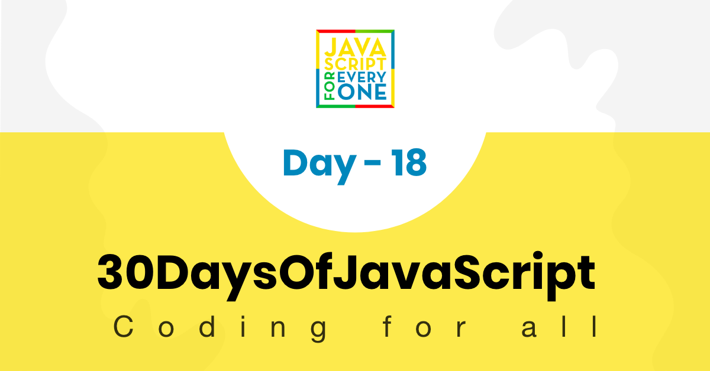

<div align="center">
  <h1> 30 Days Of JavaScript: Promises</h1>
  <a class="header-badge" target="_blank" href="https://www.linkedin.com/in/asabeneh/">
  
  </a>
  <a class="header-badge" target="_blank" href="https://twitter.com/Asabeneh">
  
  </a>

<sub>Author:
<a href="https://www.linkedin.com/in/asabeneh/" target="_blank">Asabeneh Yetayeh</a><br>
<small> January, 2020</small>
</sub>

</div>

[<< Day 17](../17_Day_Web_storages/17_day_web_storages.md) | [Day 19>>](../19_Day_Closures/19_day_closures.md)



- [Day 18](#day-18)
	- [Promise](#promise)
	- [Callbacks](#callbacks)
		- [Promise constructor](#promise-constructor)
	- [Fetch API](#fetch-api)
	- [Async and Await](#async-and-await)
	- [Exercises](#exercises)
		- [Exercises: Level 1](#exercises-level-1)
		- [Exercises: Level 2](#exercises-level-2)
		- [Exercises: Level 3](#exercises-level-3)

# Day 18

## Promise

We human give or receive a promise to do some activity at some point in time. If we keep the promise we make others happy but if we do not keep the promise, it may lead discontentment. Promise in JavaScript has something in common with the above examples.

A Promise is a way to handle asynchronous operations in JavaScript. It allows handlers with an asynchronous action's eventual success value or failure reason. This lets asynchronous methods return values like synchronous methods: instead of immediately returning the final value, the asynchronous method returns a promise to supply the value at some point in the future.

A Promise is in one of these states:

- pending: initial state, neither fulfilled nor rejected.
- fulfilled: meaning that the operation completed successfully.
- rejected: meaning that the operation failed.

A pending promise can either be fulfilled with a value, or rejected with a reason (error). When either of these options happens, the associated handlers queued up by a promise's then method are called. (If the promise has already been fulfilled or rejected when a corresponding handler is attached, the handler will be called, so there is no race condition between an asynchronous operation completing and its handlers being attached.)

As the Promise.prototype.then() and Promise.prototype.catch() methods return promises, they can be chained.

## Callbacks

To understand promise very well let us understand callback first. Let's see the following callbacks. From the following code blocks you will notice, the difference between callback and promises.

- call back
  Let us see a callback function which can take two parameters. The first parameter is err and the second is result. If the err parameter is false, there will not be error other wise it will return an error.

In this case the err has a value and it will return the err block.

```js
//Callback
const doSomething = callback => {
  setTimeout(() => {
    const skills = ['HTML', 'CSS', 'JS']
    callback('It did not go well', skills)
  }, 2000)
}

const callback = (err, result) => {
  if (err) {
    return console.log(err)
  }
  return console.log(result)
}

doSomething(callback)
```

```sh
// after 2 seconds it will print
It did not go well
```

In this case the err is false and it will return the else block which is the result.

```js
const doSomething = callback => {
  setTimeout(() => {
    const skills = ['HTML', 'CSS', 'JS']
    callback(false, skills)
  }, 2000)
}

doSomething((err, result) => {
  if (err) {
    return console.log(err)
  }
  return console.log(result)
})
```

```sh
// after 2 seconds it will print the skills
["HTML", "CSS", "JS"]
```

### Promise constructor

We can create a promise using the Promise constructor. We can create a new promise using the key word `new` followed by the word `Promise` and followed by a parenthesis. Inside the parenthesis, it takes a `callback` function. The promise callback function has two parameters which are the _`resolve`_ and _`reject`_ functions.

```js
// syntax
const promise = new Promise((resolve, reject) => {
  resolve('success')
  reject('failure')
})
```

```js
// Promise
const doPromise = new Promise((resolve, reject) => {
  setTimeout(() => {
    const skills = ['HTML', 'CSS', 'JS']
    if (skills.length > 0) {
      resolve(skills)
    } else {
      reject('Something wrong has happened')
    }
  }, 2000)
})

doPromise
  .then(result => {
    console.log(result)
  })
  .catch(error => console.log(error))
```

```sh
["HTML", "CSS", "JS"]
```

The above promise has been settled with resolve.
Let us another example when the promise is settled with reject.

```js
// Promise
const doPromise = new Promise((resolve, reject) => {
  setTimeout(() => {
    const skills = ['HTML', 'CSS', 'JS']
    if (skills.includes('Node')) {
      resolve('fullstack developer')
    } else {
      reject('Something wrong has happened')
    }
  }, 2000)
})

doPromise
  .then(result => {
    console.log(result)
  })
  .catch(error => console.error(error))
```

```sh
Something wrong has happened
```

## Fetch API

The Fetch API provides an interface for fetching resources (including across the network). It will seem familiar to anyone who has used XMLHttpRequest, but the new API provides a more powerful and flexible feature set. In this challenge we will use fetch to request url and APIS. In addition to that let us see demonstrate use case of promises in accessing network resources using the fetch API.

```js
const url = 'https://restcountries.com/v2/all' // countries api
fetch(url)
  .then(response => response.json()) // accessing the API data as JSON
  .then(data => {
    // getting the data
    console.log(data)
  })
  .catch(error => console.error(error)) // handling error if something wrong happens
```

## Async and Await

Async and await is an elegant way to handle promises. It is easy to understand and it clean to write.

```js
const square = async function (n) {
  return n * n
}

square(2)
```

```sh
Promise {<resolved>: 4}
```

The word _async_ in front of a function means that function will return a promise. The above square function instead of a value it returned a promise.

How do we access the value from the promise? To access the value from the promise, we will use the keyword _await_.

```js
const square = async function (n) {
  return n * n
}
const value = await square(2)
```

```sh
4
```

Now, as you can see from the above example writing async in front of a function create a promise and to get the value from a promise we use await. Async and await go together, one can not exist without the other.

Let us fetch API data using both promise method and async and await method.

- promise

```js
const url = 'https://restcountries.com/v2/all'
fetch(url)
  .then(response => response.json())
  .then(data => {
    console.log(data)
  })
  .catch(error => console.error(error))
```

- async and await

```js
const fetchData = async () => {
  try {
    const response = await fetch(url)
    const countries = await response.json()
    console.log(countries)
  } catch (err) {
    console.error(err)
  }
}
console.log('===== async and await')
fetchData()
```

🌕 You are real and you kept your promise and you reached to day 18. Keep your promise and settle the challenge with resolve. You are 18 steps ahead to your way to greatness. Now do some exercises for your brain and  muscles.

## Exercises

```js
const countriesAPI = 'https://restcountries.com/v2/all'
const catsAPI = 'https://api.thecatapi.com/v1/breeds'
```

### Exercises: Level 1

1. Read the countries API using fetch and print the name of country, capital, languages, population and area.

### Exercises: Level 2

1. Print out all the cat names in to catNames variable.

### Exercises: Level 3

1. Read the cats api and find the average weight of cat in metric unit.
2. Read the countries api and find out the 10 largest countries
3. Read the countries api and count total number of languages in the world used as officials.

🎉 CONGRATULATIONS ! 🎉

[<< Day 17](../17_Day_Web_storages/17_day_web_storages.md) | [Day 19>>](../19_Day_Closures/19_day_closures.md)
