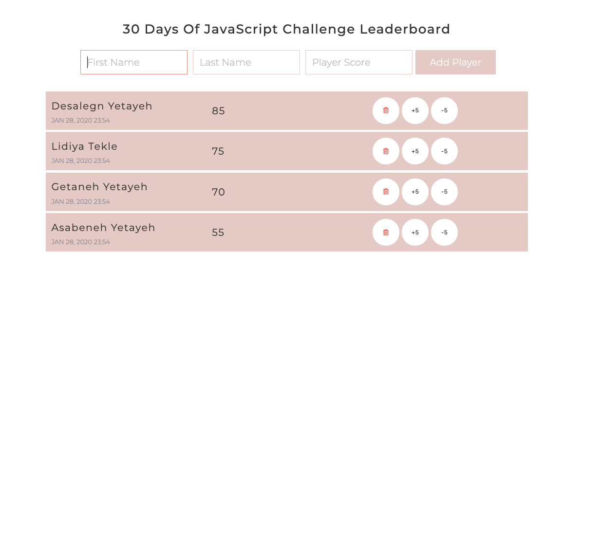

  <h1> 30 Days Of JavaScript</h1>
  
  

Author:
<a href="https://www.linkedin.com/in/asabeneh/" target="_blank">Asabeneh Yetayeh</a> 
<small> January, 2020</small>

[<< Day 27](https://github.com/Asabeneh/30DaysOfJavaScript/blob/master27_Day27_day_dom_day_7.md) | [Day 29>>](https://github.com/Asabeneh/30DaysOfJavaScript/blob/master/29_Day/29_day_dom_day_9.md)

- [Day 28](#day-28)
  - [Exercises](#exercises)
    - [Exercise: Level 1](#exercise-level-1)

# Day 28

## Exercises

### Exercise: Level 1

1. Create the following using HTML, CSS, and JavaScript

🎉 CONGRATULATIONS ! 🎉

[<< Day 27](https://github.com/Asabeneh/30DaysOfJavaScript/blob/master27_Day27_day_dom_day_7.md) | [Day 29>>](https://github.com/Asabeneh/30DaysOfJavaScript/blob/master/29_Day/29_day_dom_day_9.md)
