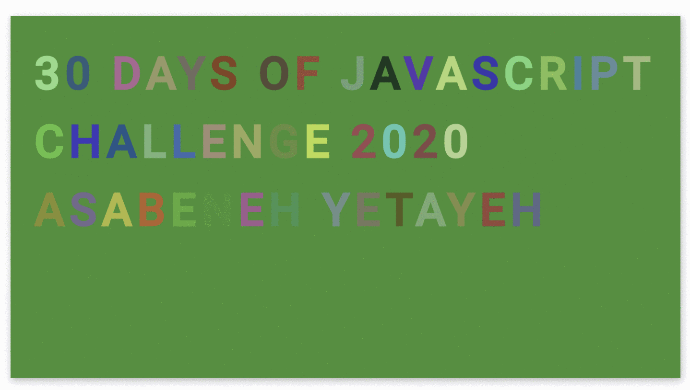

  <h1> 30 Days Of JavaScript: Animating Characters</h1>
  
  

Author:
<a href="https://www.linkedin.com/in/asabeneh/" target="_blank">Asabeneh Yetayeh</a> 
<small> January, 2020</small>

[<< Day 28](../28_Day_Mini_project_leaderboard/28_day_mini_project_leaderboard.md) | [Day 30>>](../30_Day_Mini_project_final/30_day_mini_project_final.md)

- [Day 29](#day-29)
	- [Exercises](#exercises)
		- [Exercise: Level 1](#exercise-level-1)
		- [Exercise: Level 2](#exercise-level-2)
		- [Exercise: Level 3](#exercise-level-3)

# Day 29

## Exercises

### Exercise: Level 1

1. Create the following animation using (HTML, CSS, JS)

### Exercise: Level 2

### Exercise: Level 3

🎉 CONGRATULATIONS ! 🎉

[<< Day 28](../28_Day_Mini_project_leaderboard/28_day_mini_project_leaderboard.md) | [Day 30>>](../30_Day_Mini_project_final/30_day_mini_project_final.md)