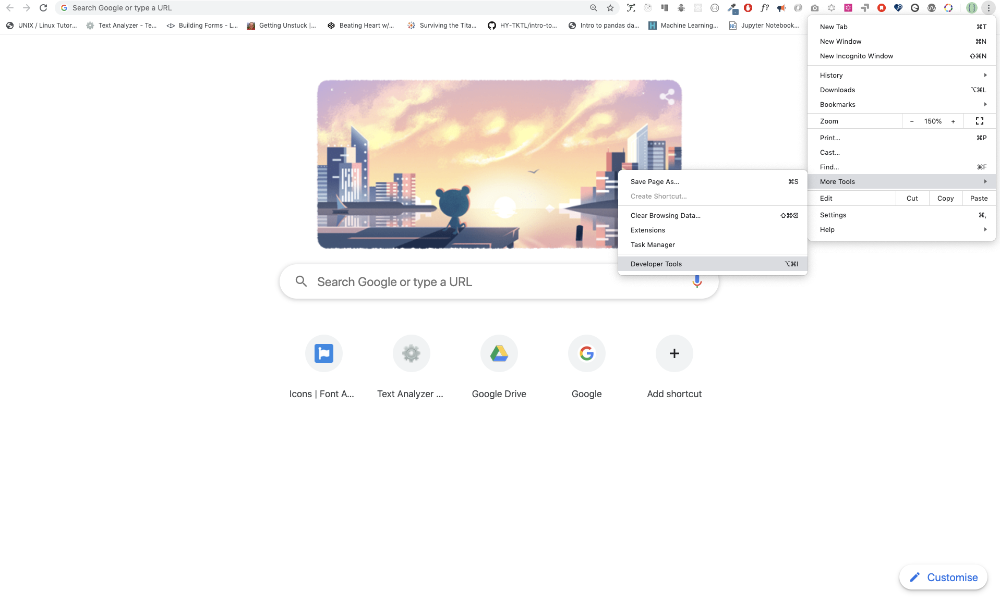
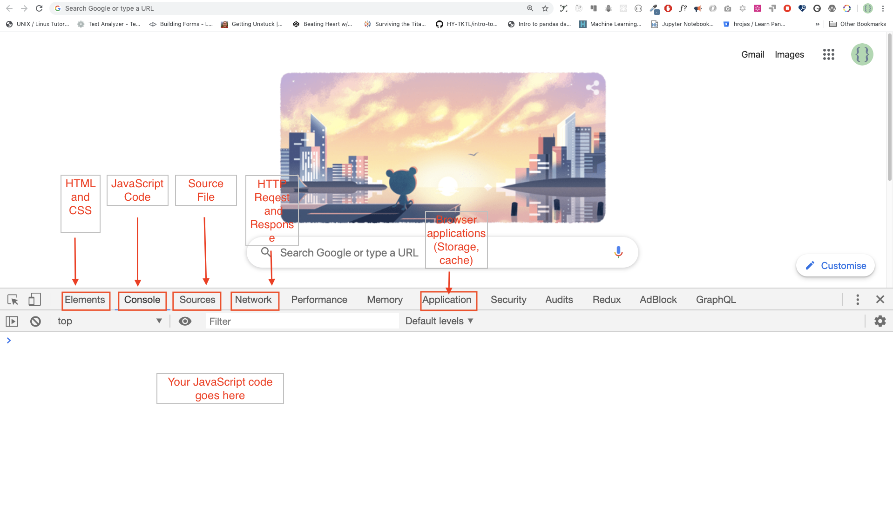

# 30 Günlük JavaScript dərsləri 

| # Gün |                                                                       Mövzular                                                                      |
| ----- | :-------------------------------------------------------------------------------------------------------------------------------------------------: |
| 01    |                                                             [Giriş](./readMe.md)                                                             |
| 02    |                                               [Data Types](./02_Day_Data_types/02_day_data_types.md)                                                |
| 03    |                             [Booleans, Operators, Date](./03_Day_Booleans_operators_date/03_booleans_operators_date.md)                             |
| 04    |                                            [Conditionals](./04_Day_Conditionals/04_day_conditionals.md)                                             |
| 05    |                                                     [Arrays](./05_Day_Arrays/05_day_arrays.md)                                                      |
| 06    |                                                       [Loops](./06_Day_Loops/06_day_loops.md)                                                       |
| 07    |                                                 [Functions](./07_Day_Functions/07_day_functions.md)                                                 |
| 08    |                                                    [Objects](./08_Day_Objects/08_day_objects.md)                                                    |
| 09    |                             [Higher Order Functions](./09_Day_Higher_order_functions/09_day_higher_order_functions.md)                              |
| 10    |                                           [Sets and Maps](./10_Day_Sets_and_Maps/10_day_Sets_and_Maps.md)                                           |
| 11    |                      [Destructuring and Spreading](./11_Day_Destructuring_and_spreading/11_day_destructuring_and_spreading.md)                      |
| 12    |                                  [Regular Expressions](./12_Day_Regular_expressions/12_day_regular_expressions.md)                                  |
| 13    |                             [Console Object Methods](./13_Day_Console_object_methods/13_day_console_object_methods.md)                              |
| 14    |                                         [Error Handling](./14_Day_Error_handling/14_day_error_handling.md)                                          |
| 15    |                                                    [Classes](./15_Day_Classes/15_day_classes.md)                                                    |
| 16    |                                                        [JSON](./16_Day_JSON/16_day_json.md)                                                         |
| 17    |                                            [Web Storages](./17_Day_Web_storages/17_day_web_storages.md)                                             |
| 18    |                                                  [Promises](./18_Day_Promises/18_day_promises.md)                                                   |
| 19    |                                                   [Closure](./19_Day_Closures/19_day_closures.md)                                                   |
| 20    |                                  [Writing Clean Code](./20_Day_Writing_clean_codes/20_day_writing_clean_codes.md)                                   |
| 21    |                                                          [DOM](./21_Day_DOM/21_day_dom.md)                                                          |
| 22    |                            [Manipulating DOM Object](./22_Day_Manipulating_DOM_object/22_day_manipulating_DOM_object.md)                            |
| 23    |                                        [Event Listeners](./23_Day_Event_listeners/23_day_event_listeners.md)                                        |
| 24    |                             [Mini Project: Solar System](./24_Day_Project_solar_system/24_day_project_solar_system.md)                              |
| 25    | [Mini Project: World Countries Data Visulalization 1](./25_Day_World_countries_data_visualization_1/25_day_world_countries_data_visualization_1.md) |
| 26    | [Mini Project: World Countries Data Visulalization 2](./26_Day_World_countries_data_visualization_2/26_day_world_countries_data_visualization_2.md) |
| 27    |                             [Mini Project: Portfolio](./27_Day_Mini_project_portfolio/27_day_mini_project_portfolio.md)                             |
| 28    |                          [Mini Project: Leaderboard](./28_Day_Mini_project_leaderboard/28_day_mini_project_leaderboard.md)                          |
| 29    |             [Mini Project:Animating characters](./29_Day_Mini_project_animating_characters/29_day_mini_project_animating_characters.md)             |
| 30    |                                     [Final Projects](./30_Day_Mini_project_final/30_day_mini_project_final.md)                                      |

🧡🧡🧡 Xoş kodlamalar 🧡🧡🧡

<div>
<small><strong>Müəllifi</strong> dəstəkləməklə daha çox təhsil materialı yaratmasına kömək ola bilərsiniz</small> <br />  
<a href = "https://www.paypal.me/asabeneh"></a>
</div>

<div align="center">
  <h1> 30 Günlük JavaScript: Giriş</h1>
  <a class="header-badge" target="_blank" href="https://www.linkedin.com/in/asabeneh/">
  
  </a>
  <a class="header-badge" target="_blank" href="https://twitter.com/Asabeneh">
  
  </a>

<sub>Author:
<a href="https://www.linkedin.com/in/asabeneh/" target="_blank">Asabeneh Yetayeh</a><br>
<small> Yanvar, 2020</small>
</sub>

  <div>

🇬🇧 [English](./readMe.md)
🇪🇸 [Spanish](./Spanish/readme.md)
🇷🇺 [Russian](./RU/README.md)
Az [Azerbaijan](./Azerbaijani/readMe.md)

  </div>

</div>
</div>

[Gün 2 >>](./02_Day_Data_types/02_day_data_types.md)


- [30 Günlük JavaScript dərsləri](#30-days-of-javascript)
- [📔 Gün 1](#-day-1)
  - [Giriş](#introduction)
  - [İlkin tələblər](#requirements)
  - [Hazırlıq](#setup)
    - [Node.js yüklə](#install-nodejs)
    - [Brauzer](#browser)
      - [Google Chrome yüklənməsi](#installing-google-chrome)
      - [Google Chrome brauzer konsolu açmaq](#opening-google-chrome-console)
      - [Brauzer konsolunda kod yazılması](#writing-code-on-browser-console)
        - [Console.log](#consolelog)
        - [Console.log - birneçə arqument ilə](#consolelog-with-multiple-arguments)
        - [Şərhlər](#comments)
        - [Sintaksis](#syntax)
      - [Riyazi əməliyyatlar](#arithmetics)
    - [Kod editoru](#code-editor)
      - [Visual Studio Code'un yüklənməsi](#installing-visual-studio-code)
      - [Visual Studio Code istifadəsi](#how-to-use-visual-studio-code)
  - [Veb səhifəyə JavaScript əlavə edilməsi](#adding-javascript-to-a-web-page)
    - [Sətirdaxili (inline) skript](#inline-script)
    - [Daxili (internal) skript](#internal-script)
    - [Xarici skript](#external-script)
    - [Birneçə xarici skript](#multiple-external-scripts)
  - [Verilənlərin tiplərinə giriş](#introduction-to-data-types)
    - [Ədəd tipləri](#numbers)
    - [Sətir tipləri](#strings)
    - [Məntiqi tiplər](#booleans)
    - [Undefined](#undefined)
    - [Null](#null)
  - [Verilənlərin tiplərinin yoxlanılması](#checking-data-types)
  - [Şərhlər (daha artıq)](#comments-again)
  - [Dəyişənlər](#variables)
- [💻 Gün 1: Tapşırıqlar](#-day-1-exercises)

# 📔 Gün 1

## Giriş

30 günlük JavaScript proqramlaşdırma müsabiqəsində iştirak etmək qərarına gəldiyiniz üçün sizi **təbrik edirik**. Bu çağırışda siz JavaScript proqramçısı olmaq üçün lazım olan hər şeyi və ümumiyyətlə, proqramlaşdırmanın bütün konsepsiyasını öyrənəcəksiniz. Müsabiqənin sonunda siz 30DaysOfJavaScript proqramlaşdırma testini tamamlama sertifikatı alacaqsınız. Yardıma ehtiyacınız olarsa və ya başqalarına kömək etmək istəyirsinizsə, rəsmi [telegram qrupuna](https://t.me/ThirtyDaysOfJavaScript) qoşula bilərsiniz

**30GünlükJavaScript** çağırışı həm yeni başlayanlar, həm də təcrübəli JavaScript proqramçıları üçün bələdçidir. JavaScript-ə xoş gəlmisiniz. JavaScript internetin dilidir. Mən JavaScript istifadə etməkdən və öyrətməkdən həzz alıram və ümid edirəm ki, siz də bunu edəcəksiniz.

Bu addım-addım JavaScript dərslərində siz bəşəriyyət tarixində ən populyar proqramlaşdırma dili olan JavaScript-i öyrənəcəksiniz.JavaScript **_veb-saytlara interaktivlik əlavə etmək, mobil proqramlar, masaüstü proqramlar, oyunlar hazırlamaq_** üçün istifadə olunur və bu gün JavaScript hətta **_maşın öyrənməsi_** və **_AI (süni intellekt)_** üçün istifadə edilə bilər.
**_JavaScript (JS)_** son illərdə populyarlığı artıb və son altı ildir ki, ardıcıl olaraq ən məhşur və ən çox istifadə olunan proqramlaşdırma dilidir
Mənbə: Github.

## Tələblər

İlkin olaraq heç bir proqramlaşdırma biliyi tələb olunmur. Yalnız ehtiyacınız var:

1. Motivasiya
2. Kompüter
3. Internet
4. Brauzer
5. Kod yazmaq üçün editor

## Hazırlıq

İnanıram ki, sizdə proqramçı olmaq üçün kompüter, internet, motivasiya və güclü istək var. Bunlara sahibsinizsə, başlamaq üçün hər şeyiniz var.

### Node.js-in yüklənilməsi

İndi olmasa belə daha sonrakı addımlar üçün Node-a ehtiyaciniz var. Yükləmək üçün [buraya](https://nodejs.org/en/) istinad edin.


Yükləndikdən sonra quraşdırılma üçün


Əməliyyat sistemi terminalımızı açaraq maşınımızda node quraşdırılıb-quraşdırılmadığını yoxlaya bilərik.

```sh
asabeneh $ node -v
v12.14.0
```

Bu dərsliyi hazırlayarkən mən Node versiyası 12.14.0-dan istifadə edirdim, lakin indi yükləmək üçün Node.js-in tövsiyə olunan versiyası v14.17.6-dır.

### Brauzer

Hazırda bir çox brauzer mövcud olsa da müəllif Google Chrome istifadəsini tövsiyə edir.

#### Google Chrome yükləmək

Google Chrome sizdə mövcud deyilsə bu [linkə](https://www.google.com/chrome/) istinad edin. Biz brauzer konsolunda kiçik JavaScript kodu yaza bilərik, lakin ciddi proqramların hazırlanması üçün brauzer konsolundan istifadə etmirik.


#### Google Chrome konsola giriş

Siz Google Chrome konsolunu brauzerin yuxarı sağ küncündə üç nöqtəyə klikləməklə, _Əlavə alətlər -> Tərtibatçı alətləri_ seçməklə və ya klaviatura qısa yolundan istifadə etməklə aça bilərsiniz. Mən qısayollardan istifadə etməyi üstün tuturam.



Klaviatura qısayolu ilə brauzer açmaq üçün

```sh
Mac
Command+Option+J

Windows/Linux:
Ctl+Shift+J
```



Google Chrome konsolunu açdıqdan sonra işarələnmiş düymələri araşdırmağa çalışın. Biz vaxtımızın çox hissəsini Konsolda keçirəcəyik. Konsol JavaScript kodunuzun mövcud olduğu yerdir. Google Console V8 mühərriki JavaScript kodunuzu maşın koduna tərcümə edir.
Gəlin Google Chrome konsolunda JavaScript kodu yazaq:


#### Brauzer konsolunda kodun yazılması

Biz istənilən JavaScript kodunu Google konsolunda və ya istənilən brauzer konsolunda yaza bilərik. Bununla belə, bu problem üçün biz yalnız Google Chrome konsoluna diqqət yetiririk. Konsolu aşağıdakılardan istifadə edərək açın:

```sh
Mac
Command+Option+I

Windows:
Ctl+Shift+I
```

##### Console.log

İlk JavaScript kodumuzu yazmaq üçün biz daxili funksiyadan istifadə etdik **console.log()**. Biz arqumenti giriş məlumatları kimi ötürdük və funksiya çıxışı göstərir. Biz console.log() funksiyasında giriş məlumatı və ya arqument kimi "Salam, Dünya"nı ötürdük.

```js
console.log('Salam, Dünya!')
```

##### Console.log - birneçə arqument ilə

**console.log()** funksiyasi vergüllə ayrılmış istənilən sayda parametri qəbul edə bilər. 
Sintaksis: **console.log(param1, param2, param3)**


```js
console.log('Hello', 'World', '!')
console.log('HAPPY', 'NEW', 'YEAR', 2020)
console.log('Welcome', 'to', 30, 'Days', 'Of', 'JavaScript')
```

Yuxarıdakı kod parçasından göründüyü kimi, _console.log()_ çoxlu arqument qəbul edə bilər.

Təbrik edirik! Siz ilk JavaScript kodunuzu _console.log()_ istifadə edərək yazdınız.

##### Şərhlər

Kodumuza şərhlər əlavə edirik. Kodu daha oxunaqlı etmək və kodumuzda qeydlər daxil etmək üçün şərhlər çox vacibdir. JavaScript kodumuzun şərh hissəsini qeydə almır və maşın dilinə tərcümə etmir. JavaScript-də // ilə başlayan hər hansı mətn sətiri şərhdir və həmçinin buna /\* \*/ kimi əlavə edilən hər şey də şərhdir.

**Nümunə: Tək sətirli şərhlər**

// Bu bir şərhdir  
 // Bu da bir şərhdir
 // Bu da həmçinin

**Nümunə: Çoxsətirli şərhlər**

/*
Çoxsətirli şərhlər  
 Çoxsətirli şərhlər bir neçə sətiri ehtiva edə bilir  
 JavaScript web-in dilidir  
 */

##### Sintaksis

Proqramlaşdırma dilləri insan dillərinə bənzəyir. İngilis və ya bir çox başqa dil mənalı mesajı çatdırmaq üçün sözlər, ifadələr, cümlələr, mürəkkəb cümlələr və sair istifadə edir. Sintaksisin ingiliscə mənası _dildə yaxşı formalaşmış cümlələr yaratmaq üçün söz və ifadələrin düzülüşüdür_. Sintaksisin texniki tərifi kompüter dilində ifadələrin strukturudur. Proqramlaşdırma dillərində sintaksis var. JavaScript proqramlaşdırma dilidir və digər proqramlaşdırma dilləri kimi onun da öz sintaksisi var. JavaScript-in başa düşdüyü sintaksisi yazmasaq, o, müxtəlif növ xətaları bizə qaytaracaq. Müxtəlif növ JavaScript xətalarını daha sonra araşdıracağıq. Hələlik gəlin sintaksis səhvlərinə baxaq.


Mən qəsdən səhv etdim. Nəticədə, konsol sintaksis səhvlərini qaytarır. Əslində, sintaksis çox informativdir. Hansı növ səhvə yol verildiyini bildirir. Səhv rəyi təlimatını oxumaqla biz sintaksisi düzəldə və problemi həll edə bilərik. Proqramdakı xətaların müəyyən edilməsi və aradan qaldırılması prosesi "debugging" adlanır. Gəlin səhvləri düzəldək:
```js
console.log('Hello, World!')
console.log('Hello, World!')
```

İndiyə qədər biz _console.log()_ istifadə edərək mətnin necə göstərildiyini gördük. Əgər biz _console.log()_ istifadə edərək mətni və ya sətri çap ediriksə, mətn tək dırnaqlar, qoşa dırnaqlar və ya əks dırnaqlar (backtick) içərisində olmalıdır.

**Nümunə:**

```js
console.log('Hello, World!')
console.log("Hello, World!")
console.log(`Hello, World!`)
```

#### Riyazi əməliyyatlar

İndi gəlin ədəd tipli dəyişənlər üzərində Google Chrome konsolunda _console.log()_ istifadə edərək JavaScript kodlarının yazılmasına aid nümunələri məşq edək.

Mətnə əlavə olaraq JavaScript-dən istifadə edərək riyazi hesablamalar da edə bilərik. Aşağıdakı sadə hesablamaları aparaq.
Konsol **_console.log()_** funksiyası olmadan birbaşa arqumentlər qəbul edə bilər. Bununla belə, o, dərslikdə daha əvvəldə daxil edilmişdir, çünki bu nümunələrin əksəriyyəti funksiyadan istifadənin məcburi olduğu mətn redaktorunda baş verəcəkdir. Konsoldakı təlimatlarlı birbaşa nəzərdən keçirə bilərsiniz.


```js
console.log(2 + 3) // Toplama
console.log(3 - 2) // Çıxma
console.log(2 * 3) // Vurma
console.log(3 / 2) // Bölmə
console.log(3 % 2) // Qalığın tapılması
console.log(3 ** 2) // Qüvvət üstü. Yəni, 3 ** 2 == 3 * 3
```

### Mətn redaktoru

Kodlarımızı brauzer konsoluna yaza bilərik, lakin bu, daha böyük layihələr üçün əlverişli deyil və ya bəzi hallarda mümkünsüzdür. Real iş mühitində proqramçılar kodlarını yazmaq üçün müxtəlif kod/mətn redaktorlarından istifadə edirlər. Bu 30 günlük JavaScript dərsliyində biz Visual Studio Code-dan istifadə edəcəyik.

#### Visual Studio Code-un yüklənməsi

Visual Studio Code çox məşhur açıq mənbəli mətn redaktorudur. [Visual Studio Code-u yükləmə](https://code.visualstudio.com/) tövsiyə edərdim, lakin başqa redaktorların tərəfdarısınızsa, əlinizdə olanları istifadə etməkdən çəkinməyin.


Yüklədikdən sonra mətn redaktoru artıq istifadəyə hazırdır.

#### Visual Studio Code-u necə istifadə etməli

Yüklənmə uğurla başa çatdıqdan sonra Visual Studio Code ikonuna 2 ardıcıl klik edərək onu başlada bilərsiniz


## Veb səhifəyə JavaScript əlavə olunması 

JavaScript kodu veb səhifəyə 3 üsulla əlavə edilə bilər:

- **_Sətirdaxili skript_**
- **_Daxili skript_**
- **_Xarici fayl ilə skript_**
- **_Birneçə xarici faylla skript_**

Aşağıdakı bölmələr veb səhifənizə JavaScript kodu əlavə etməyin müxtəlif yollarını göstərir.

### Sətirdaxili skript

İş masanızda və ya istənilən yerdə layihə qovluğu yaradın, onu 30DaysOfJS adlandırın və layihə qovluğunda **_index.html_** faylı yaradın. Sonra aşağıdakı kodu fayla əlavə edib onu brauzerdə açın, məsələn [Chrome](https://www.google.com/chrome/) ilə.

```html
<!DOCTYPE html>
<html>
  <head>
    <title>30DaysOfScript: Sətirdaxili skript</title>
  </head>
  <body>
    <button onclick="alert('30DaysOfJavaScript dərsliyinə xoş gəlmişsiniz')">Kliklə</button>
  </body>
</html>
```

İndi siz ilk daxili skriptinizi yazdınız. Biz _alert()_ daxili funksiyasından istifadə edərək pop-up xəbərdarlıq mesajı yarada bilərik.

### Daxili skript

Daxili skript _head_ və ya _body_ ilə yazıla bilər, lakin onu HTML sənədinin gövdəsinə yerləşdirməyə üstünlük verilir.
Əvvəlcə səhifənin baş hissəsinə yazaq.

```html
<!DOCTYPE html>
<html>
  <head>
    <title>30DaysOfScript: Daxili skript</title>
    <script>
      console.log('30DaysOfJavaScript-ə xoş gəlmişsiniz')
    </script>
  </head>
  <body></body>
</html>
```

Çox vaxt daxili skripti belə yazırıq. JavaScript kodunun faylın gövdəsinə (body) bölməsinə yazılması ən çox üstünlük verilən seçimdir. console.log() saytından çıxışı görmək üçün brauzer konsolunu açın

```html
<!DOCTYPE html>
<html>
  <head>
    <title>30DaysOfScript: Daxili skript</title>
  </head>
  <body>
    <button onclick="alert('30DaysOfJavaScript-ə xoş gəlmişsiniz');">Kliklə</button>
    <script>
      console.log('30DaysOfJavaScript-ə xoş gəlmişsiniz')
    </script>
  </body>
</html>
```

console.log() saytından çıxışı görmək üçün brauzer konsolunu açın


### Xarici kod skripti

Daxili skriptə bənzər şəkildə, xarici skript bağlantısı başlıqda (head) və ya gövdədə (body) ola bilər, lakin onun gövdəyə yerləşdirilməsinə üstünlük verilir.
Əvvəlcə .js uzantılı xarici JavaScript faylı yaratmalıyıq. .js uzantısı ilə bitən bütün fayllar JavaScript fayllarıdır. Layihə qovluğunda introduction.js adlı fayl yaradın və aşağıdakı kodu yazın və bu .js faylını gövdənin aşağı hissəsində əlaqələndirin.

```js
console.log('30 Günlük JS dərsləri')
```

_head_ hissəsində JavaScript faylına istinad:

```html
<!DOCTYPE html>
<html>
  <head>
    <title>30DaysOfJavaScript: Xarici skript faylı</title>
    <script src="introduction.js"></script>
  </head>
  <body></body>
</html>
```

_body_ hissəsində JavaScript faylına istinad:

```html
<!DOCTYPE html>
<html>
  <head>
    <title>30DaysOfJavaScript: Xarici skript faylı</title>
  </head>
  <body>
    <!-- Əvvəldə vurğuladığımız kimi həm head həm body hissəsində ola bilər --> 
    <!-- Lakin aşağıda göstərilən kimi (body hissəsində) olması arzuolunandır -->
    <script src="introduction.js"></script>
  </body>
</html>
```

console.log() nəticəsini görmək üçün brauzer konsolunu açın.

### Birneçə xarici skript faylına istinad

Biz həmçinin bir neçə xarici JavaScript faylına veb səhifədə istinad edə bilərik.
30DaysOfJS qovluğunda helloworld.js faylı yaradın və aşağıdakı kodu yazın.

```js
console.log('Salam, dünya!')
```

```html
<!DOCTYPE html>
<html>
  <head>
    <title>Birneçə xarici skript faylına istinad</title>
  </head>
  <body>
    <script src="helloworld.js"></script>
    <script src="introduction.js"></script>
  </body>
</html>
```

_Main.js_ faylınız bütün digər skriptlərdən sonra daxil edilməlidir. Bunu xatırlamaq çox vacibdir.


## Verilənlər tiplərinə giriş

JavaScript-də və digər proqramlaşdırma dillərində müxtəlif növ məlumat növləri mövcuddur. Aşağıdakılar JavaScript primitiv verilən tipləridir:_String, Number, Boolean, undefined, Null_ və _Symbol_.

### Ədədlər (Numbers)

- İnteger: Integer (mənfi, sıfır və müsbət) ədədlər
  Nümunə:
  ... -3, -2, -1, 0, 1, 2, 3 ...
- Tam hissəli ədədlər: Onluq (Decimal) ədədlər
  Nümunə:
  ... -3.5, -2.25, -1.0, 0.0, 1.1, 2.2, 3.5 ...

### Sətir (String) tipli verilənlər

İki tək dırnaq, qoşa dırnaq və ya əks istiqamətli dırnaqlar arasında bir və ya daha çox simvol çoxluğudur.

**Nümunə:**

```js
'Asabeneh'
'Finland'
'JavaScript is a beautiful programming language'
'I love teaching'
'I hope you are enjoying the first day'
`We can also create a string using a backtick`
'A string could be just as small as one character as big as many pages'
```

### Məntiqi ifadələr

Məntiqi tiplər yalnız iki mümkün qiymətdən birini ala bilən ifadələrdir. İstənilən müqayisə əməliyyatı _true_ və ya _false_ qiymətlərinin birindən ibarət nəticə qaytarır.

**Nümunə:**

```js
true 
false 
```

### Undefined

JavaScript-də dəyişənə ilkin qiymət təyin etməsək, _undefined_ tipi verilir. Bundan əlavə, funksiya heç nə qaytarmırsa, susmaya görə _undefined_ qaytarır.

```js
let firstName
console.log(firstName) // undefined, çünki dəyişənə ilkin qiymət təyin edilməyib
```

### Null

JavaScript-də null boş dəyər deməkdir.

```js
let emptyValue = null
```

## Verilənlər tiplərinin yoxlanılması

Hər hansi müəyyən olunmuş dəyişənin tipini tapmaq üçün **typeof** operatoru istifadə oluna bilər. Nümunəyə nəzər yetirin.

```js
console.log(typeof 'Asabeneh') // string
console.log(typeof 5) // number
console.log(typeof true) // boolean
console.log(typeof null) // object type
console.log(typeof undefined) // undefined
```

## Şərhlər (daha artıq)

Bildiyimiz kimi JavaScript-də şərh yazmaq digər proqramlaşdırma dillərinə olduğu kimidir. Kodunuzu daha oxunaqlı etmək üçün şərhlər vacibdir.
Şərh əlavə etməyin iki yolu var:

- _Təksətirli şərhlər_
- _Çoxsətirli şərhlər_

```js
// let firstName = 'Asabeneh'; tək sətirli şərh
// let lastName = 'Yetayeh'; tək sətirli şərh
```

Çoxsətirli şərhlər:

```js
/*
  let location = 'Helsinki';
  let age = 100;
  let isMarried = true;
  This is a Multiple line comment

*/
```

## Dəyişıənlər

Dəyişənlər məlumatların yaddaşda saxlanması üçün istifadə olunur. Dəyişən elan edildikdə, yaddaş yeri rezerv olunur. Dəyişən təyin edildikdə, yaddaş sahəsində həmin verilənlər saxlanılır. Dəyişən elan etmək üçün biz _var_, _let_ və ya _const_ açar sözlərindən istifadə edirik.

Qİyməti proqram daxilində dəyişən dəyişənlər üçün biz _let_ istifadə edirik. Məlumatlar ümumiyyətlə dəyişməzsə, yəni sabitlər üçün biz _const_ istifadə edirik. Məsələn, PI sabiti üçün biz _const_ istifadə edə bilərik. Bu dərslikdə _var_ istifadə etməyəcəyik və mən sizə ondan istifadə etməyi tövsiyə etmirəm. Bu, tövsiyə edilən yol deyil və təhlükəli məqamlara yol aça bilər. Var, let və const haqqında digər bölmələrdə ətraflı danışacağıq. Hələlik yuxarıdakı izahat kifayətdir.

Düzgün JavaScript dəyişən adı aşağıdakı qaydalara əməl etməlidir:

- Rəqəmlə başlaya bilməz.
- $ və _ istisna olmaqla xüsusi simvolların istifadəsinə icazə verilmir.
- Adətən camelCase konvensiyasına əsaslanaraq adlandırılır.
- Sözlər və ya dəyişən adının hissələri arasında boşluq olmaz.

Düzgün dəyişən adları nümunələri:

```js
firstName
lastName
country
city
capitalCity
age
isMarried

first_name
last_name
is_married
capital_city

num1
num_1
_num_1
$num1
year2020
year_2020
```

Siyahıdakı birinci və ikinci dəyişənlər JavaScript-də elan etmək üçün camelCase konvensiyasına uyğundur. Bu dərslikdə biz camelCase dəyişənlərindən istifadə edəcəyik.

Yalnış elan olunmuş dəyişənlər:

```sh
  first-name
  1_num
  num_#_1
```

Müxtəlif verilən tipləri ilə dəyişənləri elan edək. Dəyişən elan etmək üçün dəyişən adından əvvəl _let_ və ya _const_ açar sözündən istifadə etməliyik. Dəyişən adından sonra bərabər işarəsi (təyinat operatoru) və dəyəri (təyin edilmiş verilənlər) yazırıq.

```js
// Sintaksis
let nameOfVariable = value
```

**Nümunələr**

```js
// Müxtəlif verilənlər tipindən istifadə edərək dəyişənlərin yaradılmasə
let firstName = 'Asabeneh'    // ad
let lastName = 'Yetayeh'      // soyad
let country = 'Finland'       // ölkə
let city = 'Helsinki'         // paytaxt
let age = 100                 // yaş
let isMarried = true

console.log(firstName, lastName, country, city, age, isMarried)
```

```sh
Asabeneh Yetayeh Finland Helsinki 100 true
```

```js
// ədəd tipli dəyişənlərin sabit açar sözü ilə yaradılması
let age = 100 // yaş
const gravity = 9.81         // Fizikada istifadə olunan qravitasiya sabiti
const boilingPoint = 100     // Normal atmosfer təzyiqində suyun qaynama tempraturu
const PI = 3.14              // Geometrik sabit
console.log(gravity, boilingPoint, PI)
```

```sh
9.81 100 3.14
```

```js
// Yalnız bir açar sözü istifadə etməklə müxtəlif dəyişənlər vergüllə ayrılmış şəkildə yaradıla bilər
let name = 'Asabeneh',     //ad
  job = 'teacher',         // vəzifə
  live = 'Finland'         // ölkə  
console.log(name, job, live)
```

```sh
Asabeneh teacher Finland
```

01_Giriş qovluqda _index.html_ faylını işə saldığınız zaman bunu əldə etməlisiniz:


🌕 Təbrik edirik! Siz 1-ci günü yenicə tamamladınız. İndi beyniniz və əzələniz üçün bəzi fiziki hərəkətlər edin.

# 💻 Gün 1: Tapşırıqlar

1. _şərhlər kodu oxunaqlı edə bilər_ mətnini özündə ehtiva edən tək sətirli şərh yazın.
2. _30DaysOfJavaScript-ə xoş gəlmisiniz_ deyən başqa bir şərh yazın.
3. Şərhlərin kodu oxunaqlı, təkrar istifadəsi asan və məlumatlandırıcı edə biləcəyini deyən çoxsətirli şərh yazın

4. Variables.js faylı yaradın və dəyişənləri elan edin və sətir, boolean, undefined və null dəyişən tiplərini təyin edin
5. datatypes.js faylı yaradın və müxtəlif dəyişən tiplərini yoxlamaq üçün JavaScript **_typeof_** operatorundan istifadə edin.
6. İlkin qiymət təyin etmədən dörd dəyişəni elan edin
7. Təyin edilmiş ilkin qiymət olan dörd dəyişəni elan edin
8. Adınızı, soyadınızı, ailə vəziyyətinizi, ölkənizi və yaşınızı bir neçə sətirdə saxlamaq üçün dəyişənləri elan edin
9. Adınızı, soyadınızı, ailə vəziyyətinizi, ölkənizi və yaşınızı bir sətirdə saxlamaq üçün dəyişənləri elan edin
10. İki _myAge_ və _yourAge_ dəyişənini elan edin və onlara ilkin qiymətlər təyin edin və brauzer konsoluna daxil olun.

```sh
I am 25 years old.
You are 30 years old.
```

🎉 TƏBRİK EDİRİK ! 🎉

[Gün 2 >>](./02_Day_Data_types/02_day_data_types.md)
