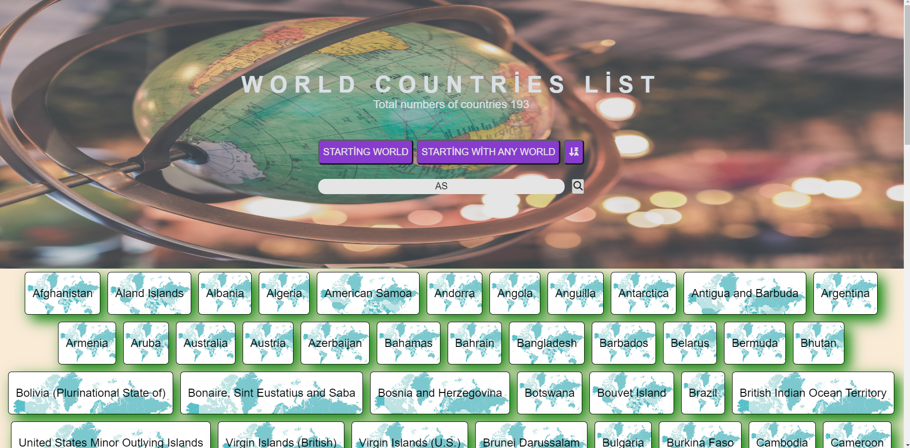

  # Day 26  - Mini Project 2
 
## [Exercise:Solutions](#exercise-solutions)

 #### [Home](../README.md) | [<< Day 25](../day_25/25_day.md) | [Day 27 >>](../day_27/27_day_portfolio.md)

### Exercise Level 1

1. Visualize the countries array as follows



### Exercise Level 1
 ```js
 //app.js
const countryApiUrl = 'https://restcountries.com/v2/all';
let startButton = document.getElementById("start");
let anyButton = document.getElementById("any");
const sort = document.getElementById("sort");
const input = document.getElementById("filter");
const form = document.getElementById("form")
const list = document.getElementById("list")
const text = document.getElementById("text")

let countries = [];
let filteredCountries = [];
startButton = false
anyButton = true


addEventListener();

function addEventListener() {
  
  form.addEventListener("click",choseButton)
}


// fetchging data

fetch(countryApiUrl)
.then((response) => response.json())
.then(async (data) => {
  await data.forEach((element) => {
    countries.push(element.name);
    
  });
  //  display(filteredCountries);
});


// display arr metod in the HTML

function display(arr) {
  
  let dizi = []
  arr.map((ar) => {
    
    const li = `<li>${ar}</li>`;
    dizi.push(li)
  });
  list.innerHTML=dizi
  sort.addEventListener("click",(e)=>{
    e.preventDefault()
    list.innerHTML = dizi.reverse();

  })
}

//chose buttton whick filter aray

function choseButton(e){
  
  input.addEventListener("keyup", filterAny);
  
  switch(e.target.id){
    
    
    case "start":
    e.preventDefault()
    filterStart()
    break;
    
    case "any":
    e.preventDefault()
    filterAny()
    break;
    
  }
}

// filter array on click any button

function filterAny(){
  let inputValue = input.value.toLowerCase().trim()
  
  list.innerHTML = '';
  filteredCountries = []
  
  if(inputValue.length !==0){
    
    countries.forEach((country)=>{
      
      if(country.toLowerCase().trim().includes(inputValue,0)){
        filteredCountries.push(country)
        
      }else{
        
        // console.log("Aradığınız ülke bulunamadı")
      }
    })
    text.innerHTML=`Countries containing ${inputValue} are ${filteredCountries.length}`

  }else{
    // alert("Lütfen geçerli bir değer girin")
  }
  display(filteredCountries)
}

// filter array on click start button

function filterStart(){
  let inputValue = input.value.toLowerCase().trim()
  
  list.innerHTML = '';
  filteredCountries = []
  
  if(inputValue.length !==0){
    
    countries.forEach((country)=>{
      
      if(country.toLowerCase().trim().startsWith(inputValue,0)){
        filteredCountries.push(country)
        
      }else{
        
        // console.log("Aradığınız ülke bulunamadı")
      }
    })
    text.innerHTML=`Countries start with ${inputValue} are ${filteredCountries.length}`
  }else{
    // alert("Lütfen geçerli bir değer girin")
  }
  display(filteredCountries)
}


 ```