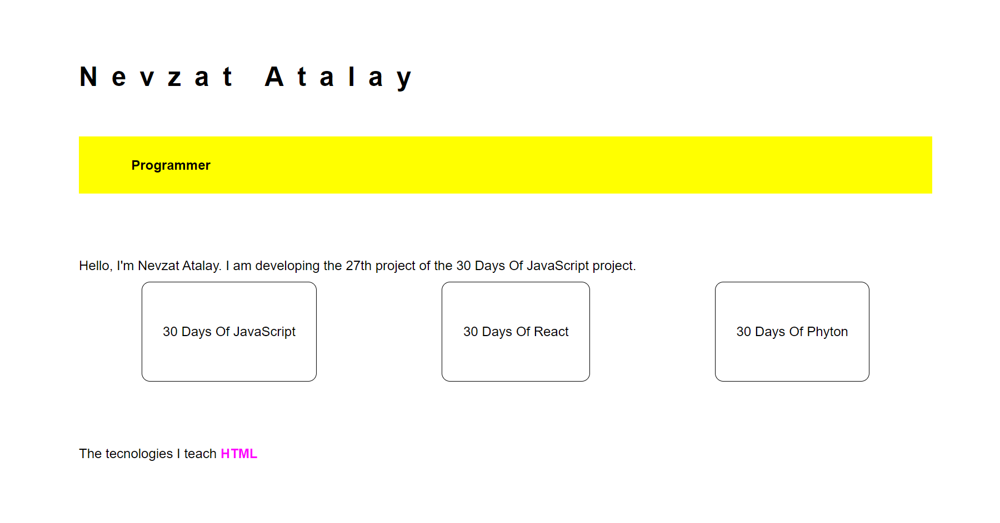

  # Day 27  - Portfolio
 
## [Exercise:Solutions](#exercise-solutions)

 #### [Home](../README.md) | [<< Day 26](../day_26/26_day_World_2.md) | [Day 28 >>](../day_28/day_28_leaderboard.md)

### Exercise Level 1

1. Create the following using HTML, CSS, and JavaScript

```js

//app.js
const animation = document.getElementById("footer")
const header = document.getElementById("header")
const headerWords=["Motivaional Speaker","Programmer", "Educator","Content Creator","Motivator","Instructer"]
const footerWords = ["HTML", "CSS", "JavaScript", "React"];
let i = 0; // bu değişkeni genel olarak tanımlamak gerekiyor

function typeWord() {
    if (i < footerWords.length) {
        let currentWord = footerWords[i];
        animation.innerHTML ="The tecnologies I teach  " + `<span>${currentWord}</span>`
        setTimeout(typeWord, 2000)
        i++
    } else {
        i = 0;
        typeWord();
    }
}

typeWord();

function headerAnimation(){
    if(i<headerWords.length){
        let currentWord=headerWords[i]
        header.innerHTML=currentWord
       i++
       setTimeout(headerAnimation,2000)
    }
    else{
        i=0
        headerAnimation()
    }
}
headerAnimation()
```