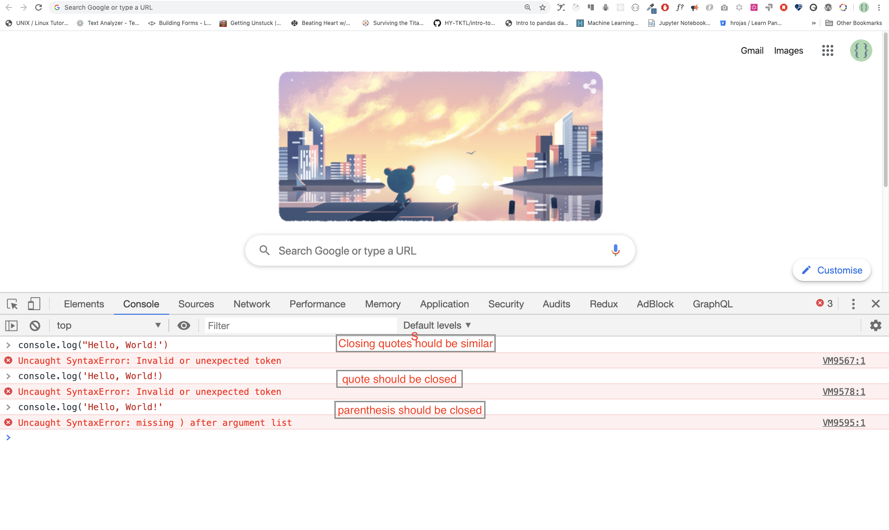
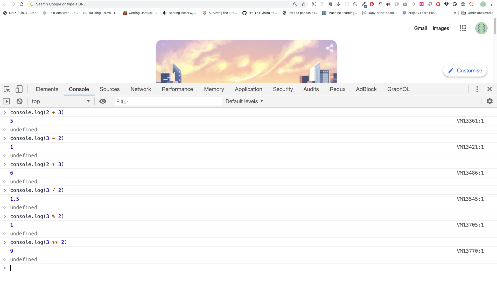
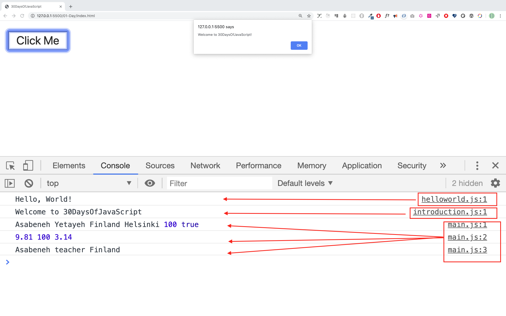

# 30 jours de JavaScript

| # Jours |                                                                       Tables des matières                                                                        |
| ----- | :-------------------------------------------------------------------------------------------------------------------------------------------------: |
| 01    |                                                             [Introduction](./readMe.md)                                                             |
| 02    |                                               [Les types de données](./02_Day_Data_types/02_day_data_types.md)                                                |
| 03    |                             [Booléens, Opérateurs, Date](./03_Day_Booleans_operators_date/03_booleans_operators_date.md)                             |
| 04    |                                            [Les conditions](./04_Day_Conditionals/04_day_conditionals.md)                                             |
| 05    |                                                     [Les tableaux (Arrays)](./05_Day_Arrays/05_day_arrays.md)                                                      |
| 06    |                                                       [Les boucles](./06_Day_Loops/06_day_loops.md)                                                       |
| 07    |                                                 [Les fonctions](./07_Day_Functions/07_day_functions.md)                                                 |
| 08    |                                                    [Les objets](./08_Day_Objects/08_day_objects.md)                                                    |
| 09    |                             [Les fonctions d'ordre supérieur](./09_Day_Higher_order_functions/09_day_higher_order_functions.md)                              |
| 10    |                                           [Set et Map](./10_Day_Sets_and_Maps/10_day_Sets_and_Maps.md)                                           |
| 11    |                      [La déstructuration et propagation](./11_Day_Destructuring_and_spreading/11_day_destructuring_and_spreading.md)                      |
| 12    |                                  [Les expressions régulières](./12_Day_Regular_expressions/12_day_regular_expressions.md)                                  |
| 13    |                             [Les méthodes de objet console. ](./13_Day_Console_object_methods/13_day_console_object_methods.md)                              |
| 14    |                                         [Gestion des erreurs](./14_Day_Error_handling/14_day_error_handling.md)                                          |
| 15    |                                                    [Les classes](./15_Day_Classes/15_day_classes.md)                                                    |
| 16    |                                                        [JSON](./16_Day_JSON/16_day_json.md)                                                         |
| 17    |                                            [Stockages Web](./17_Day_Web_storages/17_day_web_storages.md)                                             |
| 18    |                                                  [Les promesses](./18_Day_Promises/18_day_promises.md)                                                   |
| 19    |                                                   [Fermeture (Closure)](./19_Day_Closures/19_day_closures.md)                                                   |
| 20    |                                  [Écrire un code propre](./20_Day_Writing_clean_codes/20_day_writing_clean_codes.md)                                   |
| 21    |                                                          [DOM](./21_Day_DOM/21_day_dom.md)                                                          |
| 22    |                            [Manipulation de l'objet DOM](./22_Day_Manipulating_DOM_object/22_day_manipulating_DOM_object.md)                            |
| 23    |                                        [Écouteurs d'événements](./23_Day_Event_listeners/23_day_event_listeners.md)                                        |
| 24    |                             [Mini projet : Système solaire](./24_Day_Project_solar_system/24_day_project_solar_system.md)                              |
| 25    | [Mini projet : Visualisation des données sur les pays du monde 1](./25_Day_World_countries_data_visualization_1/25_day_world_countries_data_visualization_1.md) |
| 26    | [Mini projet : Visualisation des données sur les pays du monde 2](./26_Day_World_countries_data_visualization_2/26_day_world_countries_data_visualization_2.md) |
| 27    |                             [Mini Projet: Portfolio](./27_Day_Mini_project_portfolio/27_day_mini_project_portfolio.md)                             |
| 28    |                          [Mini Projet: Tableau de bord](./28_Day_Mini_project_leaderboard/28_day_mini_project_leaderboard.md)                          |
| 29    |             [Mini Projet: Animation des caractère ](./29_Day_Mini_project_animating_characters/29_day_mini_project_animating_characters.md)             |
| 30    |                                     [Les projets finals](./30_Day_Mini_project_final/30_day_mini_project_final.md)                                      |

🧡🧡🧡 BON CODAGE 🧡🧡🧡

<div>
<small>Soutenir <strong>l'auteur </strong> pour qu'il crée davantage de supports pédagogiques</small> <br />  
<a href = "https://www.paypal.me/asabeneh"></a>
</div>

<div align="center">
  <h1> 30 jours de JavaScript: Introduction</h1>
  <a class="header-badge" target="_blank" href="https://www.linkedin.com/in/asabeneh/">
  
  </a>
  <a class="header-badge" target="_blank" href="https://twitter.com/Asabeneh">
  
  </a>

<sub>Auteur:
<a href="https://www.linkedin.com/in/asabeneh/" target="_blank">Asabeneh Yetayeh</a><br>
<small> Janvier, 2020</small>
</sub>

<div>

🇬🇧 [English](./readMe.md)
🇫🇷 [French](./French/readMe.md)
🇪🇸 [Spanish](./Spanish/readme.md)
🇮🇹 [Italian](./Italian/readMe.md)Setup
🇷🇺 [Russian](./RU/README.md)
🇹🇷 [Turkish](./Turkish/readMe.md)
🇦🇿 [Azerbaijan](./Azerbaijani/readMe.md)
🇰🇷 [Korean](./Korea/README.md)
🇻🇳 [Vietnamese](./Vietnamese/README.md)
🇵🇱 [Polish](./Polish/readMe.md)
🇧🇷 [Portuguese](./Portuguese/readMe.md)


</div>

</div>
</div>

[Jour 2 >>](./02_Day_Data_types/02_day_data_types.md)


- [30 jours de JavaScript](#30-jours-de-javascript)
- [📔 Jour 1](#-jour-1)
  - [Introduction](#introduction)
  - [Les éxigences](#les-éxigences)
  - [Configuration](#configuration)
    - [Installation de  Node.js](#installation-de--nodejs)
    - [Navigateur](#navigateur)
      - [Installation de  Google Chrome](#installation-de--google-chrome)
      - [Ouverture de la console Google Chrome](#ouverture-de-la-console-google-chrome)
      - [Écrire du code sur la console du navigateur](#écrire-du-code-sur-la-console-du-navigateur)
        - [Console.log](#consolelog)
        - [Console.log avec plusieurs arguments](#consolelog-avec-plusieurs-arguments)
        - [Comments](#comments)
        - [Syntaxe](#syntaxe)
      - [AArithmétique](#aarithmétique)
    - [Editeur de code](#editeur-de-code)
      - [Installation de  Visual Studio Code](#installation-de--visual-studio-code)
      - [Comment utiliser Visual Studio Code](#comment-utiliser-visual-studio-code)
  - [Ajout de JavaScript à une page Web](#ajout-de-javascript-à-une-page-web)
    - [Script en ligne](#script-en-ligne)
    - [Script interne](#script-interne)
    - [Script externe](#script-externe)
    - [Multiple External Scripts](#multiple-external-scripts)
  - [Introduction to Data types](#introduction-to-data-types)
    - [Numbers](#numbers)
    - [Strings](#strings)
    - [Booleans](#booleans)
    - [Undefined](#undefined)
    - [Null](#null)
  - [Checking Data Types](#checking-data-types)
  - [Comments Again](#comments-again)
  - [Variables](#variables)
- [💻 Day 1: Exercises](#-day-1-exercises)

# 📔 Jour 1

## Introduction

**Félicitations** en décidant de participer au défi des 30 jours de programmation JavaScript. Dans ce défi, vous apprendrez tout ce dont vous avez besoin pour être un programmeur JavaScript, et en général, tout le concept de la programmation. À la fin du défi, vous recevrez un certificat d'achèvement du défi de programmation 30DaysOfJavaScript. Si vous avez besoin d'aide ou si vous souhaitez aider d'autres personnes, vous pouvez rejoindre le groupe de discussion dédié. [groupe telegram ](https://t.me/ThirtyDaysOfJavaScript). 

**30 jours de JavaScript** challenge est un guide pour les débutants et les développeurs avancés en JavaScript. Bienvenue à JavaScript. JavaScript est le langage du web. J'aime utiliser et enseigner JavaScript et j'espère que vous en ferez autant.

Dans ce défi JavaScript pas à pas, vous apprendrez JavaScript, le langage de programmation le plus populaire de l'histoire de l'humanité. JavaScript est utilisé **_pour ajouter de l'interactivité aux sites web, pour développer des applications mobiles, des applications de bureau, des jeux, etc._** et aujourd'hui, JavaScript peut être utilisé pour **la programmation côté serveur**,  **_l'apprentissage automatique_** and **_l'intelligence artificielle _**.

**_JavaScript (JS)_** a gagné en popularité au cours des dernières années et est le langage de programmation le plus utilisé dans le monde.
depuis dix ans et est le langage de programmation le plus utilisé sur GitHub.

Ce défi est facile à lire, écrit dans un français facile, engageant, motivant et en même temps, il est très exigeant. Vous devez consacrer beaucoup de temps à la réalisation de ce défi. Si vous êtes un apprenant visuel, vous pouvez obtenir la leçon vidéo sur <a href="https://www.youtube.com/channel/UC7PNRuno1rzYPb1xLa4yktw"> Washera</a> Chaîne YouTube. Abonnez-vous à la chaîne, commentez et posez des questions sur les vidéos YouTube et soyez proactif, l'auteur finira par vous remarquer. 

L'auteur aimerait connaître votre opinion sur le défi, partager l'auteur en exprimant vos pensées sur le défi 30 jours de JavaScript. Vous pouvez laisser votre témoignage sur cette page [link](https://testimonial-vdzd.onrender.com//)

## Les éxigences

No prior knowledge of programming is required to follow this challenge. You need only:

1. La motivation
2. Un ordinateur
3. La connexion internet
4. Un navigateur
5. Un editeur de code

## Configuration

I believe you have the motivation and a strong desire to be a developer, a computer and Internet. If you have those, then you have everything to get started.

### Installation de  Node.js

Vous n'avez peut-être pas besoin de Node.js pour l'instant, mais vous pourriez en avoir besoin plus tard. Installer [node.js](https://nodejs.org/en/).


Après le téléchargement, double-cliquez et installez


Nous pouvons vérifier si le nœud est installé sur notre machine locale en ouvrant le terminal de notre appareil ou l'invite de commande.

```sh
asabeneh $ node -v
v12.14.0
```

Lors de la création de ce didacticiel, j'utilisais Node version 12.14.0, mais maintenant la version recommandée de Node.js pour le téléchargement est v14.17.6, au moment où vous utilisez ce matériel, vous pouvez avoir une version Node.js supérieure.
### Navigateur

Il existe de nombreux navigateurs. Cependant, je recommande fortement Google Chrome.

#### Installation de  Google Chrome

Installer [Google Chrome](https://www.google.com/chrome/) si vous n'en avez pas encore. Nous pouvons écrire du petit code JavaScript sur la console du navigateur, mais nous n'utilisons pas la console du navigateur pour développer des applications.


#### Ouverture de la console Google Chrome

Vous pouvez ouvrir la console Google Chrome en cliquant sur trois points dans le coin supérieur droit du navigateur, en sélectionnant Plus d'outils -> Outils de développement ou en utilisant un raccourci clavier. Je préfère utiliser des raccourcis.


Pour ouvrir la console Chrome à l'aide d'un raccourci clavier.

```sh
Mac
Command+Option+J

Windows/Linux:
Ctl+Shift+J
```


Après avoir ouvert la console Google Chrome, essayez d'explorer les boutons marqués. Nous passerons la plupart du temps sur la console. La console est l'endroit où va votre code JavaScript. Le moteur Google Console V8 transforme votre code JavaScript en code machine. Écrivons un code JavaScript sur la console Google Chrome :


#### Écrire du code sur la console du navigateur

Nous pouvons écrire n'importe quel code JavaScript sur la console Google ou sur n'importe quelle console de navigateur. Cependant, pour ce défi, nous nous concentrons uniquement sur la console Google Chrome. Ouvrez la console en utilisant :

```sh
Mac
Command+Option+I

Windows:
Ctl+Shift+I
```

##### Console.log

Pour écrire notre premier code JavaScript, nous avons utilisé une fonction intégrée **console.log()**. Nous avons passé un argument en tant que données d'entrée et la fonction affiche la sortie. Nous avons passé `'Hello, World'` acomme données d'entrée ou argument dans la fonction console.log().

```js
console.log('Hello, World!')
```

##### Console.log avec plusieurs arguments

La fonction  **`console.log()`** peut prendre plusieurs paramètres séparés par des virgules. La syntaxe ressemble à ceci:**`console.log(param1, param2, param3)`**


```js
console.log('Hello', 'World', '!')
console.log('HAPPY', 'NEW', 'YEAR', 2020)
console.log('Welcome', 'to', 30, 'Days', 'Of', 'JavaScript')
```

Comme vous pouvez le voir dans l'extrait de code ci-dessus, _`console.log()`_ peut prendre plusieurs arguments..

Toutes nos félicitations! Vous avez écrit votre premier code JavaScript en utilisant _`console.log()`_.

##### Comments

Nous pouvons ajouter des commentaires à notre code. Les commentaires sont très importants pour rendre le code plus lisible et pour laisser des remarques dans notre code. JavaScript n'exécute pas la partie commentaire de notre code. En JavaScript, toute ligne de texte commençant par // en JavaScript est un commentaire, et tout ce qui est inclus comme cec `//` est également un commentaire.


**Example: Commentaire sur une seule lignet**

```js
// Ceci est le premier commentaire  
// Voici le deuxième commentaire  
// Je suis un commentaire d'une seule ligne
```

**Example: Commentaire multiligne**

```js
/*
Il s'agit d'un commentaire multiligne  
 Les commentaires multilignes peuvent prendre plusieurs lignes  
 JavaScript est le langage du web  
 */
```

##### Syntaxe

Les langages de programmation sont similaires aux langages humains. L'anglais ou d'autres langues utilisent des mots, des expressions, des phrases, des phrases composées et bien d'autres choses encore pour transmettre un message significatif. En anglais, le terme syntaxe signifie _la disposition des mots et des phrases pour créer des phrases bien formées dans une langue_. La définition technique de la syntaxe est la structure des énoncés dans un langage informatique. Les langages de programmation ont une syntaxe. JavaScript est un langage de programmation et, comme les autres langages de programmation, il possède sa propre syntaxe. Si nous n'écrivons pas une syntaxe que JavaScript comprend, il produira différents types d'erreurs. Nous étudierons les différents types d'erreurs JavaScript plus tard. Pour l'instant, voyons les erreurs de syntaxe.



J'ai fait une erreur délibérée. En conséquence, la console signale des erreurs de syntaxe. En fait, la syntaxe est très informative. Elle indique le type d'erreur commise. En lisant le guide de retour d'erreur, nous pouvons corriger la syntaxe et résoudre le problème. Le processus d'identification et de suppression des erreurs d'un programme s'appelle le débogage. Corrigeons les erreurs :

```js
console.log('Hello, World!')
console.log('Hello, World!')
```

Jusqu'à présent, nous avons vu comment afficher du texte à l'aide de l'extension _`console.log()`_. Si nous imprimons du texte ou une chaîne en utilisant _`console.log()`_,  texte doit être à l'intérieur des guillemets simples, des guillemets doubles ou d'un backtick.
**Example:**

```js
console.log('Hello, World!')
console.log("Hello, World!")
console.log(`Hello, World!`)
```

#### AArithmétique

Maintenant, pratiquons davantage l'écriture de codes JavaScript à l'aide _`console.log()`_ ode la console Google Chrome pour les types de données numériques. En plus du texte, nous pouvons également effectuer des calculs mathématiques en utilisant JavaScript. Faisons les calculs simples suivants. Il est possible d'écrire du code JavaScript sur la console Google Chrome directement sans la fonction. **_`console.log()`_** Cependant, il est inclus dans cette introduction car la majeure partie de ce défi se déroulerait dans un éditeur de texte où l'utilisation de la fonction serait obligatoire. Vous pouvez jouer directement avec les instructions sur la console.


```js
console.log(2 + 3) // Addition
console.log(3 - 2) // Soustraction
console.log(2 * 3) // Multiplication
console.log(3 / 2) // Division
console.log(3 % 2) // Modulo - trouver le reste
console.log(3 ** 2) // Exponentiation 3 ** 2 == 3 * 3
```

### Editeur de code 

Nous pouvons écrire nos codes sur la console du navigateur, mais ce ne sera pas pour des projets plus importants. Dans un environnement de travail réel, les développeurs utilisent différents éditeurs de code pour écrire leurs codes. Dans ce défi des 30 jours de JavaScript, nous utiliserons Visual Studio Code.

#### Installation de  Visual Studio Code

Visual Studio Code est un éditeur de texte open-source très populaire. Je recommande [download Visual Studio Code](https://code.visualstudio.com/), mais si vous êtes en faveur d'autres éditeurs, n'hésitez pas à suivre avec ce que vous avez.


Si vous avez installé Visual Studio Code, commençons à l'utiliser.

#### Comment utiliser Visual Studio Code

Ouvrez Visual Studio Code en double-cliquant sur son icône. Lorsque vous l'ouvrez, vous obtenez ce type d'interface. Essayez d'interagir avec les icônes étiquetées.


## Ajout de JavaScript à une page Web

JavaScript can be added to a web page in three different ways:

- **_Script en ligne_**
- **_Script interne_**
- **_Script externe_**
- **_Multiples scripts externes_**

Les sections suivantes présentent différentes manières d'ajouter du code JavaScript à votre page web.

### Script en ligne

Créez un dossier de projet sur votre bureau ou à n'importe quel endroit, nommez-le 30DaysOfJS et créez un fichier **_`index.html`_** dans le dossier du projet. Collez ensuite le code suivant et ouvrez-le dans un navigateur, par exemple[Chrome](https://www.google.com/chrome/).

```html
<!DOCTYPE html>
<html lang="en">
  <head>
    <title>30 Jour de javascript:Script en ligne</title>
  </head>
  <body>
    <button onclick="alert('Bienvenue dans  30 jours de JavaScript!')">Click Moi</button>
  </body>
</html>
```

Vous venez d'écrire votre premier script en ligne. Nous pouvons créer un message d'alerte contextuel à l'aide de la fonction _`alert()`_ fonction intégrée.

### Script interne

Le script interne peut être écrit dans le fichier_`head`_ ou dans le  _`body`_, mais il est préférable de le placer dans le corps du document HTML.
Commençons par écrire dans l'en-tête de la page.

```html
<!DOCTYPE html>
<html lang="en">
  <head>
    <title>30 Jour de javascript:Script en ligne</title>
    <script>
      console.log('Bienvenue dans  30 jours de JavaScript!')
    </script>
  </head>
  <body></body>
</html>
```

C'est ainsi que nous écrivons un script interne la plupart du temps. L'écriture du code JavaScript dans le corps du texte est la meilleure option. Ouvrez la console du navigateur pour voir la sortie du code JavaScript. `console.log()`.

```html
<!DOCTYPE html>
<html lang="en">
  <head>
    <title>30 Jour de javascript:Script en ligne</title>
  </head>
  <body>
    <button onclick="alert('Bienvenue dans  30 jours de JavaScript!');">Click Moi</button>
    <script>
      console.log('Bienvenue dans  30 jours de JavaScript!')
    </script>
  </body>
</html>
```

Ouvrez la console du navigateur pour voir le résultat de l'opération. `console.log()`.


### Script externe

Comme pour le script interne, le lien vers le script externe peut être placé dans l'en-tête ou dans le corps du texte, mais il est préférable de le placer dans le corps du texte.
Tout d'abord, nous devons créer un fichier JavaScript externe avec l'extension .js. Tous les fichiers se terminant par l'extension .js sont des fichiers JavaScript. Créez un fichier nommé introduction.js dans le répertoire de votre projet, écrivez le code suivant et liez ce fichier .js au bas du corps du texte.

```js
console.log('Bienvenue dans  30 jours de JavaScript!')
```

Les scripts externes dans le _head_:

```html
<!DOCTYPE html>
<html lang="en">
  <head>
    <title>30 Jour de javascript:Script externe</title>
    <script src="introduction.js"></script>
  </head>
  <body></body>
</html>
```

Les scripts externes dans le _body_:

```html
<!DOCTYPE html>
<html lang="en">
  <head>
    <title>30 Jour de javascript:Script externe/title>
  </head>
  <body>
    <!-- Le lien externe JavaScript peut être placé dans l'en-tête ou dans le corps du texte --> 
    <!-- 
		Avant la balise de fermeture du corps de texte, c'est l'endroit recommandé pour placer le script JavaScript externe.
 -->
    <script src="introduction.js"></script>
  </body>
</html>
```


Open the browser console to see the output of the `console.log()`.

### Multiple External Scripts

We can also link multiple external JavaScript files to a web page.
Create a `helloworld.js` file inside the 30DaysOfJS folder and write the following code.

```js
console.log('Hello, World!')
```

```html
<!DOCTYPE html>
<html lang="en">
  <head>
    <title>Multiple External Scripts</title>
  </head>
  <body>
    <script src="./helloworld.js"></script>
    <script src="./introduction.js"></script>
  </body>
</html>
```

_Your main.js file should be below all other scripts_. It is very important to remember this.


## Introduction to Data types

In JavaScript and also other programming languages, there are different types of data types. The following are JavaScript primitive data types: _String, Number, Boolean, undefined, Null_, and _Symbol_.

### Numbers

- Integers: Integer (negative, zero and positive) numbers
  Example:
  ... -3, -2, -1, 0, 1, 2, 3 ...
- Float-point numbers: Decimal number
  Example
  ... -3.5, -2.25, -1.0, 0.0, 1.1, 2.2, 3.5 ...

### Strings

A collection of one or more characters between two single quotes, double quotes, or backticks.

**Example:**

```js
'a'
'Asabeneh'
"Asabeneh"
'Finland'
'JavaScript is a beautiful programming language'
'I love teaching'
'I hope you are enjoying the first day'
`We can also create a string using a backtick`
'A string could be just as small as one character or as big as many pages'
'Any data type under a single quote, double quote or backtick is a string'
```

### Booleans

A boolean value is either True or False. Any comparisons returns a boolean value, which is either true or false.

A boolean data type is either a true or false value.

**Example:**

```js
true // if the light is on, the value is true
false // if the light is off, the value is false
```

### Undefined

In JavaScript, if we don't assign a value to a variable, the value is undefined. In addition to that, if a function is not returning anything, it returns undefined.

```js
let firstName
console.log(firstName) // undefined, because it is not assigned to a value yet
```

### Null

Null in JavaScript means an empty value.

```js
let emptyValue = null
```

## Checking Data Types

To check the data type of a certain variable, we use the **typeof** operator. See the following example.

```js
console.log(typeof 'Asabeneh') // string
console.log(typeof 5) // number
console.log(typeof true) // boolean
console.log(typeof null) // object type
console.log(typeof undefined) // undefined
```

## Comments Again

Remember that commenting in JavaScript is similar to other programming languages. Comments are important in making your code more readable.
There are two ways of commenting:

- _Single line commenting_
- _Multiline commenting_

```js
// commenting the code itself with a single comment
// let firstName = 'Asabeneh'; single line comment
// let lastName = 'Yetayeh'; single line comment
```

Multiline commenting:

```js
/*
  let location = 'Helsinki';
  let age = 100;
  let isMarried = true;
  This is a Multiple line comment
*/
```

## Variables

Variables are _containers_ of data. Variables are used to _store_ data in a memory location. When a variable is declared, a memory location is reserved. When a variable is assigned to a value (data), the memory space will be filled with that data. To declare a variable, we use _var_, _let_, or _const_ keywords.

For a variable that changes at a different time, we use _let_. If the data does not change at all, we use _const_. For example, PI, country name, gravity do not change, and we can use _const_. We will not use var in this challenge and I don't recommend you to use it. It is error prone way of declaring variable it has lots of leak. We will talk more about var, let, and const in detail in other sections (scope). For now, the above explanation is enough.

A valid JavaScript variable name must follow the following rules:

- A JavaScript variable name should not begin with a number.
- A JavaScript variable name does not allow special characters except dollar sign and underscore.
- A JavaScript variable name follows a camelCase convention.
- A JavaScript variable name should not have space between words.

The following are examples of valid JavaScript variables.

```js
firstName
lastName
country
city
capitalCity
age
isMarried

first_name
last_name
is_married
capital_city

num1
num_1
_num_1
$num1
year2020
year_2020
```

The first and second variables on the list follows the camelCase convention of declaring in JavaScript. In this material, we will use camelCase variables(camelWithOneHump). We use CamelCase(CamelWithTwoHump) to declare classes, we will discuss about classes and objects in other section.

Example of invalid variables:

```js
  first-name
  1_num
  num_#_1
```

Let us declare variables with different data types. To declare a variable, we need to use _let_ or _const_ keyword before the variable name. Following the variable name, we write an equal sign (assignment operator), and a value(assigned data).

```js
// Syntax
let nameOfVariable = value
```

The nameOfVriable is the name that stores different data of value. See below for detail examples.

**Examples of declared variables**

```js
// Declaring different variables of different data types
let firstName = 'Asabeneh' // first name of a person
let lastName = 'Yetayeh' // last name of a person
let country = 'Finland' // country
let city = 'Helsinki' // capital city
let age = 100 // age in years
let isMarried = true

console.log(firstName, lastName, country, city, age, isMarried)
```

```sh
Asabeneh Yetayeh Finland Helsinki 100 true
```

```js
// Declaring variables with number values
let age = 100 // age in years
const gravity = 9.81 // earth gravity  in m/s2
const boilingPoint = 100 // water boiling point, temperature in °C
const PI = 3.14 // geometrical constant
console.log(gravity, boilingPoint, PI)
```

```sh
9.81 100 3.14
```

```js
// Variables can also be declaring in one line separated by comma, however I recommend to use a seperate line to make code more readble
let name = 'Asabeneh', job = 'teacher', live = 'Finland'
console.log(name, job, live)
```

```sh
Asabeneh teacher Finland
```

When you run _index.html_ file in the 01-Day folder you should get this:



🌕 You are amazing! You have just completed day 1 challenge and you are on your way to greatness. Now do some exercises for your brain and muscle.

# 💻 Day 1: Exercises

1. Write a single line comment which says, _comments can make code readable_
2. Write another single comment which says, _Welcome to 30DaysOfJavaScript_
3. Write a multiline comment which says, _comments can make code readable, easy to reuse_
   _and informative_

4. Create a variable.js file and declare variables and assign string, boolean, undefined and null data types
5. Create datatypes.js file and use the JavaScript **_typeof_** operator to check different data types. Check the data type of each variable
6. Declare four variables without assigning values
7. Declare four variables with assigned values
8. Declare variables to store your first name, last name, marital status, country and age in multiple lines
9. Declare variables to store your first name, last name, marital status, country and age in a single line
10. Declare two variables _myAge_ and _yourAge_ and assign them initial values and log to the browser console.

```sh
I am 25 years old.
You are 30 years old.
```

🎉 CONGRATULATIONS ! 🎉

[Day 2 >>](./02_Day_Data_types/02_day_data_types.md)
