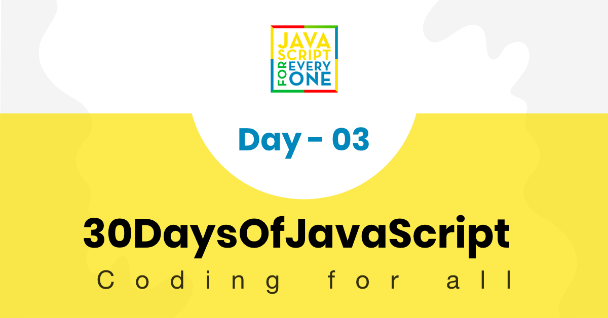

<div align="center">
  <h1> 30 Days Of JavaScript: Booleans, Operators, Date</h1>
  <a class="header-badge" target="_blank" href="https://www.linkedin.com/in/asabeneh/">
  
  </a>
  <a class="header-badge" target="_blank" href="https://twitter.com/Asabeneh">
  
  </a>

  <sub>Author:
  <a href="https://www.linkedin.com/in/asabeneh/" target="_blank">Asabeneh Yetayeh</a><br>
  <small> January, 2020</small>
  </sub>
</div>

[<< Day 2](../02_Day_Data_types/02_day_data_types.md) | [Day 4 >>](../04_Day_Conditionals/04_day_conditionals.md)



- [📔 Day 3](#-day-3)
  - [Booleans](#booleans)
    - [Truthy values](#truthy-values)
    - [Falsy values](#falsy-values)
  - [Undefined](#undefined)
  - [Null](#null)
  - [Operators](#operators)
    - [Assignment operators](#assignment-operators)
    - [Arithmetic Operators](#arithmetic-operators)
    - [Comparison Operators](#comparison-operators)
    - [Logical Operators](#logical-operators)
    - [Increment Operator](#increment-operator)
    - [Decrement Operator](#decrement-operator)
    - [Ternary Operators](#ternary-operators)
    - [Operator Precendence](#operator-precendence)
  - [Window Methods](#window-methods)
    - [Window alert() method](#window-alert-method)
    - [Window prompt() method](#window-prompt-method)
    - [Window confirm() method](#window-confirm-method)
  - [Date Object](#date-object)
    - [Creating a time object](#creating-a-time-object)
    - [Getting full year](#getting-full-year)
    - [Getting month](#getting-month)
    - [Getting date](#getting-date)
    - [Getting day](#getting-day)
    - [Getting hours](#getting-hours)
    - [Getting minutes](#getting-minutes)
    - [Getting seconds](#getting-seconds)
    - [Getting time](#getting-time)
  - [💻 Day 3: Exercises](#-day-3-exercises)
    - [Exercises: Level 1](#exercises-level-1)
    - [Exercises: Level 2](#exercises-level-2)
    - [Exercises: Level 3](#exercises-level-3)

# 📔 Day 3

## Booleans

Tipe data boolean mewakili salah satu dari dua nilai: _true_ atau _false_. Nilai Boolean bisa benar atau salah. Penggunaan tipe data ini akan menjadi jelas saat Anda memulai operator perbandingan. Setiap perbandingan mengembalikan nilai boolean yang benar atau salah.

**Contoh: Nilai Boolean**

```js
let isLightOn = true
let isRaining = false
let isHungry = false
let isMarried = true
let truValue = 4 > 3    // true
let falseValue = 4 < 3  // false
```

Kami setuju bahwa nilai boolean true atau false.

### Truthy values

- Semua angka (positif dan negatif) benar kecuali nol
- Semua string benar
- Boolean benar

### Falsy values

- 0
- 0n
- null
- undefined
- NaN
- the boolean false
- '', "", ``, empty string

Adalah baik untuk mengingat nilai-nilai kebenaran dan nilai-nilai yang salah itu. Di bagian selanjutnya, kami akan menggunakannya dengan kondisi untuk membuat keputusan.

## Undefined

Jika kita mendeklarasikan variabel dan jika kita tidak memberikan nilai, nilainya tidak akan ditentukan. Selain itu, jika suatu fungsi tidak mengembalikan nilainya, itu akan menjadi tidak terdefinisi.

```js
let firstName
console.log(firstName) //not defined, because it is not assigned to a value yet
```

## Null

```js
let empty = null
console.log(empty) // -> null , means no value
```

## Operators

### Assignment operators

Tanda sama dengan di JavaScript adalah operator penugasan. Digunakan untuk menetapkan variabel.

```js
let firstName = 'Asabeneh'
let country = 'Finland'
```

Assignment Operators


### Arithmetic Operators

Operator aritmatika adalah operator matematika.

- Addition(+): a + b
- Subtraction(-): a - b
- Multiplication(*): a * b
- Division(/): a / b
- Modulus(%): a % b
- Exponential(**): a ** b

```js
let numOne = 4
let numTwo = 3
let sum = numOne + numTwo
let diff = numOne - numTwo
let mult = numOne * numTwo
let div = numOne / numTwo
let remainder = numOne % numTwo
let powerOf = numOne ** numTwo

console.log(sum, diff, mult, div, remainder, powerOf) // 7,1,12,1.33,1, 64

```

```js
const PI = 3.14
let radius = 100          // length in meter

//Let us calculate area of a circle
const areaOfCircle = PI * radius * radius
console.log(areaOfCircle)  //  314 m


const gravity = 9.81      // in m/s2
let mass = 72             // in Kilogram

// Let us calculate weight of an object
const weight = mass * gravity
console.log(weight)        // 706.32 N(Newton)

const boilingPoint = 100  // temperature in oC, boiling point of water
const bodyTemp = 37       // body temperature in oC


// Concatenating string with numbers using string interpolation
/*
 The boiling point of water is 100 oC.
 Human body temperature is 37 oC.
 The gravity of earth is 9.81 m/s2.
 */
console.log(
  `The boiling point of water is ${boilingPoint} oC.\nHuman body temperature is ${bodyTemp} oC.\nThe gravity of earth is ${gravity} m / s2.`
)
```

### Comparison Operators

Dalam pemrograman kami membandingkan nilai, kami menggunakan operator pembanding untuk membandingkan dua nilai. Kami memeriksa apakah suatu nilai lebih besar atau kurang atau sama dengan nilai lain.


**Example: Comparison Operators**

```js
console.log(3 > 2)              // true, because 3 is greater than 2
console.log(3 >= 2)             // true, because 3 is greater than 2
console.log(3 < 2)              // false,  because 3 is greater than 2
console.log(2 < 3)              // true, because 2 is less than 3
console.log(2 <= 3)             // true, because 2 is less than 3
console.log(3 == 2)             // false, because 3 is not equal to 2
console.log(3 != 2)             // true, because 3 is not equal to 2
console.log(3 == '3')           // true, compare only value
console.log(3 === '3')          // false, compare both value and data type
console.log(3 !== '3')          // true, compare both value and data type
console.log(3 != 3)             // false, compare only value
console.log(3 !== 3)            // false, compare both value and data type
console.log(0 == false)         // true, equivalent
console.log(0 === false)        // false, not exactly the same
console.log(0 == '')            // true, equivalent
console.log(0 == ' ')           // true, equivalent
console.log(0 === '')           // false, not exactly the same
console.log(1 == true)          // true, equivalent
console.log(1 === true)         // false, not exactly the same
console.log(undefined == null)  // true
console.log(undefined === null) // false
console.log(NaN == NaN)         // false, not equal
console.log(NaN === NaN)        // false
console.log(typeof NaN)         // number

console.log('mango'.length == 'avocado'.length)  // false
console.log('mango'.length != 'avocado'.length)  // true
console.log('mango'.length < 'avocado'.length)   // true
console.log('milk'.length == 'meat'.length)      // true
console.log('milk'.length != 'meat'.length)      // false
console.log('tomato'.length == 'potato'.length)  // true
console.log('python'.length > 'dragon'.length)   // false
```

Cobalah untuk memahami perbandingan di atas dengan beberapa logika. Mengingat tanpa logika apa pun mungkin sulit.
JavaScript adalah sejenis bahasa pemrograman berkabel. Kode JavaScript berjalan dan memberi Anda hasil tetapi kecuali Anda ahli dalam hal itu mungkin bukan hasil yang diinginkan.

Sebagai aturan praktis, jika suatu nilai tidak benar dengan == maka tidak akan sama dengan ===. Menggunakan === lebih aman daripada menggunakan ==. Pengikut [link](https://dorey.github.io/JavaScript-Equality-Table/) memiliki daftar lengkap perbandingan tipe data.

### Logical Operators

Simbol berikut adalah operator logika yang umum:
&&(ampersand) , ||(pipe) and !(negation).
Operator && menjadi true hanya jika kedua operand benar.
The || operator benar, salah satu operan benar.
The! operator meniadakan benar menjadi salah dan salah menjadi benar.

```js
// && ampersand operator example

const check = 4 > 3 && 10 > 5         // true && true -> true
const check = 4 > 3 && 10 < 5         // true && false -> false
const check = 4 < 3 && 10 < 5         // false && false -> false

// || pipe or operator, example

const check = 4 > 3 || 10 > 5         // true  || true -> true
const check = 4 > 3 || 10 < 5         // true  || false -> true
const check = 4 < 3 || 10 < 5         // false || false -> false

//! Negation examples

let check = 4 > 3                     // true
let check = !(4 > 3)                  //  false
let isLightOn = true
let isLightOff = !isLightOn           // false
let isMarried = !false                // true
```

### Increment Operator

Dalam JavaScript kita menggunakan operator increment untuk meningkatkan nilai disimpan dalam variabel. increment bisa jadi increment sebelum atau sesudah. Mari kita lihat masing-masing:

1. Pre-increment

```js
let count = 0
console.log(++count)        // 1
console.log(count)          // 1
```

1. Post-increment

```js
let count = 0
console.log(count++)        // 0
console.log(count)          // 1
```

Kami menggunakan sebagian besar waktu post-increment. Setidaknya Anda harus ingat bagaimana menggunakan operator post-increment.

### Decrement Operator

Di JavaScript kami menggunakan operator penurunan untuk menurunkan nilai yang disimpan dalam variabel. Penurunan tersebut dapat berupa penurunan sebelum atau sesudah. Mari kita lihat masing-masing:

1. Pre-decrement

```js
let count = 0
console.log(--count) // -1
console.log(count)  // -1
```

2. Post-decrement

```js
let count = 0
console.log(count--) // 0
console.log(count)   // -1
```

### Ternary Operators

Operator terner memungkinkan untuk menulis kondisi.
Cara lain untuk menulis kondisional menggunakan operator terner. Lihat contoh berikut:

```js
let isRaining = true
isRaining
  ? console.log('You need a rain coat.')
  : console.log('No need for a rain coat.')
isRaining = false

isRaining
  ? console.log('You need a rain coat.')
  : console.log('No need for a rain coat.')
```

```sh
You need a rain coat.
No need for a rain coat.
```

```js
let number = 5
number > 0
  ? console.log(`${number} is a positive number`)
  : console.log(`${number} is a negative number`)
number = -5

number > 0
  ? console.log(`${number} is a positive number`)
  : console.log(`${number} is a negative number`)
```

```sh
5 is a positive number
-5 is a negative number
```

### Operator Precendence

Saya ingin merekomendasikan Anda untuk membaca tentang prioritas operator dari ini [link](https://developer.mozilla.org/en-US/docs/Web/JavaScript/Reference/Operators/Operator_Precedence)

## Window Methods

### Window alert() method

Seperti yang Anda lihat di awal metode alert () menampilkan kotak peringatan dengan pesan tertentu dan tombol OK. Ini adalah metode bawaan dan membutuhkan argumen.

```js
alert(message)
```

```js
alert('Welcome to 30DaysOfJavaScript')
```

Jangan gunakan terlalu banyak peringatan karena itu merusak dan mengganggu, gunakan hanya untuk menguji.

### Window prompt() method

Metode prompt jendela menampilkan kotak prompt dengan input pada browser Anda untuk mengambil nilai input dan data input dapat disimpan dalam variabel. Metode prompt () membutuhkan dua argumen. Argumen kedua adalah opsional.

```js
prompt('required text', 'optional text')
```

```js
let number = prompt('Enter number', 'number goes here')
console.log(number)
```

### Window confirm() method

Metode confirm () menampilkan kotak dialog dengan pesan tertentu, bersama dengan tombol OK dan Batal.
Kotak konfirmasi sering digunakan untuk meminta izin dari pengguna untuk mengeksekusi sesuatu. Window confirm () mengambil string sebagai argumen.
Mengklik OK menghasilkan nilai sebenarnya, sedangkan mengklik tombol Batal menghasilkan nilai salah.

```js
const agree = confirm('Are you sure you like to delete? ')
console.log(agree) // result will be true or false based on what you click on the dialog box
```

Ini tidak semua metode jendela, kita akan memiliki bagian terpisah untuk masuk lebih jauh ke metode jendela.

## Date Object

Waktu adalah hal yang penting. Kami ingin mengetahui waktu suatu kegiatan atau acara tertentu. Dalam JavaScript waktu dan tanggal saat ini dibuat menggunakan Objek Tanggal JavaScript. Objek yang kami buat menggunakan objek Tanggal menyediakan banyak metode untuk bekerja dengan tanggal dan waktu. Metode yang kami gunakan untuk mendapatkan informasi tanggal dan waktu dari nilai objek tanggal dimulai dengan kata _get_ karena menyediakan informasi.
_getFullYear(), getMonths(), getDate(), getDay(), getHours(), getMinutes, getSeconds(), getMilliseconds(), getTime(), getDay()_


### Creating a time object

Begitu kita membuat objek waktu. Objek waktu akan memberikan informasi tentang waktu. Mari kita buat objek waktu

```js
const now = new Date()
console.log(now) // Sat Jan 04 2020 00:56:41 GMT+0200 (Eastern European Standard Time)
```

Kami telah membuat objek waktu dan kami dapat mengakses informasi tanggal waktu apa pun dari objek menggunakan metode get yang telah kami sebutkan di tabel.

### Getting full year

Mari mengekstrak atau mendapatkan setahun penuh dari objek waktu.

```js
const now = new Date()
console.log(now.getFullYear()) // 2020
```

### Getting month

Mari ekstrak atau dapatkan bulan dari objek waktu.

```js
const now = new Date()
console.log(now.getMonth()) // 0, because the month is January,  month(0-11)
```

### Getting date

Mari mengekstrak atau mendapatkan tanggal bulan dari objek waktu.

```js
const now = new Date()
console.log(now.getDate()) // 4, because the day of the month is 4th,  day(1-31)
```

### Getting day

Mari kita mengekstrak atau mendapatkan hari dalam seminggu dari objek waktu.

```js
const now = new Date()
console.log(now.getDay()) // 6, because the day is Saturday which is the 7th day
//  Sunday is 0, Monday is 1 and Saturday is 6
// Getting the weekday as a number (0-6)
```

### Getting hours

Mari kita ekstrak atau dapatkan jam dari objek waktu.

```js
const now = new Date()
console.log(now.getHours()) // 0, because the time is 00:56:41
```

### Getting minutes

Mari kita mengekstrak atau mendapatkan menit dari objek waktu.

```js
const now = new Date()
console.log(now.getMinutes()) // 56, because the time is 00:56:41
```

### Getting seconds

Mari kita ekstrak atau dapatkan detik dari objek waktu.

```js
const now = new Date()
console.log(now.getSeconds()) // 41, because the time is 00:56:41
```

### Getting time

Metode ini memberikan waktu dalam milidetik mulai dari 1 Januari 1970. Ini juga dikenal sebagai waktu Unix. Kita bisa mendapatkan waktu unix dengan dua cara:

1. Using _getTime()_

```js
const now = new Date() //
console.log(now.getTime()) // 1578092201341, this is the number of seconds passed from January 1, 1970 to January 4, 2020 00:56:41
```

1. Using _Date.now()_

```js
const allSeconds = Date.now() //
console.log(allSeconds) // 1578092201341, this is the number of seconds passed from January 1, 1970 to January 4, 2020 00:56:41

const timeInSeconds = new Date().getTime()
console.log(allSeconds == timeInSeconds) // true
```

Mari kita format nilai-nilai ini ke dalam format waktu yang dapat dibaca manusia.
**Contoh:**

```js
const now = new Date()
const year = now.getFullYear() // return year
const month = now.getMonth() + 1 // return month(0 - 11)
const date = now.getDate() // return date (1 - 31)
const hours = now.getHours() // return number (0 - 23)
const minutes = now.getMinutes() // return number (0 -59)

console.log(`${date}/${month}/${year} ${hours}:${minutes}`) // 4/1/2020 0:56
```

🌕  Anda memiliki energi tak terbatas. Anda baru saja menyelesaikan tantangan hari ke-3 dan Anda berada dalam tiga langkah untuk menuju kehebatan. Sekarang lakukan beberapa latihan untuk otak dan otot Anda.

## 💻 Day 3: Exercises

### Exercises: Level 1

1. Deklarasikan firstName, lastName, negara, kota, umur, isMarried, variabel tahun dan tetapkan nilai padanya dan gunakan tipe operator untuk memeriksa tipe data yang berbeda.
2. Periksa apakah tipe '10' sama dengan 10
3. Periksa apakah parseInt ('9.8') sama dengan 10
4. Nilai Boolean bisa benar atau salah.
    1. Tuliskan tiga pernyataan JavaScript yang memberikan nilai kebenaran.
    2. Tuliskan tiga pernyataan JavaScript yang memberikan nilai palsu.

5. Gambarkan hasil ekspresi perbandingan berikut terlebih dahulu tanpa menggunakan console.log (). Setelah Anda memutuskan hasilnya, konfirmasikan menggunakan console.log ()
   1. 4 > 3
   2. 4 >= 3
   3. 4 < 3
   4. 4 <= 3
   5. 4 == 4
   6. 4 === 4
   7. 4 != 4
   8. 4 !== 4
   9. 4 != '4'
   10. 4 == '4'
   11. 4 === '4'
   12. Find the length of python and jargon and make a falsy comparison statement.

6. Cari tahu hasil dari ekspresi berikut terlebih dahulu tanpa menggunakan console.log (). Setelah Anda memutuskan hasilnya, konfirmasikan dengan menggunakan console.log ()
   1. 4 > 3 && 10 < 12
   2. 4 > 3 && 10 > 12
   3. 4 > 3 || 10 < 12
   4. 4 > 3 || 10 > 12
   5. !(4 > 3)
   6. !(4 < 3)
   7. !(false)
   8. !(4 > 3 && 10 < 12)
   9. !(4 > 3 && 10 > 12)
   10. !(4 === '4')
   11. There is no 'on' in both dragon and python

7. Gunakan objek Tanggal untuk melakukan aktivitas berikut
   1. What is the year today?
   2. What is the month today as a number?
   3. What is the date today?
   4. What is the day today as a number?
   5. What is the hours now?
   6. What is the minutes now?
   7. Find out the numbers of seconds elapsed from January 1, 1970 to now.

### Exercises: Level 2

1. Tulis skrip yang meminta pengguna untuk memasukkan alas dan tinggi segitiga dan menghitung luas segitiga (area = 0.5 x b x h).

   ```sh
   Enter base: 20
   Enter height: 10
   The area of the triangle is 50
   ```

1. Menulis script yang meminta pengguna untuk memasukkan sisi a, sisi b, dan sisi c segitiga dan menghitung keliling segitiga (perimeter = a + b + c)

   ```sh
   Enter side a: 5
   Enter side b: 4
   Enter side c: 3
   The perimeter of the triangle is 12
   ```

1. Dapatkan panjang dan lebar menggunakan prompt dan hitung luas persegi panjang (area = length x width and the perimeter of rectangle (perimeter = 2 x (length + width))
1. Dapatkan radius menggunakan prompt dan hitung luas lingkaran (area = pi x r x r) and circumference of a circle(c = 2 x pi x r) where pi = 3.14.
1. Hitung kemiringannya, x-intercept and y-intercept of y = 2x -2
1. Slope is (m = y2-y1/x2-x1). Temukan kemiringan di antara titik (2, 2) and point(6,10)
1. Bandingkan kemiringan dari dua pertanyaan di atas.
1. Hitung nilai y (y = x^2 + 6x + 9). Coba gunakan nilai x yang berbeda dan cari tahu berapa nilai x y adalah 0.
1.Tulis skrip yang meminta pengguna memasukkan jam dan tarif per jam. Hitung gaji orang tersebut? Tulis skrip yang meminta pengguna memasukkan jam dan tarif per jam. Hitung gaji orang tersebut?

    ```sh
    Enter hours: 40
    Enter rate per hour: 28
    Your weekly earning is 1120
    ```

1. Jika panjang nama Anda lebih dari 7 ucapkan, nama Anda panjang, atau nama Anda pendek.
1. Bandingkan panjang nama depan Anda dan panjang nama keluarga Anda dan Anda akan mendapatkan keluaran ini.

    ```js
    let firstName = 'Asabeneh'
    let lastName = 'Yetayeh'
    ```

    ```sh
    Your first name, Asabeneh is longer than your family name, Yetayeh
    ```

1. Deklarasikan dua variabel _myAge_ dan _yourAge_ dan berikan nilai awal serta myAge dan yourAge.

   ```js
   let myAge = 250
   let yourAge = 25
   ```

   ```sh
   I am 225 years older than you.
   ```

1. Menggunakan prompt, dapatkan tahun kelahiran pengguna dan jika pengguna berusia 18 tahun ke atas, izinkan pengguna mengemudi jika tidak, beri tahu pengguna untuk menunggu selama beberapa tahun.

    ```sh

    Enter birth year: 1995
    You are 25. You are old enough to drive

    Enter birth year: 2005
    You are 15. You will be allowed to drive after 3 years.
    ```

1. Tulis skrip yang meminta pengguna memasukkan jumlah tahun. Hitung berapa detik seseorang bisa hidup. Asumsikan seseorang hidup hanya seratus tahun

   ```sh
   Enter number of yours you live: 100
   You lived 3153600000 seconds.
   ```

1. Buat format waktu yang dapat dibaca manusia menggunakan objek Tanggal waktu
   1. YYYY-MM-DD HH:mm
   2. DD-MM-YYYY HH:mm
   3. DD/MM/YYYY HH:mm

### Exercises: Level 3

1. Buat format waktu yang dapat dibaca manusia menggunakan objek Tanggal waktu. Jam dan menit harus sepanjang waktu dua digit (7 jam harus 07 dan 5 menit harus 05)
   1. YYY-MM-DD HH:mm eg. 20120-01-02 07:05

[<< Day 2](../02_Day_Data_types/02_day_data_types.md) | [Day 4 >>](../04_Day_Conditionals/04_day_conditionals.md)
