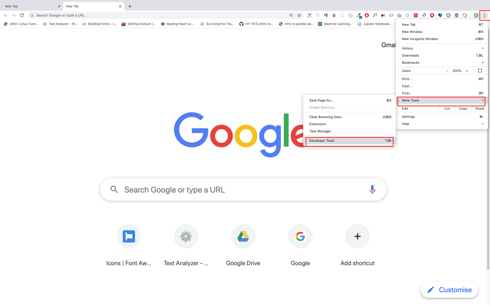
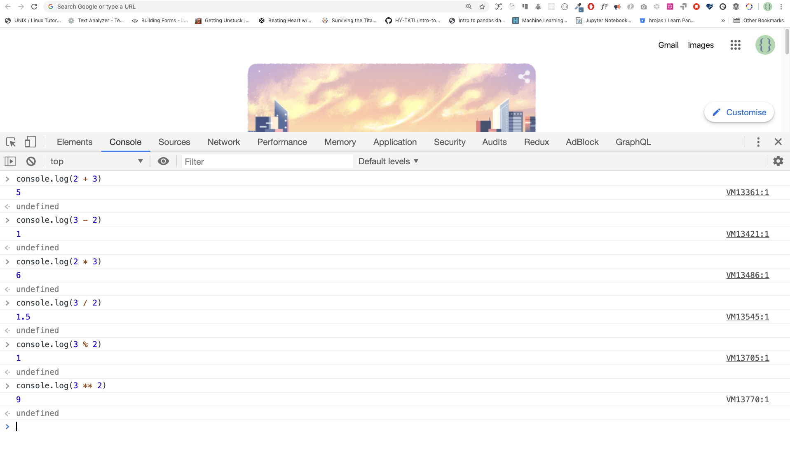
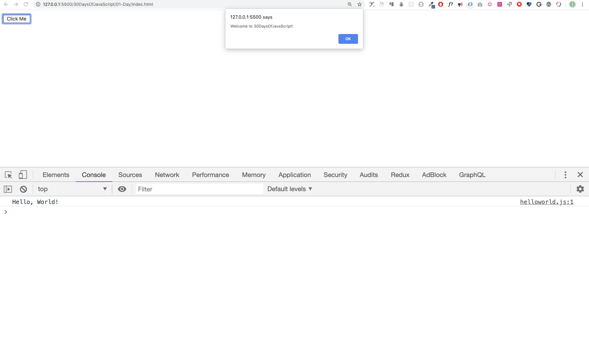

# 30 Days Of JavaScript

| # Day |                                                                       Topics                                                                        |
| ----- | :-------------------------------------------------------------------------------------------------------------------------------------------------: |
| 01    |                                                             [Pengantar](./readMe.md)                                                             |
| 02    |                                               [Data Types](./02_Day_Data_types/02_day_data_types.md)                                                |
| 03    |                             [Booleans, Operators, Date](./03_Day_Booleans_operators_date/03_booleans_operators_date.md)                             |
| 04    |                                            [Conditionals](./04_Day_Conditionals/04_day_conditionals.md)                                             |
| 05    |                                                     [Arrays](./05_Day_Arrays/05_day_arrays.md)                                                      |
| 06    |                                                       [Loops](./06_Day_Loops/06_day_loops.md)                                                       |
| 07    |                                                 [Functions](./07_Day_Functions/07_day_functions.md)                                                 |
| 08    |                                                    [Objects](./08_Day_Objects/08_day_objects.md)                                                    |
| 09    |                             [Higher Order Functions](./09_Day_Higher_order_functions/09_day_higher_order_functions.md)                              |
| 10    |                                           [Sets and Maps](./10_Day_Sets_and_Maps/10_day_Sets_and_Maps.md)                                           |
| 11    |                      [Destructuring and Spreading](./11_Day_Destructuring_and_spreading/11_day_destructuring_and_spreading.md)                      |
| 12    |                                  [Regular Expressions](./12_Day_Regular_expressions/12_day_regular_expressions.md)                                  |
| 13    |                             [Console Object Methods](./13_Day_Console_object_methods/13_day_console_object_methods.md)                              |
| 14    |                                         [Error Handling](./14_Day_Error_handling/14_day_error_handling.md)                                          |
| 15    |                                                    [Classes](./15_Day_Classes/15_day_classes.md)                                                    |
| 16    |                                                        [JSON](./16_Day_JSON/16_day_json.md)                                                         |
| 17    |                                            [Web Storages](./17_Day_Web_storages/17_day_web_storages.md)                                             |
| 18    |                                                  [Promises](./18_Day_Promises/18_day_promises.md)                                                   |
| 19    |                                                   [Closure](./19_Day_Closures/19_day_closures.md)                                                   |
| 20    |                                  [Writing Clean Code](./20_Day_Writing_clean_codes/20_day_writing_clean_codes.md)                                   |
| 21    |                                                          [DOM](./21_Day_DOM/21_day_dom.md)                                                          |
| 22    |                            [Manipulating DOM Object](./22_Day_Manipulating_DOM_object/22_day_manipulating_DOM_object.md)                            |
| 23    |                                        [Event Listeners](./23_Day_Event_listeners/23_day_event_listeners.md)                                        |
| 24    |                             [Mini Project: Solar System](./24_Day_Project_solar_system/24_day_project_solar_system.md)                              |
| 25    | [Mini Project: World Countries Data Visulalization 1](./25_Day_World_countries_data_visualization_1/25_day_world_countries_data_visualization_1.md) |
| 26    | [Mini Project: World Countries Data Visulalization 2](./26_Day_World_countries_data_visualization_2/26_day_world_countries_data_visualization_2.md) |
| 27    |                             [Mini Project: Portfolio](./27_Day_Mini_project_portfolio/27_day_mini_project_portfolio.md)                             |
| 28    |                          [Mini Project: Leaderboard](./28_Day_Mini_project_leaderboard/28_day_mini_project_leaderboard.md)                          |
| 29    |             [Mini Project:Animating characters](./29_Day_Mini_project_animating_characters/29_day_mini_project_animating_characters.md)             |
| 30    |                                     [Final Projects](./30_Day_Mini_project_final/30_day_mini_project_final.md)                                      |

🧡🧡🧡 HAPPY CODING 🧡🧡🧡

<div align="center">
  <h1> 30 Days Of JavaScript: Introduction</h1>
  <a class="header-badge" target="_blank" href="https://www.linkedin.com/in/asabeneh/">
  
  </a>
  <a class="header-badge" target="_blank" href="https://twitter.com/Asabeneh">
  
  </a>

<sub>Author:
<a href="https://www.linkedin.com/in/asabeneh/" target="_blank">Asabeneh Yetayeh</a><br>
<small> January, 2020</small>
</sub>

  <div>

🇬🇧 [English](./readMe.md)
🇪🇸 [Spanish](./Spanish/readme.md)
🇷🇺 [Russian](./RU/README.md)
ID [Indonesia](./ID/readMe.md)

  </div>

</div>
</div>

<div>

<small>Support [**Asabeneh**](https://www.patreon.com/asabeneh?fan_landing=true) to create more educational materials</small>  
[](https://www.patreon.com/asabeneh?fan_landing=true)

</div>

[Day 2 >>](./02_Day_Data_types/02_day_data_types.md)


- [30 Days Of JavaScript](#30-days-of-javascript)
- [📔 Hari 1](#-hari-1)
  - [Pengantar](#pengantar)
  - [Persyaratan](#persyaratan)
  - [Setup](#setup)
    - [Install Node.js](#install-nodejs)
    - [Browser](#browser)
      - [Installing Google Chrome](#installing-google-chrome)
      - [Opening Google Chrome Console](#opening-google-chrome-console)
      - [Menulis Kode di Konsol Browser](#menulis-kode-di-konsol-browser)
        - [Console.log](#consolelog)
        - [Console.log with Multiple Arguments](#consolelog-with-multiple-arguments)
        - [Comments](#comments)
        - [Syntax](#syntax)
      - [Arithmetics/Aritmatika](#arithmeticsaritmatika)
    - [Code Editor](#code-editor)
      - [Installing Visual Studio Code](#installing-visual-studio-code)
      - [How to Use Visual Studio Code](#how-to-use-visual-studio-code)
  - [Adding JavaScript to a Web Page](#adding-javascript-to-a-web-page)
    - [Inline Script](#inline-script)
    - [Internal Script](#internal-script)
    - [External Script](#external-script)
    - [Multiple External Scripts](#multiple-external-scripts)
  - [Introduction to Data types](#introduction-to-data-types)
    - [Numbers](#numbers)
    - [Strings](#strings)
    - [Booleans](#booleans)
    - [Undefined](#undefined)
    - [Null](#null)
  - [Checking Data Types](#checking-data-types)
  - [Comments Again](#comments-again)
  - [Variables](#variables)
- [💻 Day 1: Exercises](#-day-1-exercises)

# 📔 Hari 1

## Pengantar

**Selamat** karena telah memutuskan untuk berpartisipasi dalam 30 hari tantangan pemrograman JavaScript. Dalam tantangan ini Anda akan mempelajari semua yang Anda butuhkan untuk menjadi pemrogram JavaScript, dan secara umum, seluruh konsep pemrograman. Di akhir tantangan, Anda akan mendapatkan sertifikat penyelesaian tantangan pemrograman 30DaysOfJavaScript. Jika Anda membutuhkan bantuan atau jika Anda ingin membantu orang lain,Anda dapat bergabung dengan [group telegram](https://t.me/ThirtyDaysOfJavaScript).

**Tantangan 30DaysOfJavaScript** adalah panduan untuk pemula dan pengembang JavaScript tingkat lanjut. Selamat datang di JavaScript. JavaScript adalah bahasa web. Saya menikmati menggunakan dan mengajar JavaScript dan saya harap Anda juga akan melakukannya.

Dalam tantangan JavaScript langkah demi langkah ini, Anda akan mempelajari JavaScript, bahasa pemrograman paling populer dalam sejarah umat manusia.
JavaScript digunakan **_untuk menambahkan interaktivitas ke situs web, untuk mengembangkan aplikasi seluler, aplikasi desktop, game_** dan saat ini JavaScript dapat digunakan untuk **_pembelajaran mesin_** dan **_AI_**.
**_JavaScript (JS)_** semakin populer dalam beberapa tahun terakhir dan menjadi yang terdepan
bahasa pemrograman selama enam tahun berturut-turut dan merupakan bahasa pemrograman yang paling banyak digunakan di
Github.

## Persyaratan

Tidak diperlukan pengetahuan pemrograman sebelumnya untuk mengikuti tantangan ini. Anda hanya membutuhkan:

1. Motivasi
2. Komputer
3. Internet
4. Browser
5. code editor

## Setup

Saya yakin Anda memiliki motivasi dan keinginan kuat untuk menjadi pengembang, komputer, dan Internet. Jika Anda memilikinya, maka Anda memiliki segalanya untuk memulai.

### Install Node.js

Anda mungkin tidak membutuhkan node.js sekarang tetapi Anda mungkin membutuhkannya nanti. Install [node.js](https://nodejs.org/en/).


Setelah mengunduh, klik dua kali dan instal


Kami dapat memeriksa apakah node diinstal pada mesin lokal Anda dengan membuka terminal perangkat atau command prompt kami.

```sh
asabeneh $ node -v
v12.14.0
```

Saat membuat tutorial ini saya menggunakan node versi 12.14.0, namun sekarang versi node.js yang direkomendasikan untuk diunduh adalah 12.17.0.

### Browser

Ada banyak browser di luar sana. Namun, saya sangat merekomendasikan Google Chrome.

#### Installing Google Chrome

Install [google chrome](https://www.google.com/chrome/) jika Anda belum memilikinya. Kami dapat menulis kode JavaScript kecil di konsol browser, tetapi kami tidak menggunakan konsol browser untuk mengembangkan aplikasi.


#### Opening Google Chrome Console

Anda dapat membuka konsol Google Chrome dengan mengklik tiga titik di pojok kanan atas browser, memilih _More tools -> Developer tools_ atau menggunakan pintasan keyboard. Saya lebih suka menggunakan jalan pintas.



Untuk membuka konsol Chrome menggunakan pintasan keyboard.

```sh
Mac
Command+Option+J

Windows/Linux:
Ctl+Shift+J
```


Setelah Anda membuka konsol Google Chrome, coba jelajahi tombol yang ditandai. Kami akan menghabiskan sebagian besar waktu di Konsol. Konsol adalah tempat kode JavaScript Anda berada. Mesin Google Console V8 mengubah kode JavaScript Anda menjadi kode mesin.
Mari kita tulis kode JavaScript di konsol Google Chrome:


#### Menulis Kode di Konsol Browser

Kami dapat menulis kode JavaScript apa pun di konsol Google atau konsol browser apa pun. Namun untuk tantangan ini, kami hanya fokus pada konsol Google Chrome. Buka konsol menggunakan:

```sh
Mac
Command+Option+I

Windows:
Ctl+Shift+I
```

##### Console.log

Untuk menulis kode JavaScript pertama Anda, kami menggunakan fungsi bawaan **console.log()**. Kami memberikan argumen sebagai data masukan, dan fungsi menampilkan keluaran. Kami lulus 'Hello, World' sebagai data masukan atau argumen dalam fungsi console.log ().

```js
console.log('Hello, World!')
```

##### Console.log with Multiple Arguments

Di **conole.log ()** dapat mengambil beberapa parameter yang dipisahkan oleh koma. Sintaksnya terlihat seperti berikut: **console.log (param1, param2, param3)**


```js
console.log('Hello', 'World', '!')
console.log('HAPPY', 'NEW', 'YEAR', 2020)
console.log('Welcome', 'to', 30, 'Days', 'Of', 'JavaScript')
```

Seperti yang Anda lihat dari kode cuplikan di atas, _console.log()_ dapat menerima banyak argumen.

Selamat! Anda menulis kode JavaScript pertama Anda menggunakan _console.log()_.

##### Comments

Kami menambahkan komentar ke kode kami. Komentar sangat penting untuk membuat kode lebih mudah dibaca dan meninggalkan komentar di kode kita. JavaScript tidak mengeksekusi bagian komentar dari kode kita. Dalam JavaScript, baris teks apa pun yang dimulai dengan // dalam JavaScript adalah komentar, dan apa pun yang dilampirkan seperti ini / \*\* / juga merupakan komentar.

**Contoh: Komentar Baris Tunggal**

// Ini adalah komentar pertama
// Ini adalah komentar kedua
// Saya adalah komentar satu baris

**Contoh: Komentar Multiline**

/ _
Ini adalah komentar multiline
Komentar multiline dapat mengambil beberapa baris
JavaScript adalah bahasa web
_ /

##### Syntax

Bahasa pemrograman mirip dengan bahasa manusia. Bahasa Inggris atau banyak bahasa lainnya menggunakan kata, frasa, kalimat, kalimat majemuk, dan lainnya untuk menyampaikan pesan yang bermakna. Arti bahasa Inggris dari syntax adalah _pengaturan kata dan frase untuk membuat kalimat yang tersusun dengan baik dalam suatu bahasa_. Definisi teknis dari sintaks adalah _struktur pernyataan dalam bahasa komputer._ Bahasa pemrograman memiliki sintaks. JavaScript adalah bahasa pemrograman dan seperti bahasa pemrograman lainnya, JavaScript memiliki sintaksnya sendiri. Jika kita tidak menulis sintaks yang dimengerti JavaScript, itu akan menimbulkan berbagai jenis kesalahan. Kami akan menjelajahi berbagai jenis kesalahan JavaScript nanti. Untuk saat ini, mari kita lihat kesalahan sintaks.


Saya membuat kesalahan yang disengaja. Akibatnya, konsol memunculkan kesalahan sintaksis. Sebenarnya, sintaksnya sangat informatif. Ini menginformasikan jenis kesalahan apa yang dibuat. Dengan membaca pedoman umpan balik kesalahan, kita dapat memperbaiki sintaks dan memperbaiki masalah. Proses mengidentifikasi dan menghapus kesalahan dari program disebut debugging. Biarkan kami memperbaiki kesalahan:

```js
console.log('Hello, World!')
console.log('Hello, World!')
```

Sejauh ini, kami melihat bagaimana menampilkan teks menggunakan _console.log()_. Jika kita mencetak teks atau string menggunakan _console.log()_, teks harus di dalam tanda kutip tunggal, tanda kutip ganda, atau tanda kutip backtick.
**Contoh:**

```js
console.log('Hello, World!')
console.log('Hello, World!')
console.log(`Hello, World!`)
```

#### Arithmetics/Aritmatika

Now, let us practice more writing JSekarang, mari kita lebih banyak berlatih menulis kode JavaScript menggunakanavaScript codes using _console.log()_ di konsol google chrome untuk tipe data nomor.
Selain teks, kita juga bisa melakukan perhitungan matematis menggunakan JavaScript. Mari kita lakukan perhitungan sederhana berikut ini.
Konsol dapat langsung menerima argumen tanpa ekstensi **_console.log()_** fungsi. Namun, itu termasuk dalam pendahuluan ini karena sebagian besar tantangan ini akan terjadi di editor teks di mana penggunaan fungsi tersebut wajib. Anda dapat bermain-main langsung dengan instruksi di konsol.



```js
console.log(2 + 3) // Addition
console.log(3 - 2) // Subtraction
console.log(2 * 3) // Multiplication
console.log(3 / 2) // Division
console.log(3 % 2) // Modulus - finding remainder
console.log(3 ** 2) // Exponentiation 3 ** 2 == 3 * 3
```

### Code Editor

Kami dapat menulis kode kami di konsol browser, tetapi itu tidak akan berhasil untuk proyek yang lebih besar. Di lingkungan kerja nyata, pengembang menggunakan editor kode yang berbeda untuk menulis kode mereka. Dalam tantangan JavaScript 30 hari ini, kami akan menggunakan Visual Studio Code.

#### Installing Visual Studio Code

Visual studio code adalah editor teks sumber terbuka yang sangat populer. Saya akan merekomendasikan kepada [download Visual Studio Code](https://code.visualstudio.com/), tetapi jika Anda mendukung editor lain, silakan ikuti apa yang Anda miliki.


Jika Anda menginstal Visual Studio Code, mari kita mulai menggunakannya.

#### How to Use Visual Studio Code

Buka Visual Studio Kode dengan mengklik dua kali ikonnya. Saat Anda membukanya, Anda akan mendapatkan antarmuka semacam ini. Cobalah untuk berinteraksi dengan ikon berlabel.


## Adding JavaScript to a Web Page

JavaScript dapat ditambahkan ke halaman web dengan tiga cara berbeda:

- **_Inline script_**
- **_Internal script_**
- **_External script_**
- **_Multiple External scripts_**

Bagian berikut menunjukkan berbagai cara menambahkan kode JavaScript ke halaman web Anda.

### Inline Script

Buat folder proyek di desktop Anda atau di lokasi mana pun, beri nama 30DaysOfJS dan buat file **_index.html_** file di folder proyek. Kemudian paste kode berikut dan buka di browser, misalnya [Chrome](https://www.google.com/chrome/).

```html
<!DOCTYPE html>
<html>
  <head>
    <title>30DaysOfScript:Inline Script</title>
  </head>
  <body>
    <button onclick="alert('Welcome to 30DaysOfJavaScript!')">Click Me</button>
  </body>
</html>
```

Sekarang, Anda tinggal menulis skrip sebaris pertama Anda. Kita dapat membuat pesan peringatan pop up menggunakan _alert()_ fungsi bawaan.

### Internal Script

Skrip internal dapat ditulis di _head_ or the _body_, tetapi lebih disukai untuk meletakkannya di body dokumen HTML.
Pertama, mari kita tulis di bagian kepala halaman.

```html
<!DOCTYPE html>
<html>
  <head>
    <title>30DaysOfScript:Internal Script</title>
    <script>
      console.log('Welcome to 30DaysOfJavaScript')
    </script>
  </head>
  <body></body>
</html>
```

Ini adalah cara kami menulis skrip internal sebagian besar waktu. Menulis kode JavaScript di bagian body adalah opsi yang paling disukai. Buka konsol browser untuk melihat output dari console.log ()

```html
<!DOCTYPE html>
<html>
  <head>
    <title>30DaysOfScript:Internal Script</title>
  </head>
  <body>
    <button onclick="alert('Welcome to 30DaysOfJavaScript!');">Click Me</button>
    <script>
      console.log('Welcome to 30DaysOfJavaScript')
    </script>
  </body>
</html>
```

Buka konsol browser untuk melihat output dari console.log ()



### External Script

Mirip dengan skrip internal, tautan skrip eksternal dapat berada di header atau body, tetapi lebih disukai untuk meletakkannya di body.
Pertama, kita harus membuat file JavaScript eksternal dengan ekstensi .js. Semua file yang diakhiri dengan ekstensi .js. Semua file yang diakhiri dengan ekstensi .js adalah file JavaScript. Buat file bernama introduksi.js di dalam direktori proyek Anda dan tulis kode berikut dan tautkan file .js ini di bagian bawah badan.

```js
console.log('Welcome to 30DaysOfJavaScript')
```

Skrip eksternal di _head_:

```html
<!DOCTYPE html>
<html>
  <head>
    <title>30DaysOfJavaScript:External script</title>
    <script src="introduction.js"></script>
  </head>
  <body></body>
</html>
```

Skrip eksternal di _body_:

```html
<!DOCTYPE html>
<html>
  <head>
    <title>30DaysOfJavaScript:External script</title>
  </head>
  <body>
    //it could be in the header or in the body // Here is the recommended place
    to put the external script
    <script src="introduction.js"></script>
  </body>
</html>
```

Buka konsol browser untuk melihat output dari console.log ()

### Multiple External Scripts

Kami juga dapat menautkan beberapa file JavaScript eksternal ke halaman web.
Buat file helloworld.js di dalam folder 30DaysOfJS dan tulis kode berikut.

```js
console.log('Hello, World!')
```

```html
<!DOCTYPE html>
<html>
  <head>
    <title>Multiple External Scripts</title>
  </head>
  <body>
    <script src="./helloworld.js"></script>
    <script src="./introduction.js"></script>
  </body>
</html>
```

_File main.js Anda harus berada di bawah semua skrip lainnya_. Sangat penting untuk mengingat ini.


## Introduction to Data types

Dalam JavaScript dan juga bahasa pemrograman lainnya, terdapat berbagai jenis tipe data. Berikut ini adalah tipe data primitive JavaScript:_String, Number, Boolean, undefined, Null_, and _Symbol_.

### Numbers

- Integers: Bilangan integer (negatif, nol dan positif)
   Contoh:
  ... -3, -2, -1, 0, 1, 2, 3 ...
- Angka floating-point: Angka desimal
   Contoh
  ... -3.5, -2.25, -1.0, 0.0, 1.1, 2.2, 3.5 ...

### Strings

Kumpulan satu atau lebih karakter antara dua tanda kutip tunggal, tanda kutip ganda, atau tanda kutip belakang.
**Contoh:**

```js
'Asabeneh'
'Finland'
'JavaScript is a beautiful programming language'
'I love teaching'
'I hope you are enjoying the first day'`We can also create a string using a backtick`
;('A string could be just as small as one character as big as many pages')
```

### Booleans

Nilai boolean adalah True atau False. Setiap perbandingan mengembalikan nilai boolean, bisa true atau false.

Tipe data boolean bisa berupa nilai true atau false.

**Contoh:**

```js
true // if the light on ,the value is true
false // if the light off, the value is false
```

### Undefined

Di JavaScript, jika kita tidak menetapkan nilai ke variabel, nilainya tidak ditentukan. Selain itu, jika suatu fungsi tidak mengembalikan apa pun, ia mengembalikan tidak undefined.

```js
let firstName
console.log(firstName) //not defined, because it is not assigned to a value yet
```

### Null

Null dalam JavaScript berarti nilai kosong.

```js
let emptyValue = null
```

## Checking Data Types

Untuk memeriksa tipe data dari variabel tertentu, kami menggunakan **typeof** operator. Lihat contoh berikut.

```js
console.log(typeof 'Asabeneh') // string
console.log(typeof 5) // number
console.log(typeof true) // boolean
console.log(typeof null) // object type
console.log(typeof undefined) // undefined
```

## Comments Again

Ingatlah bahwa berkomentar dalam JavaScript mirip dengan bahasa pemrograman lainnya. Komentar penting untuk membuat kode Anda lebih mudah dibaca.
Ada dua cara untuk berkomentar:

- _Single line commenting_
- _Multiline commenting_

```js
// commenting the code itself with a single comment
// let firstName = 'Asabeneh'; single line comment
// let lastName = 'Yetayeh'; single line comment
```

Komentar multiline:

```js
/*
    let location = 'Helsinki';
    let age = 100;
    let isMarried = true;
    This is a Multiple line comment
    */
```

## Variables

Variabel adalah _containers_ data. Variabel digunakan untuk _store_ data di lokasi memori. Saat variabel dideklarasikan, lokasi memori dicadangkan. Ketika sebuah variabel ditetapkan ke suatu nilai (data), ruang memori akan diisi dengan data tersebut. Untuk mendeklarasikan variabel, kami menggunakan _var_, _let_, or _const_ kata kunci.

Untuk variabel yang berubah pada waktu yang berbeda, kami menggunakan _let_. Jika data tidak berubah sama sekali, kami gunakan _const_. Misalnya, PI, nama negara, gravitasi tidak berubah, dan kita dapat menggunakan _const_. Kami tidak akan menggunakan var dalam tantangan ini dan saya tidak menyarankan Anda untuk menggunakannya. Ini adalah cara yang rawan kesalahan untuk mendeklarasikan variabel yang memiliki banyak kebocoran. Kami akan berbicara lebih banyak tentang var, let, dan const secara rinci di bagian lain (scope). Untuk saat ini penjelasan di atas sudah cukup.

Nama variabel JavaScript yang valid harus mengikuti aturan berikut:

- Nama variabel JavaScript tidak boleh dimulai dengan angka.
- Nama variabel JavaScript tidak mengizinkan karakter khusus kecuali tanda dolar dan garis bawah.
- Nama variabel JavaScript mengikuti konvensi camelCase.
- Nama variabel JavaScript tidak boleh memiliki spasi di antara kata.

Berikut adalah contoh variabel JavaScript yang valid.

```js
firstName
lastName
country
city
capitalCity
age
isMarried

first_name
last_name
is_married
capital_city

num1
num_1
_num_1
$num1
year2020
year_2020
```

Variabel pertama dan kedua pada daftar mengikuti konvensi camelCase untuk mendeklarasikan dalam JavaScript. Dalam materi ini, kami akan menggunakan variabel camelCase.

Contoh variabel yang tidak valid:

```sh
  first-name
  1_num
  num_#_1
```

Mari kita deklarasikan variabel dengan tipe data yang berbeda. Untuk mendeklarasikan variabel, kita perlu menggunakan kata kunci *let* atau *const* sebelum nama variabel. Mengikuti nama variabel, kami menulis tanda sama dengan (assignment operator / operator penugasan), dan nilai (assigned data / data yang ditetapkan).

```js
// Syntax
let nameOfVariable = value
```

**Contoh variabel yang dideklarasikan**

```js
// Declaring different variables of different data types
let firstName = 'Asabeneh' // first name of a person
let lastName = 'Yetayeh' // last name of a person
let country = 'Finland' // country
let city = 'Helsinki' // capital city
let age = 100 // age in years
let isMarried = true

console.log(firstName, lastName, country, city, age, isMarried)
```

```sh
Asabeneh Yetayeh Finland Helsinki 100 True
```

```js
// Declaring variables with number values
let age = 100 // age in years
const gravity = 9.81 // earth gravity  in m/s2
const boilingPoint = 100 // water boiling point, temperature in oC
const PI = 3.14 // geometrical constant

console.log(gravity, boilingPoint, PI)
```

```sh
9.81 100 3.14
```

```js
// Variables can also be declaring in one line separated by comma
let name = 'Asabeneh', // name of a person
  job = 'teacher',
  live = 'Finland'
console.log(name, job, live)
```

```sh
Asabeneh teacher Finland
```

Saat Anda menjalankan file _index.html_ di folder 01-Day, Anda akan mendapatkan ini:


🌕 Kamu luar biasa! Anda baru saja menyelesaikan tantangan hari pertama dan Anda sedang dalam perjalanan menuju kehebatan. Sekarang lakukan beberapa latihan untuk otak dan otot Anda.

# 💻 Day 1: Exercises

1. Tulis satu baris komentar yang berbunyi, _komentar dapat membuat kode dapat dibaca_
2. Tulis satu lagi komentar yang mengatakan, _Selamat datang di 30DaysOfJavaScript_
3. Tulis komentar multiline yang menyatakan, _comments dapat membuat kode dapat dibaca, mudah digunakan kembali_
    _dan informatif_

4. Buat file variable.js dan deklarasikan variabel dan tetapkan tipe data string, boolean, undefined dan null
5. Buat file datatypes.js dan gunakan operator JavaScript **_typeof_** untuk memeriksa tipe data yang berbeda. Periksa tipe data setiap variabel
6. Deklarasikan empat variabel tanpa menetapkan nilai
7. Deklarasikan empat variabel dengan nilai yang ditetapkan
8. Deklarasikan variabel untuk menyimpan nama depan, nama belakang, status perkawinan, negara dan usia dalam beberapa baris
9. Deklarasikan variabel untuk menyimpan nama depan, nama belakang, status pernikahan, negara, dan usia Anda dalam satu baris
10. Deklarasikan dua variabel _myAge_ dan _yourAge_ dan tetapkan nilai awal dan log ke konsol browser.

```sh
I am 25 years old.
You are 30 years old.
```

🎉 CONGRATULATIONS ! 🎉

[Day 2 >>](./02_Day_Data_types/02_day_data_types.md)
