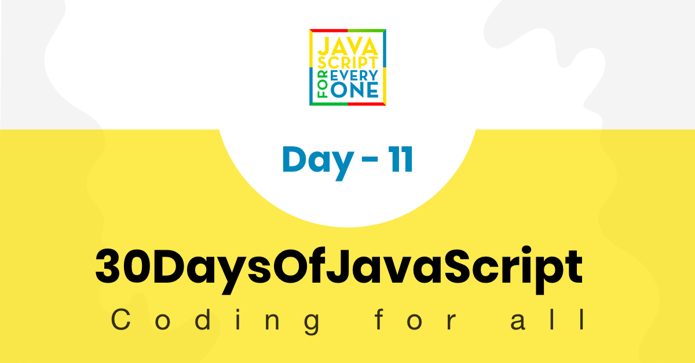

<div align="center">
  <h1> 30 Days Of JavaScript: Destructuring and Spreading</h1>
  <a class="header-badge" target="_blank" href="https://www.linkedin.com/in/asabeneh/">
  
  </a>
  <a class="header-badge" target="_blank" href="https://twitter.com/Asabeneh">
  
  </a>

  <sub>Autore:
  <a href="https://www.linkedin.com/in/asabeneh/" target="_blank">Asabeneh Yetayeh</a><br>
  <small> Gennaio, 2020</small>
  </sub>
</div>

[<< Day 10](../10_Day_Sets_and_Maps/10_day_Sets_and_Maps.md) | [Day 12>>](../12_Day_Regular_expressions/12_day_regular_expressions.md)



- [Day 11](#day-11)
	- [Destructuring e Spread](#destructuring-and-spread)
		- [Destructing Arrays](#destructing-arrays)
		- [Destructuring durante iterazione](#destructuring-during-iteration)
		- [Object Destructuring](#destructuring-object)
		- [Rinominare durante structuring](#renaming-during-structuring)
		- [Object parameter senza destructuring](#object-parameter-without-destructuring)
		- [Object parameter con destructuring](#object-parameter-with-destructuring)
		- [Object Destructuring durante l'iterazione](#destructuring-object-during-iteration)
		- [Spread o Rest Operator](#spread-or-rest-operator)
		- [Operatore Spread per ottenere il resto degli elementi di un array](#spread-operator-to-get-the-rest-of-array-elements)
		- [Operatore Spread per copiare un array](#spread-operator-to-copy-array)
		- [Operatore Spread per copiare oggetti](#spread-operator-to-copy-object)
			- [Operatore Spread con arrow function](#spread-operator-with-arrow-function)
	- [Esercizi](#exercises)
		- [Esercizi: Livello 1](#exercises-level-1)
		- [Esercizi: Livello 2](#exercises-level-2)
		- [Esercizi: Livello 3](#exercises-level-3)

# Day 11

## Destructuring e Spread

La destrutturazione è un modo per disimballare array e oggetti e assegnarli a una variabile distinta.

### Destructing Arrays

```js
  const numbers = [1, 2, 3]
  let [numOne, numTwo, numThree] = numbers

  console.log(numOne, numTwo, numThree)
```

```sh
  1 2 3
```

```js
  const names = ['Asabeneh', 'Brook', 'David', 'John']
  let [firstPerson, secondPerson, thirdPerson, fourthPerson] = names

  console.log(firstPerson, secondPerson,thirdPerson, fourthPerson)
```

```sh
Asabeneh Brook David John
```

```js
  const scientificConstants = [2.72, 3.14, 9.81, 37, 100]
  let [e, pi, gravity, bodyTemp, boilingTemp] = scientificConstants

  console.log(e,pi,gravity, bodyTemp, boilingTemp)
```

```sh
2.72 3.14 9.81 37 100
```

```js
const fullStack = [
  ['HTML', 'CSS', 'JS', 'React'],
  ['Node', 'Express', 'MongoDB']
]
const [frontEnd, backEnd] = fullStack

console.log(frontEnd)
console.log(backEnd)
```

```sh
["HTML", "CSS", "JS", "React"]
["Node", "Express", "MongoDB"]
```

Se vogliamo saltare uno dei valori dell'array, usiamo una virgola aggiuntiva. La virgola aiuta a omettere il valore in quello specifico indice

```js
  const numbers = [1, 2, 3]
  let [numOne, , numThree] = numbers //2 is omitted

  console.log(numOne, numThree)
```

```sh
1 3
```

```js
  const names = ['Asabeneh', 'Brook', 'David', 'John']
  let [, secondPerson, , fourthPerson] = names // first and third person is omitted

  console.log(secondPerson, fourthPerson)
```

```sh
Brook John
```

È possibile utilizzare il valore predefinito nel caso in cui il valore dell'array per quell'indice sia indefinito:

```js
const names = [undefined, 'Brook', 'David']
let [
  firstPerson = 'Asabeneh',
  secondPerson,
  thirdPerson,
  fourthPerson = 'John'
] = names

console.log(firstPerson, secondPerson, thirdPerson, fourthPerson)  
```

```sh
Asabeneh Brook David John
```

Non possiamo assegnare una variabile a tutti gli elementi dell'array. Possiamo destrutturare alcuni dei primi e ottenere i rimanenti come array utilizzando l'operatore spread(...).

```js
const nums = [1, 2, 3, 4, 5, 6, 7, 8, 9, 10]
let [num1, num2, num3, ...rest] = nums

console.log(num1, num2, num3)
console.log(rest)
```

```sh
1 2 3
[4, 5, 6, 7, 8, 9, 10]
```

### Destructuring durante iterazione

```js
const countries = [['Finland', 'Helsinki'], ['Sweden', 'Stockholm'], ['Norway', 'Oslo']]

for (const [country, city] of countries) {
console.log(country, city)
}
```

```sh
Finland Helsinki
Sweden Stockholm
Norway Oslo
```

```js
const fullStack = [
  ['HTML', 'CSS', 'JS', 'React'],
  ['Node', 'Express', 'MongoDB']
]

for(const [first, second, third] of fullStack) {
console.log(first, second, third)
}
```

```sh
HTML CSS JS
Node Express MongoDB
```

### Object Destructuring

Quando si destruttura, il nome della variabile che si usa per destrutturare deve essere esattamente lo stesso della chiave o della proprietà dell'oggetto. Si veda l'esempio seguente.

```js
const rectangle = {
  width: 20,
  height: 10,
  area: 200
}
let { width, height, area, perimeter } = rectangle

console.log(width, height, area, perimeter)
```

```sh
20 10 200 undefined
```

### Rinominare durante structuring

```js
const rectangle = {
  width: 20,
  height: 10,
  area: 200
}
let { width: w, height: h, area: a, perimeter: p } = rectangle

console.log(w, h, a, p)
```

```sh
20 10 200 undefined
```

Se la chiave non viene trovata nell'oggetto, la variabile verrà assegnata a undefined. A volte la chiave potrebbe non essere presente nell'oggetto, in questo caso possiamo dare un valore predefinito durante la dichiarazione. Si veda l'esempio.

```js
const rectangle = {
  width: 20,
  height: 10,
  area: 200
}
let { width, height, area, perimeter = 60 } = rectangle

console.log(width, height, area, perimeter) //20 10 200 60
//Let us modify the object:width to 30 and perimeter to 80
```

```js
const rectangle = {
  width: 30,
  height: 10,
  area: 200,
  perimeter: 80
}
let { width, height, area, perimeter = 60 } = rectangle
console.log(width, height, area, perimeter) //30 10 200 80
```

Destrutturazione delle chiavi come parametri di una funzione. Creiamo una funzione che prende un oggetto rettangolo e restituisce il perimetro di un rettangolo.

### Object parameter senza destructuring

```js
// Without destructuring
const rect = {
  width: 20,
  height: 10
}
const calculatePerimeter = rectangle => {
  return 2 * (rectangle.width + rectangle.height)
}

console.log(calculatePerimeter(rect)) // 60
//with destructuring
```

```js
//Another Example
const person = {
  firstName: 'Asabeneh',
  lastName: 'Yetayeh',
  age: 250,
  country: 'Finland',
  job: 'Instructor and Developer',
  skills: [
    'HTML',
    'CSS',
    'JavaScript',
    'React',
    'Redux',
    'Node',
    'MongoDB',
    'Python',
    'D3.js'
  ],
  languages: ['Amharic', 'English', 'Suomi(Finnish)']
}
// Let us create a function which give information about the person object without destructuring

const getPersonInfo = obj => {
  const skills = obj.skills
  const formattedSkills = skills.slice(0, -1).join(', ')
  const languages = obj.languages
  const formattedLanguages = languages.slice(0, -1).join(', ')

  personInfo = `${obj.firstName} ${obj.lastName} lives in ${obj.country}. He is  ${
    obj.age
  } years old. He is an ${obj.job}. He teaches ${formattedSkills} and ${
    skills[skills.length - 1]
  }. He speaks ${formattedLanguages} and a little bit of ${languages[2]}.`

  return personInfo
}

console.log(getPersonInfo(person))
```

### Object parameter con destructuring

```js

const calculatePerimeter = ({ width, height }) => {
  return 2 * (width + height)
}

console.log(calculatePerimeter(rect)) // 60
```

```js
// Let us create a function which give information about the person object with destructuring
const getPersonInfo = ({
  firstName,
  lastName,
  age,
  country,
  job,
  skills,
  languages
}) => {
  const formattedSkills = skills.slice(0, -1).join(', ')
  const formattedLanguages = languages.slice(0, -1).join(', ')

  personInfo = `${firstName} ${lastName} lives in ${country}. He is ${age} years old. He is an ${job}. He teaches ${formattedSkills} and ${
    skills[skills.length - 1]
  }. He speaks ${formattedLanguages} and a little bit of ${languages[2]}.`

  return personInfo
}
console.log(getPersonInfo(person))
/*
Asabeneh Yetayeh lives in Finland. He is  250 years old. He is an Instructor and Developer. He teaches HTML, CSS, JavaScript, React, Redux, Node, MongoDB, Python and D3.js. He speaks Amharic, English and a little bit of Suomi(Finnish)
*/
```

### Object Destructuring durante l'iterazione

```js
const todoList = [
{
  task:'Prepare JS Test',
  time:'4/1/2020 8:30',
  completed:true
},
{
  task:'Give JS Test',
  time:'4/1/2020 10:00',
  completed:false
},
{
  task:'Assess Test Result',
  time:'4/1/2020 1:00',
  completed:false
}
]

for (const {task, time, completed} of todoList){
  console.log(task, time, completed)
}
```

```sh
Prepare JS Test 4/1/2020 8:30 true
Give JS Test 4/1/2020 10:00 false
Assess Test Result 4/1/2020 1:00 false
```

### Spread o Rest Operator

Quando destrutturiamo un array, utilizziamo l'operatore spread(...) per ottenere gli elementi rimanenti come array. Inoltre, utilizziamo l'operatore spread per distribuire gli elementi dell'array in un altro array.

### Operatore Spread per ottenere il resto degli elementi di un array

```js
const nums = [1, 2, 3, 4, 5, 6, 7, 8, 9, 10]
let [num1, num2, num3, ...rest] = nums
​
console.log(num1, num2, num3)
console.log(rest)
```

```sh
1 2 3
[4, 5, 6, 7, 8, 9, 10]
```

```js
const countries = [
  'Germany',
  'France',
  'Belgium',
  'Finland',
  'Sweden',
  'Norway',
  'Denmark',
  'Iceland'
]

let [gem, fra, , ...nordicCountries] = countries

console.log(gem)
console.log(fra)
console.log(nordicCountries)
```

```sh
Germany
France
["Finland", "Sweden", "Norway", "Denmark", "Iceland"]
```

### Operatore Spread per copiare un array

```js
const evens = [0, 2, 4, 6, 8, 10]
const evenNumbers = [...evens]

const odds = [1, 3, 5, 7, 9]
const oddNumbers = [...odds]

const wholeNumbers = [...evens, ...odds]

console.log(evenNumbers)
console.log(oddNumbers)
console.log(wholeNumbers)


```

```sh
[0, 2, 4, 6, 8, 10]
[1, 3, 5, 7, 9]
[0, 2, 4, 6, 8, 10, 1, 3, 5, 7, 9]
```

```js
const frontEnd = ['HTML', 'CSS', 'JS', 'React']
const backEnd = ['Node', 'Express', 'MongoDB']
const fullStack = [...frontEnd, ...backEnd]

console.log(fullStack)
```

```sh
["HTML", "CSS", "JS", "React", "Node", "Express", "MongoDB"]
```

### Operatore Spread per copiare oggetti

Possiamo copiare un oggetto usando un operatore di diffusione

```js
const user = {
  name:'Asabeneh',
  title:'Programmer',
  country:'Finland',
  city:'Helsinki'
}

const copiedUser = {...user}
console.log(copiedUser)
```

```sh
{name: "Asabeneh", title: "Programmer", country: "Finland", city: "Helsinki"}
```

Modificare o cambiare l'oggetto durante la copia

```js
const user = {
  name:'Asabeneh',
  title:'Programmer',
  country:'Finland',
  city:'Helsinki'
}

const copiedUser = {...user, title:'instructor'}
console.log(copiedUser)
```

```sh
{name: "Asabeneh", title: "instructor", country: "Finland", city: "Helsinki"}
```

#### Operatore Spread con arrow function

Ogni volta che vogliamo scrivere una funzione che accetta un numero illimitato di argomenti, utilizziamo l'operatore spread. Se utilizziamo un operatore di diffusione come parametro, l'argomento passato quando invochiamo una funzione si trasformerà in un array.

```js

const sumAllNums = (...args) => {
  console.log(args)
}

sumAllNums(1, 2, 3, 4, 5)

```

```sh
[1, 2, 3, 4, 5]

```

```js

const sumAllNums = (...args) => {
  let sum = 0
  for (const num of args){
    sum += num
  }
  return sum
  
}

console.log(sumAllNums(1, 2, 3, 4, 5))
```

```sh
15

```

🌕 Finora hai ottenuto molti risultati. Ora il tuo livello di JavaScript è intermedio. Continua così! Sei appena completato le sfide dell'undicesimo giorno e sei a 11 passi dalla tua strada verso la grandezza. Ora fai qualche esercizio per il cervello e per i muscoli.

## Esercizi

### Esercizi: Livello 1

```js
const constants = [2.72, 3.14, 9.81, 37, 100]
const countries = ['Finland', 'Estonia', 'Sweden', 'Denmark', 'Norway']
const rectangle = {
  width: 20,
  height: 10,
  area: 200,
  perimeter: 60
}
const users = [
{
  name:'Brook',
  scores:75,
  skills:['HTM', 'CSS', 'JS'],
  age:16
},
{
  name:'Alex',
  scores:80,
  skills:['HTM', 'CSS', 'JS'],
  age:18
},
{
  name:'David',
  scores:75,
  skills:['HTM', 'CSS'],
  age:22
},
{
  name:'John',
  scores:85,
  skills:['HTML'],
  age:25
},
{
  name:'Sara',
  scores:95,
  skills:['HTM', 'CSS', 'JS'],
  age: 26
},
{
  name:'Martha',
  scores:80,
  skills:['HTM', 'CSS', 'JS'],
  age:18
},
{
  name:'Thomas',
  scores:90,
  skills:['HTM', 'CSS', 'JS'],
  age:20
}
]
```

1. Destrutturare e assegnare gli elementi dell'array di costanti a e, pi greco, gravità, humanBodyTemp, waterBoilingTemp.
2. Destrutturare e assegnare gli elementi dell'array countries a fin, est, sw, den, nor.
3. Destrutturare l'oggetto rettangolo in base alle sue proprietà o chiavi.

### Esercizi: Livello 2

1. Iterare l'array degli utenti e ottenere tutte le chiavi dell'oggetto utilizzando la destrutturazione.
2. Trovare le persone che hanno meno di due competenze

### Esercizi: Livello 3

1. Destrutturare l'oggetto Paesi stampare nome, capitale, popolazione e lingua di tutti i Paesi.
2. Uno sviluppatore junior struttura il nome dello studente, le competenze e il punteggio in array di array che potrebbero non essere facili da leggere. Destrutturare il seguente array nome in nome, l'array delle competenze in competenze, l'array dei punteggi in punteggi, il punteggio JavaScript in jsScore e il punteggio React in reactScore in una riga.


  ```js
    const student = ['David', ['HTM', 'CSS', 'JS', 'React'], [98, 85, 90, 95]]
    console.log(name, skills, jsScore, reactScore)
  ```

  ```sh
  David (4) ["HTM", "CSS", "JS", "React"] 90 95
  ```

3. Scrivete una funzione chiamata *convertArrayToObject* in grado di convertire l'array in un oggetto struttura.

  ```js
      const students = [
          ['David', ['HTM', 'CSS', 'JS', 'React'], [98, 85, 90, 95]],
          ['John', ['HTM', 'CSS', 'JS', 'React'], [85, 80, 85, 80]]
        ]

      console.log(convertArrayToObject(students))
      [
        {
          name: 'David',
          skills: ['HTM','CSS','JS','React'],
          scores: [98,85,90,95]
        },
        {
          name: 'John',
          skills: ['HTM','CSS','JS','React'],
          scores: [85, 80,85,80]
        }
      ]
  ```

4. Copiare l'oggetto studente in newStudent senza mutare l'oggetto originale. Nel nuovo oggetto aggiungere il seguente ?

- Aggiungere Bootstrap con Livello 8 ai set di competenze del front end.
- Aggiungere Express con Livello 9 ai set di competenze del back end.
- Aggiungere SQL con Livello 8 ai set di competenze della base dati.
- Aggiungere SQL senza Livello ai set di competenze di scienza dei dati.

```js
    const student = {
      name: 'David',
      age: 25,
      skills: {
        frontEnd: [
          { skill: 'HTML', level: 10 },
          { skill: 'CSS', level: 8 },
          { skill: 'JS', level: 8 },
          { skill: 'React', level: 9 }
        ],
        backEnd: [
          { skill: 'Node',level: 7 },
          { skill: 'GraphQL', level: 8 },
        ],
        dataBase:[
          { skill: 'MongoDB', level: 7.5 },
        ],
        dataScience:['Python', 'R', 'D3.js']
      }
    }
  ```

 L'output dell'oggetto copiato dovrebbe essere simile a questo:

```js
    {
    name: 'David',
    age: 25,
    skills: {
      frontEnd: [
        {skill: 'HTML',level: 10},
        {skill: 'CSS',level: 8},
        {skill: 'JS',level: 8},
        {skill: 'React',level: 9},
        {skill: 'BootStrap',level: 8}
      ],
      backEnd: [
        {skill: 'Node',level: 7},
        {skill: 'GraphQL',level: 8},
        {skill: 'Express',level: 9}
      ],
      dataBase: [
        { skill: 'MongoDB',level: 7.5},
        { skill: 'SQL',level: 8}
      ],
      dataScience: ['Python','R','D3.js','SQL']
    }
  }

```

🎉 CONGRATULAZIONI ! 🎉

[<< Day 10](../10_Day_Sets_and_Maps/10_day_Sets_and_Maps.md) | [Day 12 >>](../12_Day_Regular_expressions/12_day_regular_expressions.md)
