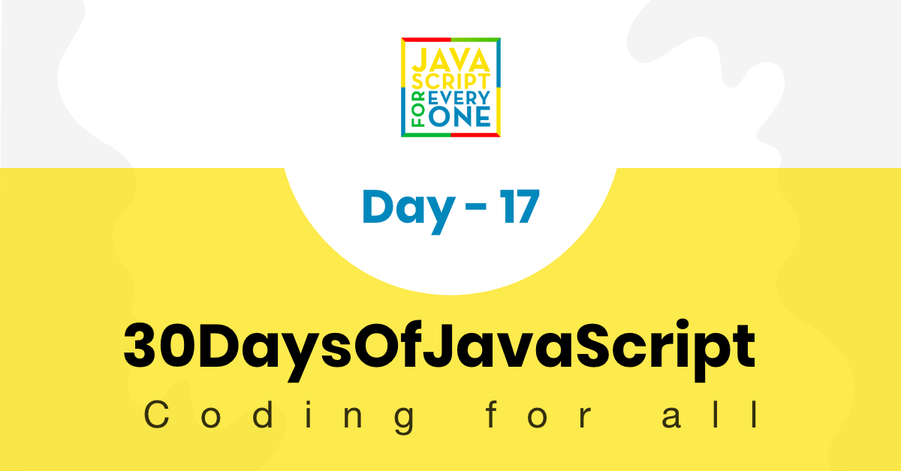

<div align="center">
  <h1> 30 Days Of JavaScript: Web Storages</h1>
  <a class="header-badge" target="_blank" href="https://www.linkedin.com/in/asabeneh/">
  
  </a>
  <a class="header-badge" target="_blank" href="https://twitter.com/Asabeneh">
  
  </a>

<sub>Autore:
<a href="https://www.linkedin.com/in/asabeneh/" target="_blank">Asabeneh Yetayeh</a><br>
<small> Gennaio, 2020</small>
</sub>

</div>

[<< Day 16](../16_Day_JSON/16_day_json.md) | [Day 18 >>](../18_Day_Promises/18_day_promises.md)



- [Day 17](#day-17)
	- [HTML5 Web Storage](#html5-web-storage)
		- [sessionStorage](#sessionstorage)
		- [localStorage](#localstorage)
		- [Casi d'uso per il Web Storage](#use-case-of-web-storages)
	- [Oggetti HTML5 Web Storage](#html5-web-storage-objects)
		- [Impostare elementi nel localStorage](#setting-item-to-the-localstorage)
		- [Ottenere elementi dal localStorage](#getting-item-from-localstorage)
		- [Svuotare il localStorage](#clearing-the-localstorage)
	- [Esercizi](#exercises)
		- [Esercizi: Livello 1](#exercises-level-1)
		- [Esercizi: Livello 2](#exercises-level-2)
		- [Esercizi: Livello 3](#exercises-level-3)

# Day 17

## HTML5 Web Storage

Web Storage (sessionStorage e localStorage) è una nuova API HTML5 che offre importanti vantaggi rispetto ai cookie tradizionali. Prima di HTML5, i dati delle applicazioni dovevano essere memorizzati nei cookie, inclusi in ogni richiesta del server. La memorizzazione sul Web è più sicura e grandi quantità di dati possono essere memorizzate localmente, senza influire sulle prestazioni del sito web. Il limite di memorizzazione dei dati dei cookie in molti browser web è di circa 4 KB per cookie. We Storages può memorizzare dati molto più grandi (almeno 5 MB) e non vengono mai trasferiti al server. Tutti i siti della stessa o di una stessa origine possono memorizzare e accedere agli stessi dati.

È possibile accedere ai dati memorizzati utilizzando JavaScript, che consente di sfruttare lo scripting lato client per fare molte cose che tradizionalmente richiedevano la programmazione lato server e i database relazionali. Esistono due oggetti Web Storage:

- sessionStorage
- localStorage

localStorage è simile a sessionStorage, tranne per il fatto che mentre i dati memorizzati in localStorage non hanno scadenza, i dati memorizzati in sessionStorage vengono cancellati quando la sessione della pagina termina, cioè quando la pagina viene chiusa.

Va notato che i dati memorizzati in localStorage o in sessionStorage sono specifici del protocollo della pagina.

Le chiavi e i valori sono sempre stringhe (si noti che, come per gli oggetti, le chiavi intere saranno automaticamente convertite in stringhe).


### sessionStorage

sessionStorage è disponibile solo all'interno della sessione della scheda o della finestra del browser. È progettato per memorizzare i dati in una singola sessione della pagina web. Ciò significa che se la finestra viene chiusa, i dati della sessione vengono rimossi. Poiché sessionStorage e localStorage hanno metodi simili, ci concentreremo solo su localStorage.

### localStorage

HTML5 localStorage è il para dell'API di archiviazione web che viene utilizzato per memorizzare i dati sul browser senza scadenza. I dati saranno disponibili sul browser anche dopo la sua chiusura. localStorage viene mantenuto anche tra le sessioni del browser. Ciò significa che i dati sono ancora disponibili quando il browser viene chiuso e riaperto e anche istantaneamente tra le schede e le finestre.

I dati di Web Storage, in entrambi i casi, non sono disponibili tra i diversi browser. Ad esempio, gli oggetti di memorizzazione creati in Firefox non sono accessibili in Internet Explorer, esattamente come i cookie. Esistono cinque metodi per lavorare sull'archiviazione locale:
_setItem(), getItem(), removeItem(), clear(), key()_

### Casi d'uso per il Web Storage

Alcuni casi d'uso degli archivi web sono

- memorizzare temporaneamente i dati
- salvare i prodotti che l'utente inserisce nel suo carrello della spesa
- i dati possono essere resi disponibili tra le richieste di pagina, tra più schede del browser e anche tra le sessioni del browser utilizzando localStorage
- possono essere utilizzati completamente offline utilizzando localStorage.
- Il Web Storage può essere un grande vantaggio in termini di prestazioni quando alcuni dati statici vengono memorizzati sul client per ridurre al minimo il numero di richieste successive. Anche le immagini possono essere memorizzate in stringhe utilizzando la codifica Base64.
- può essere usato per il metodo di autenticazione dell'utente

Per gli esempi sopra citati, ha senso usare localStorage. Ci si potrebbe chiedere, allora, quando si dovrebbe usare sessionStorage.

Nel caso in cui si voglia sbarazzarsi dei dati non appena la finestra viene chiusa. Oppure, se non si vuole che l'applicazione interferisca con la stessa applicazione aperta in un'altra finestra. Questi scenari sono meglio serviti con sessionStorage.

Vediamo ora come utilizzare queste API di Web Storage.

## Oggetti HTML5 Web Storage

Il web storage HTML fornisce due oggetti per la memorizzazione dei dati sul client:

- window.localStorage - memorizza i dati senza data di scadenza
- window.sessionStorage - memorizza i dati per una sessione (i dati vengono persi quando la scheda del browser viene chiusa)La maggior parte dei browser moderni supporta Web Storage, tuttavia è bene verificare il supporto del browser per localStorage e sessionStorage. Vediamo i metodi disponibili per gli oggetti Web Storage.

Oggetti Web Storage:

- _localStorage_ - per visualizzare l'oggetto localStorage
- _localStorage.clear()_ - per rimuovere tutto ciò che è presente nel localStorage
- _localStorage.setItem()_ - per memorizzare i dati nel localStorage. Richiede i parametri chiave e valore.
- _localStorage.getItem()_ - per visualizzare i dati memorizzati nel localStorage. Richiede una chiave come parametro.
- _localStorage.removeItem()_ - per rimuovere un elemento memorizzato dal localStorage. Richiede la chiave come parametro.
- _localStorage.key()_ - per visualizzare un dato memorizzato in un localStorage. Richiede l'indice come parametro.


### Impostare elementi nel localStorage

Quando si impostano i dati da memorizzare in un localStorage, questi vengono memorizzati come stringa. Se stiamo memorizzando un array o un oggetto, dovremmo prima stringare per mantenere il formato, a meno che non si perda la struttura dell'array o dell'oggetto dei dati originali.

I dati vengono memorizzati nel localStorage utilizzando il metodo _localStorage.setItem_.

```js
//syntax
localStorage.setItem('key', 'value')
```

- Memorizzazione di stringhe in un localStorage

```js
localStorage.setItem('firstName', 'Asabeneh') // since the value is string we do not stringify it
console.log(localStorage)
```

```sh
Storage {firstName: 'Asabeneh', length: 1}
```

- Storing number in a local storage

```js
localStorage.setItem('age', 200)
console.log(localStorage)
```

```sh
 Storage {age: '200', firstName: 'Asabeneh', length: 2}
```

- Memorizzazione di un array in un localStorage. Se si memorizza un array, un oggetto o un array di oggetti, occorre prima stringere l'oggetto. Vedere l'esempio seguente.

```js
const skills = ['HTML', 'CSS', 'JS', 'React']
//Skills array has to be stringified first to keep the format.
const skillsJSON = JSON.stringify(skills, undefined, 4)
localStorage.setItem('skills', skillsJSON)
console.log(localStorage)
```

```sh
Storage {age: '200', firstName: 'Asabeneh', skills: 'HTML,CSS,JS,React', length: 3}
```

```js
let skills = [
  { tech: 'HTML', level: 10 },
  { tech: 'CSS', level: 9 },
  { tech: 'JS', level: 8 },
  { tech: 'React', level: 9 },
  { tech: 'Redux', level: 10 },
  { tech: 'Node', level: 8 },
  { tech: 'MongoDB', level: 8 }
]

let skillJSON = JSON.stringify(skills)
localStorage.setItem('skills', skillJSON)
```

- Memorizzazione di un oggetto in un localStorage. Prima di memorizzare gli oggetti in un localStorage, l'oggetto deve essere stringato.

```js
const user = {
  firstName: 'Asabeneh',
  age: 250,
  skills: ['HTML', 'CSS', 'JS', 'React']
}

const userText = JSON.stringify(user, undefined, 4)
localStorage.setItem('user', userText)
```

### Ottenere elementi dal localStorage

Si ottengono i dati dalla memoria locale con il metodo _localStorage.getItem()_.

```js
//syntax
localStorage.getItem('key')
```

```js
let firstName = localStorage.getItem('firstName')
let age = localStorage.getItem('age')
let skills = localStorage.getItem('skills')
console.log(firstName, age, skills)
```

```sh
 'Asabeneh', '200', '['HTML','CSS','JS','React']'
```

Come si può vedere, l'abilità è in formato stringa. Utilizziamo JSON.parse() per analizzarla in un normale array.

```js
let skills = localStorage.getItem('skills')
let skillsObj = JSON.parse(skills, undefined, 4)
console.log(skillsObj)
```

```sh
['HTML','CSS','JS','React']
```

### Svuotare il localStorage

Il metodo clear cancella tutto ciò che è memorizzato nella memoria locale.

```js
localStorage.clear()
```

🌕 Ora conosci un Web Storages e sai come memorizzare piccoli dati sui browser dei client. Sei a 17 passi dalla tua strada verso la grandezza. Ora fai qualche esercizio per il tuo cervello e per i muscoli.

## Esercizi

### Esercizi: Livello 1

1. Memorizzare nome, cognome, età, paese e città nel browser localStorage.

### Esercizi: Livello 2

1. Creare un oggetto studente. L'oggetto studente avrà nome, cognome, età, competenze, nazione, chiavi di iscrizione e valori per le chiavi. Memorizzare l'oggetto studente nel localStorage del browser.

### Esercizi: Livello 3

1. Creare un oggetto chiamato personAccount. Ha le proprietà nome, cognome, reddito, spese e i metodi totalIncome, totalExpense, accountInfo, addIncome, addExpense e accountBalance. Le entrate sono un insieme di entrate e la loro descrizione e le spese sono anch'esse un insieme di spese e la loro descrizione.

🎉 CONGRATULAZIONI ! 🎉

[<< Day 16](../16_Day_JSON/16_day_json.md) | [Day 18 >>](../18_Day_Promises/18_day_promises.md)
