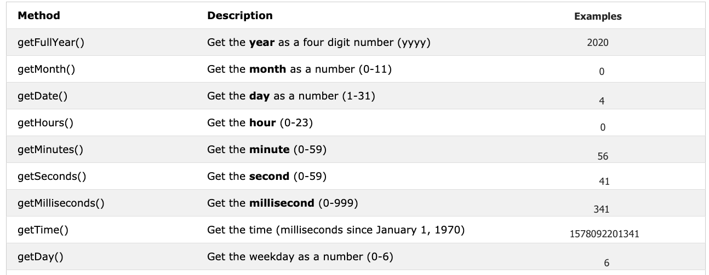

<div align="center">
  <h1> 30 ថ្ងៃនៃ JavaScript: Booleans, ប្រតិបត្តិករ, Date</h1>
  <a class="header-badge" target="_blank" href="https://www.linkedin.com/in/asabeneh/">
  
  </a>
  <a class="header-badge" target="_blank" href="https://twitter.com/Asabeneh">
  
  </a>

  <sub>អ្នកនិពន្ធ:
  <a href="https://www.linkedin.com/in/asabeneh/" target="_blank">Asabeneh Yetayeh</a><br>
  <small> ខែមករា ឆ្នាំ ២០២០</small>
  </sub>
</div>

[<< ថ្ងៃទី 2](../02_Day_Data_types/02_day_data_types.md) | [ថ្ងៃទី 4 >>](../04_Day_Conditionals/04_day_conditionals.md)


- [📔 ថ្ងៃទី 3](#-day-3)
	- [Booleans](#booleans)
		- [តម្លៃពិត](#truthy-values)
		- [តម្លៃមិនពិត](#falsy-values)
	- [Undefined](#undefined)
	- [Null](#null)
	- [ប្រតិបត្តិករ](#operators)
		- [ប្រតិបត្តិករ Assignment](#assignment-operators)
		- [ប្រតិបត្តិករ Arithmetic](#arithmetic-operators)
		- [ប្រតិបត្តិករ Comparison](#comparison-operators)
		- [ប្រតិបត្តិករ Logical](#logical-operators)
		- [ប្រតិបត្តិករ Increment](#increment-operator)
		- [ប្រតិបត្តិករ Decrement](#decrement-operator)
		- [ប្រតិបត្តិករ Ternary](#ternary-operators)
		- [អាទិភាពប្រតិបត្តិករ](#operator-precedence)
	- [Window Methods](#window-methods)
		- [Window alert() method](#window-alert-method)
		- [Window prompt() method](#window-prompt-method)
		- [Window confirm() method](#window-confirm-method)
	- [Date Object](#date-object)
		- [ការបង្កើត object ពេលវេលា](#creating-a-time-object)
		- [ទាញយកឆ្នាំ](#getting-full-year)
		- [ទាញយកខែ](#getting-month)
		- [ទាញយកកាលបរិច្ឆេទ](#getting-date)
		- [ទាញយកថ្ងៃ](#getting-day)
		- [ទាញយកម៉ោង](#getting-hours)
		- [ទាញយកនាទី](#getting-minutes)
		- [ទាញយកវិនាទី](#getting-seconds)
		- [ទាញយក​ពេល](#getting-time)
	- [💻 លំហាត់សម្រាប់ថ្ងៃទី ៣](#-day-3-exercises)
		- [លំហាត់៖ កម្រិត ១](#exercises-level-1)
		- [លំហាត់៖ កម្រិត ២](#exercises-level-2)
		- [លំហាត់៖ កម្រិត ៣](#exercises-level-3)

# 📔 ថ្ងៃទី 3

## Booleans

ប្រភេទទិន្នន័យ Boolean តំណាងឱ្យតម្លៃមួយក្នុងចំណោមតម្លៃទាំងពីរ៖ _true_ ឬ _false_ ។ តម្លៃ Boolean គឺពិតឬមិនពិត។ ការប្រើប្រាស់ប្រភេទទិន្នន័យទាំងនេះនឹងច្បាស់នៅពេលអ្នកចាប់ផ្តើមប្រតិបត្តិករប្រៀបធៀប។ ការប្រៀបធៀបណាមួយនឹងតឲតម្លៃ boolean ដែលពិតឬមិនពិត។

**ឧទាហរណ៍៖ តម្លៃ Boolean**

```js
let isLightOn = true
let isRaining = false
let isHungry = false
let isMarried = true
let truValue = 4 > 3    // ពិត
let falseValue = 4 < 3  // មិនពិត
```

យើងបានយល់ព្រមថាតម្លៃ boolean គឺពិតឬមិនពិត។

### តម្លៃពិត

- លេខទាំងអស់ (វិជ្ជមាន និងអវិជ្ជមាន) គឺជាតម្លៃពិត លើកលែងតែលេខសូន្យ
- string ទាំងអស់គឺជាការពិត លើកលែងតែ string ទទេ ('')
- boolean true

### តម្លៃមិនពិត

- 0
- 0n
- null
- undefined
- NaN
- boolean false
- '', "", ``, string ទទេ

វាជាការល្អក្នុងការចងចាំតម្លៃពិត និងតម្លៃមិនពិតទាំងនោះ។ នៅក្នុងផ្នែកបន្ទាប់ យើងនឹងប្រើប្រាស់ពួកវាជាមួយនិង conditional ដើម្បីធ្វើការសម្រេចចិត្ត។

## Undefined

ប្រសិនបើយើងប្រកាស variable ហើយយើងមិនកំណត់តម្លៃទេ តម្លៃនឹង undefined។ បន្ថែមពីលើនេះ ប្រសិនបើ function មិនឲតម្លៃទេ វានឹងឲ undefined។

```js
let firstName
console.log(firstName) // undefined ព្រោះ​វា​មិន​ទាន់បាន​កំណត់​តម្លៃ​នៅ​ឡើយ​ទេ។
```

## Null

```js
let empty = null
console.log(empty) // -> null , មានន័យថាគ្មានតម្លៃ
```

## Operators

### ប្រតិបត្តិករ Assignment

សញ្ញាស្មើគ្នានៅក្នុង JavaScript គឺជាប្រតិបត្តិករ assignment។ វាប្រើដើម្បីកំណត់ variable។

```js
let firstName = 'Asabeneh'
let country = 'Finland'
```

ប្រតិបត្តិករ Assignment


### ប្រតិបត្តិករ Arithmetic 

ប្រតិបត្តិករ Arithmetic គឺជា ប្រមាណវិធីគណិតវិទ្យា។

- ផលបូក(+): a + b
- ផលដក(-): a - b
- ផលគុណ(*): a * b
- ផលចែក(/): a / b
- ម៉ូឌុល(%): a % b
- ស្វ័យគុណ(**): a ** b

```js
let numOne = 4
let numTwo = 3
let sum = numOne + numTwo
let diff = numOne - numTwo
let mult = numOne * numTwo
let div = numOne / numTwo
let remainder = numOne % numTwo
let powerOf = numOne ** numTwo

console.log(sum, diff, mult, div, remainder, powerOf) // 7,1,12,1.33,1, 64

```

```js
const PI = 3.14
let radius = 100          // ប្រវែងគិតជាម៉ែត្រ

// គណនាផ្ទៃនៃរង្វង់មួយ
const areaOfCircle = PI * radius * radius
console.log(areaOfCircle)  //  314 m


const gravity = 9.81      // គិតជា m/s2
let mass = 72             // គិតជាគីឡូក្រាម

// គណនាទម្ងន់របស់វត្ថុមួយ។
const weight = mass * gravity
console.log(weight)        // 706.32 N(Newton)

const boilingPoint = 100  // សីតុណ្ហភាពក្នុង oC, ចំណុចរំពុះនៃទឹក
const bodyTemp = 37       // សីតុណ្ហភាពរាងកាយក្នុង oC


// ការភ្ជាប់ string ជាមួយលេខដោយប្រើ string interpolation
/*
 The boiling point of water is 100 oC.
 Human body temperature is 37 oC.
 The gravity of earth is 9.81 m/s2.
 */
console.log(
  `The boiling point of water is ${boilingPoint} oC.\nHuman body temperature is ${bodyTemp} oC.\nThe gravity of earth is ${gravity} m / s2.`
)
```

### ប្រតិបត្តិករ Comparison 

ក្នុង​ការ​សរសេរ​កម្មវិធី យើង​ប្រើ​ប្រតិបត្តិករ​ comparison ដើម្បី​ប្រៀបធៀប​តម្លៃ​ពីរ។ យើងពិនិត្យមើលថាតើតម្លៃមួយធំជាង ឬតិចជាង ឬស្មើនឹងតម្លៃផ្សេងទៀត។


**Example: Comparison Operators**

```js
console.log(3 > 2)              // ពិតព្រោះ 3 ធំជាង 2
console.log(3 >= 2)             // ពិតព្រោះ 3 ធំជាង 2
console.log(3 < 2)              // មិនពិត ពីព្រោះ 3 ធំជាង 2
console.log(2 < 3)              // ពិតព្រោះ 2 តិចជាង 3
console.log(2 <= 3)             // ពិតព្រោះ 2 តិចជាង 3
console.log(3 == 2)             // មិនពិត ព្រោះ ៣ មិនស្មើនឹង ២
console.log(3 != 2)             // ពិតព្រោះ ៣ មិនស្មើនឹង ២
console.log(3 == '3')           // ពិត ប្រៀបធៀបតម្លៃប៉ុណ្ណោះ។
console.log(3 === '3')          // មិនពិត ប្រៀបធៀបតម្លៃ និងប្រភេទទិន្នន័យ
console.log(3 !== '3')          // ពិត ប្រៀបធៀបតម្លៃ និងប្រភេទទិន្នន័យ
console.log(3 != 3)             // មិនពិត ប្រៀបធៀបតម្លៃប៉ុណ្ណោះ។
console.log(3 !== 3)            // មិនពិត ប្រៀបធៀបតម្លៃ និងប្រភេទទិន្នន័យ
console.log(0 == false)         // ពិត, សមមូល
console.log(0 === false)        // មិនពិត មិនដូចគ្នាទេ។
console.log(0 == '')            // ពិត, សមមូល
console.log(0 == ' ')           // ពិត, សមមូល
console.log(0 === '')           // មិនពិត មិនដូចគ្នាទេ។
console.log(1 == true)          // ពិត, សមមូល
console.log(1 === true)         // មិនពិត មិនដូចគ្នាទេ។
console.log(undefined == null)  // ពិត
console.log(undefined === null) // មិនពិត
console.log(NaN == NaN)         // មិនពិត, មិនស្មើគ្នាទេ
console.log(NaN === NaN)        // មិនពិត
console.log(typeof NaN)         // ចំនួន

console.log('mango'.length == 'avocado'.length)  // មិនពិត
console.log('mango'.length != 'avocado'.length)  // ពិត
console.log('mango'.length < 'avocado'.length)   // ពិត
console.log('milk'.length == 'meat'.length)      // ពិត
console.log('milk'.length != 'meat'.length)      // មិនពិត
console.log('tomato'.length == 'potato'.length)  // ពិត
console.log('python'.length > 'dragon'.length)   // មិនពិត
```

ព្យាយាមយល់ពីការប្រៀបធៀបខាងលើជាមួយនឹងតក្កវិជ្ជាមួយចំនួន។ ការចងចាំដោយគ្មានតក្កវិជ្ជាអាចពិបាក។
JavaScript គឺជាប្រភេទភាសាសរសេរកម្មវិធីដែលចងគ្នា។ កូដ JavaScript ដំណើរការ និងផ្តល់ឱ្យអ្នកនូវលទ្ធផល ប៉ុន្តែលុះត្រាតែអ្នកពូកែវាប្រហែលជាមិនមែនជាលទ្ធផលដែលចង់បាននោះទេ។

តាមក្បួន ប្រសិនបើតម្លៃមិនពិតជាមួយ == វានឹងមិនស្មើនឹង === ។ ការប្រើប្រាស់ === មានសុវត្ថិភាពជាងការប្រើប្រាស់ == ។ [លំនាំ​](https://dorey.github.io/JavaScript-Equality-Table/) មានបញ្ជីពេញលេញនៃការប្រៀបធៀបប្រភេទទិន្នន័យ

### ប្រតិបត្តិករ Logical 

និមិត្តសញ្ញាខាងក្រោមគឺជាសញ្ញាប្រមាណវិធីតក្កវិជ្ជាទូទៅ៖
&&(ampersand), ||(pipe) និង !(negation)។
ប្រតិបត្តិករ && ទទួលបានពិត លុះត្រាតែប្រតិបត្តិករទាំងពីរពិត។
នេះ || ប្រតិបត្តិករទទួលបានពិត នៅពេលប្រតិបត្តិករមួយពិតរឺទាំងពីរ។
នេះ! ប្រតិបត្តិករបដិសេធការពិតទៅមិនពិត និងមិនពិតទៅពិត។

```js
// ឧទាហរណ៍  ប្រតិបត្តិករ ampersand &&

const check = 4 > 3 && 10 > 5         // ពិត && ពិត -> ពិត
const check = 4 > 3 && 10 < 5         // ពិត && មិនពិត -> មិនពិត
const check = 4 < 3 && 10 < 5         // មិនពិត && មិនពិត -> មិនពិត

// ឧទាហរណ៍នៃប្រតិបត្តិការ || pipe or

const check = 4 > 3 || 10 > 5         // ពិត || ពិត -> ពិត
const check = 4 > 3 || 10 < 5         // ពិត || មិនពិត -> ពិត
const check = 4 < 3 || 10 < 5         // មិនពិត || false -> មិនពិត

// ឧទាហរណ៍ ! Negation 

let check = 4 > 3                     // ពិត
let check = !(4 > 3)                  //  មិនពិត
let isLightOn = true
let isLightOff = !isLightOn           // មិនពិត
let isMarried = !false                // ពិត
```

### ប្រតិបត្តិករ Increment

នៅក្នុង JavaScript យើងប្រើ increment operator ដើម្បីបង្កើនតម្លៃដែលរក្សាទុកក្នុង variable។ ការកើនឡើងអាចជា pre-increment រឺក៏ post-increment។ តោះមើលពួកគេមួយៗ៖

1. Pre-increment

```js
let count = 0
console.log(++count)        // 1
console.log(count)          // 1
```

1. Post-increment

```js
let count = 0
console.log(count++)        // 0
console.log(count)          // 1
```

យើងប្រើភាគច្រើនគឺ post-increment។ យ៉ាងហោចណាស់ អ្នកគួរចងចាំពីរបៀបប្រើ ប្រតិបត្តិករ post-increment

### ប្រតិបត្តិករ Decrement 

នៅក្នុង JavaScript យើងប្រើ decrement operator ដើម្បីបន្ថយតម្លៃដែលរក្សាទុកក្នុងអថេរ។ ការថយចុះអាចជា pre-decrement រឺ post-decrement។ តោះមើលពួកវាមួយៗ៖

1. Pre-decrement

```js
let count = 0
console.log(--count) // -1
console.log(count)  // -1
```

2. Post-decrement

```js
let count = 0
console.log(count--) // 0
console.log(count)   // -1
```

### ប្រតិបត្តិករ Ternary 

ប្រតិបត្តិករ Ternary អនុញ្ញាតឱ្យយើងសរសេរលក្ខខណ្ឌ។
វិធីមួយទៀតដើម្បីសរសេរលក្ខខណ្ឌគឺប្រើ ternary operators ។ សូមមើលឧទាហរណ៍ខាងក្រោម៖

```js
let isRaining = true
isRaining
  ? console.log('You need a rain coat.')
  : console.log('No need for a rain coat.')
isRaining = false

isRaining
  ? console.log('You need a rain coat.')
  : console.log('No need for a rain coat.')
```

```sh
You need a rain coat.
No need for a rain coat.
```

```js
let number = 5
number > 0
  ? console.log(`${number} is a positive number`)
  : console.log(`${number} is a negative number`)
number = -5

number > 0
  ? console.log(`${number} is a positive number`)
  : console.log(`${number} is a negative number`)
```

```sh
5 is a positive number
-5 is a negative number
```

### អាទិភាពប្រតិបត្តិករ

ចង់ណែនាំអ្នកឱ្យអានអំពីអាទិភាពប្រតិបត្តិករពីនេះ។ [link](https://developer.mozilla.org/en-US/docs/Web/JavaScript/Reference/Operators/Operator_Precedence)

## Window Methods

### Window alert() method

ដូចដែលអ្នកបានឃើញនៅដើមដំបូង method alert() បង្ហាញប្រអប់ជូនដំណឹងមួយដែលមានសារដែលបានបញ្ជាក់ និងប៊ូតុងយល់ព្រម។ វា​ជា​ method ដែល​មាន​ស្រាប់ ហើយ​វា​យក argument មួយ។

```js
alert(message)
```

```js
alert('Welcome to 30DaysOfJavaScript')
```


កុំប្រើការ alert() ច្រើនពេកព្រោះវានឹងរំខាន ។ សូមប្រើវាដើម្បីតែសាកល្បង។

### Window prompt() method

method prompt បង្ហាញប្រអប់បញ្ចូលជាមួយធាតុបញ្ចូលនៅលើ browser របស់អ្នកដើម្បីយកតម្លៃបញ្ចូល ហើយទិន្នន័យបញ្ចូលអាចត្រូវបានរក្សាទុកក្នុងអថេរមួយ។ វិធីសាស្ត្រ prompt() យក argument ពីរ។ អាគុយម៉ង់ទីពីរគឺស្រេចចិត្ត។

```js
prompt('required text', 'optional text')
```

```js
let number = prompt('Enter number', 'number goes here')
console.log(number)
```

### Window confirm() method

method confirm() បង្ហាញប្រអប់ដែលមានសារដែលបានបញ្ជាក់ រួមជាមួយនឹងប៊ូតុង OK និងប៊ូតុង Cancel ។
ប្រអប់ confirm ត្រូវបានប្រើជាញឹកញាប់ដើម្បីសុំការអនុញ្ញាតពីអ្នកប្រើប្រាស់ដើម្បីប្រតិបត្តិអ្វីមួយ។ Window confirm() យក string ជា argument។
ការ​ចុច OK ផ្តល់​ផល​តម្លៃ​ពិត ចំណែក​ឯ​ការ​ចុច​ប៊ូតុង Cancel ផ្តល់​តម្លៃ​មិន​ពិត។

```js
const agree = confirm('Are you sure you like to delete? ')
console.log(agree) // លទ្ធផលនឹងពិត ឬមិនពិត ដោយផ្អែកលើអ្វីដែលអ្នកចុចលើប្រអប់
```

ទាំង​នេះ​មិន​មែន​ជា window method ​ទាំង​អស់ទេ  ​យើង​នឹង​មាន​ផ្នែក​ដាច់​ដោយ​ឡែក​ដើម្បី​ចូល​ជ្រៅ​ទៅ​ក្នុង​ window method​។

## Date Object

ពេលវេលាគឺជារឿងសំខាន់។ យើងចង់ដឹងពីពេលវេលានៃសកម្មភាព ឬព្រឹត្តិការណ៍ជាក់លាក់មួយ។ នៅក្នុង JavaScript បច្ចុប្បន្ន និងកាលបរិច្ឆេទត្រូវបានបង្កើតដោយប្រើ JavaScript Date Object។ object ដែលយើងបង្កើតដោយប្រើ Date object ផ្តល់នូវវិធីសាស្រ្តជាច្រើនដើម្បីធ្វើការជាមួយកាលបរិច្ឆេទ និងពេលវេលា។ វិធីសាស្ត្រដែលយើងប្រើដើម្បីទទួលបានព័ត៌មានកាលបរិច្ឆេទ និងពេលវេលាពីតម្លៃវត្ថុកាលបរិច្ឆេទត្រូវបានចាប់ផ្តើមដោយពាក្យ _get_ ព្រោះវាផ្តល់ព័ត៌មាន។
_getFullYear(), getMonth(), getDate(), getDay(), getHours(), getMinutes, getSeconds(), getMilliseconds(), getTime(), getDay()_



### ការបង្កើត object ពេលវេលា

នៅពេលយើងបង្កើតobject ពេលវេលាវានឹងផ្តល់ព័ត៌មានអំពីពេលវេលា។ តោះយើងបង្កើត object ពេលវេលា

```js
const now = new Date()
console.log(now) // Sat Jan 04 2020 00:56:41 GMT+0200 (Eastern European Standard Time)
```

យើងបានបង្កើត time object ហើយហើយយើងអាចចូលប្រើព័ត៌មានកាលបរិច្ឆេទណាមួយពី object ដោយប្រើ get method ដែលយើងបាននិយាយនៅលើតារាងខាងលើ។

### ទាញយកឆ្នាំ

ចូរស្រង់ចេញ ឬទាញយកឆ្នាំពេញពី object ពេលវេលាមួយ។

```js
const now = new Date()
console.log(now.getFullYear()) // 2020
```

### ទាញយកខែ

ចូរស្រង់ចេញ ឬទាញយកខែពីវត្ថុពេលវេលាមួយ។

```js
const now = new Date()
console.log(now.getMonth()) // 0 ព្រោះ​ខែ​មករា​ ខែ (0-11)
```

### ទាញយកបរិច្ឆេទ

ចូរស្រង់ចេញ ឬទាញយកកាលបរិច្ឆេទនៃខែពី object ពេលវេលាមួយ។

```js
const now = new Date()
console.log(now.getDate()) // ៤ ព្រោះ​ថ្ងៃ​នេះ​ជា​ថ្ងៃ​ទី ៤ គឺ​ថ្ងៃ (១-៣១)
```

### ទាញយកថ្ងៃ

Let's extract or get the day of the week from a time object.

ចូរស្រង់ចេញ ឬទាញយកថ្ងៃនៃសប្តាហ៍ពី object ពេលវេលាមួយ។

```js
const now = new Date()
console.log(now.getDay()) // ៦ ព្រោះ​ថ្ងៃ​សៅរ៍ ជា​ថ្ងៃ​ទី ៧
// ថ្ងៃអាទិត្យគឺ 0 ថ្ងៃច័ន្ទគឺ 1 និងថ្ងៃសៅរ៍គឺ 6
// ទទួលបានថ្ងៃធ្វើការជាលេខ (0-6)
```

### ទាញយកម៉ោង

ចូរស្រង់ចេញ ឬទាញយកម៉ោងពី object ពេលវេលាមួយ។

```js
const now = new Date()
console.log(now.getHours()) // 0 ពីព្រោះពេលវេលាគឺ 00:56:41
```

### ទាញយកនាទី

ចូរស្រង់ចេញ ឬទាញយកនាទីពីវត្ថុពេលវេលាមួយ។

```js
const now = new Date()
console.log(now.getMinutes()) // 56, ដោយសារតែពេលវេលាគឺ 00:56:41
```

### ទាញយកវិនាទី

តោះស្រង់ ឬទាញយកវិនាទីពីវត្ថុពេលវេលា។

```js
const now = new Date()
console.log(now.getSeconds()) // 41, ដោយសារតែពេលវេលាគឺ 00:56:41
```

### ទាញយកពេល

វិធីសាស្រ្តនេះផ្តល់ពេលវេលាគិតជាមិល្លីវិនាទី ដែលចាប់ផ្តើមពីថ្ងៃទី 1 ខែមករា ឆ្នាំ 1970។ វាក៏ត្រូវបានគេស្គាល់ថាជាពេលវេលា Unix ផងដែរ។ យើងអាចទទួលបានពេលវេលា Unix តាមពីរវិធី៖

1. ដោយ _getTime()_

```js
const now = new Date() //
console.log(now.getTime()) // 1578092201341 នេះគឺជាចំនួនវិនាទីដែលបានឆ្លងកាត់ចាប់ពីថ្ងៃទី 1 ខែមករា ឆ្នាំ 1970 ដល់ថ្ងៃទី 4 ខែមករា ឆ្នាំ 2020 00:56:41
```

1. ដោយ _Date.now()_

```js
const allSeconds = Date.now() //
console.log(allSeconds) // 1578092201341 នេះគឺជាចំនួនវិនាទីដែលបានឆ្លងកាត់ចាប់ពីថ្ងៃទី 1 ខែមករា ឆ្នាំ 1970 ដល់ថ្ងៃទី 4 ខែមករា ឆ្នាំ 2020 00:56:41

const timeInSeconds = new Date().getTime()
console.log(allSeconds == timeInSeconds) // ពិត
```

តោះយើងធ្វើទ្រង់ទ្រាយតម្លៃទាំងនេះទៅជាទម្រង់ពេលវេលាដែលអាចអានបាន។
**Example:**

```js
const now = new Date()
const year = now.getFullYear() // ឲឆ្នាំ
const month = now.getMonth() + 1 // ឲខែ (0 - 11)
const date = now.getDate() // ឲកាលបរិច្ឆេទ (1 - 31)
const hours = now.getHours() // ឲលេខ (0 - 23)
const minutes = now.getMinutes() // ឲលេខ (0 -59)

console.log(`${date}/${month}/${year} ${hours}:${minutes}`) // 4/1/2020 0:56
```

🌕 អ្នកមានថាមពលគ្មានដែនកំណត់។ អ្នកទើបតែបានបញ្ចប់ challenge នៅថ្ងៃទី 3 ហើយអ្នកគឺបានឈានជំហានបីឆ្ពោះទៅរកផ្លូវអស្ចារ្យ។ ឥឡូវធ្វើលំហាត់ខ្លះសម្រាប់ខួរក្បាល និងសាច់ដុំរបស់អ្នក។

## 💻 លំហាត់សម្រាប់ថ្ងៃទី ៣

### លំហាត់៖ កម្រិត ១

1. ប្រកាស firstName, lastName, country, city, age, isMarried, year variable ហើយកំណត់តម្លៃទៅវា ហើយប្រើ typeof ដើម្បីពិនិត្យមើលប្រភេទទិន្នន័យផ្សេងៗគ្នា។
2. ពិនិត្យមើលថាតើប្រភេទនៃ '10' ស្មើនឹង 10 រឺទេ
3. ពិនិត្យមើលថាតើ parseInt ('9.8') ស្មើនឹង 10 រឺទេ
4. តម្លៃ boolean គឺពិតឬមិនពិត.
   1. សរសេរ JavaScript ចំនួនបី statement ដែលផ្តល់តម្លៃពិត.
   2. សរសេរ JavaScript ចំនួនបី statement ដែលផ្តល់តម្លៃមិនពិត.

5. ស្វែងរកលទ្ធផលនៃកន្សោមប្រៀបធៀបខាងក្រោមជាមុនសិនដោយមិនប្រើ console.log()។ បន្ទាប់ពីអ្នកសម្រេចចិត្តលទ្ធផល បញ្ជាក់វាដោយប្រើ console.log()
   1. 4 > 3
   2. 4 >= 3
   3. 4 < 3
   4. 4 <= 3
   5. 4 == 4
   6. 4 === 4
   7. 4 != 4
   8. 4 !== 4
   9. 4 != '4'
   10. 4 == '4'
   11. 4 === '4'
   12. ស្វែងរកប្រវែងនៃ python និង jargon ហើយបង្កើត statement ប្រៀបធៀបដែលឲតម្លៃមិនពិត។

6. ស្វែងរកលទ្ធផលនៃកន្សោមប្រៀបធៀបខាងក្រោមជាមុនសិនដោយមិនប្រើ console.log()។ បន្ទាប់ពីអ្នកសម្រេចចិត្តលទ្ធផល បញ្ជាក់វាដោយប្រើ console.log()
   1. 4 > 3 && 10 < 12
   2. 4 > 3 && 10 > 12
   3. 4 > 3 || 10 < 12
   4. 4 > 3 || 10 > 12
   5. !(4 > 3)
   6. !(4 < 3)
   7. !(false)
   8. !(4 > 3 && 10 < 12)
   9. !(4 > 3 && 10 > 12)
   10. !(4 === '4')
   11. There is no 'on' in both dragon and python

7. ប្រើ date object ដើម្បីធ្វើសកម្មភាពដូចខាងក្រោម
   1. តើពេលនេះជាឆ្នាំអ្វី?
   2. តើពេលនេះជាខែអ្វី?
   3. តើ​ថ្ងៃនេះ​ជា​ថ្ងៃ​អ្វី?
   4. តើថ្ងៃនេះជាថ្អៃអ្វីហើយជាលេខ?
   5. តើម៉ោងប៉ុន្មានឥឡូវនេះ?
   6. តើ​មាន​នាទី​អ្វី​ឥឡូវ​នេះ?
   7. រកមើលចំនួនវិនាទីដែលបានកន្លងផុតទៅចាប់ពីថ្ងៃទី 1 ខែមករាឆ្នាំ 1970 ដល់ឥឡូវនេះ

### លំហាត់៖ កម្រិត ២

1.សរសេរស្គ្រីបដែលជំរុញឱ្យអ្នកប្រើប្រាស់បញ្ចូលមូលដ្ឋាន និងកម្ពស់នៃត្រីកោណ ហើយគណនាផ្ទៃដីនៃត្រីកោណមួយ (ផ្ទៃ = 0.5 x b x h) ។

   ```sh
   Enter base: 20
   Enter height: 10
   The area of the triangle is 100
   ```

1. សរសេរស្គ្រីបដែលជំរុញឱ្យអ្នកប្រើប្រាស់បញ្ចូលចំហៀង a ចំហៀង b និងចំហៀង c នៃត្រីកោណ ហើយនិងគណនាបរិវេណនៃត្រីកោណ (បរិមាត្រ = a + b + c)

   ```sh
   Enter side a: 5
   Enter side b: 4
   Enter side c: 3
   The perimeter of the triangle is 12
   ```

1. ទទួលបានប្រវែង និងទទឹងដោយប្រើប្រអប់បញ្ចូល ហើយគណនាផ្ទៃដីនៃចតុកោណកែង (ផ្ទៃ = ប្រវែង x ទទឹង និងបរិមាត្រនៃចតុកោណកែង (បរិមាត្រ = 2 x (ប្រវែង + ទទឹង)))
1. ទទួលបានកាំដោយប្រើប្រអប់បញ្ចូល ហើយគណនាផ្ទៃរង្វង់មួយ (ផ្ទៃ = pi x r x r) និងបរិមាត្រនៃរង្វង់មួយ (c = 2 x pi x r) ដែល pi = 3.14 ។
1. គណនាជម្រាល x-intercept និង y-intercept នៃ y = 2x −2
1. ជម្រាលគឺ m = (y<sub>2</sub>-y<sub>1</sub>)/(x<sub>2</sub>-x<sub>1</sub>) ។ ស្វែងរកជម្រាលរវាងចំណុច (2, 2) និងចំណុច (6,10)
1. ប្រៀបធៀបជម្រាលនៃសំណួរទាំងពីរខាងលើ។
1. គណនាតម្លៃ y (y = x<sup>2</sup> + 6x + 9) ។ ព្យាយាមប្រើតម្លៃ x ផ្សេងគ្នា ហើយរកឱ្យឃើញនូវតម្លៃ x ដែល y គឺ 0 ។
1. សរសេរស្គ្រីបដែលជំរុញឱ្យអ្នកប្រើប្រាស់បញ្ចូលម៉ោង និងអត្រាប្រាក់ឈ្នួលក្នុងមួយម៉ោង។ គណនាប្រាក់ឈ្នួលរបស់មនុស្ស?

    ```sh
    Enter hours: 40
    Enter rate per hour: 28
    Your weekly earning is 1120
    ```

1. ប្រសិនបើប្រវែងនៃឈ្មោះរបស់អ្នកធំជាង 7 និយាយថាឈ្មោះរបស់អ្នកវែង ផ្សេងទៀតនិយាយថាឈ្មោះរបស់អ្នកខ្លី។
1. ប្រៀបធៀបប្រវែងនាមខ្លួនរបស់អ្នក និងប្រវែងនាមត្រកូលរបស់អ្នក ហើយអ្នកគួរតែទទួលបានលទ្ធផលនេះ។

    ```js
    let firstName = 'Asabeneh'
    let lastName = 'Yetayeh'
    ```

    ```sh
    Your first name, Asabeneh is longer than your family name, Yetayeh
    ```

1. ប្រកាសអថេរពីរ _myAge_ និង _yourAge_ ហើយកំណត់តម្លៃដំបូង

   ```js
   let myAge = 250
   let yourAge = 25
   ```

   ```sh
   I am 225 years older than you.
   ```

1. ដោយប្រើប្រអប់បញ្ចូល ទាញយកឆ្នាំដែលអ្នកប្រើប្រាស់កើត ហើយប្រសិនបើអ្នកប្រើមានអាយុ 18 ឆ្នាំឡើងទៅ អនុញ្ញាតឲ្យអ្នកប្រើប្រាស់បើកបរ ប្រសិនបើមិនទាន់គ្រប់អាយុទេ ប្រាប់អ្នកប្រើប្រាស់ឱ្យរង់ចាំចំនួនឆ្នាំជាក់លាក់ណាមួយ។

    ```sh

    Enter birth year: 1995
    You are 25. You are old enough to drive

    Enter birth year: 2005
    You are 15. You will be allowed to drive after 3 years.
    ```

1. សរសេរ​ស្គ្រីប​ដែល​ទាញយក​ឆ្នាំហើយគណនាចំនួននាទីដែលបានរស់នៅ

   ```sh
   Enter number of years you live: 100
   You lived 3153600000 seconds.
   ```

1. បង្កើតទម្រង់ពេលវេលាដែលអាចអានបានរបស់មនុស្សដោយប្រើ date object
   1. YYYY-MM-DD HH:mm
   2. DD-MM-YYYY HH:mm
   3. DD/MM/YYYY HH:mm

### លំហាត់៖ កម្រិត ៣

1. Create a human readable time format using the Date time object. The hour and the minute should be all the time two digits(7 hours should be 07 and 5 minutes should be 05 )
1. បង្កើតទម្រង់ពេលវេលាដែលអាចអានបានរបស់មនុស្សដោយប្រើ date obejct។ ម៉ោង និងនាទីគួរតែជាលេខពីរខ្ទង់ (៧ ម៉ោងគួរតែជា ០៧ និង ៥ នាទីគួរតែជា ០៥)
   1. YYY-MM-DD HH:mm eg. 20120-01-02 07:05

[<< ថ្ងៃទី 2](../02_Day_Data_types/02_day_data_types.md) | [ថ្ងៃទី 4 >>](../04_Day_Conditionals/04_day_conditionals.md)
