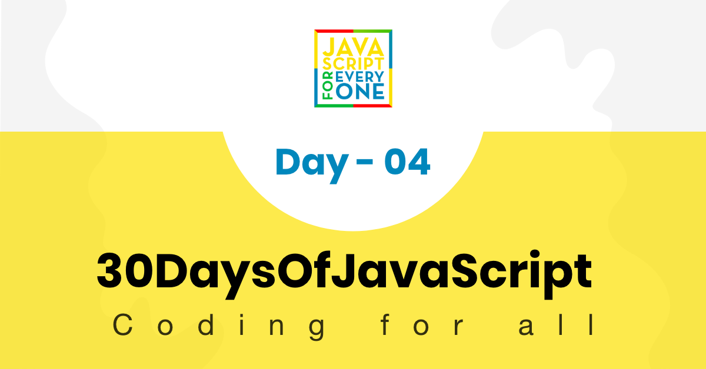

<div align="center">
  <h1> 30 ថ្ងៃនៃ JavaScript៖ Conditionals</h1>
  <a class="header-badge" target="_blank" href="https://www.linkedin.com/in/asabeneh/">
  
  </a>
  <a class="header-badge" target="_blank" href="https://twitter.com/Asabeneh">
  
  </a>

  <sub>អ្នកនិពន្ធ:
  <a href="https://www.linkedin.com/in/asabeneh/" target="_blank">Asabeneh Yetayeh</a><br>
  <small> ខែមករា ឆ្នាំ ២០២០</small>
  </sub>
</div>

[<< ថ្ងៃទី 3](../03_Day_Booleans_operators_date/03_booleans_operators_date.md) | [ថ្ងៃទី 5 >>](../05_Day_Arrays/05_day_arrays.md)



- [📔 ថ្ងៃទី 4](#-day-4)
	- [Conditionals](#conditionals)
		- [If](#if)
		- [If Else](#if-else)
		- [If  Else if Else](#if--else-if-else)
		- [Switch](#switch)
		- [Ternary Operators](#ternary-operators)
	- [💻 លំហាត់](#-exercises)
		- [លំហាត់៖ កម្រិត 1](#exercises-level-1)
		- [លំហាត់៖ កម្រិត 2](#exercises-level-2)
		- [លំហាត់៖ កម្រិត 3](#exercises-level-3)

# 📔 Day 4

## Conditionals

conditional statement ត្រូវបានប្រើសម្រាប់ធ្វើការសម្រេចចិត្តដោយផ្អែកលើលក្ខខណ្ឌផ្សេងៗ។
តាមលំនាំដើម statement នៅក្នុងស្គ្រីប JavaScript ត្រូវបានប្រតិបត្តិតាមលំដាប់ពីកំពូលទៅបាត។ ប្រសិនបើតក្កវិជ្ជាដំណើរការទាមទារដូច្នេះ លំហូរបន្តបន្ទាប់គ្នានៃការប្រតិបត្តិអាចត្រូវបានផ្លាស់ប្តូរតាមពីរវិធី៖

- conditional execution៖ ប្លុកនៃ statement មួយ ឬច្រើននឹងត្រូវបានប្រតិបត្តិប្រសិនបើកន្សោមជាក់លាក់មួយគឺពិត
- repetitive execution៖ ប្លុកនៃ statement មួយ ឬច្រើននឹងត្រូវបានប្រតិបត្តិដដែលៗ ដរាបណាកន្សោមជាក់លាក់មួយគឺពិត។ នៅក្នុងផ្នែកនេះ យើងនឹងនិយាយអំពី _if_, _else_ , _else if_ statements។ ប្រតិបត្តិករប្រៀបធៀប និង តក្កដែលយើងបានរៀននៅក្នុងផ្នែកមុនៗនឹងមានប្រយោជន៍នៅទីនេះ។

Conditoinals អាចត្រូវបានអនុវត្តដោយប្រើវិធីខាងក្រោម:

- if
- if else
- if else if else
- switch
- ternary operator

### If

នៅក្នុង JavaScript និងភាសាសរសេរកម្មវិធីផ្សេងទៀត ពាក្យគន្លឹះ _if_ ត្រូវបានប្រើដើម្បីពិនិត្យមើលថាតើលក្ខខណ្ឌមួយគឺពិត និងដើម្បីប្រតិបត្តិកូដ។ ដើម្បីបង្កើតលក្ខខណ្ឌ if យើងត្រូវការពាក្យគន្លឹះ _if_ និងលក្ខខណ្ឌនៅខាងក្នុងវង់ក្រចក និងប្លុកកូដនៅខាងក្នុងតង្កៀបអង្កាញ់ ({})។

```js
// syntax
if (condition) {
  //ផ្នែកនៃកូដនេះដំណើរការសម្រាប់លក្ខខណ្ឌដែលមានតម្លៃពិត
}
```

**ឧទាហរណ៍:**

```js
let num = 3
if (num > 0) {
  console.log(`${num} is a positive number`)
}
//  3 គឺជាលេខវិជ្ជមាន
```

ដូចដែលអ្នកអាចឃើញនៅក្នុងឧទាហរណ៍លក្ខខណ្ឌខាងលើ 3 គឺធំជាង 0 ដូច្នេះវាគឺជាចំនួនវិជ្ជមាន។ លក្ខខណ្ឌគឺពិត ហើយប្លុកកូដត្រូវបានប្រតិបត្តិ។ យ៉ាងណាមិញ ប្រសិនបើលក្ខខណ្ឌមិនពិត យើងនឹងមិនឃើញលទ្ធផលណាមួយឡើយ។

```js
let isRaining = true
if (isRaining) {
  console.log('Remember to take your rain coat.')
}
```

 ដូចគ្នាទៅនឹងលក្ខខណ្ឌទីពីរ ប្រសិនបើ isRaining មិនពិត នោះ if block នឹងមិនត្រូវបានប្រតិបត្តិ ហើយយើងនឹងមិនឃើញលទ្ធផលណាមួយទេ។ ដើម្បី​មើល​ឃើញ​លទ្ធផល​នៃ​លក្ខខណ្ឌ​មិន​ពិត យើង​គួរ​តែ​មាន​ប្លុក​មួយ​ទៀត​ដែលជា _else_.

### If Else

ប្រសិនបើលក្ខខណ្ឌ if ពិត ប្លុកទីមួយនឹងត្រូវបានប្រតិបត្តិ ប្រសិនបើមិនចឹងទេ លក្ខខណ្ឌ else នឹងត្រូវបានប្រតិបត្តិ។

```js
// syntax
if (condition) {
  // ផ្នែកនៃកូដនេះដំណើរការសម្រាប់លក្ខខណ្ឌពិត
} else {
  // ផ្នែកនៃកូដនេះដំណើរការសម្រាប់លក្ខខណ្ឌមិនពិត
}
```

```js
let num = 3
if (num > 0) {
  console.log(`${num} is a positive number`)
} else {
  console.log(`${num} is a negative number`)
}
//  3 is a positive number

num = -3
if (num > 0) {
  console.log(`${num} is a positive number`)
} else {
  console.log(`${num} is a negative number`)
}
//  -3 is a negative number
```

```js
let isRaining = true
if (isRaining) {
  console.log('You need a rain coat.')
} else {
  console.log('No need for a rain coat.')
}
// You need a rain coat.

isRaining = false
if (isRaining) {
  console.log('You need a rain coat.')
} else {
  console.log('No need for a rain coat.')
}
// No need for a rain coat.
```

លក្ខខណ្ឌចុងក្រោយគឺមិនពិត ដូច្នេះប្លុក else ត្រូវបានប្រតិបត្តិ។ ចុះបើយើងមានលក្ខខណ្ឌលើសពីពីរ? ក្នុងករណីនោះ យើងនឹងប្រើលក្ខខណ្ឌ *else if*។

### If  Else if Else

នៅក្នុងជីវិតប្រចាំថ្ងៃរបស់យើង យើងធ្វើការសម្រេចចិត្តជារៀងរាល់ថ្ងៃ។ យើងធ្វើការសម្រេចចិត្តមិនមែនដោយពិនិត្យមើលលក្ខខណ្ឌមួយ ឬពីរទេ យើងធ្វើការសម្រេចចិត្តដោយផ្អែកលើលក្ខខណ្ឌជាច្រើន។ ដូចទៅនឹងជីវិតប្រចាំថ្ងៃរបស់យើង ការសរសេរកម្មវិធីក៏ពោរពេញទៅដោយលក្ខខណ្ឌផងដែរ។ យើងប្រើ *else if* នៅពេលដែលយើងមានលក្ខខណ្ឌច្រើន។

```js
// syntax
if (condition) {
     // code
} else if (condition) {
   // code
} else {
    //  code

}
```

**ឧទាហរណ៍:**

```js
let a = 0
if (a > 0) {
  console.log(`${a} is a positive number`)
} else if (a < 0) {
  console.log(`${a} is a negative number`)
} else if (a == 0) {
  console.log(`${a} is zero`)
} else {
  console.log(`${a} is not a number`)
}
```

```js
// if else if else
let weather = 'sunny'
if (weather === 'rainy') {
  console.log('You need a rain coat.')
} else if (weather === 'cloudy') {
  console.log('It might be cold, you need a jacket.')
} else if (weather === 'sunny') {
  console.log('Go out freely.')
} else {
  console.log('No need for rain coat.')
}
```

### Switch

Switch គឺជាជម្រើសមួយសម្រាប់ **if else if else**។
switch statement ចាប់ផ្តើមដោយពាក្យគន្លឹះ **switch** បន្តដោយវង់ក្រចក និងប្លុកកូដ។ នៅខាងក្នុងប្លុកកូដយើងនឹងមាន case ផ្សេងគ្នា។ ប្លុកដំណើរការប្រសិនបើតម្លៃនៅក្នុងវង់ក្រចក switch statement ត្រូវគ្នានឹងតម្លៃ case។ break statement គឺដើម្បីបញ្ចប់ការប្រតិបត្តិ ដូច្នេះការប្រតិបត្តិកូដមិនធ្លាក់ចុះបន្ទាប់។ ប្លុក default ដំណើរការប្រសិនបើ case ទាំងអស់មិនបំពេញលក្ខខណ្ឌ។

```js
switch(caseValue){
  case 1:
    // code
    break
  case 2:
   // code
   break
  case 3:
   // code
   break
  default:
   // code
}
```

```js
let weather = 'cloudy'
switch (weather) {
  case 'rainy':
    console.log('You need a rain coat.')
    break
  case 'cloudy':
    console.log('It might be cold, you need a jacket.')
    break
  case 'sunny':
    console.log('Go out freely.')
    break
  default:
    console.log(' No need for rain coat.')
}

// ឧទាហរណច្រើនទៀតពី​ switch
let dayUserInput = prompt('What day is today ?')
let day = dayUserInput.toLowerCase()

switch (day) {
  case 'monday':
    console.log('Today is Monday')
    break
  case 'tuesday':
    console.log('Today is Tuesday')
    break
  case 'wednesday':
    console.log('Today is Wednesday')
    break
  case 'thursday':
    console.log('Today is Thursday')
    break
  case 'friday':
    console.log('Today is Friday')
    break
  case 'saturday':
    console.log('Today is Saturday')
    break
  case 'sunday':
    console.log('Today is Sunday')
    break
  default:
    console.log('It is not a week day.')
}

```

// ឧទាហរណ៍ដើម្បីប្រើ if នៅក្នុង case

```js
let num = prompt('Enter number');
switch (true) {
  case num > 0:
    console.log('Number is positive');
    break;
  case num == 0:
    console.log('Numbers is zero');
    break;
  case num < 0:
    console.log('Number is negative');
    break;
  default:
    console.log('Entered value was not a number');
}
```

### Ternary Operators

វិធីមួយទៀតដើម្បីសរសេរ conditionals គឺប្រើ ternary operators ។ យើងបានរៀបរាប់រឿងនេះនៅក្នុងផ្នែកផ្សេងទៀត ប៉ុន្តែយើងក៏គួរលើកឡើងវានៅទីនេះផងដែរ។

```js
let isRaining = true
isRaining
  ? console.log('You need a rain coat.')
  : console.log('No need for a rain coat.')
```

🌕  អ្នកពិតជាអស្ចារ្យ ហើយអ្នកមានសក្តានុពលគួរឱ្យកត់សម្គាល់។ អ្នកទើបតែបានបញ្ចប់ challenge ថ្ងៃទី 4 ហើយអ្នកនៅខាងមុខបួនជំហានឆ្ពោះទៅរកភាពអស្ចារ្យ។ ឥឡូវធ្វើលំហាត់ខ្លះសម្រាប់ខួរក្បាល និងសាច់ដុំរបស់អ្នក។

## 💻 លំហាត់

### លំហាត់៖ កម្រិត ១

1. ទទួលយកការបញ្ចូលរបស់អ្នកប្រើដោយប្រើប្រអប់បញ្ចូល ("បញ្ចូលអាយុរបស់អ្នក៖")។ ប្រសិនបើអ្នកប្រើមានអាយុ 18 ឆ្នាំ ឬចាស់ជាងនេះ សូមផ្តល់៖ 'អ្នកមានអាយុគ្រប់គ្រាន់ក្នុងការបើកបរ' ប៉ុន្តែប្រសិនបើមិនមែន 18 ឆ្នាំ សូមផ្តល់មតិផ្សេងទៀតដោយបញ្ជាក់ថា រង់ចាំចំនួនឆ្នាំដែលគាត់គ្រប់ 18 ឆ្នាំ។

   ```sh
   Enter your age: 30
   You are old enough to drive.

   Enter your age:15
   You are left with 3 years to drive.
   ```

1. ប្រៀបធៀបតម្លៃនៃ myAge និង yourAge ដោយប្រើ if … else ។ ផ្អែកលើការប្រៀបធៀប បង្ហាញលទ្ធផលទៅកាន់ console ដែលបញ្ជាក់ថាអ្នកណាចាស់ជាង (ខ្ញុំឬអ្នក)។ ប្រើប្រអប់បញ្ចូល (“បញ្ចូលអាយុរបស់អ្នក៖”) ដើម្បីទទួលបានអាយុ។

   ```sh
   Enter your age: 30
   You are 5 years older than me.
   ```

1. ប្រសិនបើ a ធំជាង b ឲ 'a គឺធំជាង b' បើមិចចឹងទេ 'a គឺតិចជាង b' ។ ព្យាយាមអនុវត្តវាតាមវិធី

    - ប្រើ if else
    - ternary operator.

    ```js
      let a = 4
      let b = 3
    ```

    ```sh
      4 is greater than 3
    ```

1. លេខគូគឺចែកដាច់ដោយ 2 ហើយនៅសំណល់សូន្យ។ តើ​អ្នក​ពិនិត្យ​មើល​ដោយ​របៀប​ណាថាលេខ​មួយ​គឺ​គូ ឬ​មិន​គូ ដោយប្រើ JavaScript?

    ```sh
    Enter a number: 2
    2 is an even number

    Enter a number: 9
    9 is is an odd number.
    ```

### លំហាត់៖ កម្រិត ២

1. សរសេរកូដដែលអាចផ្តល់លំដាប់ពិន្ទុដល់សិស្សតាមពិន្ទុរបស់ពួកគេ៖
   - 80-100, A
   - 70-89, B
   - 60-69, C
   - 50-59, D
   - 0-49, F
1. ពិនិត្យមើលថាតើរដូវដែលបានបញ្ចូលគឺរដូវស្លឹកឈើជ្រុះ រដូវរងា និទាឃរដូវ ឬរដូវក្តៅ.
   ប្រសិនបើអ្នកប្រើប្រាស់បញ្ចូល :
   - ខែកញ្ញា តុលា ឬវិច្ឆិកា រដូវគឺរដូវស្លឹកឈើជ្រុះ.
   - ខែធ្នូ មករា ឬកុម្ភៈ រដូវគឺរដូវរងា.
   - ខែមីនា មេសា ឬឧសភា រដូវគឺនិទាឃរដូវ
   - ខែមិថុនា កក្កដា ឬសីហា រដូវគឺរដូវក្តៅ
1. ពិនិត្យមើលថាតើថ្ងៃដែលបានបញ្ចូលជាថ្ងៃចុងសប្តាហ៍ ឬថ្ងៃធ្វើការ។ ស្គ្រីបរបស់អ្នកនឹងយកថ្ងៃជាតម្លៃបញ្ចូល.

```sh
    What is the day  today? Saturday
    Saturday is a weekend.

    What is the day today? saturDaY
    Saturday is a weekend.

    What is the day today? Friday
    Friday is a working day.

    What is the day today? FrIDAy
    Friday is a working day.
  ```

### លំហាត់៖ កម្រិត ៣

1. សរសេរកម្មវិធីដែលប្រាប់ចំនួនថ្ងៃក្នុងមួយខែ។

  ```sh
    Enter a month: January
    January has 31 days.

    Enter a month: JANUARY
    January has 31 day

    Enter a month: February
    February has 28 days.

    Enter a month: FEbruary
    February has 28 days.
  ```

1. សរសេរកម្មវិធីដែលប្រាប់ចំនួនថ្ងៃក្នុង 1 ខែ ហើយពិចារណាឆ្នាំបង្គ្រប់។


🎉 អបអរសាទរ ! 🎉

[<< ថ្ងៃទី 3](../03_Day_Booleans_operators_date/03_booleans_operators_date.md) | [ថ្ងៃទី 5 >>](../05_Day_Arrays/05_day_arrays.md)
