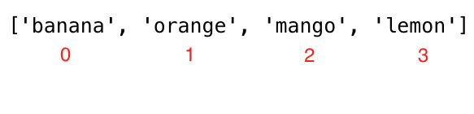

<div align="center">
  <h1> 30 ថ្ងៃនៃ JavaScript: Arrays</h1>
  <a class="header-badge" target="_blank" href="https://www.linkedin.com/in/asabeneh/">
  
  </a>
  <a class="header-badge" target="_blank" href="https://twitter.com/Asabeneh">
  
  </a>

  <sub>អ្នកនិពន្ធ:
  <a href="https://www.linkedin.com/in/asabeneh/" target="_blank">Asabeneh Yetayeh</a><br>
  <small> ខែមករា ឆ្នាំ ២០២០</small>
  </sub>
</div>

[<< ថ្ងៃទី 4](../04_Day_Conditionals/04_day_conditionals.md) | [ថ្ងៃទី 6 >>](../06_Day_Loops/06_day_loops.md)


- [📔 ថ្ងៃទី 5](#-day-5)
	- [Arrays](#arrays)
		- [របៀបបង្កើត array ទទេ](#how-to-create-an-empty-array)
		- [របៀបបង្កើត array ដែលមានតម្លៃ](#how-to-create-an-array-with-values)
		- [ការបង្កើត array ដោយប្រើ split](#creating-an-array-using-split)
		- [ការចូលប្រើធាតុ array ដោយប្រើ index](#accessing-array-items-using-index)
		- [ការកែប្រែធាតុ array](#modifying-array-element)
		- [Methods ដើម្បីកែប្រែ array](#methods-to-manipulate-array)
			- [Array Constructor](#array-constructor)
			- [ការបង្កើតតម្លៃ static ជាមួយ fill](#creating-static-values-with-fill)
			- [ការភ្ជាប់ array ដោយប្រើ concat](#concatenating-array-using-concat)
			- [ការទាញយកប្រវែង array](#getting-array-length)
			- [ទាញយក index ធាតុនៅក្នុង array](#getting-index-an-element-in-arr-array)
			- [ទាញយក index ចុងក្រោយនៃធាតុនៅក្នុង array](#getting-last-index-of-an-element-in-array)
			- [ពិនិត្យ array](#checking-array)
			- [បំប្លែង array ទៅជា string](#converting-array-to-string)
			- [ការភ្ជាប់ធាតុ array](#joining-array-elements)
			- [Slice ធាតុ array](#slice-array-elements)
			- [Splice method នៅក្នុង array](#splice-method-in-array)
			- [បន្ថែមធាតុទៅ array ដោយប្រើ push](#adding-item-to-an-array-using-push)
			- [ដកធាតុបញ្ចប់ដោយប្រើ pop](#removing-the-end-element-using-pop)
			- [ដកធាតុចេញពីដើម array](#removing-an-element-from-the-beginning)
			- [បន្ថែមធាតុពីដើម array](#add-an-element-from-the-beginning)
			- [បញ្ច្រាសលំដាប់នៃ array](#reversing-array-order)
			- [ការតម្រៀបធាតុនៅក្នុង array](#sorting-elements-in-array)
		- [array នៃ array](#array-of-arrays)
	- [💻 លំហាត់](#-exercise)
		- [លំហាត់៖ កម្រិត 1](#exercise-level-1)
		- [លំហាត់៖ កម្រិត 2](#exercise-level-2)
		- [លំហាត់៖ កម្រិត 3](#exercise-level-3)

# 📔 ថ្ងៃទី 5

## Arrays

ផ្ទុយទៅនឹងអថេរ array មួយអាចរក្សាទុក តម្លៃច្រើន។ តម្លៃនីមួយៗក្នុង array មាន _index_ ហើយ index នីមួយៗមាន memory address។ តម្លៃនីមួយៗអាចចូលប្រើបានដោយប្រើ _indexes_ របស់ពួកគេ។ index នៃ array មួយចាប់ផ្តើមពី  សូន្យហើយ index នៃធាតុចុងក្រោយគឺតិចជាងមួយពីប្រវែងនៃ array 

array គឺជាបណ្តុំនៃប្រភេទទិន្នន័យផ្សេងៗគ្នាដែលត្រូវបានដំរៀប និងអាចផ្លាស់ប្តូរបាន (កែប្រែបាន)។ array អនុញ្ញាតឱ្យរក្សាទុកធាតុស្ទួន និងប្រភេទទិន្នន័យផ្សេងៗគ្នា។ array អាចទទេ ឬវាអាចមានតម្លៃប្រភេទទិន្នន័យផ្សេងគ្នា។

### របៀបបង្កើត array ទទេ

នៅក្នុង JavaScript យើងអាចបង្កើត array តាមវិធីផ្សេងៗគ្នា។ យើងនឹងមើលវិធីផ្សេងគ្នាដើម្បីបង្កើត array មួយ។
វាជារឿងធម្មតាណាស់ក្នុងការប្រើ _const_ ជំនួសឱ្យ _let_ ដើម្បីប្រកាសអថេរ array។ ប្រសិនបើអ្នកកំពុងប្រើ const វាមានន័យថាអ្នកមិនប្រើឈ្មោះអថេរនោះម្តងទៀតទេ។

- ដោយ Array constructor

```js
// syntax
const arr = Array()
// or
// let arr = new Array()
console.log(arr) // []
```

- ដោយ square brackets([])

```js
// syntax
// នេះជាវិធីដែលបានណែនាំបំផុតដើម្បីបង្កើត ​array ទទេ
const arr = []
console.log(arr)
```

### របៀបបង្កើត array ដែលមានតម្លៃ

Array ជាមួយតម្លៃដំបូង។ យើងប្រើ _length_ property ដើម្បីស្វែងរកប្រវែងនៃ array មួយ។

```js
const numbers = [0, 3.14, 9.81, 37, 98.6, 100] // array នៃលេខ
const fruits = ['banana', 'orange', 'mango', 'lemon'] //  array នៃ string, ផ្លែឈើ
const vegetables = ['Tomato', 'Potato', 'Cabbage', 'Onion', 'Carrot'] // array នៃ string, បន្លៃ
const animalProducts = ['milk', 'meat', 'butter', 'yoghurt'] // array នៃ string, ផលិតផល
const webTechs = ['HTML', 'CSS', 'JS', 'React', 'Redux', 'Node', 'MongDB'] // array នៃបច្ចេកវិទ្យា web
const countries = ['Finland', 'Denmark', 'Sweden', 'Norway', 'Iceland'] // array នៃ string, ប្រទេស

// បង្ហាញ array និងប្រវែងរបស់វា។

console.log('Numbers:', numbers)
console.log('Number of numbers:', numbers.length)

console.log('Fruits:', fruits)
console.log('Number of fruits:', fruits.length)

console.log('Vegetables:', vegetables)
console.log('Number of vegetables:', vegetables.length)

console.log('Animal products:', animalProducts)
console.log('Number of animal products:', animalProducts.length)

console.log('Web technologies:', webTechs)
console.log('Number of web technologies:', webTechs.length)

console.log('Countries:', countries)
console.log('Number of countries:', countries.length)
```

```sh
Numbers: [0, 3.14, 9.81, 37, 98.6, 100]
Number of numbers: 6
Fruits: ['banana', 'orange', 'mango', 'lemon']
Number of fruits: 4
Vegetables: ['Tomato', 'Potato', 'Cabbage', 'Onion', 'Carrot']
Number of vegetables: 5
Animal products: ['milk', 'meat', 'butter', 'yoghurt']
Number of animal products: 4
Web technologies: ['HTML', 'CSS', 'JS', 'React', 'Redux', 'Node', 'MongDB']
Number of web technologies: 7
Countries: ['Finland', 'Estonia', 'Denmark', 'Sweden', 'Norway']
Number of countries: 5
```

- array អាចមានធាតុនៃប្រភេទទិន្នន័យផ្សេងៗគ្នា

```js
const arr = [
    'Asabeneh',
    250,
    true,
    { country: 'Finland', city: 'Helsinki' },
    { skills: ['HTML', 'CSS', 'JS', 'React', 'Python'] }
] // arr មានប្រភេទទិន្នន័យផ្សេងៗគ្នា
console.log(arr)
```

### ការបង្កើត array ដោយប្រើ split

ដូចដែលយើងបានឃើញនៅក្នុងផ្នែកមុន យើងអាចបំបែក string នៅទីតាំងផ្សេងគ្នា ហើយយើងអាចប្តូរវាទៅជា array មួយ។ ចូរយើងមើលឧទាហរណ៍ខាងក្រោម។

```js
let js = 'JavaScript'
const charsInJavaScript = js.split('')

console.log(charsInJavaScript) // ["J", "a", "v", "a", "S", "c", "r", "i", "p", "t"]

let companiesString = 'Facebook, Google, Microsoft, Apple, IBM, Oracle, Amazon'
const companies = companiesString.split(',')

console.log(companies) // ["Facebook", " Google", " Microsoft", " Apple", " IBM", " Oracle", " Amazon"]
let txt =
  'I love teaching and empowering people. I teach HTML, CSS, JS, React, Python.'
const words = txt.split(' ')

console.log(words)
// អត្ថបទមានតួអក្សរពិសេស ចូរគិតពីរបៀបដែលអ្នកអាចទទួលបានតែពាក្យ
// ["I", "love", "teaching", "and", "empowering", "people.", "I", "teach", "HTML,", "CSS,", "JS,", "React,", "Python"]
```

### ការចូលប្រើធាតុ array ដោយប្រើ index

យើងចូលប្រើធាតុនីមួយៗក្នុង array ដោយប្រើ index របស់វា។ index របស់ array ចាប់ផ្តើមពី 0។ រូបភាពខាងក្រោមបង្ហាញយ៉ាងច្បាស់អំពី index នៃធាតុនីមួយៗនៅក្នុង array ។



```js
const fruits = ['banana', 'orange', 'mango', 'lemon']
let firstFruit = fruits[0] // យើងកំពុងចូលប្រើធាតុទីមួយដោយប្រើ index របស់វា។

console.log(firstFruit) // banana

secondFruit = fruits[1]
console.log(secondFruit) // orange

let lastFruit = fruits[3]
console.log(lastFruit) // lemon
// index ចុងក្រោយអាចត្រូវបានគណនាដូចខាងក្រោម

let lastIndex = fruits.length - 1
lastFruit = fruits[lastIndex]

console.log(lastFruit)  // lemon
```

```js
const numbers = [0, 3.14, 9.81, 37, 98.6, 100]  // សំណុំនៃលេខ

console.log(numbers.length)  // => ដើម្បីដឹងពីទំហំនៃអារេដែលជា 6
console.log(numbers)         // -> [0, 3.14, 9.81, 37, 98.6, 100]
console.log(numbers[0])      //  -> 0
console.log(numbers[5])      //  -> 100

let lastIndex = numbers.length - 1;
console.log(numbers[lastIndex]) // -> 100
```

```js
const webTechs = [
  'HTML',
  'CSS',
  'JavaScript',
  'React',
  'Redux',
  'Node',
  'MongoDB'
] // array នៃបច្ចេកវិទ្យាគេហទំព័រ

console.log(webTechs)        // ធាតុអារេទាំងអស់។
console.log(webTechs.length) // => ដើម្បីដឹងពីទំហំនៃអារេដែលជា 7
console.log(webTechs[0])     //  -> HTML
console.log(webTechs[6])     //  -> MongoDB

let lastIndex = webTechs.length - 1
console.log(webTechs[lastIndex]) // -> MongoDB
```

```js
const countries = [
  'Albania',
  'Bolivia',
  'Canada',
  'Denmark',
  'Ethiopia',
  'Finland',
  'Germany',
  'Hungary',
  'Ireland',
  'Japan',
  'Kenya'
] // array នៃប្រទេស

console.log(countries)      // -> ប្រទេសទាំងអស់នៅក្នុងអារេ
console.log(countries[0])   //  -> Albania
console.log(countries[10])  //  -> Kenya

let lastIndex = countries.length - 1;
console.log(countries[lastIndex]) //  -> Kenya
```

```js
const shoppingCart = [
  'Milk',
  'Mango',
  'Tomato',
  'Potato',
  'Avocado',
  'Meat',
  'Eggs',
  'Sugar'
] // array នៃផលិតផលអាហារ

console.log(shoppingCart) //
console.log(shoppingCart[0]) //  -> Milk
console.log(shoppingCart[7]) //  -> Sugar

let lastIndex = shoppingCart.length - 1;
console.log(shoppingCart[lastIndex]) //  -> Sugar
```

### ការកែប្រែធាតុ array

អារេអាចផ្លាស់ប្តូរបាន (កែប្រែបាន)។ នៅពេលដែលអារេមួយត្រូវបានបង្កើត យើងអាចកែប្រែតម្លៃនៃធាតុអារេ។

```js
const numbers = [1, 2, 3, 4, 5]
numbers[0] = 10      // ការផ្លាស់ប្តូរ 1 នៅ index 0 ទៅ 10
numbers[1] = 20      // ការផ្លាស់ប្តូរ 2 នៅ index 1 ដល់ 20

console.log(numbers) // [10, 20, 3, 4, 5]

const countries = [
  'Albania',
  'Bolivia',
  'Canada',
  'Denmark',
  'Ethiopia',
  'Finland',
  'Germany',
  'Hungary',
  'Ireland',
  'Japan',
  'Kenya'
]

countries[0] = 'Afghanistan'  // ជំនួសអាល់បានីដោយអាហ្វហ្គានីស្ថាន
let lastIndex = countries.length - 1
countries[lastIndex] = 'Korea' // ជំនួសប្រទេសកេនយ៉ាដោយកូរ៉េ

console.log(countries)
```

```sh
["Afghanistan", "Bolivia", "Canada", "Denmark", "Ethiopia", "Finland", "Germany", "Hungary", "Ireland", "Japan", "Korea"]
```

### Methods ដើម្បីកែប្រែ array

មាន method ផ្សេងគ្នាដើម្បីកែប្រែអារេមួយ។ ទាំងនេះគឺជា methods ដែលមានមួយចំនួនដើម្បីដោះស្រាយជាមួយអារេ៖_Array, length, concat, indexOf, slice, splice, join, toString, include, lastIndexOf, isArray, fill, push, pop, shift, unshift_

#### Array Constructor

Array:ដើម្បីបង្កើតអារេ.

```js
const arr = Array() // បង្កើតអារេទទេ
console.log(arr)

const eightEmptyValues = Array(8) // វាបង្កើតតម្លៃទទេប្រាំបី
console.log(eightEmptyValues) // [empty x 8]
```

#### ការបង្កើត static values ជាមួយ fill

fill:បំពេញធាតុអារេទាំងអស់ដោយតម្លៃ static

```js
const arr = Array() // បង្កើតអារេទទេ
console.log(arr)

const eightXvalues = Array(8).fill('X') // វាបង្កើតតម្លៃធាតុប្រាំបីដែលបំពេញដោយ 'X'
console.log(eightXvalues) // ['X', 'X','X','X','X','X','X','X']

const eight0values = Array(8).fill(0) // វាបង្កើតតម្លៃធាតុប្រាំបីដែលបំពេញដោយ '0'
console.log(eight0values) // [0, 0, 0, 0, 0, 0, 0, 0]

const four4values = Array(4).fill(4) // វាបង្កើតតម្លៃធាតុ 4 ដែលបំពេញដោយ '4'
console.log(four4values) // [4, 4, 4, 4]
```

#### ការភ្ជាប់ array ដោយប្រើ concat

concat:ដើម្បីភ្ជាប់អារេពីរ។

```js
const firstList = [1, 2, 3]
const secondList = [4, 5, 6]
const thirdList = firstList.concat(secondList)

console.log(thirdList) // [1, 2, 3, 4, 5, 6]
```

```js
const fruits = ['banana', 'orange', 'mango', 'lemon']                 // អារេនៃផ្លែឈើ
const vegetables = ['Tomato', 'Potato', 'Cabbage', 'Onion', 'Carrot'] // អារេនៃបន្លែ
const fruitsAndVegetables = fruits.concat(vegetables)                 // ភ្ជាប់អារេទាំងពីរ

console.log(fruitsAndVegetables)
```

```sh
["banana", "orange", "mango", "lemon", "Tomato", "Potato", "Cabbage", "Onion", "Carrot"]
```

#### ការទាញយកប្រវែង array

Length:ដើម្បីដឹងពីទំហំនៃអារេ

```js
const numbers = [1, 2, 3, 4, 5]
console.log(numbers.length) // -> 5 គឺជាទំហំនៃអារេ
```

#### ទាញយក index ធាតុនៅក្នុង array

indexOf: ដើម្បីពិនិត្យមើលថាតើធាតុមាននៅក្នុងអារេ។ ប្រសិនបើវាឲ index នោះធាតុនោះមាន តែបើវាឲ index ផ្សេង វាត្រឡប់ -1 ។

```js
const numbers = [1, 2, 3, 4, 5]

console.log(numbers.indexOf(5)) // -> 4
console.log(numbers.indexOf(0)) // -> -1
console.log(numbers.indexOf(1)) // -> 0
console.log(numbers.indexOf(6)) // -> -1
```

ពិនិត្យធាតុមួយប្រសិនបើវាមាននៅក្នុងអារេ។

- ពិនិត្យធាតុនៅក្នុងបញ្ជីមួយ។
  
```js
// អនុញ្ញាតឱ្យយើងពិនិត្យមើលថាតើចេកមាននៅក្នុងអារេ

const fruits = ['banana', 'orange', 'mango', 'lemon']
let index = fruits.indexOf('banana')  // 0

if(index === -1){
   console.log('This fruit does not exist in the array')  
} else {
    console.log('This fruit does exist in the array')
}
// ផ្លែឈើនេះមាននៅក្នុងអារេ

// យើងអាចប្រើ ternary នៅទីនេះផងដែរ។
index === -1 ? console.log('This fruit does not exist in the array'): console.log('This fruit does exist in the array')

// យើងនឹងពិនិត្យមើលថាតើផ្លែបឺរមាននៅក្នុងអារេរឺទេ
let indexOfAvocado = fruits.indexOf('avocado')  // ប្រសិនបើធាតុមិនបានរកឃើញ index គឺ -1
if(indexOfAvocado === -1){
   console.log('This fruit does not exist in the array')  
} else {
    console.log('This fruit does exist in the array')
}
// This fruit does not exist in the array
```

#### ទាញយក index ចុងក្រោយនៃធាតុនៅក្នុង array

LastIndexOf៖ វាផ្តល់ទីតាំងនៃធាតុចុងក្រោយក្នុងអារេ។ ប្រសិនបើវាមានវាឲindex បើមិនមានទេវាឲ -1

```js
const numbers = [1, 2, 3, 4, 5, 3, 1, 2]

console.log(numbers.lastIndexOf(2)) // 7
console.log(numbers.lastIndexOf(0)) // -1
console.log(numbers.lastIndexOf(1)) //  6
console.log(numbers.lastIndexOf(4)) //  3
console.log(numbers.lastIndexOf(6)) // -1
```

includes:ដើម្បីពិនិត្យមើលថាតើមានធាតុនៅក្នុងអារេ។ ប្រសិនបើវាមាន វាឲ true ផ្សេងទៀតវាឲ false។

```js
const numbers = [1, 2, 3, 4, 5]

console.log(numbers.includes(5)) // true
console.log(numbers.includes(0)) // false
console.log(numbers.includes(1)) // true
console.log(numbers.includes(6)) // false

const webTechs = [
  'HTML',
  'CSS',
  'JavaScript',
  'React',
  'Redux',
  'Node',
  'MongoDB'
] // បញ្ជីនៃបច្ចេកវិទ្យាគេហទំព័រ

console.log(webTechs.includes('Node'))  // true
console.log(webTechs.includes('C'))     // false
```

#### ពិនិត្យ array

Array.isArray:ដើម្បីពិនិត្យមើលថាតើប្រភេទទិន្នន័យគឺជាអារេ

```js
const numbers = [1, 2, 3, 4, 5]
console.log(Array.isArray(numbers)) // true

const number = 100
console.log(Array.isArray(number)) // false
```

#### ការបំប្លែង array ទៅជា string

toString:បំប្លែងអារេទៅជាខ្សែអក្សរ

```js
const numbers = [1, 2, 3, 4, 5]
console.log(numbers.toString()) // 1,2,3,4,5

const names = ['Asabeneh', 'Mathias', 'Elias', 'Brook']
console.log(names.toString()) // Asabeneh,Mathias,Elias,Brook
```

#### ការភ្ជាប់ធាតុអារេ

join: វា​ត្រូវ​បាន​ប្រើ​ដើម្បី​ភ្ជាប់​ធាតុ​នៃ​អារេ​ argument ដែលបានដាក់ក្នុង method នេះ​នឹង​ត្រូវ​បាន​ភ្ជាប់​ក្នុង​អារេ​ ហើយ​ឲជា string។ តាមលំនាំដើម វាភ្ជាប់ជាមួយសញ្ញាក្បៀស ប៉ុន្តែយើងអាចដាក់ parameter ផ្សេងគ្នាដែលអាចត្រូវបានភ្ជាប់រវាងធាតុ។

```js
const numbers = [1, 2, 3, 4, 5]
console.log(numbers.join()) // 1,2,3,4,5

const names = ['Asabeneh', 'Mathias', 'Elias', 'Brook']

console.log(names.join()) // Asabeneh,Mathias,Elias,Brook
console.log(names.join('')) //AsabenehMathiasEliasBrook
console.log(names.join(' ')) //Asabeneh Mathias Elias Brook
console.log(names.join(', ')) //Asabeneh, Mathias, Elias, Brook
console.log(names.join(' # ')) //Asabeneh # Mathias # Elias # Brook

const webTechs = [
  'HTML',
  'CSS',
  'JavaScript',
  'React',
  'Redux',
  'Node',
  'MongoDB'
] // បញ្ជីនៃបច្ចេកវិទ្យាគេហទំព័រ

console.log(webTechs.join())       // "HTML,CSS,JavaScript,React,Redux,Node,MongoDB"
console.log(webTechs.join(' # '))  // "HTML # CSS # JavaScript # React # Redux # Node # MongoDB"
```

#### Slice ធាតុ array

Slice: ដើម្បីកាត់ធាតុជាច្រើននៅក្នុងជួរ។ វាត្រូវការប៉ារ៉ាម៉ែត្រពីរ: ទីតាំងចាប់ផ្តើមនិងបញ្ចប់។ វាមិនរាប់បញ្ចូលទីតាំងបញ្ចប់នោះទេ។

```js
  const numbers = [1,2,3,4,5]

  console.log(numbers.slice()) // -> វាចម្លងធាតុទាំងអស់។
  console.log(numbers.slice(0)) // -> វាចម្លងធាតុទាំងអស់។
  console.log(numbers.slice(0, numbers.length)) //វាចម្លងធាតុទាំងអស់។
  console.log(numbers.slice(1,4)) // -> [2,3,4] // វាមិនរាប់បញ្ចូលទីតាំងបញ្ចប់នោះទេ។
```

#### Splice method ក្នុង array

Splice: វាត្រូវការប៉ារ៉ាម៉ែត្របី៖ ទីតាំងចាប់ផ្តើម ចំនួនដងដែលត្រូវដកចេញ និងចំនួនធាតុដែលត្រូវបន្ថែម។

```js
  const numbers = [1, 2, 3, 4, 5]
  numbers.splice()
  console.log(numbers)                // -> លុបធាតុទាំងអស់។

```

```js
  const numbers = [1, 2, 3, 4, 5]
	numbers.splice(0,1)
  console.log(numbers)            // លុបធាតុទីមួយចេញ
```

```js
  const numbers = [1, 2, 3, 4, 5, 6]
	numbers.splice(3, 3, 7, 8, 9)
  console.log(numbers.splice(3, 3, 7, 8, 9))  // -> [1, 2, 3, 7, 8, 9] //វាដកធាតុបីចេញ ហើយជំនួសធាតុបី
```

#### បន្ថែមធាតុទៅអារេដោយប្រើ push

Push: ការបន្ថែមធាតុនៅចុងបញ្ចប់។ ដើម្បីបន្ថែមធាតុទៅចុងបញ្ចប់នៃអារេដែលមានស្រាប់ យើងប្រើ method push។

```js
// syntax
const arr  = ['item1', 'item2','item3']
arr.push('new item')
console.log(arr)
// ['item1', 'item2','item3','new item']
```

```js
const numbers = [1, 2, 3, 4, 5]
numbers.push(6)
console.log(numbers) // -> [1,2,3,4,5,6]

numbers.pop() // -> យកធាតុមួយចេញពីចុង
console.log(numbers) // -> [1,2,3,4,5]
```

```js
let fruits = ['banana', 'orange', 'mango', 'lemon']
fruits.push('apple')
console.log(fruits)    // ['banana', 'orange', 'mango', 'lemon', 'apple']

fruits.push('lime')
console.log(fruits)   // ['banana', 'orange', 'mango', 'lemon', 'apple', 'lime']
```

#### ការដកធាតុចុងដោយប្រើ pop

pop: ការដកធាតុចេញនៅចុង

```js
const numbers = [1, 2, 3, 4, 5]
numbers.pop() // -> យកធាតុមួយចេញពីចុង
console.log(numbers) // -> [1,2,3,4]
```

#### ការដកធាតុចេញពីដើម

shift: ការដកធាតុអារេមួយចេញនៅដើមអារេ។

```js
const numbers = [1, 2, 3, 4, 5]
numbers.shift() // -> យកធាតុមួយចេញពីដើម
console.log(numbers) // -> [2,3,4,5]
```

#### បន្ថែមធាតុពីដើម

unshift: ការបន្ថែមធាតុអារេនៅដើមអារេ។

```js
const numbers = [1, 2, 3, 4, 5]
numbers.unshift(0) // -> បន្ថែមធាតុមួយពីដំបូង
console.log(numbers) // -> [0,1,2,3,4,5]
```

#### បញ្ច្រាសលំដាប់អារេ

reverse: បញ្ច្រាសលំដាប់នៃអារេមួយ។

```js
const numbers = [1, 2, 3, 4, 5]
numbers.reverse() // -> បញ្ច្រាសលំដាប់នៃអារេ
console.log(numbers) // [5, 4, 3, 2, 1]

numbers.reverse()
console.log(numbers) // [1, 2, 3, 4, 5]
```

#### ការតម្រៀបធាតុនៅក្នុងអារេ

sort: រៀបចំធាតុអារេតាមលំដាប់ឡើង។ តម្រៀបយក callback function យើងនឹងឃើញពីរបៀបដែលយើងប្រើការតម្រៀបជាមួយ callback function នៅក្នុងផ្នែកខាងមុខ។

```js
const webTechs = [
  'HTML',
  'CSS',
  'JavaScript',
  'React',
  'Redux',
  'Node',
  'MongoDB'
]

webTechs.sort()
console.log(webTechs) // ["CSS", "HTML", "JavaScript", "MongoDB", "Node", "React", "Redux"]

webTechs.reverse() // បន្ទាប់​ពី​តម្រៀប​ហើយ យើង​អាច​បញ្ច្រាស​វា​បាន។
console.log(webTechs) // ["Redux", "React", "Node", "MongoDB", "JavaScript", "HTML", "CSS"]
```

### Array នៃ arrays

អារេអាចរក្សាទុកប្រភេទទិន្នន័យផ្សេងៗគ្នា រួមទាំងអារេខ្លួនឯងផងដែរ។ ចូរយើងបង្កើតអារេនៃអារេ

```js
const firstNums = [1, 2, 3]
const secondNums = [1, 4, 9]

const arrayOfArray =  [[1, 2, 3], [1, 2, 3]]
console.log(arrayOfArray[0]) // [1, 2, 3]

 const frontEnd = ['HTML', 'CSS', 'JS', 'React', 'Redux']
 const backEnd = ['Node','Express', 'MongoDB']
 const fullStack = [frontEnd, backEnd]
 console.log(fullStack)   // [["HTML", "CSS", "JS", "React", "Redux"], ["Node", "Express", "MongoDB"]]
 console.log(fullStack.length)  // 2
 console.log(fullStack[0])  // ["HTML", "CSS", "JS", "React", "Redux"]
 console.log(fullStack[1]) // ["Node", "Express", "MongoDB"]
```

🌕  អ្នក​ឧស្សាហ៍​ព្យាយាម ហើយ​អ្នក​បាន​សម្រេច​បាន​ច្រើន​ហើយ។ អ្នកទើបតែបានបញ្ចប់ challenge ថ្ងៃទី 5 ហើយអ្នកគឺជាជំហាន 5 ឆ្ពោះទៅរកផ្លូវរបស់អ្នកទៅកាន់ភាពអស្ចារ្យ។ ឥឡូវធ្វើលំហាត់ខ្លះសម្រាប់ខួរក្បាល និងសាច់ដុំរបស់អ្នក។

## 💻 លំហាត់

### លំហាត់៖ កម្រិត ១

```js
const countries = [
  'Albania',
  'Bolivia',
  'Canada',
  'Denmark',
  'Ethiopia',
  'Finland',
  'Germany',
  'Hungary',
  'Ireland',
  'Japan',
  'Kenya'
]

const webTechs = [
  'HTML',
  'CSS',
  'JavaScript',
  'React',
  'Redux',
  'Node',
  'MongoDB'
]
```

1. ប្រកាសអារេទទេ
2. ប្រកាសអារេដែលមានធាតុច្រើនជាង 5
3. ស្វែងរកប្រវែងនៃអារេរបស់អ្នក។
4. ទាញយកធាតុទីមួយ ធាតុកណ្តាល និងធាតុចុងក្រោយនៃអារេ
5. ប្រកាសអារេមួយហៅថា _mixedDataTypes_ ហើយដាក់ប្រភេទទិន្នន័យផ្សេងៗគ្នាក្នុងអារេ និងស្វែងរកប្រវែងនៃអារេ។ ទំហំអារេគួរតែធំជាង 5
6. ប្រកាសឈ្មោះអារេក្រុមហ៊ុន និងឲតម្លៃដំបូង Facebook, Google, Microsoft, Apple, IBM, Oracle និង Amazon
7. បង្ហាញដោយប្រើ _console.log()_
8. បង្ហាញចំនួនក្រុមហ៊ុននៅក្នុងអារេ
9. បង្ហាញក្រុមហ៊ុនទីមួយ ក្រុមហ៊ុនកណ្តាល និងក្រុមហ៊ុនចុងក្រោយ
10. បង្ហាញក្រុមហ៊ុននីមួយៗ
11. ប្តូរឈ្មោះក្រុមហ៊ុននីមួយៗទៅជាអក្សរធំម្តងមួយ ហើយបង្ហាញវាចេញ
12. បង្ហាញអារេដូចជាប្រយោគ៖ Facebook, Google, Microsoft, Apple, IBM, Oracle និង Amazon គឺជាក្រុមហ៊ុន IT ធំ។
13. ពិនិត្យមើលថាតើមានក្រុមហ៊ុនជាក់លាក់នៅក្នុងអារេ itCompanies ដែរឬទេ។ ប្រសិនបើវាមាន ឲក្រុមហ៊ុន បើទេ ឲ _Not found_
14. ត្រងចេញក្រុមហ៊ុនដែលមានច្រើនជាងមួយ 'o' ដោយគ្មានវិធីសាស្ត្រតម្រង
15. តម្រៀបអារេដោយប្រើវិធីសាស្ត្រ _sort()_
16. បញ្ច្រាសអារេដោយប្រើវិធីសាស្ត្រ _reverse()_
17. កាត់ក្រុមហ៊ុន 3 ដំបូងចេញពីអារេ
18. កាត់ក្រុមហ៊ុន 3 ចុងក្រោយចេញពីអារេ
19. កាត់ក្រុមហ៊ុន IT កណ្តាល ឬក្រុមហ៊ុនចេញពីអារេ
20. យកក្រុមហ៊ុន IT ដំបូងចេញពីអារេ
21. ដកក្រុមហ៊ុន IT កណ្តាល ឬក្រុមហ៊ុនចេញពីអារេ
22. លុបក្រុមហ៊ុន IT ចុងក្រោយចេញពីអារេ
23. លុបក្រុមហ៊ុន IT ទាំងអស់។

### លំហាត់៖ កម្រិត ២

1. បង្កើតឯកសារ country.js ដាច់ដោយឡែក ហើយរក្សាទុកអារេប្រទេសទៅក្នុងឯកសារនេះ បង្កើតឯកសារដាច់ដោយឡែក web_techs.js និងរក្សាទុកអារេ webTechs ទៅក្នុងឯកសារនេះ។ ចូលប្រើឯកសារទាំងពីរនៅក្នុងឯកសារ main.js
1. ដំបូង​ត្រូវ​ដក​វណ្ណយុត្តិ​ទាំងអស់​ចេញ ហើយ​ប្តូរ​ខ្សែអក្សរ​ទៅជា​អារេ ហើយ​រាប់​ចំនួន​ពាក្យ​ក្នុង​អារេ

    ```js
    let text =
    'I love teaching and empowering people. I teach HTML, CSS, JS, React, Python.'
    console.log(words)
    console.log(words.length)
    ```

    ```sh
    ["I", "love", "teaching", "and", "empowering", "people", "I", "teach", "HTML", "CSS", "JS", "React", "Python"]
  
    13
    ```

1. នៅ​ក្នុង​រទេះ​លក់​ទំនិញ​ដូច​ខាង​ក្រោម ចូរបន្ថែម លុប និងកែសម្រួល​ធាតុ

    ```js
    const shoppingCart = ['Milk', 'Coffee', 'Tea', 'Honey']
    ```

   - បន្ថែម 'Meat' នៅដើមរទេះទិញទំនិញរបស់អ្នក ប្រសិនបើវាមិនទាន់ត្រូវបានបន្ថែម
   - បន្ថែម Sguar នៅចុងបញ្ចប់នៃរទេះទិញទំនិញរបស់អ្នកប្រសិនបើវាមិនទាន់ត្រូវបានបន្ថែម
   - យក 'Honey' ចេញ ប្រសិនបើអ្នកមានប្រតិកម្មនឹងទឹកឃ្មុំ
   - កែប្រែ Tea ទៅជា 'Green Tea'
1. នៅក្នុងប្រទេសនានា សូមពិនិត្យមើលថាតើ 'Ethiopia' មាននៅក្នុងអារេប្រសិនបើវាមានបោះពុម្ព 'ETHIOPIA' ។ ប្រសិនបើវាមិនមាន បន្ថែមទៅបញ្ជីប្រទេស។
1. នៅក្នុងអារេ webTechs ពិនិត្យមើលថាតើ Sass មាននៅក្នុងអារេ ហើយប្រសិនបើវាមាន បោះពុម្ព 'Sass is a preprocess CSS'។ ប្រសិនបើវាមិនមានទេ បន្ថែម Sass ទៅអារេ ហើយបោះពុម្ពអារេ។
1. ភ្ជាប់អថេរទាំងពីរខាងក្រោម ហើយរក្សាទុកវាក្នុងអថេរ fullStack ។

    ```js
    const frontEnd = ['HTML', 'CSS', 'JS', 'React', 'Redux']
    const backEnd = ['Node','Express', 'MongoDB']
  
    console.log(fullStack)
    ```

    ```sh
    ["HTML", "CSS", "JS", "React", "Redux", "Node", "Express", "MongoDB"]
    ```

### លំហាត់៖ កម្រិត ៣

1. ខាង​ក្រោម​នេះ​គឺ​ជា​អារេ​នៃ​អាយុនៃសិស្ស​ទាំង​១០​

    ```js
    const ages = [19, 22, 19, 24, 20, 25, 26, 24, 25, 24]
    ```

    - តម្រៀបអារេ និងស្វែងរកអាយុអប្បបរមា និងអតិបរមា
    - ស្វែងរកអាយុមធ្យម (ធាតុកណ្តាលមួយ ឬធាតុកណ្តាលពីរចែកនឹងពីរ)
    - ស្វែងរកអាយុជាមធ្យម (ធាតុទាំងអស់បែងចែកដោយចំនួនធាតុ)
    - ស្វែងរក range អាយុ (អតិបរមាដកអប្បបរមា)
    - ប្រៀបធៀបតម្លៃនៃ (អប្បបរមា - មធ្យម) និង (អតិបរមា - មធ្យម) ប្រើវិធីសាស្ត្រ _abs()_
1. Slice ប្រទេសដប់ដំបូងពី [countries array](https://github.com/Asabeneh/30DaysOfJavaScript/tree/master/data/countries.js)
1. ស្វែងរកប្រទេសកណ្តាលនៅក្នុង[countries array](https://github.com/Asabeneh/30DaysOfJavaScript/tree/master/data/countries.js)
2. ចែកអារេប្រទេសជាពីរអារេស្មើគ្នាប្រសិនបើវាគូ។ ប្រសិនបើអារេប្រទេសមិនគូ បន្ថែមទៀតសម្រាប់ពាក់កណ្តាលទីមួយ។
  
🎉 អបអរសាទរ ! 🎉

[<< ថ្ងៃទី 4](../04_Day_Conditionals/04_day_Conditionals.md) | [ថ្ងៃទី 6 >>](../06_Day_Loops/06_day_loops.md)
