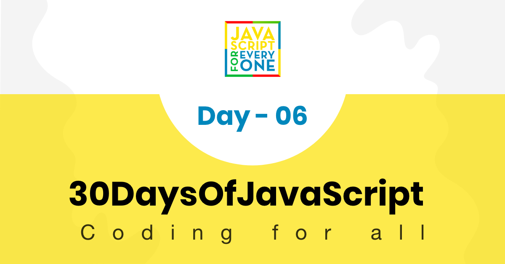

<div align="center">
  <h1> 30 ថ្ងៃនៃ JavaScript: Loops</h1>
  <a class="header-badge" target="_blank" href="https://www.linkedin.com/in/asabeneh/">
  
  </a>
  <a class="header-badge" target="_blank" href="https://twitter.com/Asabeneh">
  
  </a>

  <sub>អ្នកនិពន្ធ:
  <a href="https://www.linkedin.com/in/asabeneh/" target="_blank">Asabeneh Yetayeh</a><br>
  <small> ខែមករា ឆ្នាំ ២០២០</small>
  </sub>
</div>

[<< ថ្ងៃទី 5](../05_Day_Arrays/05_day_arrays.md) | [ថ្ងៃទី 7 >>](../07_Day_Functions/07_day_functions.md)



- [📔 ថ្ងៃទី 6](#-day-6)
	- [Loops](#loops)
		- [for Loop](#for-loop)
		- [while loop](#while-loop)
		- [do while loop](#do-while-loop)
		- [for of loop](#for-of-loop)
		- [break](#break)
		- [continue](#continue)
	- [💻 លំហាត់៖ ថ្ងៃទី ៦](#-exercisesday-6)
		- [លំហាត់៖ កម្រិត ១](#exercises-level-1)
		- [លំហាត់៖ កម្រិត ២](#exercises-level-2)
		- [លំហាត់៖ កម្រិត ៣](#exercises-level-3)

# 📔 ថ្ងៃទី 6

## Loops

សកម្មភាពភាគច្រើនដែលយើងធ្វើក្នុងជីវិតគឺពោរពេញដោយពាក្យដដែលៗ។ ស្រមៃមើលប្រសិនបើខ្ញុំសុំឱ្យអ្នកបោះពុម្ពពី 0 ទៅ 100 ដោយប្រើ console.log() ។ ដើម្បីអនុវត្តកិច្ចការដ៏សាមញ្ញនេះ វាអាចចំណាយពេលអ្នកពី 2 ទៅ 5 នាទី កិច្ចការដែលធុញទ្រាន់ និងដដែលៗអាចត្រូវបានអនុវត្តដោយប្រើ loop។ ប្រសិនបើអ្នកចូលចិត្តមើលវីដេអូ អ្នកអាចពិនិត្យមើល [video tutorials](https://www.youtube.com/channel/UCM4xOopkYiPwJqyKsSqL9mw)

នៅក្នុងភាសាសរសេរកម្មវិធី ដើម្បីអនុវត្តការងារដដែលៗ យើងប្រើប្រភេទ loop ផ្សេងៗគ្នា។ ឧទាហរណ៍ខាងក្រោមគឺជា loop ដែលប្រើជាទូទៅក្នុង JavaScript និងភាសាសរសេរកម្មវិធីផ្សេងទៀត។

### for Loop

```js
// ចនាសម្ព័ន្ធរបស់ For loop 
for(initialization, condition, increment/decrement){
  // code goes here
}
```

```js
for(let i = 0; i <= 5; i++){
  console.log(i)
}

// 0 1 2 3 4 5
```

```js
for(let i = 5; i >= 0; i--){
  console.log(i)
}

// 5 4 3 2 1 0
```

```js
for(let i = 0; i <= 5; i++){
  console.log(`${i} * ${i} = ${i * i}`)
}
```

```sh
0 * 0 = 0
1 * 1 = 1
2 * 2 = 4
3 * 3 = 9
4 * 4 = 16
5 * 5 = 25
```

```js
const countries = ['Finland', 'Sweden', 'Denmark', 'Norway', 'Iceland']
const newArr = []
for(let i = 0; i < countries.length; i++){
  newArr.push(countries[i].toUpperCase())
}

// ["FINLAND", "SWEDEN", "DENMARK", "NORWAY", "ICELAND"]
```

ការបន្ថែមធាតុទាំងអស់នៅក្នុងអារេ

```js
const numbers = [1, 2, 3, 4, 5]
let sum = 0
for(let i = 0; i < numbers.length; i++){
  sum  = sum + numbers[i]  // អាចកាត់ឲខ្លីបាន, sum += numbers[i]

}

console.log(sum)  // 15
```

ការបង្កើតអារេថ្មីដោយផ្អែកលើអារេដែលមានស្រាប់

```js
const numbers = [1, 2, 3, 4, 5]
const newArr = []
let sum = 0
for(let i = 0; i < numbers.length; i++){
  newArr.push( numbers[i] ** 2)

}

console.log(newArr)  // [1, 4, 9, 16, 25]
```

```js
const countries = ['Finland', 'Sweden', 'Norway', 'Denmark', 'Iceland']
const newArr = []
for(let i = 0; i < countries.length; i++){
  newArr.push(countries[i].toUpperCase())
}

console.log(newArr)  // ["FINLAND", "SWEDEN", "NORWAY", "DENMARK", "ICELAND"]
```

### while loop

```js
let i = 0
while (i <= 5) {
  console.log(i)
  i++
}

// 0 1 2 3 4 5
```

### do while loop

```js
let i = 0
do {
  console.log(i)
  i++
} while (i <= 5)

// 0 1 2 3 4 5
```

### for of loop

យើងប្រើ for of loop សម្រាប់អារេ។ វា​ជា​វិធី​ដ៏​ងាយស្រួល​ក្នុង​ការ​ iterate ​តាមរយៈ​អារេ​មួយ ប្រសិនបើ​យើង​មិន​ចាប់អារម្មណ៍​លើ​ index ​នៃ​ធាតុ​នីមួយៗ​ក្នុង​អារេ។

```js
for (const element of arr) {
  // ដាក់កូដទីនេះ
}
```

```js

const numbers = [1, 2, 3, 4, 5]

for (const num of numbers) {
  console.log(num)
}

// 1 2 3 4 5

for (const num of numbers) {
  console.log(num * num)
}

// 1 4 9 16 25

// ការបន្ថែមលេខទាំងអស់នៅក្នុងអារេ
let sum = 0
for (const num of numbers) {
  sum = sum + num  
	// អាច​ត្រូវ​បាន​កាត់ឲខ្លី​ដូច​នេះ​, sum += num
  // បន្ទាប់ពីនេះយើងនឹងប្រើ syntax ខ្លីជាងមុន (+=, -=, *=, /= etc)
}
console.log(sum) // 15

const webTechs = [
  'HTML',
  'CSS',
  'JavaScript',
  'React',
  'Redux',
  'Node',
  'MongoDB'
]

for (const tech of webTechs) {
  console.log(tech.toUpperCase())
}

// HTML CSS JAVASCRIPT REACT NODE MONGODB

for (const tech of webTechs) {
  console.log(tech[0]) // យកតែអក្សរទីមួយនៃធាតុនីមួយៗ,  H C J R N M
}

```

```js
const countries = ['Finland', 'Sweden', 'Norway', 'Denmark', 'Iceland']
const newArr = []
for(const country of countries){
  newArr.push(country.toUpperCase())
}

console.log(newArr)  // ["FINLAND", "SWEDEN", "NORWAY", "DENMARK", "ICELAND"]
```

### break

Break ត្រូវបានប្រើដើម្បីបញ្ចប់ loop.

```js
for(let i = 0; i <= 5; i++){
  if(i == 3){
    break
  }
  console.log(i)
}

// 0 1 2
```

កូដខាងលើនឹងឈប់ ប្រសិនបើ 3 បានរកឃើញនៅក្នុងដំណើរការ iteration។

### continue

យើងប្រើពាក្យគន្លឹះ *continue* ដើម្បីរំលង iteration ណាមួយ។

```js
for(let i = 0; i <= 5; i++){
  if(i == 3){
    continue
  }
  console.log(i)
}

// 0 1 2 4 5
```

🌕 អ្នក​ក្លាហាន​ណាស់​អ្នក​បាន​ធ្វើ​វា​ដល់​ពេល​នេះ​។ ឥឡូវនេះ អ្នកទទួលបានថាមពលដើម្បីធ្វើកិច្ចការដដែលៗ និងគួរឱ្យធុញទ្រាន់ដោយស្វ័យប្រវត្តិ។ អ្នកទើបតែបានបញ្ចប់ការប្រកួតថ្ងៃទី 6 ហើយអ្នកគឺជាជំហាន 6 ឆ្ពោះទៅរកផ្លូវរបស់អ្នកទៅកាន់ភាពអស្ចារ្យ។ ឥឡូវធ្វើលំហាត់ខ្លះសម្រាប់ខួរក្បាល និងសាច់ដុំរបស់អ្នក។

## 💻 លំហាត់៖ ថ្ងៃទី ៦

### លំហាត់៖ កម្រិត ១

  ```js
  const countries = [
    'Albania',
    'Bolivia',
    'Canada',
    'Denmark',
    'Ethiopia',
    'Finland',
    'Germany',
    'Hungary',
    'Ireland',
    'Japan',
    'Kenya'
  ]

  const webTechs = [
    'HTML',
    'CSS',
    'JavaScript',
    'React',
    'Redux',
    'Node',
    'MongoDB'
  ]

  const mernStack = ['MongoDB', 'Express', 'React', 'Node']
  ```

1. iterate ពី 0 ទៅ 10 ដោយប្រើ loop ហើយធ្វើដូចគ្នាដោយប្រើ while និងធ្វើ while loop
2. iterate ពី 10 ទៅ 0 ដោយប្រើ loop ហើយធ្វើដូចគ្នាដោយប្រើ while និងធ្វើ while loop
3. iterate ពី 0 ទៅ n ដោយប្រើ loop
4. សរសេរ loop ដែលបង្កើតលំនាំខាងក្រោមដោយប្រើ console.log():

   ```js
       #
       ##
       ###
       ####
       #####
       ######
       #######
   ```

5. ប្រើ loop ដើម្បីបង្ហាញលំនាំខាងក្រោម:

   ```sh
   0 x 0 = 0
   1 x 1 = 1
   2 x 2 = 4
   3 x 3 = 9
   4 x 4 = 16
   5 x 5 = 25
   6 x 6 = 36
   7 x 7 = 49
   8 x 8 = 64
   9 x 9 = 81
   10 x 10 = 100
   ```

6. ប្រើ loop ដើម្បីបង្ហាញលំនាំខាងក្រោម:

   ```sh
    i    i^2   i^3
    0    0     0
    1    1     1
    2    4     8
    3    9     27
    4    16    64
    5    25    125
    6    36    216
    7    49    343
    8    64    512
    9    81    729
    10   100   1000
   ```

7. ប្រើ for loop ដើម្បី iterate ពី 0 ទៅ 100 ហើយបង្ហាញតែលេខគូប៉ុណ្ណោះ។
8. ប្រើ for loop ដើម្បី iterate ពី 0 ទៅ 100 ហើយបង្ហាញតែលេខសេសប៉ុណ្ណោះ។
9. ប្រើ for loop ដើម្បី iterate ពី 0 ទៅ 100 ហើយបង្ហាញតែលេខបឋមតែប៉ុណ្ណោះ។
10. ប្រើ for loop ដើម្បី iterate ពី 0 ទៅ 100 ហើយបង្ហាញផលបូកនៃលេខទាំងអស់។

    ```sh
    The sum of all numbers from 0 to 100 is 5050.
    ```

11. ប្រើ for loop ដើម្បី iterate ពី 0 ដល់ 100 ហើយបោះពុម្ពផលបូកនៃលេខគូទាំងអស់ និងផលបូកនៃលេខសេសទាំងអស់។

    ```sh
    The sum of all evens from 0 to 100 is 2550. And the sum of all odds from 0 to 100 is 2500.
    ```

12. ប្រើ for loop ដើម្បី iterate ពី 0 ដល់ 100 ហើយបង្ហាញផលបូកនៃលេខគូទាំងអស់ និងផលបូកនៃលេខសេសទាំងអស់។ បង្ហាញផលបូកនៃគូ និងផលបូកនៃសេសជាអារេ

    ```sh
      [2550, 2500]
    ```

13. បង្កើតស្គ្រីបតូចមួយដែលបង្កើតអារេនៃ 5 លេខចៃដន្យ
14. បង្កើតស្គ្រីបតូចមួយដែលបង្កើតអារេនៃលេខចៃដន្យ 5 ហើយលេខត្រូវតែមានតែមួយគត់
15. បង្កើតស្គ្រីបតូចមួយដែលបង្កើតលេខសម្គាល់ចៃដន្យចំនួនប្រាំមួយ:

    ```sh
    5j2khz
    ```

### លំហាត់៖ កម្រិត ២

1. បង្កើតស្គ្រីបតូចមួយដែលបង្កើតលេខតួអក្សរចៃដន្យណាមួយ៖

    ```sh
      fe3jo1gl124g
    ```

    ```sh
      xkqci4utda1lmbelpkm03rba
    ```

1. សរសេរស្គ្រីបដែលបង្កើតលេខគោលដប់ប្រាំមួយចៃដន្យ។

    ```sh
    '#ee33df'
    ```

1. សរសេរស្គ្រីបដែលបង្កើតលេខពណ៌ rgb ចៃដន្យ។

    ```sh
    rgb(240,180,80)
    ```

1. ដោយប្រើអារេប្រទេសខាងលើ បង្កើតអារេថ្មីខាងក្រោម។

    ```sh
    ["ALBANIA", "BOLIVIA", "CANADA", "DENMARK", "ETHIOPIA", "FINLAND", "GERMANY", "HUNGARY", "IRELAND", "JAPAN", "KENYA"]
    ```

1. ដោយប្រើអារេប្រទេសខាងលើ បង្កើតអារេសម្រាប់ប្រវែងប្រទេស'។

    ```sh
    [7, 7, 6, 7, 8, 7, 7, 7, 7, 5, 5]
    ```

1. ប្រើ array ប្រទេសដើម្បីបង្កើតអារេខាងក្រោម៖

    ```sh
      [
      ['Albania', 'ALB', 7],
      ['Bolivia', 'BOL', 7],
      ['Canada', 'CAN', 6],
      ['Denmark', 'DEN', 7],
      ['Ethiopia', 'ETH', 8],
      ['Finland', 'FIN', 7],
      ['Germany', 'GER', 7],
      ['Hungary', 'HUN', 7],
      ['Ireland', 'IRE', 7],
      ['Iceland', 'ICE', 7],
      ['Japan', 'JAP', 5],
      ['Kenya', 'KEN', 5]
    ]
    ```

2. នៅក្នុងបណ្តាប្រទេសខាងលើ សូមពិនិត្យមើលថាតើមានប្រទេស ឬប្រទេសដែលមានពាក្យ 'land' ។ ប្រសិនបើមានប្រទេសដែលមាន 'land' សូមបោះពុម្ពវាជាអារេ។ ប្រសិនបើគ្មានប្រទេសណាដែលមានពាក្យ 'land' ទេ បោះពុម្ព 'All these countries are without land'

    ```sh
    ['Finland','Ireland', 'Iceland']
    ```

3. នៅក្នុងអារេប្រទេសខាងលើ សូមពិនិត្យមើលថាតើមានប្រទេស ឬប្រទេសដែលបញ្ចប់ដោយអក្សររង 'ia' ។ ប្រសិនបើមានប្រទេសបញ្ចប់ដោយ បោះពុម្ពវាជាអារេ។ ប្រសិនបើគ្មានប្រទេសដែលមានពាក្យ 'ai' ទេ បោះពុម្ព 'These are countries ends without ia' ។

    ```sh
    ['Albania', 'Bolivia','Ethiopia']
    ```

4. ដោយប្រើអារេប្រទេសខាងលើ ស្វែងរកប្រទេសដែលមានចំនួនតួអក្សរច្រើនបំផុត។

      ```sh
      Ethiopia
      ```

5. ដោយប្រើអារេប្រទេសខាងលើ ស្វែងរកប្រទេសដែលមានត្រឹមតែ 5 តួអក្សរ។

    ```sh
    ['Japan', 'Kenya']
    ```

6. ស្វែងរកពាក្យវែងបំផុតនៅក្នុងអារេ webTechs
7. ប្រើអារេ webTechs ដើម្បីបង្កើតអារេនៃអារេខាងក្រោម៖

    ```sh
    [["HTML", 4], ["CSS", 3],["JavaScript", 10],["React", 5],["Redux", 5],["Node", 4],["MongoDB", 7]]
    ```

8. កម្មវិធីដែលបានបង្កើតដោយប្រើ MongoDB, Express, React និង Node ត្រូវបានគេហៅថាកម្មវិធីជង់ MERN ។ បង្កើតអក្សរកាត់ MERN ដោយប្រើអារេ mernStack
9. iterate តាមរយៈអារេ ["HTML", "CSS", "JS", "React", "Redux", "Node", "Express", "MongoDB"] ដោយប្រើ for loop ឬ for of loop ហើយបោះពុម្ពចេញ ធាតុ។
10. នេះគឺជាអារេផ្លែឈើ , ['banana', 'orange', 'mango', 'lemon'] បញ្ច្រាសលំដាប់ដោយប្រើ loop និងមិនប្រើ reverse method។
11. បង្ហាញធាតុទាំងអស់នៃអារេដូចបង្ហាញខាងក្រោម។

    ```js
      const fullStack = [
        ['HTML', 'CSS', 'JS', 'React'],
        ['Node', 'Express', 'MongoDB']
      ]
    ````

    ```sh
      HTML
      CSS
      JS
      REACT
      NODE
      EXPRESS
      MONGODB
    ```

### លំហាត់៖ កម្រិត ៣

1. ចម្លងអារេប្រទេស (ជៀសវាងការផ្លាស់ប្តូរ)
1. អារេអាចផ្លាស់ប្តូរបាន។ បង្កើតច្បាប់ចម្លងនៃអារេដែលមិនកែប្រែរបស់ដើម។ តម្រៀបអារេដែលបានចម្លង ហើយរក្សាទុកក្នុង sortedCountries
1. តម្រៀបអារេ webTechs និង អារេ mernStack 
1. ស្រង់ប្រទេសទាំងអស់មានពាក្យ 'land' ពី [countries array](https://github.com/Asabeneh/30DaysOfJavaScript/tree/master/data/countries.js) ហើយបោះពុម្ពវាជាអារេ
1. ស្វែងរកប្រទេសដែលមានចំនួនតួអក្សរខ្ពស់បំផុតនៅក្នុង [countries array](https://github.com/Asabeneh/30DaysOfJavaScript/tree/master/data/countries.js)
1. ស្រង់ប្រទេសទាំងអស់មានពាក្យ 'land' ពី [countries array](https://github.com/Asabeneh/30DaysOfJavaScript/tree/master/data/countries.js) ហើយបោះពុម្ពវាជាអារេ
1. ស្រង់ប្រទេសទាំងអស់ដែលមានតែបួនតួអក្សរពី [countries array](https://github.com/Asabeneh/30DaysOfJavaScript/tree/master/data/countries.js) ហើយបោះពុម្ពវាជាអារេ
1. ស្រង់ប្រទេសទាំងអស់ដែលមានពាក្យពីរ ឬច្រើនចេញពី [countries array](https://github.com/Asabeneh/30DaysOfJavaScript/tree/master/data/countries.js) ហើយបោះពុម្ពវាជាអារេ
1. បញ្ច្រាស [countries array](https://github.com/Asabeneh/30DaysOfJavaScript/tree/master/data/countries.js) ហើយសរសេរជាអក្សរធំរបស់ប្រទេសនីមួយៗ ហើយរក្សាទុកវាជាអារេ

🎉 អបអរសាទរ ! 🎉

[<< ថ្ងៃទី 5](../05_Day_Arrays/05_day_arrays.md) | [ថ្ងៃទី 7 >>](../07_Day_Functions/07_day_functions.md)
