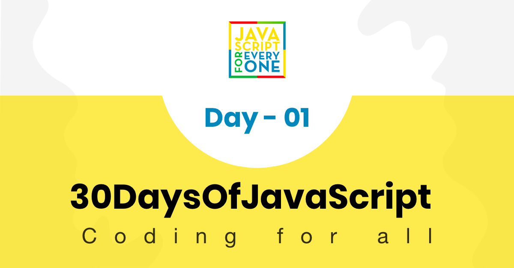

# 30 ថ្ងៃនៃ Javascript

| # ថ្ងៃ |                                                                       ប្រធានបទ                                                                       |
| ------ | :--------------------------------------------------------------------------------------------------------------------------------------------------: |
| 01     |                                                             [សេចក្តីផ្តើម](./readMe.md)                                                              |
| 02     |                                              [ប្រភេទទិន្នន័យ](./02_Day_Data_types/02_day_data_types.md)                                              |
| 03     |                         [Booleans, ប្រមាណវិធី, កាលបរិច្ឆេទ](./03_Day_Booleans_operators_date/03_booleans_operators_date.md)                          |
| 04     |                                               [លក្ខខណ្ឌ](./04_Day_Conditionals/04_day_conditionals.md)                                               |
| 05     |                                                      [Arrays](./05_Day_Arrays/05_day_arrays.md)                                                      |
| 06     |                                                       [Loops](./06_Day_Loops/06_day_loops.md)                                                        |
| 07     |                                                  [អនុគមន៍](./07_Day_Functions/07_day_functions.md)                                                   |
| 08     |                                                    [Objects](./08_Day_Objects/08_day_objects.md)                                                     |
| 09     |                              [Higher Order Functions](./09_Day_Higher_order_functions/09_day_higher_order_functions.md)                              |
| 10     |                                           [Sets and Maps](./10_Day_Sets_and_Maps/10_day_Sets_and_Maps.md)                                            |
| 11     |                      [Destructuring and Spreading](./11_Day_Destructuring_and_spreading/11_day_destructuring_and_spreading.md)                       |
| 12     |                                  [Regular Expressions](./12_Day_Regular_expressions/12_day_regular_expressions.md)                                   |
| 13     |                              [Console Object Methods](./13_Day_Console_object_methods/13_day_console_object_methods.md)                              |
| 14     |                                        [ការគ្រប់គ្រង Error](./14_Day_Error_handling/14_day_error_handling.md)                                        |
| 15     |                                                    [Classes](./15_Day_Classes/15_day_classes.md)                                                     |
| 16     |                                                         [JSON](./16_Day_JSON/16_day_json.md)                                                         |
| 17     |                                             [Web Storages](./17_Day_Web_storages/17_day_web_storages.md)                                             |
| 18     |                                                   [Promises](./18_Day_Promises/18_day_promises.md)                                                   |
| 19     |                                                   [Closure](./19_Day_Closures/19_day_closures.md)                                                    |
| 20     |                                  [ការសរសេរ Clean Code](./20_Day_Writing_clean_codes/20_day_writing_clean_codes.md)                                   |
| 21     |                                                          [DOM](./21_Day_DOM/21_day_dom.md)                                                           |
| 22     |                              [ការរៀបចំ DOM Object](./22_Day_Manipulating_DOM_object/22_day_manipulating_DOM_object.md)                               |
| 23     |                                        [Event Listeners](./23_Day_Event_listeners/23_day_event_listeners.md)                                         |
| 24     |                             [គម្រោងខ្នាតតូច: Solar System](./24_Day_Project_solar_system/24_day_project_solar_system.md)                             |
| 25     | [គម្រោងខ្នាតតូច: World Countries Data Visualization 1](./25_Day_World_countries_data_visualization_1/25_day_world_countries_data_visualization_1.md) |
| 26     | [គម្រោងខ្នាតតូច: World Countries Data Visualization 2](./26_Day_World_countries_data_visualization_2/26_day_world_countries_data_visualization_2.md) |
| 27     |                            [គម្រោងខ្នាតតូច: Portfolio](./27_Day_Mini_project_portfolio/27_day_mini_project_portfolio.md)                             |
| 28     |                         [គម្រោងខ្នាតតូច: Leaderboard](./28_Day_Mini_project_leaderboard/28_day_mini_project_leaderboard.md)                          |
| 29     |            [គម្រោងខ្នាតតូច: Animating characters](./29_Day_Mini_project_animating_characters/29_day_mini_project_animating_characters.md)            |
| 30     |                                       [គម្រោងបញ្ចប់](./30_Day_Mini_project_final/30_day_mini_project_final.md)                                       |

🧡🧡🧡 រីករាយក្នុងការសរសេរកូដ 🧡🧡🧡

<div>
<small>គាំទ្រ<strong>អ្នកនិពន្ធ</strong>ដើម្បីទទួលបានឯកសារសិក្សាបន្ថែមទៀត</small> <br />  
<a href = "https://www.paypal.me/asabeneh"></a>
</div>

<div align="center">
  <h1>30 ថ្ងៃនៃ JavaScript៖ ការណែនាំ</h1>
  <a class="header-badge" target="_blank" href="https://www.linkedin.com/in/asabeneh/">
  
  </a>
  <a class="header-badge" target="_blank" href="https://twitter.com/Asabeneh">
  
  </a>

<sub>អ្នកនិពន្ធ:
<a href="https://www.linkedin.com/in/asabeneh/" target="_blank">Asabeneh Yetayeh</a><br>
<small> មករា, ២០២០</small>
</sub>

<div>

🇬🇧 [English](./readMe.md)
🇪🇸 [Spanish](./Spanish/readme.md)
🇮🇹 [Italian](./Italian/readMe.md)
🇷🇺 [Russian](./RU/README.md)
🇹🇷 [Turkish](./Turkish/readMe.md)
🇦🇿 [Azerbaijan](./Azerbaijani/readMe.md)
🇰🇷 [Korean](./Korea/README.md)
🇻🇳 [Vietnamese](./Vietnamese/README.md)
🇵🇱 [Polish](./Polish/readMe.md)
🇧🇷 [Portuguese](./Portuguese/readMe.md)
🇰🇭 [Khmer](./Khmer/readMe.md)

</div>

</div>
</div>

[ថ្ងៃទី ២ >>](./02_Day_Data_types/02_day_data_types.md)



- [៣០ ថ្ងៃនៃ JavaScript](#30-days-of-javascript)
- [📔 ថ្ងៃទី ១](#-day-1)
  - [សេចក្តីផ្តើម](#introduction)
  - [តម្រូវការ](#requirements)
  - [ការរៀបចំ](#setup)
    - [ដំឡើង Node.js](#install-nodejs)
    - [Browser](#browser)
      - [ដំឡើង Google Chrome](#installing-google-chrome)
      - [ការបើក Google Chrome Console](#opening-google-chrome-console)
      - [ការសរសេរកូដនៅលើ Browser Console](#writing-code-on-browser-console)
        - [Console.log](#consolelog)
        - [Console.log ជាមួយ Arguments ច្រើន](#consolelog-with-multiple-arguments)
        - [Comments](#comments)
        - [Syntax](#syntax)
      - [Arithmetics](#arithmetics)
    - [កម្មវិធីនិពន្ធកូដ](#code-editor)
      - [ការដំឡើង Visual Studio Code](#installing-visual-studio-code)
      - [របៀបប្រើ Visual Studio Code](#how-to-use-visual-studio-code)
  - [ការបន្ថែម JavaScript ទៅគេហទំព័រ](#adding-javascript-to-a-web-page)
    - [Inline Script](#inline-script)
    - [Internal Script](#internal-script)
    - [External Script](#external-script)
    - [External Scripts ច្រើន](#multiple-external-scripts)
  - [ការណែនាំអំពីប្រភេទទិន្នន័យ](#introduction-to-data-types)
    - [Numbers](#numbers)
    - [Strings](#strings)
    - [Booleans](#booleans)
    - [Undefined](#undefined)
    - [Null](#null)
  - [ការពិនិត្យប្រភេទទិន្នន័យ](#checking-data-types)
  - [Comments ម្តងទៀត](#comments-again)
  - [Variables](#variables)
- [💻 លំហាត់សម្រាប់ថ្ងៃទី ១](#-day-1-exercises) 

# 📔 ថ្ងៃទី ១

## សេចក្តីផ្តើម

សូមអបអរសាទរលើការសម្រេចចិត្តចូលរួមក្នុង challenge សរសេរកម្មវិធី JavaScript រយៈពេល 30 ថ្ងៃ។ នៅក្នុង challenge នេះអ្នកនឹងរៀនអ្វីគ្រប់យ៉ាងដែលអ្នកត្រូវការដើម្បីក្លាយជាអ្នកសរសេរកម្មវិធី JavaScript។ ហើយនៅចុងបញ្ចប់នៃ challenge អ្នកនឹងទទួលបានវិញ្ញាបនបត្របញ្ចប់ challenge 30DaysOfJavaScript ។ ក្នុងករណីដែលអ្នកត្រូវការជំនួយ ឬប្រសិនបើអ្នកចង់ជួយអ្នកដទៃ អ្នកអាចចូលរួមជាមួយ [telegram group](https://t.me/ThirtyDaysOfJavaScript).

**30DaysOfJavaScript** challenge គឺជាការណែនាំសម្រាប់អ្នកចាប់ផ្តើមដំបូង និង កម្រិតខ្ពស់។ សូមស្វាគមន៍មកកាន់ JavaScript ។ JavaScript គឺជាភាសានៃ web។ ខ្ញុំរីករាយក្នុងការប្រើ និងបង្រៀន JavaScript ហើយខ្ញុំសង្ឃឹមថាអ្នកនឹងរីករាយផងដែរ។

ក្នុង​ chllenge JavaScript មួយ​នេះ អ្នក​នឹង​រៀន JavaScript ដែល​ជា​ភាសា​សរសេរ​កម្មវិធី​ពេញ​និយម​បំផុត​ក្នុង​ប្រវត្តិសាស្ត្រ​មនុស្សជាតិ។
JavaScript ត្រូវ​បាន​ប្រើ ដើម្បី​បន្ថែម​ភាពរស់រវើក​ទៅ​គេហទំព័រ​ ដើម្បី​បង្កើត​កម្មវិធី​ទូរសព្ទ​ កម្មវិធី​កុំព្យូទ័រ​ និង ហ្គេម​ ហើយ​បច្ចុប្បន្ន​ JavaScript ត្រូវ​បាន​ប្រើ​សម្រាប់​ server-side programming, ​ machine learning និង AI

**_JavaScript (JS)_** បានកើនឡើងប្រជាប្រិយភាពក្នុងរយៈពេលប៉ុន្មានឆ្នាំចុងក្រោយនេះ ហើយបានឈានមុខគេសម្រាប់ដប់ឆ្នាំចុងក្រោយនេះ និងជាភាសាដែលប្រើច្រើនបំផុតនៅលើ
GitHub ។

challenge នេះគឺមានភាពងាយស្រួលក្នុងការអានប៉ុន្តែវាក៏ទាមទារពេលច្រើនដែរ។ អ្នកត្រូវបែងចែកពេលវេលាច្រើនដើម្បីបញ្ចប់ challenge នេះ។ ប្រសិនបើអ្នកជាអ្នកសិក្សាដែលចូលចិត្តមើលរូបភាព អ្នកអាចទទួលបានមេរៀនវីដេអូនៅលើ <a href="https://www.youtube.com/channel/UC7PNRuno1rzYPb1xLa4yktw"> Washera</a> YouTube channel។ ជាវប៉ុស្តិ៍ បញ្ចេញមតិ និងសួរសំណួរនៅលើវីដេអូ YouTube ហើយសកម្មរបស់អ្នកនឹងឲអ្នកនិពន្ធចាប់អារម្មណ៏។

អ្នកនិពន្ធចង់បានយោបល់របស់អ្នកអំពី challenge នេះហើយអ្នកអាចបញ្ចេញយោបល់តាម [link](https://testimonial-vdzd.onrender.com//)

## តម្រូវការ

challenge នេះមិនត្រូវការឲអ្នកមានចំណេះដឹងលើការសរសេរកូដជាមុនទេ។ អ្នកត្រូវការតែ៖

1. ទឹកចិត្ត
2. កុំព្យូទ័រ
3. អ៊ីនធឺណិត
4. Browser
5. កម្មវិធីកែកូដ

## ការរៀបចំ

ខ្ញុំជឿថាអ្នកមានទឹកចិត្ត និងបំណងប្រាថ្នាដ៏ខ្លាំងក្លាដើម្បីក្លាយជាអ្នកអភិវឌ្ឍន៍ កុំព្យូទ័រ និងអ៊ីនធឺណិត។ ប្រសិនបើអ្នកមានវា នោះអ្នកមានអ្វីគ្រប់យ៉ាងដើម្បីចាប់ផ្តើម។

### តម្លើង Node.js

អ្នកប្រហែលជាមិនត្រូវការ Node.js ទេឥឡូវនេះ ប៉ុន្តែអ្នកប្រហែលជាត្រូវការវានៅពេលក្រោយ។ ដំឡើង [node.js](https://nodejs.org/en/).


បន្ទាប់ពីទាញយកចុចពីរដងដើម្បីដម្លើង


យើងអាចពិនិត្យមើលថាតើ node ត្រូវបានដំឡើងនៅលើម៉ាស៊ីនរបស់យើងដោយបើក terminal រឺក៏ command prompt

```sh
asabeneh $ node -v
v12.14.0
```

នៅពេលបង្កើតការបង្រៀននេះ ខ្ញុំកំពុងប្រើ Node កំណែ 12.14.0 ប៉ុន្តែឥឡូវនេះកំណែដែលបានណែនាំរបស់ Node.js គឺ v14.17.6 ហើយអ្នកអាចនឹងមានកំណែ Node.js ខ្ពស់ជាងនេះ។

### Browser

Browsers គឺមានច្រើនប៉ុន្តែខ្ញុំណែនាំឲប្រើ Google Chrome.


#### ការតម្លើង Google Chrome

តម្លើង [Google Chrome](https://www.google.com/chrome/) ប្រសិនបើអ្នកមិនទាន់មាន។ យើងអាចសរសេរកូដ JavaScript តូចៗនៅលើ browser console ប៉ុន្តែយើងមិនប្រើ browser console ដើម្បីអភិវឌ្ឍកម្មវិធីទេ។


#### ការបើក Google Chrome Console

អ្នកអាចបើក Google Chrome console ដោយចុចចំនុចបីនៅជ្រុងខាងស្តាំខាងលើនៃ Browser ដោយជ្រើសរើស _More tools -> Developer tools_ ឬដោយប្រើក្តារចុច shortcut។ ខ្ញុំចូលចិត្ត shortcut


ដើម្បីបើក Chrome console ដោយប្រើក្តារចុច shortcut។

```sh
Mac
Command+Option+J

Windows/Linux:
Ctl+Shift+J
```


បន្ទាប់ពីអ្នកបើក Google Chrome console សូមព្យាយាមរុករកប៊ូតុងដែលបានសម្គាល់។ យើងនឹងចំណាយពេលភាគច្រើននៅលើ console ហ្នឹង។ Console គឺជាកន្លែងដាក់កូដ JavaScript របស់អ្នក។ ម៉ាស៊ីន Google Console V8 ផ្លាស់ប្តូរកូដ JavaScript របស់អ្នកទៅជាកូដម៉ាស៊ីន។
តោះយើងចាប់ផ្តើមសរសេរ JavaScript នៅលើ Google Chrome console៖


#### ការសរសេរកូដនៅលើ ​browser console

យើងអាចសរសេរកូដ JavaScript នៅលើ Google console ឬ browser console ណាមួយ។ ប៉ុន្តែសម្រាប់ challengeនេះ យើងផ្តោតលើ Google Chrome console ប៉ុណ្ណោះ។ អ្នកអាចបើក console ដោយប្រើ៖

```sh
Mac
Command+Option+I

Windows:
Ctl+Shift+I
```

##### Console.log

ដើម្បីសរសេរកូដ JavaScript ដំបូងរបស់យើង យើងបានប្រើអនុគមន៍ដែលភ្ជាប់មកជាមួយ JavaScript គឺ **console.log()**។ យើងបញ្ចូល argument ជាទិន្នន័យបញ្ចូល ហើយអនុគមន៍នឹងបង្ហាញលទ្ធផល។ យើងបានបញ្ចូល `'Hello World'` ជាទិន្នន័យបញ្ចូល ឬ argument ទៅក្នុងអនុគមន៍ console.log()។

```js
console.log("Hello, World!");
```

##### Console.log ជាមួយ Arguments ច្រើន

អនុគមន៍ **`console.log()`** អាចយកប៉ារ៉ាម៉ែត្រជាច្រើនដែលបំបែកដោយសញ្ញាក្បៀស។ ហើយ syntax មើលទៅដូចនេះ៖ **`console.log(param1, param2, param3)`**


```js
console.log("Hello", "World", "!");
console.log("HAPPY", "NEW", "YEAR", 2020);
console.log("Welcome", "to", 30, "Days", "Of", "JavaScript");
```

ដូចដែលអ្នកអាចមើលឃើញពីកូដខាងលើ _`console.log()`_ អាចយក argument ច្រើន។

អបអរសាទរ! អ្នកបានសរសេរកូដ JavaScript ដំបូងរបស់អ្នកបានហើយដោយប្រើ _`console.log()`_។

##### Comments

យើងអាចបន្ថែម comment ទៅកូដរបស់យើង។ comment មានសារៈសំខាន់ខ្លាំងណាស់ក្នុងការធ្វើឱ្យកូដអាចអានបានកាន់តែច្រើន និងដើម្បីទុកការកត់សម្គាល់នៅក្នុងកូដរបស់យើង។ JavaScript មិនអានផ្នែក comment នៃកូដរបស់យើងទេ។ នៅក្នុង JavaScript បន្ទាត់ណាមួយដែលចាប់ផ្តើមដោយ // គឺជា comment ហើយអ្វីទាំងអស់ដែលរុំព័ទ្ធដូចនេះ `//` ក៏ជា comment ផងដែរ។

**ឧទាហរណ៍: Comment** មួយជួរ

```js
// This is the first comment
// This is the second comment
// I am a single line comment
```

**ឧទាហរណ៍: Comment** ច្រើនជួរ

```js
/*
This is a multiline comment  
 Multiline comments can take multiple lines  
 JavaScript is the language of the web  
 */
```

##### Syntax

ភាសាសរសេរកម្មវិធីគឺស្រដៀងនឹងភាសាមនុស្សដែរ។ ភាសាអង់គ្លេស ឬភាសាផ្សេងទៀតជាច្រើនប្រើពាក្យ ឃ្លា ប្រយោគ ប្រយោគផ្សំ និងផ្សេងៗទៀត ដើម្បីបញ្ជូនសារដ៏មានអត្ថន័យ។ ក្នុងភាសាអង់គ្លេស syntax គឺជាការរៀបចំពាក្យ និងឃ្លាដើម្បីបង្កើតប្រយោគដែលមានទម្រង់ល្អក្នុងភាសាមួយ។ និយមន័យបច្ចេកទេសនៃ synxtax គឺជារចនាសម្ព័ន្ធនៃប្រយោគនៅក្នុងភាសាកុំព្យូទ័រ។ ភាសាសរសេរកម្មវិធីមាន syntax។ JavaScript គឺជាភាសាសរសេរកម្មវិធី ហើយដូចជាភាសាសរសេរកម្មវិធីផ្សេងទៀតដែរ វាមាន syntax ផ្ទាល់ខ្លួន។ ប្រសិនបើយើងមិនសរសេរ syntax ដែល JavaScript យល់ទេ វានឹងលើកឡើងនូវ error ផ្សេងៗ។ យើងនឹងរុករកប្រភេទផ្សេងៗនៃ error ក្នុង JavaScript នៅពេលក្រោយ។ សម្រាប់ពេលនេះ យើងនឹងមើលកំហុស syntax ខ្លះៗ។


ខ្ញុំបានធ្វើកំហុសដោយចេតនាមួយ។ ជាលទ្ធផល ក្នុង console គឺបានបញ្ជាក់ពី syntax erros នោះ។ តាមពិត syntax គឺផ្តល់ព័ត៌មានច្បាស់ណាស់។ វាប្រាប់ពីប្រភេទនៃកំហុសដែលបានកើតឡើង។ តាមរយៈការអានការណែនាំអំពីកំហុសឆ្គង យើងអាចកែ syntax និងដោះស្រាយបញ្ហាបាន។ ដំណើរការនៃការកំណត់អត្តសញ្ញាណ និងកែកំហុសចេញពីកម្មវិធីត្រូវបានគេហៅថា debugging។ ពេលនេះយើងនឹងដោះស្រាយកំហុសនេះ:

```js
console.log("Hello, World!");
console.log("Hello, World!");
```

រហូតមកដល់ពេលនេះ យើងបានឃើញពីរបៀបបង្ហាញអត្ថបទដោយប្រើ _`console.log()`_។ ប្រសិនបើយើងចង់បង្ហាញអត្ថបទរឺប្រយោគដោយប្រើ _`console.log()`_ នោះអត្ថបទត្រូវតែនៅខាងក្នុង single quotes, double quotes, or a backtick

**ឧទាហរណ៍:**

```js
console.log("Hello, World!");
console.log("Hello, World!");
console.log(`Hello, World!`);
```

#### Arithmetics

ឥឡូវនេះ យើងនឹងអនុវត្តការសរសេរកូដ JavaScript បន្ថែមទៀតដោយប្រើ _`console.log()`_ នៅលើ Google Chrome Console សម្រាប់ប្រភេទទិន្នន័យលេខ។ លើសពីនេះ យើងក៏អាចធ្វើការគណនាគណិតវិទ្យាដោយប្រើ JavaScript ផងដែរ។ យើងនឹងធ្វើការគណនាដ៏សាមញ្ញដូចខាងក្រោម។
វាអាចទៅរួចក្នុងការសរសេរកូដ JavaScript នៅលើ Google Chrome ​Console ដោយផ្ទាល់ដោយគ្មានមុខងារ **_`console.log()`_**។ ទោះជាយ៉ាងណាក៏ដោយ វាត្រូវបានរួមបញ្ចូលនៅក្នុងការណែនាំនេះ ដោយសារតែ challenge នេះនឹងធ្វើនៅលើ text editor ភាគច្រើន។ អ្នកអាចលេងដោយផ្ទាល់ជាមួយការណែនាំនៅលើ console។


```js
console.log(2 + 3); // ផលបូក
console.log(3 - 2); // ផលដក
console.log(2 * 3); // ផលគុណ
console.log(3 / 2); // ផលចែក
console.log(3 % 2); // modulus - ការស្វែងរកសំណល់នៃផលចែក
console.log(3 ** 2); // ស្វ័យគុណ 3 ** 2 == 3 * 3
```

### កម្មវិធីនិពន្ធកូដ

យើង​អាច​សរសេរ​កូដ​របស់​យើង​នៅ​លើ browser console ប៉ុន្តែ​វា​មិនមែន​សម្រាប់​គម្រោង​ធំ​ៗទេ។ នៅក្នុងការងារពិតប្រាកដ អ្នកអភិវឌ្ឍន៍ប្រើប្រាស់កម្មវិធីកែកូដផ្សេងៗដើម្បីសរសេរកូដរបស់ពួកគេ។ ក្នុងរយៈពេល 30 ថ្ងៃនៃ challenge JavaScript នេះ យើងនឹងប្រើប្រាស់ Visual Studio Code ។

#### ការតម្លើង Visual Studio Code

Visual Studio Code គឺជាកម្មវិធីនិពន្ធកូដ open source ដ៏ពេញនិយម។ ខ្ញុំណែនាំអោយ [ទាញយក Visual Studio Code](https://code.visualstudio.com/) ប៉ុន្តែប្រសិនបើអ្នកពេញចិត្តនឹងកម្មវិធីផ្សេងទៀត សូមធ្វើតាមអ្វីដែលអ្នកមាន។


ប្រសិនបើអ្នកបានដំឡើង Visual Studio Code រួចរាល់យើងនឹងចាប់ផ្តើមប្រើវា។

#### របៀបប្រើ Visual Studio Code

បើក Visual Studio Code ដោយចុចពីរដងលើរូបតំណាងរបស់វា។ នៅពេលអ្នកបើកវា អ្នកនឹងទទួលបាន interface បែបនេះ។


## ការបន្ថែម JavaScript ទៅគេហទំព័រ

JavaScript អាច​ត្រូវ​បាន​បន្ថែម​ទៅ​ទំព័រ​បណ្ដាញ​តាម​បី​វិធី​ផ្សេង​គ្នា៖

- **_Inline script_**
- **_Internal script_**
- **_External script_**
- **_Multiple External scripts_**

ផ្នែកខាងក្រោមបង្ហាញពីវិធីផ្សេងគ្នានៃការបន្ថែមកូដ JavaScript ទៅកាន់គេហទំព័ររបស់អ្នក។

### Inline Script

បង្កើតថតគម្រោងនៅលើកុំព្យូទ័ររបស់អ្នក ឬនៅក្នុងទីតាំងណាមួយ ហើយដាក់ឈ្មោះវាថា 30DaysOfJS ហើយបង្កើតឯកសារ **_`index.html`_** នៅក្នុងថតគម្រោង។ បន្ទាប់មកបញ្ចូលកូដខាងក្រោម ហើយបើកវាក្នុងកម្មវិធី browser ឧទាហរណ៍ [Chrome](https://www.google.com/chrome/)។

```html
<!DOCTYPE html>
<html lang="en">
  <head>
    <title>30DaysOfScript:Inline Script</title>
  </head>
  <body>
    <button onclick="alert('Welcome to 30DaysOfJavaScript!')">Click Me</button>
  </body>
</html>
```

ឥឡូវនេះ អ្នកទើបតែសរសេរ script ជា inline script។ យើងអាចបង្កើតសារដាស់តឿនលេចឡើងដោយប្រើអនុគមន៍ _`alert()`_ ដែលភ្ជាប់មកជាមួយ JavaScript។

### Internal Script

សម្រាប់ internal script គឺអាចសរសេរបាននៅក្នុង _`head`_ ឬ _`body`_ ប៉ុន្តែវាត្រូវបានគេពេញចិត្តក្នុងការដាក់វានៅលើ body នៃឯកសារ HTML ។
ដំបូង​យើង​សរសេរ​នៅ​ផ្នែក​ head ​នៃ​គេហទំព័រ។

```html
<!DOCTYPE html>
<html lang="en">
  <head>
    <title>30DaysOfScript:Internal Script</title>
    <script>
      console.log("Welcome to 30DaysOfJavaScript");
    </script>
  </head>
  <body></body>
</html>
```

នេះជារបៀបដែលយើងសរសេរ internal script ភាគច្រើន។ ការសរសេរកូដ JavaScript នៅក្នុងផ្នែក body គឺជាជម្រើសដែលពេញចិត្តបំផុត។ អ្នកអាចបើក console នៅក្នុង browser ដើម្បីមើលលទ្ធផលពី `console.log()`។

```html
<!DOCTYPE html>
<html lang="en">
  <head>
    <title>30DaysOfScript:Internal Script</title>
  </head>
  <body>
    <button onclick="alert('Welcome to 30DaysOfJavaScript!');">Click Me</button>
    <script>
      console.log("Welcome to 30DaysOfJavaScript");
    </script>
  </body>
</html>
```

បើក console នៅក្នុង browser ដើម្បីមើលលទ្ធផលពី `console.log()`។


### External Script

ស្រដៀងទៅនឹង internal script ដែរ external script អាចមាននៅលើ header រឺ body ប៉ុន្តែវាត្រូវបានគេពេញចិត្តក្នុងការដាក់វានៅក្នុង body។
ដំបូង យើងគួរតែបង្កើតឯកសារ JavaScript ខាងក្រៅដែលដែលមានឈ្មោះបញ្ចប់ដោយ .js ។ ឯកសារទាំងអស់ដែលបញ្ចប់ដោយផ្នែកបន្ថែម .js គឺជាឯកសារ JavaScript ។ បង្កើតឯកសារមួយដែលមានឈ្មោះថា introduction.js នៅក្នុងថតគម្រោងរបស់អ្នក ហើយសរសេរកូដខាងក្រោម ហើយភ្ជាប់ឯកសារ .js នេះនៅផ្នែកខាងក្រោមនៃ body។

```js
console.log("Welcome to 30DaysOfJavaScript");
```

External scripts នៅក្នុង _head_:

```html
<!DOCTYPE html>
<html lang="en">
  <head>
    <title>30DaysOfJavaScript:External script</title>
    <script src="introduction.js"></script>
  </head>
  <body></body>
</html>
```

External scripts នៅក្នុង _body_:

```html
<!DOCTYPE html>
<html lang="en">
  <head>
    <title>30DaysOfJavaScript:External script</title>
  </head>
  <body>

    <!-- external JavaScript អាចនៅក្នុង header រឺ body -->
     <!-- មុននឹងស្លាកបិទ body គឺជាកន្លែងដែលណែនាំអោយដាក់ external script JavaScript -->
    <script src="introduction.js"></script>
  </body>
</html>
```

បើក console នៅក្នុង browser ដើម្បីមើលលទ្ធផលនៃ `console.log()`។

### External Scripts ច្រើន

យើងក៏អាចភ្ជាប់ឯកសារ JavaScript ខាងក្រៅជាច្រើនទៅគេហទំព័រមួយ។
បង្កើតឯកសារ `helloworld.js` នៅខាងក្នុងថត 30DaysOfJS ហើយសរសេរកូដខាងក្រោម។

```js
console.log("Hello, World!");
```

```html
<!DOCTYPE html>
<html lang="en">
  <head>
    <title>Multiple External Scripts</title>
  </head>
  <body>
    <script src="./helloworld.js"></script>
    <script src="./introduction.js"></script>
  </body>
</html>
```

_ឯកសារ main.js របស់អ្នកគួរតែនៅខាងក្រោមស្គ្រីបផ្សេងទៀតទាំងអស់_។ វាសំខាន់ខ្លាំងណាស់ក្នុងការចងចាំរឿងនេះ។


## ការណែនាំអំពីប្រភេទទិន្នន័យ

នៅក្នុង JavaScript ក៏ដូចជាភាសាសរសេរកម្មវិធីផ្សេងទៀត មានប្រភេទទិន្នន័យផ្សេងៗគ្នា។ ខាងក្រោមនេះគឺជាប្រភេទទិន្នន័យបឋមរបស់ JavaScript៖ _String, Number, Boolean, undefined, Null_, និង _Symbol_។

### Numbers

- ជាចំនួនគត់៖ ចំនួនគត់ (អវិជ្ជមាន សូន្យ និងវិជ្ជមាន)
  ឧទាហរណ៍:
  ... -3, -2, -1, 0, 1, 2, 3 ...
- ជាលេខ៖ លេខទសភាគ
  ឧទាហរណ៍:
  ... -3.5, -2.25, -1.0, 0.0, 1.1, 2.2, 3.5 ...

### Strings

ជាបណ្តុំនៃតួអក្សរមួយ ឬច្រើននៅក្នុង single quotes, double quotes រឺក៏ backticks។

**ឧទាហរណ៍:**

```js
"a";
"Asabeneh";
"Asabeneh";
"Finland";
"JavaScript is a beautiful programming language";
"I love teaching";
"I hope you are enjoying the first day"`We can also create a string using a backtick`;
("A string could be just as small as one character or as big as many pages");
("Any data type under a single quote, double quote or backtick is a string");
```

### Booleans

តម្លៃ Boolean គឺមានពីរ ពិត រឺ មិនពិត។ ការប្រៀបធៀបណាមួយបង្កើតជាតម្លៃប៊ូលីន ដែលជាពិតឬមិនពិត។

ប្រភេទទិន្នន័យប៊ូលីនគឺជាតម្លៃពិតឬមិនពិត។

**ឧទាហរណ៍:**

```js
true; // ប្រសិនបើអំពូលត្រូវបានបើក តម្លៃគឺពិត
false; // ប្រសិនបើពន្លឺត្រូវបានបិទ តម្លៃគឺមិនពិត
```

### Undefined

នៅក្នុង JavaScript ប្រសិនបើយើងមិនកំណត់តម្លៃទៅ variable ទេ នោះតម្លៃគឺ undefined រឺមិនកំណត់។ បន្ថែមពីលើនោះ ប្រសិនបើអនុគមន៍មួយមិនផ្តល់អ្វីមកវិញទេ នោះវាផ្តល់តម្លៃមួយគឺ មិនកំណត់។

```js
let firstName;
console.log(firstName); // មិន​បាន​កំណត់​ ព្រោះ​វា​មិន​ទាន់​បាន​កំណត់​ជា​តម្លៃ​នៅ​ឡើយ​ទេ។
```

### Null

Null ក្នុង JavaScript មានន័យថាតម្លៃទទេ។

```js
let emptyValue = null;
```

## ការពិនិត្យប្រភេទទិន្នន័យ

ដើម្បីពិនិត្យមើលប្រភេទទិន្នន័យនៃ variable ណាមួយ យើងប្រើប្រតិបត្តិករ **typeof**។ សូមមើលឧទាហរណ៍ខាងក្រោម។

```js
console.log(typeof "Asabeneh"); // string
console.log(typeof 5); // number
console.log(typeof true); // boolean
console.log(typeof null); // object type
console.log(typeof undefined); // undefined
```

## Comments ម្តងទៀត

សូមចងចាំថា comment នៅក្នុង JavaScript គឺស្រដៀងទៅនឹងភាសាសរសេរកម្មវិធីផ្សេងទៀត។ comment មានសារៈសំខាន់ក្នុងការធ្វើឱ្យកូដរបស់អ្នកអាចអានបានកាន់តៃស្រួល។
មានវិធីពីរយ៉ាងក្នុងការសរសេរ comment៖

-  comment មួយជួរ
-  comment ច្រើនជួរ

```js
// commenting the code itself with a single comment
// let firstName = 'Asabeneh'; comment មួយជួរ
// let lastName = 'Yetayeh'; comment មួយជួរ
```

comment ច្រើនជួរ:

```js
/*
  let location = 'Helsinki';
  let age = 100;
  let isMarried = true;
  នេះជា comment ច្រើនជួរ
*/
```

## Variables

variables គឺជាកន្លែងផ្ទុកទិន្នន័យមួយ។ variable ត្រូវបានប្រើដើម្បី ផ្ទុកទុកនូវទិន្នន័យនៅក្នុង memory។ នៅពេល variable ត្រូវបានប្រកាស ទីតាំងនៅក្នុង memory ត្រូវបានរក្សារទុក។ ហើយនៅពេល variable ទទួលបាននូវទិន្នន័យ កន្លៃង memory នឹងត្រូវបានបំពេញដោយទិន្នន័យនោះ។ ដើម្បីប្រកាស variable យើងប្រើពាក្យគន្លឹះ _var_, _let_, ឬ _const_ ។

សម្រាប់ variable ដែលអាចផ្លាស់ប្តូរនៅពេលផ្សេងគ្នា យើងប្រើ _let_ ។ ប្រសិនបើទិន្នន័យមិនផ្លាស់ប្តូរទាល់តែសោះ យើងប្រើ _const_ ។ ឧទាហរណ៍ PI ឈ្មោះប្រទេស និង ទំនាញ ដែលមិនផ្លាស់ប្តូរនោះយើងអាចប្រើ _const_ ។ យើងនឹងមិនប្រើ var ក្នុង challenge នេះទេ ហើយខ្ញុំមិនណែនាំអ្នកឱ្យប្រើវាទេ។ ព្រោះវា​ងាយ​នឹង​មាន​កំហុស​ក្នុង​ការប្រកាស variable។ យើងនឹងនិយាយបន្ថែមអំពី var, let, និង const ដោយលម្អិតនៅក្នុងផ្នែកផ្សេងទៀត។ សម្រាប់ពេលនេះ ការពន្យល់ខាងលើគឺគ្រប់គ្រាន់ហើយ។

ឈ្មោះ variable នៅក្នុង JavaScript ត្រឹមត្រូវត្រូវតែអនុវត្តតាមច្បាប់ខាងក្រោម៖

- ឈ្មោះ variable ក្នុង JavaScript មិនគួរចាប់ផ្តើមដោយលេខទេ។
- ឈ្មោះ​ variable ក្នុង JavaScript មិន​អនុញ្ញាត​ឱ្យ​មាន​តួអក្សរ​ពិសេស​ទេ លើក​លែង​តែ​សញ្ញា​ដុល្លារ និង​សញ្ញា​គូស​ក្រោម។
- ឈ្មោះ variable ក្នុង JavaScript ធ្វើតាមអនុសញ្ញា camelCase ។
- ឈ្មោះ variable ក្នុង JavaScript មិនគួរមានចន្លោះរវាងពាក្យទេ។

ខាងក្រោមនេះគឺជាឧទាហរណ៍នៃ variable ក្នុង JavaScript ដែលត្រឹមត្រូវ។

```js
firstName;
lastName;
country;
city;
capitalCity;
age;
isMarried;

first_name;
last_name;
is_married;
capital_city;

num1;
num_1;
_num_1;
$num1;
year2020;
year_2020;
```

សំណុំ variable ទីមួយ និងទីពីរនៅខាងលើគឺធ្វើតាមអនុសញ្ញា camelCase នៃការប្រកាសនៅក្នុង JavaScript ។ នៅក្នុង challenge នេះ យើងនឹងប្រើ camelCase (camelWithOneHump) ដើម្បីសម្គាល់ variable។ ហើយយើងប្រើ CamelCase(CamelWithTwoHump) ដើម្បីប្រកាស class។ យើងនឹងពិភាក្សាអំពី class និង object នៅក្នុងផ្នែកផ្សេងទៀត។

ឧទាហរណ៍នៃ variable ដែលមិនត្រឹមត្រូវ:

```js
  first-name
  1_num
  num_#_1
```

ឥឡូវ​នេះយើងនឹងប្រកាស variable ជាមួយនឹងប្រភេទទិន្នន័យផ្សេងគ្នា។ ដើម្បីប្រកាស variable យើងត្រូវប្រើពាក្យគន្លឹះ _let_ ឬ _const_ មុនឈ្មោះ variable។ បន្ទាប់ពី​ឈ្មោះ​ variable យើង​សរសេរ​សញ្ញា​ស្មើ (សញ្ញា​ប្រមាណវិធី​ចាត់តាំង) និង​តម្លៃ (ទិន្នន័យ​ដែល​បាន​ចាត់តាំង)។

```js
// Syntax
let nameOfVariable = value;
```

nameOfVariable គឺជាឈ្មោះដែលរក្សាទុកទិន្នន័យនៃតម្លៃផ្សេងៗគ្នា។ សូមមើលខាងក្រោមសម្រាប់ឧទាហរណ៍លម្អិត។

**ឧទាហរណ៍នៃ variable ដែលបានប្រកាស**

```js
// ប្រកាស variable ដែលមានប្រភេទទិន្នន័យផ្សេងៗគ្នា
let firstName = "Asabeneh"; // ត្រកូលរបស់មនុស្ស
let lastName = "Yetayeh"; // នាមត្រកូលរបស់មនុស្ស
let country = "Finland"; // ប្រទេស
let city = "Helsinki"; // រាជធានី
let age = 100; // អាយុ
let isMarried = true;

console.log(firstName, lastName, country, city, age, isMarried);
```

```sh
Asabeneh Yetayeh Finland Helsinki 100 true
```

```js
// Declaring variables with number values
let age = 100; // age in years
const gravity = 9.81; // earth gravity  in m/s2
const boilingPoint = 100; // water boiling point, temperature in °C
const PI = 3.14; // geometrical constant
console.log(gravity, boilingPoint, PI);
```

```sh
9.81 100 3.14
```

```js
// variable ក៏អាចប្រកាសក្នុងជួរមួយបំបែកដោយសញ្ញាក្បៀសដែរ ប៉ុន្តែខ្ញុំសូមណែនាំឱ្យប្រើបន្ទាត់ដាច់ដោយឡែកដើម្បីធ្វើឱ្យកូដអាចអានបានកាន់តែស្រួល។
let name = "Asabeneh",
  job = "teacher",
  live = "Finland";
console.log(name, job, live);
```

```sh
Asabeneh teacher Finland
```

នៅពេលអ្នកដំណើរ index.html នៅក្នុងថត 01-Day អ្នកគួរតែទទួលបានវា៖


🌕 អស្ចារ្យមែន! អ្នកទើបតែបានបញ្ចប់ challenge ថ្ងៃទី 1 ហើយអ្នកកំពុងធ្វើដំណើរទៅកាន់ភាពអស្ចារ្យ។ ឥឡូវធ្វើលំហាត់ខ្លះសម្រាប់ខួរក្បាល និងសាច់ដុំរបស់អ្នក។

# 💻 លំហាត់សម្រាប់ថ្ងៃទី 1

1. Write a single line comment which says, _comments can make code readable_
2. Write another single comment which says, _Welcome to 30DaysOfJavaScript_
3. Write a multiline comment which says, _comments can make code readable, easy to reuse_
   _and informative_
4. Create a variable.js file and declare variables and assign string, boolean, undefined and null data types
5. Create datatypes.js file and use the JavaScript **_typeof_** operator to check different data types. Check the data type of each variable
6. Declare four variables without assigning values
7. Declare four variables with assigned values
8. Declare variables to store your first name, last name, marital status, country and age in multiple lines
9. Declare variables to store your first name, last name, marital status, country and age in a single line
10. Declare two variables _myAge_ and _yourAge_ and assign them initial values and log to the browser console.

1. សរសេរ comment មួយបន្ទាត់ដែលនិយាយថា _comments អាចធ្វើឱ្យកូដអាចអានបាន_
2. សរសេរ comment តែមួយផ្សេងទៀតដែលនិយាយថា _Welcome to 30DaysOfJavaScript_
3. សរសេរ comment ច្រើនបន្ទាត់ដែលនិយាយថា _comments អាចធ្វើឱ្យកូដអាចអានបាន ងាយស្រួលប្រើឡើងវិញ_
    _និងព័ត៌មាន_
4. បង្កើតឯកសារ variable.js ហើយប្រកាស variable និងកំណត់ប្រភេទទិន្នន័យ string, boolean, undefined និង null
5. បង្កើតឯកសារ datatypes.js ហើយប្រើ JavaScript **_typeof_** operator ដើម្បីពិនិត្យមើលប្រភេទទិន្នន័យផ្សេងៗគ្នា។ ហើយពិនិត្យប្រភេទទិន្នន័យនៃ variable នីមួយៗ
6. ប្រកាស variable បួនដោយមិនកំណត់តម្លៃ
7. ប្រកាស variable បួនជាមួយនឹងនិងកំណត់តម្លៃ
8. ប្រកាស variable ដើម្បីរក្សាទុកឈ្មោះ នាមត្រកូល ស្ថានភាពអាពាហ៍ពិពាហ៍ ប្រទេស និងអាយុរបស់អ្នកនៅក្នុងជួរជាច្រើន
9. ប្រកាស variable ដើម្បីរក្សាទុកឈ្មោះ នាមត្រកូល ស្ថានភាពអាពាហ៍ពិពាហ៍ ប្រទេស និងអាយុរបស់អ្នកនៅក្នុងបន្ទាត់តែមួយ
10. ប្រកាស variable ពីរ _myAge_ និង _yourAge_ ហើយកំណត់តម្លៃឱ្យពួកវា ហើយបង្ហាញតម្លៃរបស់ពួកវាទៅក្នុង Browser console។

```sh
I am 25 years old.
You are 30 years old.
```

🎉 អបអរសាទរ ! 🎉

[Day 2 >>](./02_Day_Data_types/02_day_data_types.md)
