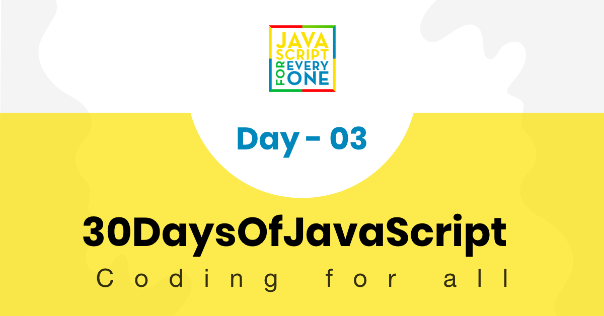
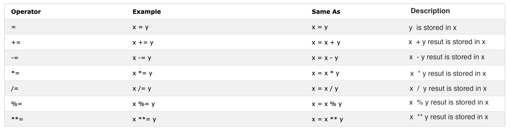

<div align="center">
  <h1> 30 Days Of JavaScript</h1>
  <a class="header-badge" target="_blank" href="https://www.linkedin.com/in/asabeneh/">
  
  </a>
  <a class="header-badge" target="_blank" href="https://twitter.com/Asabeneh">
  
  </a>

<sub>Автор:
<a href="https://www.linkedin.com/in/asabeneh/" target="_blank">Asabeneh Yetayeh</a><br>
<small> Январь, 2020</small>
</sub>

</div>

[<< День 2](https://github.com/Asabeneh/30DaysOfJavaScript/blob/master/02_Day/02_day_data_types.md) | [Day 4 >>](https://github.com/Asabeneh/30DaysOfJavaScript/blob/master/04_Day/04_day_conditionals.md)



- [📔 День 3](#%f0%9f%93%94-%d0%94%d0%b5%d0%bd%d1%8c-3)
  - [Булевый тип (boolean)](#%d0%91%d1%83%d0%bb%d0%b5%d0%b2%d1%8b%d0%b9-%d1%82%d0%b8%d0%bf-boolean)
    - [Пример: логические значения](#%d0%9f%d1%80%d0%b8%d0%bc%d0%b5%d1%80-%d0%bb%d0%be%d0%b3%d0%b8%d1%87%d0%b5%d1%81%d0%ba%d0%b8%d0%b5-%d0%b7%d0%bd%d0%b0%d1%87%d0%b5%d0%bd%d0%b8%d1%8f)
    - [Истинные значения](#%d0%98%d1%81%d1%82%d0%b8%d0%bd%d0%bd%d1%8b%d0%b5-%d0%b7%d0%bd%d0%b0%d1%87%d0%b5%d0%bd%d0%b8%d1%8f)
    - [Ложные значения](#%d0%9b%d0%be%d0%b6%d0%bd%d1%8b%d0%b5-%d0%b7%d0%bd%d0%b0%d1%87%d0%b5%d0%bd%d0%b8%d1%8f)
  - [Undefined](#undefined)
  - [Null](#null)
  - [Операторы](#%d0%9e%d0%bf%d0%b5%d1%80%d0%b0%d1%82%d0%be%d1%80%d1%8b)
    - [Операторы присваивания](#%d0%9e%d0%bf%d0%b5%d1%80%d0%b0%d1%82%d0%be%d1%80%d1%8b-%d0%bf%d1%80%d0%b8%d1%81%d0%b2%d0%b0%d0%b8%d0%b2%d0%b0%d0%bd%d0%b8%d1%8f)
    - [Арифметические Операторы](#%d0%90%d1%80%d0%b8%d1%84%d0%bc%d0%b5%d1%82%d0%b8%d1%87%d0%b5%d1%81%d0%ba%d0%b8%d0%b5-%d0%9e%d0%bf%d0%b5%d1%80%d0%b0%d1%82%d0%be%d1%80%d1%8b)
    - [Операторы сравнения](#%d0%9e%d0%bf%d0%b5%d1%80%d0%b0%d1%82%d0%be%d1%80%d1%8b-%d1%81%d1%80%d0%b0%d0%b2%d0%bd%d0%b5%d0%bd%d0%b8%d1%8f)
      - [Пример: операторы сравнения](#%d0%9f%d1%80%d0%b8%d0%bc%d0%b5%d1%80-%d0%be%d0%bf%d0%b5%d1%80%d0%b0%d1%82%d0%be%d1%80%d1%8b-%d1%81%d1%80%d0%b0%d0%b2%d0%bd%d0%b5%d0%bd%d0%b8%d1%8f)
    - [Логические Операторы](#%d0%9b%d0%be%d0%b3%d0%b8%d1%87%d0%b5%d1%81%d0%ba%d0%b8%d0%b5-%d0%9e%d0%bf%d0%b5%d1%80%d0%b0%d1%82%d0%be%d1%80%d1%8b)
    - [Оператор инкремента](#%d0%9e%d0%bf%d0%b5%d1%80%d0%b0%d1%82%d0%be%d1%80-%d0%b8%d0%bd%d0%ba%d1%80%d0%b5%d0%bc%d0%b5%d0%bd%d1%82%d0%b0)
    - [Оператор декремента](#%d0%9e%d0%bf%d0%b5%d1%80%d0%b0%d1%82%d0%be%d1%80-%d0%b4%d0%b5%d0%ba%d1%80%d0%b5%d0%bc%d0%b5%d0%bd%d1%82%d0%b0)
    - [Тернарный операторы](#%d0%a2%d0%b5%d1%80%d0%bd%d0%b0%d1%80%d0%bd%d1%8b%d0%b9-%d0%be%d0%bf%d0%b5%d1%80%d0%b0%d1%82%d0%be%d1%80%d1%8b)
    - [Приоритет оператора](#%d0%9f%d1%80%d0%b8%d0%be%d1%80%d0%b8%d1%82%d0%b5%d1%82-%d0%be%d0%bf%d0%b5%d1%80%d0%b0%d1%82%d0%be%d1%80%d0%b0)
  - [Методы окна](#%d0%9c%d0%b5%d1%82%d0%be%d0%b4%d1%8b-%d0%be%d0%ba%d0%bd%d0%b0)
    - [Метод alert()](#%d0%9c%d0%b5%d1%82%d0%be%d0%b4-alert)
    - [Метод prompt()](#%d0%9c%d0%b5%d1%82%d0%be%d0%b4-prompt)
    - [Метод confirm()](#%d0%9c%d0%b5%d1%82%d0%be%d0%b4-confirm)
  - [Объект Date](#%d0%9e%d0%b1%d1%8a%d0%b5%d0%ba%d1%82-date)
    - [Создание объекта времени](#%d0%a1%d0%be%d0%b7%d0%b4%d0%b0%d0%bd%d0%b8%d0%b5-%d0%be%d0%b1%d1%8a%d0%b5%d0%ba%d1%82%d0%b0-%d0%b2%d1%80%d0%b5%d0%bc%d0%b5%d0%bd%d0%b8)
    - [Получение года](#%d0%9f%d0%be%d0%bb%d1%83%d1%87%d0%b5%d0%bd%d0%b8%d0%b5-%d0%b3%d0%be%d0%b4%d0%b0)
    - [Получение месяца](#%d0%9f%d0%be%d0%bb%d1%83%d1%87%d0%b5%d0%bd%d0%b8%d0%b5-%d0%bc%d0%b5%d1%81%d1%8f%d1%86%d0%b0)
    - [Получение даты](#%d0%9f%d0%be%d0%bb%d1%83%d1%87%d0%b5%d0%bd%d0%b8%d0%b5-%d0%b4%d0%b0%d1%82%d1%8b)
    - [Получение дня](#%d0%9f%d0%be%d0%bb%d1%83%d1%87%d0%b5%d0%bd%d0%b8%d0%b5-%d0%b4%d0%bd%d1%8f)
    - [Получение часов](#%d0%9f%d0%be%d0%bb%d1%83%d1%87%d0%b5%d0%bd%d0%b8%d0%b5-%d1%87%d0%b0%d1%81%d0%be%d0%b2)
    - [Получение минут](#%d0%9f%d0%be%d0%bb%d1%83%d1%87%d0%b5%d0%bd%d0%b8%d0%b5-%d0%bc%d0%b8%d0%bd%d1%83%d1%82)
    - [Получение секунд](#%d0%9f%d0%be%d0%bb%d1%83%d1%87%d0%b5%d0%bd%d0%b8%d0%b5-%d1%81%d0%b5%d0%ba%d1%83%d0%bd%d0%b4)
    - [Получение времени](#%d0%9f%d0%be%d0%bb%d1%83%d1%87%d0%b5%d0%bd%d0%b8%d0%b5-%d0%b2%d1%80%d0%b5%d0%bc%d0%b5%d0%bd%d0%b8)
  - [💻 День 3: Упражнения](#%f0%9f%92%bb-%d0%94%d0%b5%d0%bd%d1%8c-3-%d0%a3%d0%bf%d1%80%d0%b0%d0%b6%d0%bd%d0%b5%d0%bd%d0%b8%d1%8f)
    - [Упражнения: Уровень 1](#%d0%a3%d0%bf%d1%80%d0%b0%d0%b6%d0%bd%d0%b5%d0%bd%d0%b8%d1%8f-%d0%a3%d1%80%d0%be%d0%b2%d0%b5%d0%bd%d1%8c-1)
    - [Упражнения: уровень 2](#%d0%a3%d0%bf%d1%80%d0%b0%d0%b6%d0%bd%d0%b5%d0%bd%d0%b8%d1%8f-%d1%83%d1%80%d0%be%d0%b2%d0%b5%d0%bd%d1%8c-2)
    - [Упражнения: уровень 3](#%d0%a3%d0%bf%d1%80%d0%b0%d0%b6%d0%bd%d0%b5%d0%bd%d0%b8%d1%8f-%d1%83%d1%80%d0%be%d0%b2%d0%b5%d0%bd%d1%8c-3)

# 📔 День 3

## Булевый тип (boolean)

Логический тип данных представляет одно из двух значений: _true_ или _false_. Логическое значение может быть истинным или ложным. Использование этих типов данных будет понятно при запуске оператора сравнения. Любые сравнения возвращают логическое значение, которое является истинным или ложным.

### Пример: логические значения

```js
let isLightOn = true;
let isRaining = false;
let isHungry = false;
let isMarried = true;
let truValue = 4 > 3; // true
let falseValue = 4 < 3; // false
```

Мы согласились с тем, что логические значения являются истинными или ложными.

### Истинные значения

- Все числа (положительные и отрицательные) являются правдивыми, кроме нуля
- Все строки правдивы
- boolean истинное

### Ложные значения

- 0
- 0n
- null
- undefined
- NaN
- the boolean false
- '', "", ``, пустая строка

Нужно хорощо помнить эти истинные и ложные значения. В следующем разделе мы будем использовать их с условиями для принятия решения.

## Undefined

Если мы объявим переменную и не назначим значение, оно будет неопределенным. В дополнение к этому, если функция не возвращает значение, оно будет неопределенным.

```js
let firstName;
console.log(firstName); //не определено, потому что оно еще не присвоено значению
```

## Null

```js
let empty = null;
console.log(empty); // -> null , не имеет значения
```

## Операторы

### Операторы присваивания

Знак равенства в JavaScript - это оператор присваивания. Используется для присвоения переменной.

```js
let firstName = "Asabeneh";
let country = "Finland";
```

Операторы присваивания



### Арифметические Операторы

Арифметические операторы являются математическими операторами.

- Сложение (+): `a + b`
- Вычитание (-): `a - b`
- Умножение (_): `a _ b`
- Деление (/): `a / b`
- Остаток от деления % (%): `a % b`
- Возведение в степень (**): `a ** b`

```js
let numOne = 4;
let numTwo = 3;
let sum = numOne + numTwo;
let diff = numOne - numTwo;
let mult = numOne * numTwo;
let div = numOne / numTwo;
let remainder = numOne % numTwo;
let powerOf = numOne ** numTwo;

console.log(sum, diff, mult, div, remainder, powerOf); // 7,1,12,1.33,1, 64
```

```js
let PI = 3.14;
let radius = 100; // длина в метрах

const gravity = 9.81; // в m/s2
let mass = 72; // в килограммах
const boilingPoint = 100; // температура в °С, температура кипения воды
const bodyTemp = 37; // температура тела в °С

//Рассчитаем площадь круга
const areaOfCircle = PI * radius * radius;
console.log(areaOfCircle); //  314 m

// Давайте посчитаем вес объекта
const weight = mass * gravity;
console.log(weight); // 706.32 N (Newton)

//Конкатенация строк с числами с использованием строковой интерполяции
/*
Температура кипения воды составляет 100 °С.
Температура тела человека составляет 37 °С.
Гравитация земли составляет 9,81 м/с2.
 */
console.log(
  `The boiling point of water is ${boilingPoint} oC.\nHuman body temperature is ${bodyTemp} oC.\nThe gravity of earth is ${gravity} m / s2.`
);
```

### Операторы сравнения

В программировании мы сравниваем значения, мы используем операторы сравнения для сравнения двух значений. Мы проверяем, является ли значение больше или меньше или равно другому значению.


#### Пример: операторы сравнения

```js
console.log(3 > 2); // true, потому что 3 больше 2
console.log(3 >= 2); // true, потому что 3 больше 2
console.log(3 < 2); // false,  потому что 3 больше 2
console.log(2 < 3); // true, потому что 2 меньше 3
console.log(2 <= 3); // true, потому что 2 меньше 3
console.log(3 == 2); // false, потому что 3 не равно 2
console.log(3 != 2); // true, потому что 3 не равно 2
console.log(3 == "3"); // true, сравнить только значение
console.log(3 === "3"); // false, сравнить значение и тип данных
console.log(3 !== "3"); // true, сравнить значение и тип данных
console.log(3 !== "3"); // true, сравнить значение и тип данных
console.log(3 != 3); // false, сравнить только значение
console.log(3 !== 3); // false, сравнить значение и тип данных
console.log(0 == false); // true, эквивалент
console.log(0 == ""); // true, эквивалент
console.log(0 == " "); // true, эквивалент
console.log(0 === ""); // false, не совсем то же самое
console.log(0 === false); // false, не совсем то же самое
console.log(1 == true); // true, эквивалент
console.log(1 === true); // false, не совсем то же самое
console.log(undefined == null); // true
console.log(undefined === null); // false
console.log(NaN == NaN); // false, не равный
console.log(NaN === NaN); // false
console.log(typeof NaN); // число

console.log("mango".length == "avocado".length); // false
console.log("mango".length != "avocado".length); // true
console.log("mango".length < "avocado".length); // true
console.log("milk".length != "meat".length); // false
console.log("milk".length == "meat".length); // true
console.log("tomato".length == "potato".length); // true
console.log("python".length > "dragon".length); // false
```

Попытайтесь понять приведенные выше сравнения с некоторой логикой. Запоминать без какой-либо логики может быть сложно.
JavaScript - это своего рода проводной язык программирования. Код JavaScript запускается и дает вам результат, но если вы не разбираетесь в нем, это может быть нежелательным результатом.

По практическому правилу, если значение не верно с `==`, оно не будет равно `===`. Использование `===` более безопасно, чем использование `==`. Следующая [ссылка](https://dorey.github.io/JavaScript-Equality-Table/) имеет исчерпывающий список сравнения типов данных.

### Логические Операторы

Следующие символы являются общими логическими операторами: `&&` (амперсанд), `||` (труба) и `!` (отрицание).

- `&&` получает значение `true`, только если два операнда имеют значение `true`.
- `||` становится истинным, любой из операндов верен.
- `!` отрицает истину на ложь, ложь на истину.

```js
//&& Пример оператора амперсанда

const check = 4 > 3 && 10 > 5; // true && true -> true
const check = 4 > 3 && 10 < 5; // true && false -> false
const check = 4 < 3 && 10 < 5; // false && false -> false

//|| pipe or operator, example

const check = 4 > 3 || 10 > 5; // true  || true -> true
const check = 4 > 3 || 10 < 5; // true  || false -> true
const check = 4 < 3 || 10 < 5; // false || false -> false

//! Примеры отрицания

let check = 4 > 3; // true
let check = !(4 > 3); //  false
let isLightOn = true;
let isLightOff = !isLightOn; // false
let isMarried = !false; // true
```

### Оператор инкремента

В JavaScript мы используем оператор приращения для увеличения значения, хранящегося в переменной. Приращение может быть до или после приращения. Давайте посмотрим на каждого из них:

1. Преинкремент

   ```js
   let count = 0;
   console.log(++count); // 1
   console.log(count); // 1
   ```

2. Пост-инкремент

   ```js
   let count = 0;
   console.log(count++); // 0
   console.log(count); // 1
   ```

Мы используем большую часть времени после приращения. По крайней мере, вы должны помнить, как использовать постинкрементный оператор.

### Оператор декремента

В JavaScript мы используем оператор декремента для уменьшения значения, хранящегося в переменной. Декремент может быть до или после декремента. Давайте посмотрим на каждого из них:

1. Предекремент

   ```js
   let count = 0;
   console.log(--count); // -1
   console.log(count); // -1
   ```

2. Постдекремента

   ```js
   let count = 0;
   console.log(count--); // 0
   console.log(count); // -1
   ```

### Тернарный операторы

Тернарный оператор позволяет записать условие.
Другой способ написания условных выражений - использование Тернарных операторов. Посмотрите на следующие примеры:

```js
let isRaining = true;
isRaining
  ? console.log("You need a rain coat.")
  : console.log("No need for a rain coat.");
isRaining = false;

isRaining
  ? console.log("You need a rain coat.")
  : console.log("No need for a rain coat.");
```

```sh
You need a rain coat.
No need for a rain coat.
```

```js
let number = 5;
number > 0
  ? console.log(`${number} is a positive number`)
  : console.log(`${number} is a negative number`);
number = -5;

number > 0
  ? console.log(`${number} is a positive number`)
  : console.log(`${number} is a negative number`);
```

```sh
5 is a positive number
-5 is a negative number
```

### Приоритет оператора

Я хотел бы рекомендовать вам прочитать о приоритете оператора из этой [ссылки](https://developer.mozilla.org/en-US/docs/Web/JavaScript/Reference/Operators/Operator_Precedence)

## Методы окна

### Метод alert()

Как вы видели в самом начале, метод `alert()` отображает окно предупреждения с указанным сообщением и кнопкой OK. Это встроенный метод, и он принимает аргумент.

```js
alert(message);
```

```js
alert("Welcome to 30DaysOfJavaScript");
```

Не используйте слишком много предупреждений, потому что это раздражает, используйте его только для тестирования.

### Метод prompt()

Методы подсказки окна отображают окно подсказки с вводом в вашем браузере, чтобы принять входные значения, и входные данные могут быть сохранены в переменной. Метод `prompt()` принимает два аргумента. Второй аргумент является необязательным.

```js
prompt("required text", "optional text");
```

```js
let number = prompt("Enter number", "number goes here");
console.log(number);
```

### Метод confirm()

Метод `confirm()` отображает диалоговое окно с указанным сообщением, а также кнопки "ОК" и "Отмена".
Окно подтверждения часто используется, чтобы запросить у пользователя разрешение на что-либо. Окно `confirm()` принимает строку в качестве аргумента.
Нажатие "ОК" дает значение `true`, нажатие кнопки "Отмена" дает значение `false`.

```js
const agree = confirm("Are you sure you like to delete? ");
console.log(agree); // результат будет true или false в зависимости от того, что вы нажимаете в диалоговом окне
```

These are not all the window methods we will have a separate section to go deep into window methods.

## Объект Date

Время это важная вещь. Нам нравится знать время определенного действия или события. В JavaScript текущее время и дата создаются с использованием JavaScript Date Object. Объект, который мы создаем с использованием объекта Date, предоставляет множество методов для работы с датой и временем. Методы, которые мы используем для получения информации о дате и времени из значений объекта даты, начинаются со слова _get_, поскольку они предоставляют информацию.

- `getFullYear()`,
- `getMonths()`,
- `getDate()`,
- `getDay()`,
- `getHours()`,
- `getMinutes`,
- `getSeconds()`,
- `getMilliseconds()`,
- `getTime()`,
- `getDay()`


### Создание объекта времени

Однажды мы создаем объект времени. Объект времени предоставит информацию о времени. Давайте создадим объект времени

```js
const now = new Date();
console.log(now); // Sat Jan 04 2020 00:56:41 GMT+0200 (Eastern European Standard Time)
```

Мы создали объект времени, и мы можем получить доступ к любой информации о дате и времени из объекта, используя методы get, которые мы упомянули в таблице.

### Получение года

Давайте извлечем или получим полный объект времени.

```js
const now = new Date();
console.log(now.getFullYear()); // 2020
```

### Получение месяца

Давайте извлечем или получим месяц из объекта времени.

```js
const now = new Date();
console.log(now.getMonth()); // 0, потому, что месяц январь,  month(0-11)
```

### Получение даты

Давайте извлечем или получим дату месяца из объекта времени.

```js
const now = new Date();
console.log(now.getDate()); // 4, потому что день месяца 4th,  day(0-31)
```

### Получение дня

Давайте извлечем или получим день недели из объекта времени.

```js
const now = new Date();
console.log(now.getDay()); // 6, потому, что день Суббота, который является 5-м днем,
// Получение дня недели в виде числа (0-6)
```

### Получение часов

Давайте извлекать или получать часы из объекта времени.

```js
const now = new Date();
console.log(now.getHours()); // 0, потому, что время 00:56:41
```

### Получение минут

Давайте извлекать или получать минуты из объекта времени.

```js
const now = new Date();
console.log(now.getMinutes()); // 56, потому, что время 00:56:41
```

### Получение секунд

Давайте извлекать или получать секунды из объекта времени.

```js
const now = new Date();
console.log(now.getSeconds()); // 41, потому, что время 00:56:41
```

### Получение времени

Этот метод дает время в миллисекундах, начиная с 1 января 1970 года. Он также известен как время Unix. Мы можем получить время Unix двумя способами:

1. Используя `getTime()`

   ```js
   const now = new Date(); //
   console.log(now.getTime()); // 1578092201341, это количество секунд, прошедших с January 1, 1970 to January 4, 2020 00:56:41
   ```

2. Используя _Date.now()_

```js
const allSeconds = Date.now(); //
console.log(allSeconds); // 1578092201341, это количество секунд, прошедших с January 1, 1970 to January 4, 2020 00:56:41

const timeInSeconds = new Date().getTime();
console.log(allSeconds == timeInSeconds); // true
```

Давайте отформатируем эти значения в удобочитаемом формате времени.

**Пример:**

```js
const now = new Date();
const year = now.getFullYear(); // вернет year
const month = now.getMonth() + 1; // вернет month(0 - 11)
const date = now.getDate(); // вернет date (1 - 31)
const hours = now.getHours(); // вернет number (0 - 23)
const minutes = now.getMinutes(); // вернет number (0 -59)

console.log(`${date}/${month}/${year} ${hours}:${minutes}`); // 4/1/2020 0:56
```

🌕 У вас есть безграничная энергия! Вы только что выполнили 3-й день испытаний, и вы на три шага на пути к успеху. Теперь сделайте несколько упражнений для вашего мозга и ваших мышц.

## 💻 День 3: Упражнения

### Упражнения: Уровень 1

1. Объявите переменные firstName, lastName, страну, город, возраст, isMarried, year, присвойте ей значение и используйте оператор `typeof` для проверки разных типов данных.
2. Проверьте, равен ли тип «10» 10
3. Проверьте, равен ли `parseInt ('9.8')` 10
4. Булево значение равно либо true, либо false.

   1. Напишите три утверждения JavaScript, которые обеспечивают значение `true`.
   2. Напишите три оператора JavaScript, которые предоставляют значения `false`.

5. Сначала выясните результат следующего выражения сравнения без использования `console.log()`. После того, как вы определите результат, подтвердите его, используя `console.log()`.

   1. 4 > 3
   2. 4 >= 3
   3. 4 < 3
   4. 4 <= 3
   5. 4 == 4
   6. 4 === 4
   7. 4 != 4
   8. 4 !== 4
   9. 4 != '4'
   10. 4 == '4'
   11. 4 === '4'
   12. Найдите длину python и jargon и сделайте ложное сравнение.

6. Сначала выясните результат следующих выражений без использования `console.log()`. После того, как вы определите результат, подтвердите его с помощью `console.log()`.

   1. 4 > 3 && 10 < 12
   2. 4 > 3 && 10 > 12
   3. 4 > 3 || 10 < 12
   4. 4 > 3 || 10 > 12
   5. !(4 > 3)
   6. !(4 < 3)
   7. !(false)
   8. !(4 > 3 && 10 < 12)
   9. !(4 > 3 && 10 > 12)
   10. !(4 === '4')
   11. В обоих случаях нет 'on'

7. Используйте объект Date для выполнения следующих действий
       1. Какой сегодня год?
       2. Какой сегодня месяц, как число?
       3. Какая сегодня дата?
       4. Какой сегодня день, как число?
       5. Сколько сейчас часов?
       6. Какие минуты сейчас?
       7. Узнайте количество секунд, прошедших с 1 января 1970 года по настоящее время.

### Упражнения: уровень 2

1. Напишите скрипт, который предложит пользователю ввести основание и высоту треугольника и рассчитать площадь треугольника. (прлощадь = 0.5 x b x h).

   ```sh
   Введите основанеи: 20
   Введите высоту: 10
   Площадь треугольника 50
   ```

2. Напишите скрипт, который предложит пользователю ввести сторону a, сторону b и сторону c треугольника и вычислить периметр треугольника. (периметр = a + b + c)

   ```sh
   Введите сторону a: 5
   Введите сторону b: 4
   Введите сторону c: 3
   Периметр треугольника 12
   ```

3. Получите длину и ширину, используя подсказку, и вычислите площадь прямоугольника (площадь = длина х ширина и периметр прямоугольника (периметр = 2 х (длина + ширина))
4. Получите радиус, используя подсказку, и вычислите площадь круга (площадь = pi x r x r) и окружность круга (c = 2 x pi x r), где pi = 3.14.
5. Рассчитайте наклон, x-пересечение и y-пересечение y = 2x -2
6. Наклон (m = y2-y1 / x2-x1). Найти наклон между точкой (2, 2) и точкой (6,10)
7. Сравните наклон двух приведенных выше вопросов.
8. Рассчитайте значение y (y = x ^ 2 + 6x + 9). Попробуйте использовать разные значения х и выяснить, при каком значении х у 0.
9. Напишите скрипт, который побудит пользователя вводить часы и ставку за час. Рассчитать зарплату человека?

   ```sh
   Введите часы: 40
   Введите ставку в час: 28
   Ваш еженедельный заработок 1120
   ```

10. Если длина вашего имени больше 7, скажем, ваше имя длинное, иначе скажем, ваше имя короткое.
11. Сравните длину вашего имени и длину вашей фамилии, и вы должны получить этот вывод.

    ```js
    let firstName = "Asabeneh";
    let lastName = "Yetayeh";
    ```

    ```sh
    Твое имя, Asabeneh длиннее вашей фамилии, Yetayeh
    ```

12. Объявите две переменные _myAge_ и _yourAge_ и присвойте им начальные значения, myAge и yourAge.

    ```js
    let myAge = 250;
    let yourAge = 25;
    ```

    ```sh
    Я на 225 лет старше тебя.
    ```

13. Используя подсказку, укажите год рождения пользователя и, если ему исполнилось 18 лет, разрешите ему ехать, если он не скажет пользователю подождать определенное количество лет.

    ```sh
    Введите год рождения: 1995
    Вам 25. Вы достаточно взрослый, чтобы водить

    Введите год рождения: 2005
    Вам 15. Вам будет разрешено водить после 3 лет.
    ```

14. Напишите скрипт, который предложит пользователю ввести количество лет. Подсчитайте, сколько секунд человек может прожить. Предположим, кто-то живет всего сто лет

    ```sh
    Введите число, в котором вы живете: 100

    Вы жили 3153600000 секунд.
    ```

15. Создайте удобочитаемый формат времени, используя объект Date time
    1. YYY-MM-DD HH:mm
    2. DD-MM-YYYY HH:mm
    3. DD/MM/YYY HH:mm

### Упражнения: уровень 3

1. Создайте удобочитаемый формат времени, используя объект Date time. Час и минута должны быть все время двузначными (7 часов должны быть 07, а 5 минут должны быть 05)
   1. YYY-MM-DD HH:mm eg. 20120-01-02 07:05

🎉 ПОЗДРАВЛЯЕМ! 🎉

[<< День 2](https://github.com/Asabeneh/30DaysOfJavaScript/blob/master/RU/02_Day/02_day_data_types.md) | [День 4 >>](https://github.com/Asabeneh/30DaysOfJavaScript/blob/master/RU/04_Day/04_day_conditionals.md)
