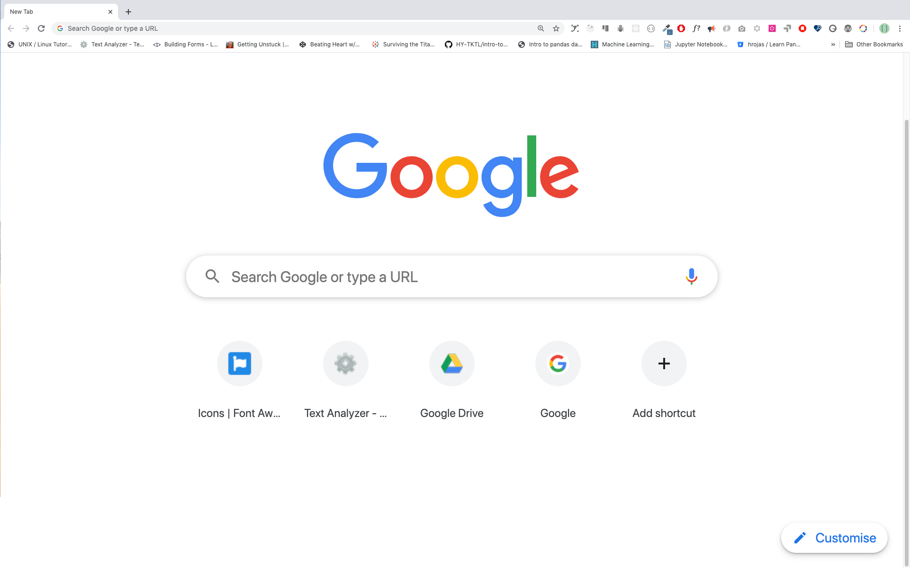
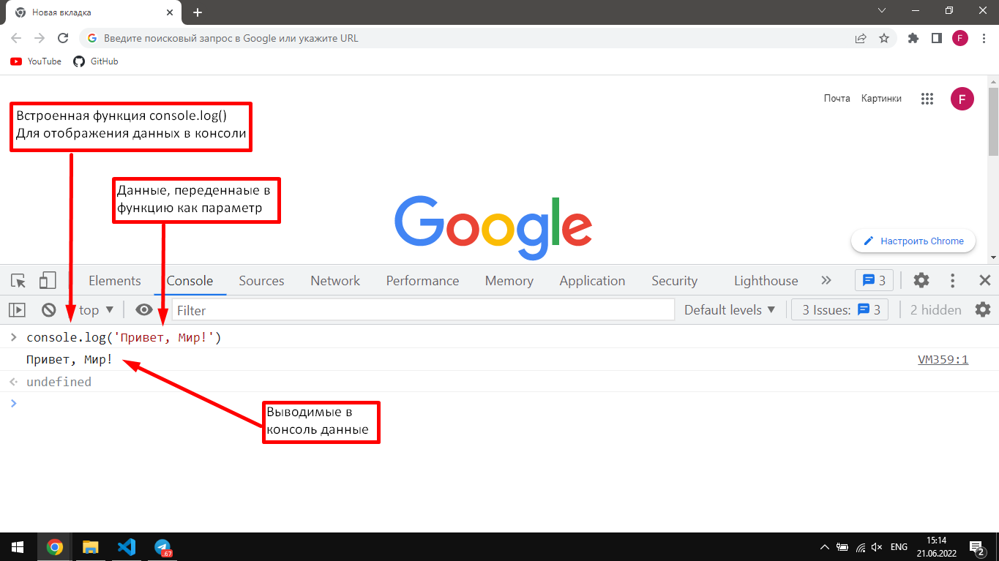
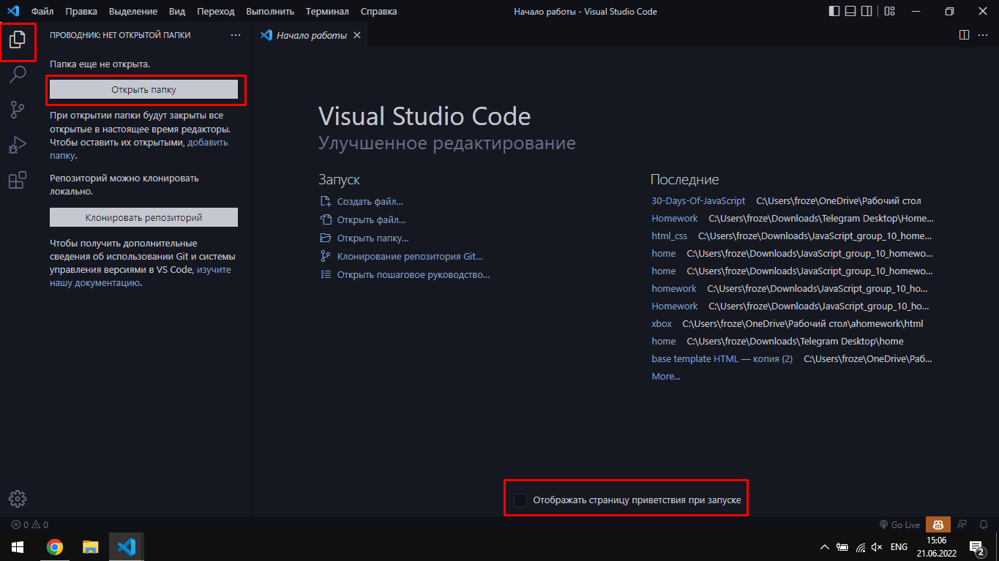
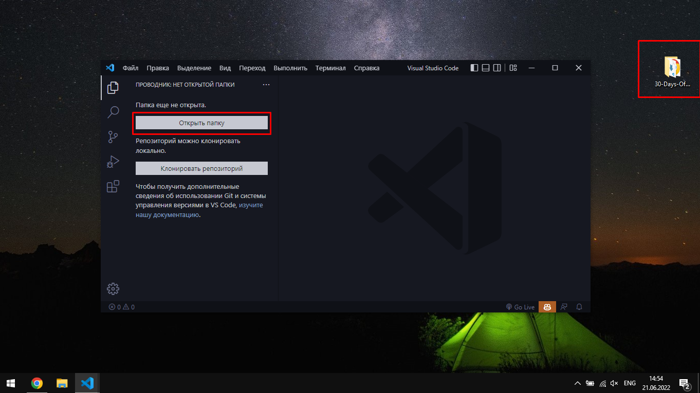
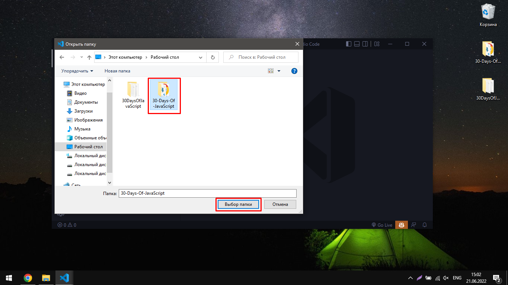
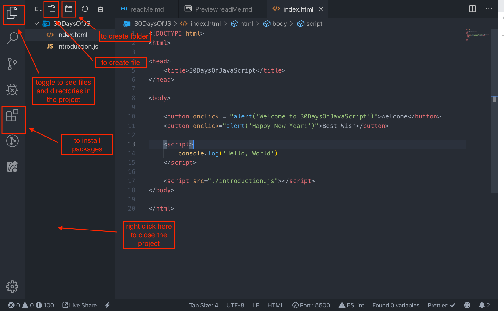
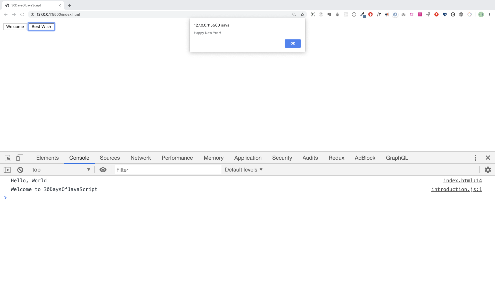

<div align="center">
  <h1> 30 Days Of JavaScript</h1>
  <a class="header-badge" target="_blank" href="https://www.linkedin.com/in/asabeneh/">
  
  </a>
  <a class="header-badge" target="_blank" href="https://twitter.com/Asabeneh">
  
  </a>

<sub>Автор:
<a href="https://www.linkedin.com/in/asabeneh/" target="_blank">Asabeneh Yetayeh</a><br>
<small> Январь, 2020</small>
</sub>

  <div>

  🇬🇧 [English](../readMe.md)
  🇪🇸 [Spanish](../Spanish/readme.md)
  🇷🇺 [Russian](./README.md)

  </div>

</div>

[День 2 >>](https://github.com/Asabeneh/30DaysOfJavaScript/blob/master/RU/02_Day/02_day_data_types.md)


- [День 1](#%d0%94%d0%b5%d0%bd%d1%8c-1)
  - [Вступление](#%d0%92%d1%81%d1%82%d1%83%d0%bf%d0%bb%d0%b5%d0%bd%d0%b8%d0%b5)
  - [Требования](#%d0%a2%d1%80%d0%b5%d0%b1%d0%be%d0%b2%d0%b0%d0%bd%d0%b8%d1%8f)
  - [Настройка](#%d0%9d%d0%b0%d1%81%d1%82%d1%80%d0%be%d0%b9%d0%ba%d0%b0)
    - [Установка Node.js](#%d0%a3%d1%81%d1%82%d0%b0%d0%bd%d0%be%d0%b2%d0%ba%d0%b0-nodejs)
    - [Браузер](#%d0%91%d1%80%d0%b0%d1%83%d0%b7%d0%b5%d1%80)
      - [Установка Google Chrome](#%d0%a3%d1%81%d1%82%d0%b0%d0%bd%d0%be%d0%b2%d0%ba%d0%b0-google-chrome)
      - [Открытие Google Chrome Console](#%d0%9e%d1%82%d0%ba%d1%80%d1%8b%d1%82%d0%b8%d0%b5-google-chrome-console)
      - [Написание кода на консоли браузера](#%d0%9d%d0%b0%d0%bf%d0%b8%d1%81%d0%b0%d0%bd%d0%b8%d0%b5-%d0%ba%d0%be%d0%b4%d0%b0-%d0%bd%d0%b0-%d0%ba%d0%be%d0%bd%d1%81%d0%be%d0%bb%d0%b8-%d0%b1%d1%80%d0%b0%d1%83%d0%b7%d0%b5%d1%80%d0%b0)
        - [Console.log](#consolelog)
        - [Console.log with multiple arguments](#consolelog-with-multiple-arguments)
        - [Комментарии](#%d0%9a%d0%be%d0%bc%d0%bc%d0%b5%d0%bd%d1%82%d0%b0%d1%80%d0%b8%d0%b8)
        - [Синтаксис](#%d0%a1%d0%b8%d0%bd%d1%82%d0%b0%d0%ba%d1%81%d0%b8%d1%81)
      - [Арифметика](#%d0%90%d1%80%d0%b8%d1%84%d0%bc%d0%b5%d1%82%d0%b8%d0%ba%d0%b0)
    - [Редактор кода](#%d0%a0%d0%b5%d0%b4%d0%b0%d0%ba%d1%82%d0%be%d1%80-%d0%ba%d0%be%d0%b4%d0%b0)
      - [Установка Visual Studio Code](#%d0%a3%d1%81%d1%82%d0%b0%d0%bd%d0%be%d0%b2%d0%ba%d0%b0-visual-studio-code)
      - [Как использовать VS Code](#%d0%9a%d0%b0%d0%ba-%d0%b8%d1%81%d0%bf%d0%be%d0%bb%d1%8c%d0%b7%d0%be%d0%b2%d0%b0%d1%82%d1%8c-vs-code)
  - [Добавление JavaScript на веб-страницу](#%d0%94%d0%be%d0%b1%d0%b0%d0%b2%d0%bb%d0%b5%d0%bd%d0%b8%d0%b5-javascript-%d0%bd%d0%b0-%d0%b2%d0%b5%d0%b1-%d1%81%d1%82%d1%80%d0%b0%d0%bd%d0%b8%d1%86%d1%83)
    - [Встроенный скрипт](#%d0%92%d1%81%d1%82%d1%80%d0%be%d0%b5%d0%bd%d0%bd%d1%8b%d0%b9-%d1%81%d0%ba%d1%80%d0%b8%d0%bf%d1%82)
    - [Внутренний скрипт](#%d0%92%d0%bd%d1%83%d1%82%d1%80%d0%b5%d0%bd%d0%bd%d0%b8%d0%b9-%d1%81%d0%ba%d1%80%d0%b8%d0%bf%d1%82)
    - [Внешний скрипт](#%d0%92%d0%bd%d0%b5%d1%88%d0%bd%d0%b8%d0%b9-%d1%81%d0%ba%d1%80%d0%b8%d0%bf%d1%82)
    - [Несколько внешних скриптов](#%d0%9d%d0%b5%d1%81%d0%ba%d0%be%d0%bb%d1%8c%d0%ba%d0%be-%d0%b2%d0%bd%d0%b5%d1%88%d0%bd%d0%b8%d1%85-%d1%81%d0%ba%d1%80%d0%b8%d0%bf%d1%82%d0%be%d0%b2)
  - [Введение в типы данных](#%d0%92%d0%b2%d0%b5%d0%b4%d0%b5%d0%bd%d0%b8%d0%b5-%d0%b2-%d1%82%d0%b8%d0%bf%d1%8b-%d0%b4%d0%b0%d0%bd%d0%bd%d1%8b%d1%85)
    - [Число](#%d0%a7%d0%b8%d1%81%d0%bb%d0%be)
    - [Строка](#%d0%a1%d1%82%d1%80%d0%be%d0%ba%d0%b0)
      - [Пример](#%d0%9f%d1%80%d0%b8%d0%bc%d0%b5%d1%80)
    - [Булевый (логический) тип «boolean»](#%d0%91%d1%83%d0%bb%d0%b5%d0%b2%d1%8b%d0%b9-%d0%bb%d0%be%d0%b3%d0%b8%d1%87%d0%b5%d1%81%d0%ba%d0%b8%d0%b9-%d1%82%d0%b8%d0%bf-%c2%abboolean%c2%bb)
      - [Пример](#%d0%9f%d1%80%d0%b8%d0%bc%d0%b5%d1%80-1)
    - [Undefined](#undefined)
    - [Null](#null)
  - [Проверка типов данных](#%d0%9f%d1%80%d0%be%d0%b2%d0%b5%d1%80%d0%ba%d0%b0-%d1%82%d0%b8%d0%bf%d0%be%d0%b2-%d0%b4%d0%b0%d0%bd%d0%bd%d1%8b%d1%85)
  - [Комментарии](#%d0%9a%d0%be%d0%bc%d0%bc%d0%b5%d0%bd%d1%82%d0%b0%d1%80%d0%b8%d0%b8-1)
  - [Переменные](#%d0%9f%d0%b5%d1%80%d0%b5%d0%bc%d0%b5%d0%bd%d0%bd%d1%8b%d0%b5)
    - [Примеры: Переменные](#%d0%9f%d1%80%d0%b8%d0%bc%d0%b5%d1%80%d1%8b-%d0%9f%d0%b5%d1%80%d0%b5%d0%bc%d0%b5%d0%bd%d0%bd%d1%8b%d0%b5)
- [💻 День 1: Упражнения](#%f0%9f%92%bb-%d0%94%d0%b5%d0%bd%d1%8c-1-%d0%a3%d0%bf%d1%80%d0%b0%d0%b6%d0%bd%d0%b5%d0%bd%d0%b8%d1%8f)

# День 1

## Вступление

**Поздравляем** с решением принять участие в 30-дневном челендже по программированию на JavaScript. В этом задании вы изучите все, что вам нужно для того, чтобы стать программистом на JavaScript, и вообще все концепции программирования. В конце конкурса вы получите сертификат 30DaysOfJavaScript. Присоединяйтесь к [группе телеграмм](https://t.me/ThirtyDaysOfJavaScript).

**Задача 30DaysOfJavaScript** - руководство для начинающих и опытных разработчиков JavaScript. Добро пожаловать в JavaScript. Мне нравится использовать и преподавать JavaScript, и я надеюсь, что вы это сделаете. JavaScript - это язык браузера.

В этом пошаговом руководстве вы изучите JavaScript, самый популярный язык программирования в истории человечества.
Вы используете JavaScript **_для добавления интерактивности на веб-сайты, для разработки мобильных приложений, настольных приложений, игр_**, и в настоящее время JavaScript можно использовать для **_машинного обучения_** и **_AI_**.
**_JavaScript (JS)_** вырос в популярности в последние годы и был ведущим языком программирования в течение четырех лет подряд и является наиболее используемым языком программирования на Github.

## Требования

Для выполнения этой задачи не требуется предварительное знание программирования. Вам нужно только:

1. Мотивация
2. Компьютер
3. Интернет
4. Браузер
5. Редактор кода

## Настройка

Я считаю, что у вас есть мотивация и сильное желание быть разработчиком, компьютер и Интернет. Если у вас есть это, то у вас есть всё =).

### Установка Node.js

Возможно, вам это не нужно прямо сейчас, но может понадобиться позже. Устанавить [node.js](https://nodejs.org/en/).


После загрузки дважды щелкните и установите


Мы можем проверить, установлен ли узел на нашем локальном компьютере, открыв терминал устройства или командную строку.

```sh
asabeneh $ node -v
v12.14.0
```

Я использую версию node 12.14.0, которая является рекомендуемой версией узла.

### Браузер

Есть много браузеров там. Тем не менее, я настоятельно рекомендую Google Chrome.

#### Установка Google Chrome

Установите [google chrome](https://www.google.com/chrome/), если у вас его еще нет. Мы можем написать небольшой код JavaScript в консоли браузера, но мы не используем консоль браузера для разработки приложений.



#### Открытие Google Chrome Console

Вы можете открыть Google Chrome, нажав три точки в верхнем правом углу браузера Chrome или воспользовавшись ярлыком. Я предпочитаю использовать ярлыки.


Чтобы открыть консоль Chrome с помощью горячих клавиш.

```sh
Mac
Command+Option+I

Windows:
Ctl+Shift+I
```


После того, как вы откроете консоль Google Chrome, попробуйте изучить отмеченные кнопки. Мы будем проводить большую часть времени на консоли. Консоль - это место, куда идет ваш код JavaScript. Движок Google Console V8 изменяет ваш код JavaScript на машинный код.
Давайте напишем код JavaScript на консоли Google Chrome:



#### Написание кода на консоли браузера

Мы можем написать любой код JavaScript на консоли Google или любой консоли браузера. Однако для решения этой проблемы мы сосредоточимся только на консоли Google Chrome. Откройте консоль, используя:

```sh
Mac
Command+Option+I

Windows:
Ctl+Shift+I
```

##### Console.log

Чтобы написать наш первый код JavaScript, мы использовали встроенную функцию `console.log()`. Мы передали аргумент в качестве входных данных, и функция отображает вывод. Мы передали 'Hello, World' в качестве входных данных или аргумента в функцию `console.log()`.

```js
console.log("Hello, World!");
```

##### Console.log with multiple arguments

`console.log(param1, param2, param3)`, может принимать несколько аргументов.


```js
console.log("Hello", "World", "!");
console.log("HAPPY", "NEW", "YEAR", 2020);
console.log("Welcome", "to", 30, "Days", "Of", "JavaScript");
```

Как вы можете видеть из приведенного выше фрагмента кода, `console.log()` может принимать несколько аргументов.

Поздравляем! Вы написали свой первый код JavaScript, используя `console.log()`.

##### Комментарии

Мы добавляем комментарии к нашему коду. Комментарии очень важны, чтобы сделать код более читабельным и оставить комментарии в нашем коде. JavaScript не выполняет часть комментариев нашего кода. Любой текст, начинающийся с `//` в JavaScript, является комментарием или что-то в этом роде `/* */` является комментарием.

**Пример: Однострочный комментарий**

```js
// Это первый комментарий
// Это второй комментарий
// Я однострочный комментарий
```

**Пример: Многострочный комментарий**

```js
/*
Это многострочный комментарий
Многострочные комментарии могут занимать несколько строк
JavaScript - это язык Интернета
*/
```

##### Синтаксис

JavaScript это язык программирования. В результате он имеет свой синтаксис, как и другие языки программирования. Если мы не напишем синтаксис, понятный JavaScript, это вызовет различные типы ошибок. Мы рассмотрим различные виды ошибок JavaScript позже. А пока давайте посмотрим на синтаксические ошибки.


Я сделал преднамеренную ошибку. В результате консоль вызывает синтаксическую ошибку. На самом деле, синтаксис очень информативен. Он сообщает, какую ошибку мы допустили. Прочитав руководство по обратной связи об ошибках, мы можем исправить синтаксис и устранить проблему. Процесс выявления и удаления ошибок из программы называется отладкой. Давайте исправим ошибки:

```js
console.log("Hello, World!");
console.log("Hello, World!");
```

До сих пор мы видели, как отображать текст с помощью `console.log()`. Если мы печатаем текст или строку с помощью `console.log()`, текст должен находиться в одинарных, двойных или обратных кавычках.
**Пример:**

```js
console.log("Hello, World!");
console.log("Hello, World!");
console.log(`Hello, World!`);
```

#### Арифметика

Теперь давайте попрактикуемся в написании кодов JavaScript с помощью `console.log()` в консоли Google Chrome для числовых типов данных.
В дополнение к тексту мы также можем выполнять математические вычисления с использованием JavaScript. Давайте сделаем следующие простые вычисления.


```js
console.log(2 + 3); // Сложение
console.log(3 - 2); // Вычитание
console.log(2 * 3); // Умножение
console.log(3 / 2); // Разделение
console.log(3 % 2); // Модуль - поиск остатка
console.log(3 ** 2); // Экспоненциальный
```

### Редактор кода

Мы можем написать наш код в консоли браузера, но это не будет работать для больших проектов. В реальной рабочей среде разработчики используют разные редакторы кода для написания своих кодов. В этом 30-дневном челендже JavaScript мы будем использовать визуальный Visual Studio Code.

#### Установка Visual Studio Code

VS Code - это очень популярный текстовый редактор с открытым исходным кодом. Я бы рекомендовал [скачать](https://code.visualstudio.com/) VS Code, но если вы поддерживаете другие редакторы, не стесняйтесь использовать то, что у вас есть.


Если вы установили код VS Code, давайте начнем использовать его.

#### Как использовать VS Code

Откройте код VS Code, дважды щелкнув значок VS Code. Когда вы откроете его, вы получите такой интерфейс. Попробуйте взаимодействовать с помеченными значками.












## Добавление JavaScript на веб-страницу

JavaScript можно добавить на веб-страницу тремя различными способами:

- **_Встроенный скрипт_**
- **_Внутренний скрипт_**
- **_Внешний скрипт_**
- **_Несколько внешних скриптов_**

В следующих разделах показаны различные способы добавления кода JavaScript на вашу веб-страницу.

### Встроенный скрипт

Создайте папку на рабочем столе и назовите ее `30DaysOfJS` или в любом месте и создайте файл **_index.html_** в папке проекта. Затем вставьте следующий код и откройте его в браузере, либо в [Chrome](https://www.google.com/chrome/).

```html
<!DOCTYPE html>
<html>
  <head>
    <title>30DaysOfScript: Встроенный скрипт</title>
  </head>
  <body>
    <button onclick="alert('Добро пожаловать на 30 дней JavaScript!')">
      Нажми на меня
    </button>
  </body>
</html>
```

Теперь вы написали свой первый встроенный скрипт. Мы можем создать всплывающее сообщение с предупреждением, используя встроенную функцию `alert()`.

### Внутренний скрипт

Внутренний скрипт может быть записан в `head` или `body`, но предпочтительно поместить его в `body` HTML-документа.
Во-первых, давайте напишем в верхней части страницы.

```html
<!DOCTYPE html>
<html>
  <head>
    <title>30DaysOfScript: Внутренний скрипт</title>
    <script>
      console.log("Добро пожаловать на 30 дней JavaScript");
    </script>
  </head>
  <body></body>
</html>
```

Так мы пишем внутренний скрипт большую часть времени. Написание кода JavaScript в разделе `body` является наиболее предпочтительным местом. Откройте консоль браузера, чтобы увидеть вывод `console.log()`

```html
<!DOCTYPE html>
<html>
  <head>
    <title>30DaysOfScript: Внутренний скрипт</title>
  </head>
  <body>
    <button onclick="alert('Добро пожаловать на 30 дней JavaScript!');">
      Нажми на меня
    </button>
    <script>
      console.log("Добро пожаловать на 30 дней JavaScript");
    </script>
  </body>
</html>
```

Откройте консоль браузера, чтобы увидеть вывод `console.log()`


### Внешний скрипт

Подобно внутреннему сценарию, ссылка на внешний сценарий может быть в `head` или `body`, но предпочтительно помещать ее в `body`.
Во-первых, мы должны создать внешний файл JavaScript с расширением `.js`. Любой файл JavaScript заканчивается на `.js`. Создайте файл `introduction.js` внутри директории вашего проекта, напишите следующий код и подключите этот файл `.js` внизу `body`.

```js
console.log("Добро пожаловать на 30 дней JavaScript");
```

Внешние скрипты в head

```html
<!DOCTYPE html>
<html>
  <head>
    <title>30DaysOfJavaScript: Внешний скрипт</title>
    <script src="introduction.js"></script>
  </head>
  <body></body>
</html>
```

Внешние скрипты в body

```html
<!DOCTYPE html>
<html>
  <head>
    <title>30DaysOfJavaScript:External script</title>
  </head>
  <body>
    <!-- Это может быть в head или в body. Вот рекомендуемое место для размещения внешнего скрипта -->
    <script src="introduction.js"></script>
  </body>
</html>
```

Откройте консоль браузера, чтобы увидеть вывод `console.log()`.

### Несколько внешних скриптов

Мы можем связать несколько внешних файлов JavaScript с веб-страницей.
Создайте файл _helloworld.js_ в папке 30DaysOfJS и напишите следующий код.

```js
console.log("Hello, World!");
```

```html
<!DOCTYPE html>
<html>
  <head>
    <title>Multiple External Scripts</title>
  </head>
  <body>
    <script src="./helloworld.js"></script>
    <script src="./introduction.js"></script>
  </body>
</html>
```

Ваш файл main.js должен быть ниже всех других скриптов. Будьте внимательными, чтобы понять эту строчку.


## Введение в типы данных

В JavaScript, а также в других языках программирования существуют разные типы типов данных. Ниже приведены примитивные типы данных JavaScript: _Строка, Число, Булевый (логический) тип, undefined, Null_ и _Symbol_.

### Число

- Integer: Целые (отрицательные, нулевые и положительные) числа
  Пример:
  ... -3, -2, -1, 0, 1, 2, 3 ...
- Float: десятичное число
  Пример:
  ... -3.5, -2.25, -1.0, 0.0, 1.1, 2.2, 3.5 ...

### Строка

Строка (string) в JavaScript должна быть заключена в кавычки (одинарных, двойных или обратных кавычках).

#### Пример

```js
"Asabeneh";
"Finland";
"JavaScript is a beautiful programming language";
"I love teaching";
"I hope you are enjoying the first day"`We can also create a string using a backtick`;
```

### Булевый (логический) тип «boolean»

Логическое значение может быть истинным или ложным. Любые сравнения возвращают логическое значение, которое является истинным или ложным.

Логический тип данных является либо Истинным, либо Ложным значением.

#### Пример

```js
true; // если свет включен, значение истинно
false; // если свет выключен, значение False
```

### Undefined

В JavaScript, если мы не присваиваем значение переменной, значение не определено. В дополнение к этому, если функция ничего не возвращает, она возвращает undefined.

```js
let firstName;
console.log(firstName); // не определено, потому что оно еще не присвоено значению
```

### Null

Null в JavaScript означает пустое значение.

```js
let emptyValue = null;
```

## Проверка типов данных

Чтобы проверить тип данных определенного типа данных, мы используем оператор `typeof`. Смотрите следующий пример.

```js
console.log(typeof "Asabeneh"); // строка
console.log(typeof 5); // число
console.log(typeof true); // булевое значение
console.log(typeof null); // объект
console.log(typeof undefined); // undefined
```

## Комментарии

Комментирование в JavaScript похоже на другие языки программирования. Комментарии важны для того, чтобы сделать ваш код более читабельным.

Есть два способа комментирования:

- _Однострочные комментарии_
- _Многострочное комментирование_

```js
// комментирование самого кода одним комментарием
// let firstName = 'Asabeneh'; однострочный комментарий
// let lastName = 'Yetayeh'; однострочный комментарий
```

Многострочное комментирование:

```js
/*
  let location = 'Helsinki';
  let age = 100;
  let isMarried = true;
  This is a Multiple line comment
*/
```

## Переменные

Переменные являются _контейнером_ данных. Переменные, используются для хранения данных в ячейке памяти. Когда переменная объявлена, место в памяти зарезервировано. Когда переменной присваивается значение (данные), пространство памяти будет заполнено этими данными. Чтобы объявить переменную, мы используем ключевые слова `var`, `let` или `const`. Мы поговорим подробнее о `var`, `let` и `const` в других разделах (область действия). Пока приведенного выше объяснения достаточно.

Для переменной, которая изменяется в другое время, мы используем `let`. Если данные не меняются вообще, мы используем `const`. Например, PI, название страны, гравитация не меняются, и мы можем использовать `const`.

- Имя переменной JavaScript не должно начинаться с цифры.
- Имя переменной JavaScript не допускает специальных символов, кроме знака доллара и подчеркивания.
- Имя переменной JavaScript следует соглашению camelCase.
- Имя переменной JavaScript не должно содержать пробелов между словами.

Ниже приведены допустимые примеры переменных JavaScript.

Допустимые переменные в JavaScript:

```js
firstName;
lastName;
country;
city;
capitalCity;
age;
isMarried;

first_name;
last_name;
is_marreid;
capital_city;

num1;
num_1;
_num_1;
$num1;
year2020;
year_2020;
```

camelCase или первый способ декларирования обычно используются в JavaScript. В этом материале мы будем использовать переменные camelCase.

Неверное название переменных:

```sh
first-name
1_num
num_#_1
```

Давайте объявим переменные с разными типами данных. Чтобы объявить переменную, нам нужно использовать ключевое слово let или const перед именем переменной. После имени переменной мы пишем знак равенства (оператор присваивания) и значение.

```js
// Синтаксис
let nameOfVariable = value;
```

### Примеры: Переменные

```js
// Объявление разных переменных разных типов данных
let firstName = "Asabeneh"; // имя человека
let lastName = "Yetayeh"; // фамилия человека
let country = "Finland"; // страна
let city = "Helsinki"; // столица
let age = 100; // возраст в годах
let isMarried = true;

console.log(firstName, lastName, country, city, age, isMarried);
```

```sh
Asabeneh Yetayeh Finland Helsinki 100 True
```

```js
// Объявление переменных с числовыми значениями
let age = 100; // возраст в годах
const gravity = 9.81; // сила тяжести на землю в м/с2
const boilingPoint = 100; // температура кипения воды, температура в oC
const PI = 3.14; // геометрическая постоянная

console.log(gravity, boilingPoint, PI);
```

```sh
9.81 100 3.14
```

```js
// Переменные также могут быть объявлены в одну строку через запятую
let name = "Asabeneh", // Имя человека
  job = "teacher",
  live = "Finland";
console.log(name, job, live);
```

```sh
Asabeneh teacher Finland
```

Когда вы запускаете файлы в папке 01-Day, вы должны получить это:


🌕 Ты великолепен. Вы только что выполнили задание первого дня, и вы на пути к величию. Теперь сделайте несколько упражнений для вашего мозга и ваших мышц.

# 💻 День 1: Упражнения

1. Написать однострочный комментарий, который говорит: _comments can make code readable_
2. Написать еще один комментарий, который говорит: _welcome to 30DaysOfJavaScript_
3. Написать многострочный комментарий, который говорит: _comments can make code readable, easy to use and informative_
4. Создать файл _variable.js_, объявить переменные и назначить строковые, логические, undefined и null типы данных.
5. Создайте файл _datatypes.js_ и используйте оператор JavaScript `typeof` для проверки различных типов данных. Проверьте тип данных каждой переменной
6. Объявите четыре переменные без присвоения значений
7. Объявите четыре переменные с присвоением значений
8. Объявите переменные для хранения вашего имени, фамилии, семейного положения, страны и возраста в несколько строк
9. Объявите переменные, чтобы хранить ваши имя, фамилию, семейное положение, страну и возраст в одной строке
10. Объявите две переменные _myAge_ и _yourAge_, присвойте им начальные значения и войдите в консоль браузера.

```sh
I am 25 years old.
You are 30 years old.
```

🎉 ПОЗДРАВЛЯЕМ ! 🎉

[День 2 >>](https://github.com/Asabeneh/30DaysOfJavaScript/blob/master/RU/02_Day/02_day_data_types.md)
