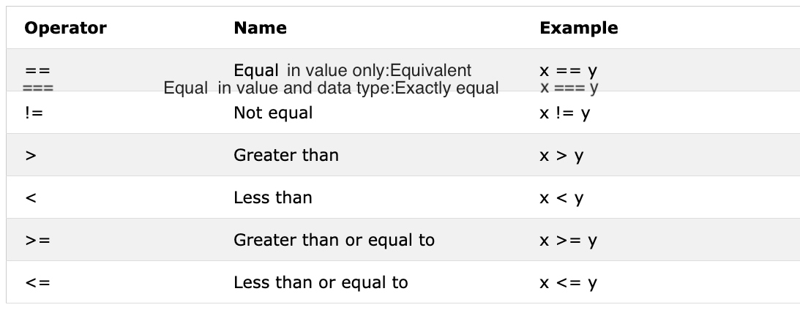

<div align="center">
  <h1> 30 Días De JavaScript: Booleanos, Operadores, Date</h1>
  <a class="header-badge" target="_blank" href="https://www.linkedin.com/in/asabeneh/">
  
  </a>
  <a class="header-badge" target="_blank" href="https://twitter.com/Asabeneh">
  
  </a>

<sub>Autor:
<a href="https://www.linkedin.com/in/asabeneh/" target="_blank">Asabeneh Yetayeh</a><br>
<small> Enero, 2020</small>
</sub>

</div>

[<< Día 2](../dia_02_tipos_de_datos.md) | [Día 4 >>](../dia_04_Condicionales/dia_04_Condicionales.md)


- [📔 Día 3](#-day-3)
  - [Booleanos](#booleanos)
    - [Valores verdaderos](#valores-verdaderos)
    - [Valores falsos](#valores-falsos)
  - [Undefined](#undefined)
  - [Null](#null)
  - [Operadores](#operadores)
    - [Operadores de Asignación](#operadores-de-asignación)
    - [Operadores Aritméticos](#operadores-aritméticos)
    - [Operadores de Comparación](#operadores-de-comparación)
    - [Operadores Lógicos](#operadores-lógicos)
    - [Operadores de Incremento](#operadores-de-incremento)
    - [Operadores de Decremento](#operadores-de-decremento)
    - [Operadores Ternarios](#operadores-ternarios)
    - [Precedencia de Operadores](#precedencia-de-operadores)
  - [Métodos Window](#métodos-window)
    - [Método Window alert()](#método-window-alert)
    - [Método Window prompt() ](#método-window-prompt)
    - [Método Window confirm() ](#método-window-confirm)
  - [Objeto Date](#objeto-date)
    - [Crear un objeto de tiempo](#crear-un-objeto-de-tiempo)
    - [Obtener el año completo](#obtener-el-año-completo)
    - [Obtener mes](#obtener-mes)
    - [Obtener fecha](#obtener-fecha)
    - [Obtener día](#obtener-día)
    - [Obtener horas](#obtener-horas)
    - [Obtener minutos](#obtener-minutos)
    - [Obtener segundos](#obtener-segundos)
    - [Obtener tiempo](#obtener-tiempo)
  - [💻 Día 3: Ejercicios](#💻-día-3-ejercicios)
    - [Ejercicios: Nivel 1](#ejercicios-nivel-1)
    - [Ejercicios: Nivel 2](#ejercicios-nivel-2)
    - [Ejercicios: Nivel 3](#ejercicios-nivel-3)

# 📔 Day 3

## Booleanos

Un tipo de dato booleano representa uno de los dos valores: _true_ o _false_. El valor booleano es true (verdadero) o false (falso) El uso de estos tipos de datos quedará claro cuando veas operadores de comparación. Cualquier comparación devuelve un valor booleano que es true o false.

**Ejemplos: Valores Booleanos**

```js
let isLightOn = true;
let isRaining = false;
let isHungry = false;
let isMarried = true;
let truValue = 4 > 3; // true
let falseValue = 4 < 3; // false
```

Acordamos que los valores booleanos son true o false.

### Valores verdaderos

- Todos los números (positivos y negativos) son verdaderos excepto cero
- Todos las string (cadenas) son verdaderos excepto un string vacío ('')
- El booleano true

### Valores falsos

- 0
- 0n
- null
- undefined
- NaN
- El booleano false
- '', "", ``, string vacío

Es bueno recordar esos valores verdaderos y falsos. En una sección posterior, los usaremos con condiciones para tomar decisiones.

## Undefined

Si declaramos una variable y no le asignamos un valor, el valor será undefined (indefinido). Además de esto, si una función no devuelve el valor, será undefined.

```js
let firstName;
console.log(firstName); //no definido, porque aún no está asignado un valor
```

## Null

```js
let empty = null;
console.log(empty); // -> null (nulo) , significa que no tiene valor
```

## Operadores

### Operadores de Asignación

Un signo igual en JavaScript es un operador de asignación. Se utiliza para asignar una variable.

```js
let firstName = "Asabeneh";
let country = "Finland";
```

Operadores de asignación


### Operadores Aritméticos

Los operadores aritméticos son operadores matemáticos.

- Suma(+): a + b
- Resta(-): a - b
- Multiplicación(\*): a \* b
- División(/): a / b
- Módulo(%): a % b
- Exponencial(**): a ** b

```js
let numOne = 4;
let numTwo = 3;
let sum = numOne + numTwo;
let diff = numOne - numTwo;
let mult = numOne * numTwo;
let div = numOne / numTwo;
let remainder = numOne % numTwo;
let powerOf = numOne ** numTwo;

console.log(sum, diff, mult, div, remainder, powerOf); // 7,1,12,1.33,1, 64
```

```js
const PI = 3.14;
let radius = 100; // longitud en metros

//Calculemos el área de un circulo
const areaOfCircle = PI * radius * radius;
console.log(areaOfCircle); //  314 m

const gravity = 9.81; // en m/s2
let mass = 72; // en Kilogram

// Calculemos el peso de un objeto.
const weight = mass * gravity;
console.log(weight); // 706.32 N(Newton)

const boilingPoint = 100; // temperatura en °C, punto de ebullición del agua
const bodyTemp = 37; // temperatura corporal en °C

// Concatenación de string con números usando interpolación de strings
/*
 El punto de ebullición del agua es de 100 °C.
 La temperatura del cuerpo humano es de 37 oC.
 La gravedad de la tierra es de 9.81 m/s2.
 */
console.log(
  `El punto de ebullición del agua es de ${boilingPoint} °C.\nLa temperatura del cuerpo humano es de ${bodyTemp} °C.\nLa gravedad de la tierra es de ${gravity} m / s2.`
);
```

### Operadores de Comparación

En programación comparamos valores, usamos operadores de comparación para comparar dos valores. Comprobamos si un valor es mayor, menor o igual a otro valor.


**Ejemplos: Operadores de Comparación**

```js
console.log(3 > 2); // true, porque 3 es mayor que 2
console.log(3 >= 2); // true, porque 3 es mayor que 2
console.log(3 < 2); // false,  porque 3 es mayor que 2
console.log(2 < 3); // true, porque 2 es menor que 3
console.log(2 <= 3); // true, porque 2 es menor que 3
console.log(3 == 2); // false, porque 3 no es igual a 2
console.log(3 != 2); // true, porque 3 no es igual a 2
console.log(3 == "3"); // true, compara solamente el valor
console.log(3 === "3"); // false, compara tanto el valor como el tipo de dato
console.log(3 !== "3"); // true, compara tanto el valor como el tipo de dato
console.log(3 != 3); // false, compara solo valor
console.log(3 !== 3); // false, compara tanto el valor como el tipo de dato
console.log(0 == false); // true, equivalente
console.log(0 === false); // false, No exactamente igual
console.log(0 == ""); // true, equivalente
console.log(0 == " "); // true, equivalente
console.log(0 === ""); // false, No exactamente igual
console.log(1 == true); // true, equivalente
console.log(1 === true); // false, No exactamente igual
console.log(undefined == null); // true
console.log(undefined === null); // false
console.log(NaN == NaN); // false, diferente
console.log(NaN === NaN); // false
console.log(typeof NaN); // tipo número

console.log("mango".length == "avocado".length); // false
console.log("mango".length != "avocado".length); // true
console.log("mango".length < "avocado".length); // true
console.log("milk".length == "meat".length); // true
console.log("milk".length != "meat".length); // false
console.log("tomato".length == "potato".length); // true
console.log("python".length > "dragon".length); // false
```

Trate de entender las comparaciones anteriores con algo de lógica. Recuerde que ninguna lógica puede ser difícil.
JavaScript es de alguna manera un lenguaje extraño de programación. El código JavaScript se ejecuta y le da un resultado, pero a menos que sea bueno en él, puede que no sea el resultado deseado.

Como regla general, si un valor no es verdadero con == no será igual con ===. Usar === es más seguro que usar ==. El siguiente [link](https://dorey.github.io/JavaScript-Equality-Table/) tiene una lista exhaustiva de comparaciones de tipos de datos.

### Operadores Lógicos

Los siguientes símbolos son los operadores lógicos más comunes:
&&(ampersand) , ||(pipe) and !(negation).
El operador && se vuelve verdadero sólo si los dos operandos son verdaderos.
El operador || se vuelve verdadero cualquiera de los operandos es verdadero.
El operador ! niega true a false y false a true.

```js
// && ejemplo de operador ampersand

const check = 4 > 3 && 10 > 5; // true && true -> true
const check = 4 > 3 && 10 < 5; // true && false -> false
const check = 4 < 3 && 10 < 5; // false && false -> false

// || ejemplo de operador pipe

const check = 4 > 3 || 10 > 5; // true  || true -> true
const check = 4 > 3 || 10 < 5; // true  || false -> true
const check = 4 < 3 || 10 < 5; // false || false -> false

//! ejemplos de negación

let check = 4 > 3; // true
let check = !(4 > 3); //  false
let isLightOn = true;
let isLightOff = !isLightOn; // false
let isMarried = !false; // true
```

### Operadores de Incremento

En JavaScript usamos el operador de incremento para aumentar un valor almacenado en una variable. El incremento podría ser antes o después del incremento. Veamos cada uno de ellos:

1. Pre-incremento

```js
let count = 0;
console.log(++count); // 1
console.log(count); // 1
```

1. Post-incremento

```js
let count = 0;
console.log(count++); // 0
console.log(count); // 1
```

Usamos la mayor parte del tiempo post-incremento. Pero debes recordar cómo usar el operador de incremento posterior.

### Operadores de Decremento

En JavaScript usamos el operador de decremento para disminuir un valor almacenado en una variable. El decremento puede ser previo o posterior al decremento. Veamos cada uno de ellos:

1. Pre-decremento

```js
let count = 0;
console.log(--count); // -1
console.log(count); // -1
```

2. Post-decremento

```js
let count = 0;
console.log(count--); // 0
console.log(count); // -1
```

### Operadores Ternarios

El operador ternario permite escribir una condición.
Otra forma de escribir condicionales es usando operadores ternarios. Mira los siguientes ejemplos:

```js
let isRaining = true;
isRaining
  ? console.log("Necesitas un impermeable.")
  : console.log("No necesitas un impermeable.");
isRaining = false;

isRaining
  ? console.log("Necesitas un impermeable.")
  : console.log("No necesitas un impermeable.");
```

```sh
Necesitas un impermeable.
No necesitas un impermeable.
```

```js
let number = 5;
number > 0
  ? console.log(`${number} is a positive number`)
  : console.log(`${number} is a negative number`);
number = -5;

number > 0
  ? console.log(`${number} is a positive number`)
  : console.log(`${number} is a negative number`);
```

```sh
5 es un número positivo
-5 es un número negativo
```

### Precedencia de Operadores

Me gustaría recomendarle que lea sobre la precedencia de operadores en el siguiente [link](https://developer.mozilla.org/en-US/docs/Web/JavaScript/Reference/Operators/Operator_Precedence)

## Métodos Window

### Método Window alert()

Cómo ha visto al principio, el método alert() muestra un cuadro de alerta con un mensaje específico y un botón Aceptar. Es un método incorporado y toma un argumento.

```js
alert(message);
```

```js
alert("Bienvenido a 30DaysOfJavaScript");
```

No uses demasiada alert (alertas) porque molesta, úsala solo para probar.

### Método Window prompt()

Los métodos window prompt (entrada) muestran un cuadro de solicitud con una entrada en su navegador para tomar valores de entrada y los datos de entrada se pueden almacenar en una variable. El método prompt() toma dos argumentos. El segundo argumento es opcional.

```js
prompt("texto requerido", "texto opcional");
```

```js
let number = prompt("Ingrese un número", "El número va aquí");
console.log(number);
```

### Método Window confirm()

El método confirm() muestra un cuadro de diálogo con un mensaje específico, junto con un botón Aceptar y Cancelar. Un cuadro de confirmación se usa a menudo para pedir permiso a un usuario para ejecutar algo. Window confirm() toma una cadena como argumento. Al hacer clic en Aceptar se obtiene un valor true, mientras que al hacer clic en el botón Cancelar se obtiene un valor false.

```js
const agree = confirm("¿Estás seguro de que quieres eliminar? ");
console.log(agree); // el resultado será true o false según el click en el cuadro de diálogo
```

Estos no son todos los métodos de window, tendremos una sección separada para profundizar en los métodos de window.

## Objeto Date

El tiempo es una cosa importante. Nos gusta saber la hora de una determinada actividad o evento. En JavaScript, la hora y la fecha actuales se crean utilizando el objeto Date de JavaScript. El objeto que creamos usando el objeto Date proporciona muchos métodos para trabajar con fecha y hora. Los métodos que usamos para obtener información de fecha y hora de los valores de un objeto Date comienzan con una palabra _get_ porque proporciona la información.
_getFullYear(), getMonth(), getDate(), getDay(), getHours(), getMinutes, getSeconds(), getMilliseconds(), getTime(), getDay()_


### Crear un objeto de tiempo

Una vez que creamos el objeto de tiempo. El objeto de tiempo proporcionará información sobre el tiempo. Vamos a crear un objeto de tiempo

```js
const now = new Date();
console.log(now); // Sáb 04 de enero de 2020 00:56:41 GMT+0200 (hora estándar de Europa del Este
```

Hemos creado un objeto de tiempo y podemos acceder a cualquier información de fecha y hora del objeto utilizando los métodos de obtención que hemos mencionado en la tabla.

### Obtener el año completo

Extraigamos u obtengamos el año completo de un objeto de tiempo.

```js
const now = new Date();
console.log(now.getFullYear()); // 2020
```

### Obtener mes

Extraigamos u obtengamos el mes de un objeto de tiempo.

```js
const now = new Date();
console.log(now.getMonth()); // 0, porque el mes es enero, meses(0-11)
```

### Obtener fecha

Extraigamos u obtengamos la fecha del mes de un objeto de tiempo.

```js
const now = new Date();
console.log(now.getDate()); // 4, porque es el 4to dia del mes, día (1-31)
```

### Obtener día

Extraigamos u obtengamos el día de la semana de un objeto de tiempo.

```js
const now = new Date();
console.log(now.getDay()); // 6, porque el día es sábado que es el día 7
// El domingo es 0, el lunes es 1 y el sábado es 6
// Obtener el día de la semana como un número (0-6)
```

### Obtener horas

Extraigamos u obtengamos las horas de un objeto de tiempo.

```js
const now = new Date();
console.log(now.getHours()); // 0, porque el tiempo es 00:56:41
```

### Obtener minutos

Extraigamos u obtengamos los minutos de un objeto de tiempo.

```js
const now = new Date();
console.log(now.getMinutes()); // 56, porque el tiempo es 00:56:41
```

### Obtener segundos

Extraigamos u obtengamos los segundos de un objeto de tiempo.

```js
const now = new Date();
console.log(now.getSeconds()); // 41, porque el tiempo es 00:56:41
```

### Obtener tiempo

Este método da tiempo en milisegundos a partir del 1 de enero de 1970. También se conoce como tiempo Unix. Podemos obtener el tiempo de Unix de dos maneras:

1. Usando _getTime()_

```js
const now = new Date(); //
console.log(now.getTime()); // 1578092201341, este es el número de segundos que han pasado desde el 1ero de Enero de 1970 al 4 de Enero del 2020 00:56:41
```

2. Usando _Date.now()_

```js
const allSeconds = Date.now(); //
console.log(allSeconds); // 1578092201341, este es el número de segundos que han pasado desde el 1ero de Enero de 1970 al 4 de Enero del 2020 00:56:41

const timeInSeconds = new Date().getTime();
console.log(allSeconds == timeInSeconds); // true
```

Vamos a formatear estos valores a un formato de tiempo legible por humanos.
**Ejemplo:**

```js
const now = new Date();
const year = now.getFullYear(); // return años
const month = now.getMonth() + 1; // return meses(0 - 11)
const date = now.getDate(); // return días (1 - 31)
const hours = now.getHours(); // return horas (0 - 23)
const minutes = now.getMinutes(); // return minutos (0 -59)

console.log(`${date}/${month}/${year} ${hours}:${minutes}`); // 4/1/2020 0:56
```

🌕 Tienes una energía ilimitada. Acabas de completar los desafíos del día 3 y estás a tres pasos de tu camino hacia la grandeza. Ahora haz algunos ejercicios para tu cerebro y tus músculos.

## 💻 Día 3: Ejercicios

### Ejercicios: Nivel 1

1. Declare las siguientes variables; firstName, lastName, country, city, age, isMarried, year y asignar un valor, use el operador typeof para verificar diferentes tipos de datos.
2. Verifique si typeof '10' es igual a 10
3. Verifique si parseInt('9.8') es igual a 10
4. Verifique cualquier valor booleano true o false.

   1. Escriba tres declaraciones de JavaScript que proporcionen un valor verdadero.
   2. Escriba tres declaraciones de JavaScript que proporcionen un valor falso.

5. Calcule primero el resultado de la siguiente expresión de comparación sin usar console.log(). Después de decidir el resultado, confirmelo usando console.log()

   1. 4 > 3
   2. 4 >= 3
   3. 4 < 3
   4. 4 <= 3
   5. 4 == 4
   6. 4 === 4
   7. 4 != 4
   8. 4 !== 4
   9. 4 != '4'
   10. 4 == '4'
   11. 4 === '4'
   12. Encuentre la longitud de Python y jargon y haga una declaración de comparación falsa.

6. Calcule primero el resultado de las siguientes expresiones sin usar console.log(). Después de decidir el resultado, confirmelo usando console.log()

   1. 4 > 3 && 10 < 12
   2. 4 > 3 && 10 > 12
   3. 4 > 3 || 10 < 12
   4. 4 > 3 || 10 > 12
   5. !(4 > 3)
   6. !(4 < 3)
   7. !(false)
   8. !(4 > 3 && 10 < 12)
   9. !(4 > 3 && 10 > 12)
   10. !(4 === '4')
   11. No hay 'on' tanto en dragon como en python

7. Utilice el objeto Date para realizar las siguientes actividades
   1. ¿Qué año es hoy?
   2. ¿Qué mes es hoy con un número?
   3. ¿Qué fecha es hoy?
   4. ¿Qué día es hoy con un número?
   5. ¿Cuál es la hora actual?
   6. ¿Cuántos minutos hay actualmente?
   7. Averigüe el número de segundos transcurridos desde el 1 de enero de 1970 hasta ahora.

### Ejercicios: Nivel 2

1. Escriba un script que solicite al usuario que ingrese la base y la altura del triángulo y calcule el área de un triángulo (área = 0,5 x b x h).

   ```sh
   Ingrese base: 20
   Ingrese altura: 10
   El área del triángulo es: 100
   ```

1. Escriba un script que solicite al usuario que ingrese el lado a, el lado b y el lado c del triángulo y calcule el perímetro del triángulo (perímetro = a + b + c)

   ```sh
   Ingrese lado a: 5
   Ingrese lado b: 4
   Ingrese lado c: 3
   El perimetro del triangulo es: 12
   ```

1. Obtenga el largo y el ancho usando prompt y calcule el área del rectángulo (área = largo x ancho y el perímetro del rectángulo (perímetro = 2 x (largo + ancho))
1. Obtenga el radio usando prompt y calcule el área de un círculo (área = pi x r x r) y la circunferencia de un círculo (c = 2 x pi x r) donde pi = 3.14.
1. Calcule la pendiente, la intersección X y la intersección Y de y = 2x -2
1. La pendiente es m = (y<sub>2</sub>-y<sub>1</sub>)/(x<sub>2</sub>-x<sub>1</sub>). Encuentra la pendiente entre el punto (2, 2) y el punto (6,10)
1. Compare la pendiente de las dos preguntas anteriores.
1. Calcula el valor de y (y = x<sup>2</sup> + 6x + 9). Trate de usar diferentes valores de x y averigüe en qué valor de x y es 0.
1. Escriba un script con prompt que solicite al usuario que ingrese las horas y la tarifa por hora. ¿Calcular el salario de la persona?

   ```sh
   Ingrese horas: 40
   Introduce la tarifa por hora: 28
   Su ganancia semanal es 1120
   ```

1. Si la longitud de su nombre es mayor que 7, diga que su nombre es largo; de lo contrario, diga que su nombre es corto.
1. Compare la longitud de su nombre y la longitud de su apellido y debería obtener este resultado.

   ```js
   let firstName = "Asabeneh";
   let lastName = "Yetayeh";
   ```

   ```sh
   Tu primer nombre, Asabeneh, es más largo que tu apellido, Yetayeh.
   ```

1. Declare dos variables _myAge_ y _yourAge_ y asignarles los valores iniciales y myAge y yourAge.

   ```js
   let myAge = 250;
   let yourAge = 25;
   ```

   ```sh
   Soy 225 años mayor que tú.
   ```

1. Usando prompt, obtenga el año en que nació el usuario y, si el usuario tiene 18 años o más, permita que el usuario conduzca, si no dígale que espere una cierta cantidad de años.

   ```sh

   Introduzca el año de nacimiento: 1995
   Tienes 25 años. Tienes la edad suficiente para conducir.

   Introduzca el año de nacimiento: 2005
   Tienes 15 años. Podrás conducir después de 3 años.
   ```

1. Escriba un script que solicite por prompt al usuario que ingrese el número de años. Calcular el número de segundos que puede vivir una persona. Supongamos que alguien vive solo cien años

   ```sh
   Ingrese el número de años de vida: 100
    Viviste 3153600000 segundos.
   ```

1. Cree un formato de hora legible por humanos usando el objeto Date.
   1. YYYY-MM-DD HH:mm
   2. DD-MM-YYYY HH:mm
   3. DD/MM/YYYY HH:mm

### Ejercicios: Nivel 3

1. Cree un formato de hora legible por humanos usando el objeto Date. La hora y el minuto deben ser siempre dos dígitos (7 horas deben ser 07 y 5 minutos deben ser 05)
   1. YYY-MM-DD HH:mm eg. 20120-01-02 07:05

[<< Día 2](../dia_02_tipos_de_datos.md) | [Día 4 >>](../dia_04_Condicionales/dia_04_Condicionales.md)
