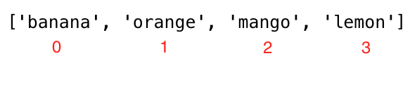

<div align="center">
  <h1> 30 Días de JavaScript: Arrays</h1>
  <a class="header-badge" target="_blank" href="https://www.linkedin.com/in/asabeneh/">
  
  </a>
  <a class="header-badge" target="_blank" href="https://twitter.com/Asabeneh">
  
  </a>

<sub>Autor:
<a href="https://www.linkedin.com/in/asabeneh/" target="_blank">Asabeneh Yetayeh</a><br>
<small> January, 2020</small>
</sub>

</div>

[<< Día 4](../dia_04_Condicionales/dia_04_Condicionales.md) | [Día 6 >>](../dia_06_Bucles/dia_06_bucles.md)


- [📔 Día 5](#📔-día-5)
  - [Arrays](#arrays)
    - [Como crear un array vacío](#como-crear-un-array-vacío)
    - [Como crear un array con valores](#como-crear-un-array-con-valores)
    - [Creando un array usando split](#creando-un-array-usando-split)
    - [Acceder a los elementos de un array usando el index](#acceder-a-los-elementos-de-un-array-usando-el-index)
    - [Modificar elementos de array](#modificar-elementos-de-array)
    - [Métodos para manipular arrays](#métodos-para-manipular-arrays)
      - [Constructor de arrays](#constructor-de-arrays)
      - [Creando valores estáticos con fill](#creando-valores-estáticos-con-fill)
      - [Concatenación de arrays usando concat](#concatenación-de-arrays-usando-concat)
      - [Obtener la longitud de array](#obtener-la-longitud-de-array)
      - [Obtener el index de un elemento en un array](#obtener-el-index-de-un-elemento-en-un-array)
      - [Obtener el último index de un elemento en un array](#obtener-el-último-index-de-un-elemento-en-un-array)
      - [Comprobar un array](#comprobar-un-array)
      - [Convertir array a string](#convertir-array-a-string)
      - [Unir elementos de un array](#unir-elementos-de-un-array)
      - [Cortar elementos de un array](#cortar-elementos-de-un-array)
      - [Método splice en un array](#método-splice-en-un-array)
      - [Agregar elementos a un array usando push](#agregar-elementos-a-un-array-usando-push)
      - [Eliminar el último elemento usando pop](#eliminar-el-último-elemento-usando-pop)
      - [Eliminar elemento al principio](#eliminar-elemento-al-principio)
      - [Añade un elemento al inicio](#añade-un-elemento-al-inicio)
      - [Invertir orden de un array](#invertir-orden-de-un-array)
      - [Ordenar elementos en un array](#ordenar-elementos-en-un-array)
    - [Array de arrays](#array-de-arrays)
  - [💻 Ejercicios](#💻-ejercicios)
    - [Ejercicios: Nivel 1](#ejercicios-nivel-1)
    - [Ejercicios: Nivel 2](#ejercicios-nivel-2)
    - [Ejercicios: Nivel 3](#ejercicios-nivel-3)

# 📔 Día 5

## Arrays

A diferencia de las variables, un array (matriz ó arreglo) puede almacenar _múltiples valores_.Cada valor en un array tiene un _index_ y cada index (índice) tiene _una referencia en una dirección de memoria_. Se puede acceder a cada valor usando sus _index_. El index de un array comienza desde _cero_, y el index del último elemento es menor a uno desde la longitud del array.

Un array es una colección de diferentes tipos de datos que están ordenados y son cambiables (modificables). Un array permite almacenar elementos duplicados y diferentes tipos de datos. Un array puede estar vacío o puede tener diferentes valores de diferentes tipos de datos.

### Como crear un array vacío

En JavaScript, podemos crear una array de diferentes maneras. Veamos diferentes formas de crear un array.
Es muy común usar _const_ en lugar de _let_ para declarar una variable array. Si está utilizando const, significa que no volverás a utilizar ese nombre de variable.

- Usando el constructor de arrays

```js
// sintaxis
const arr = Array();
// or
// let arr = new Array()
console.log(arr); // []
```

- Usando corchetes([])

```js
// sintaxis
// Esto es lo más recomendable para crear una lista vacía
const arr = [];
console.log(arr);
```

### Como crear un array con valores

Array con valores iniciales. Usamos _length_ para encontrar la longitud del array.

```js
const numbers = [0, 3.14, 9.81, 37, 98.6, 100]; // array de  números
const fruits = ["banana", "orange", "mango", "lemon"]; // array de strings, Fruits
const vegetables = ["Tomato", "Potato", "Cabbage", "Onion", "Carrot"]; // array de strings, vegetables
const animalProducts = ["milk", "meat", "butter", "yoghurt"]; // array de strings, products
const webTechs = ["HTML", "CSS", "JS", "React", "Redux", "Node", "MongDB"]; // array web, technology
const countries = ["Finland", "Denmark", "Sweden", "Norway", "Iceland"]; // array de strings, country

// Imprimimos el array y su longitud

console.log("Numbers:", numbers);
console.log("Number of numbers:", numbers.length);

console.log("Fruits:", fruits);
console.log("Number of fruits:", fruits.length);

console.log("Vegetables:", vegetables);
console.log("Number of vegetables:", vegetables.length);

console.log("Animal products:", animalProducts);
console.log("Number of animal products:", animalProducts.length);

console.log("Web technologies:", webTechs);
console.log("Number of web technologies:", webTechs.length);

console.log("Countries:", countries);
console.log("Number of countries:", countries.length);
```

```sh
Numbers: [0, 3.14, 9.81, 37, 98.6, 100]
Number of numbers: 6
Fruits: ['banana', 'orange', 'mango', 'lemon']
Number of fruits: 4
Vegetables: ['Tomato', 'Potato', 'Cabbage', 'Onion', 'Carrot']
Number of vegetables: 5
Animal products: ['milk', 'meat', 'butter', 'yoghurt']
Number of animal products: 4
Web technologies: ['HTML', 'CSS', 'JS', 'React', 'Redux', 'Node', 'MongDB']
Number of web technologies: 7
Countries: ['Finland', 'Estonia', 'Denmark', 'Sweden', 'Norway']
Number of countries: 5
```

- Array puede tener elementos de diferentes tipos de datos

```js
const arr = [
  "Asabeneh",
  250,
  true,
  { country: "Finland", city: "Helsinki" },
  { skills: ["HTML", "CSS", "JS", "React", "Python"] },
]; // arr contiene diferentes tipos de datos
console.log(arr);
```

### Creando un array usando split

Como hemos visto en la sección anterior, podemos dividir un string en diferentes posiciones y podemos cambiar a un array. Veamos los ejemplos a continuación

```js
let js = "JavaScript";
const charsInJavaScript = js.split("");

console.log(charsInJavaScript); // ["J", "a", "v", "a", "S", "c", "r", "i", "p", "t"]

let companiesString = "Facebook, Google, Microsoft, Apple, IBM, Oracle, Amazon";
const companies = companiesString.split(",");

console.log(companies); // ["Facebook", " Google", " Microsoft", " Apple", " IBM", " Oracle", " Amazon"]
let txt =
  "I love teaching and empowering people. I teach HTML, CSS, JS, React, Python.";
const words = txt.split(" ");

console.log(words);
// el texto tiene caracteres especiales piensa cómo puedes obtener solo las palabras
// ["I", "love", "teaching", "and", "empowering", "people.", "I", "teach", "HTML,", "CSS,", "JS,", "React,", "Python"]
```

### Acceder a los elementos de un array usando el index

Accedemos a cada elemento en un array usando su index. El index de un array comienza desde 0. La siguiente imagen muestra claramente el index de cada elemento en un array



```js
const fruits = ["banana", "orange", "mango", "lemon"];
let firstFruit = fruits[0]; // estamos accediendo al primer elemento usando su index

console.log(firstFruit); // banana

secondFruit = fruits[1];
console.log(secondFruit); // orange

let lastFruit = fruits[3];
console.log(lastFruit); // lemon
// El último index se puede calcular de la siguiente manera

let lastIndex = fruits.length - 1;
lastFruit = fruits[lastIndex];

console.log(lastFruit); // lemon
```

```js
const numbers = [0, 3.14, 9.81, 37, 98.6, 100]; // set of numbers

console.log(numbers.length); // => para saber el tamaño de la array, que es 6
console.log(numbers); // -> [0, 3.14, 9.81, 37, 98.6, 100]
console.log(numbers[0]); //  -> 0
console.log(numbers[5]); //  -> 100

let lastIndex = numbers.length - 1;
console.log(numbers[lastIndex]); // -> 100
```

```js
const webTechs = [
  "HTML",
  "CSS",
  "JavaScript",
  "React",
  "Redux",
  "Node",
  "MongoDB",
]; // Lista de tecnologías web

console.log(webTechs); // Todos los elementos del array
console.log(webTechs.length); // => para saber el tamaño de la array, que es 7
console.log(webTechs[0]); //  -> HTML
console.log(webTechs[6]); //  -> MongoDB

let lastIndex = webTechs.length - 1;
console.log(webTechs[lastIndex]); // -> MongoDB
```

```js
const countries = [
  "Albania",
  "Bolivia",
  "Canada",
  "Denmark",
  "Ethiopia",
  "Finland",
  "Germany",
  "Hungary",
  "Ireland",
  "Japan",
  "Kenya",
]; // Lista de países

console.log(countries); // -> Todas los países del array
console.log(countries[0]); //  -> Albania
console.log(countries[10]); //  -> Kenya

let lastIndex = countries.length - 1;
console.log(countries[lastIndex]); //  -> Kenya
```

```js
const shoppingCart = [
  "Milk",
  "Mango",
  "Tomato",
  "Potato",
  "Avocado",
  "Meat",
  "Eggs",
  "Sugar",
]; // Lista de productos alimenticios

console.log(shoppingCart); // -> todo el carrito de compras en array
console.log(shoppingCart[0]); //  -> Milk
console.log(shoppingCart[7]); //  -> Sugar

let lastIndex = shoppingCart.length - 1;
console.log(shoppingCart[lastIndex]); //  -> Sugar
```

### Modificar elementos de array

Un array es mutable (modificable). Una vez que un array es creado, podemos modificar el contenido de los elementos del array.

```js
const numbers = [1, 2, 3, 4, 5];
numbers[0] = 10; // cambiando 1 en el índice 0 a 10
numbers[1] = 20; // cambiando 2 en el índice 1 a 20

console.log(numbers); // [10, 20, 3, 4, 5]

const countries = [
  "Albania",
  "Bolivia",
  "Canada",
  "Denmark",
  "Ethiopia",
  "Finland",
  "Germany",
  "Hungary",
  "Ireland",
  "Japan",
  "Kenya",
];

countries[0] = "Afghanistan"; // Sustitución de Albania por Afganistán
let lastIndex = countries.length - 1;
countries[lastIndex] = "Korea"; // Sustitución de Kenia por Corea
console.log(countries);
```

```sh
["Afghanistan", "Bolivia", "Canada", "Denmark", "Ethiopia", "Finland", "Germany", "Hungary", "Ireland", "Japan", "Korea"]
```

### Métodos para manipular arrays

Existen diferentes métodos para manipular un array. Estos son algunos de los métodos disponibles para manejar arrays:_Array, length, concat, indexOf, slice, splice, join, toString, includes, lastIndexOf, isArray, fill, push, pop, shift, unshift_

#### Constructor de arrays

Array:Para crear un array.

```js
const arr = Array(); // crea un array vacío
console.log(arr);

const eightEmptyValues = Array(8); // crea ocho valores vacíos
console.log(eightEmptyValues); // [empty x 8]
```

#### Creando valores estáticos con fill

fill: Rellena todos los elementos del array con un valor estático.

```js
const arr = Array(); // crea un array vacío
console.log(arr);

const eightXvalues = Array(8).fill("X"); // crea ocho valores de elementos llenos de 'X'
console.log(eightXvalues); // ['X', 'X','X','X','X','X','X','X']

const eight0values = Array(8).fill(0); // crea ocho valores de elementos llenos de '0'
console.log(eight0values); // [0, 0, 0, 0, 0, 0, 0, 0]

const four4values = Array(4).fill(4); // crea 4 valores de elementos llenos de '4'
console.log(four4values); // [4, 4, 4, 4]
```

#### Concatenación de arrays usando concat

concat:Para concatenar dos arrays.

```js
const firstList = [1, 2, 3];
const secondList = [4, 5, 6];
const thirdList = firstList.concat(secondList);

console.log(thirdList); // [1, 2, 3, 4, 5, 6]
```

```js
const fruits = ["banana", "orange", "mango", "lemon"]; // array de fruits
const vegetables = ["Tomato", "Potato", "Cabbage", "Onion", "Carrot"]; // array de vegetables
const fruitsAndVegetables = fruits.concat(vegetables); // concatena los dos arrays

console.log(fruitsAndVegetables);
```

```sh
["banana", "orange", "mango", "lemon", "Tomato", "Potato", "Cabbage", "Onion", "Carrot"]
```

#### Obtener la longitud de array

Length:Para saber el tamaño del array

```js
const numbers = [1, 2, 3, 4, 5];
console.log(numbers.length); // -> 5 es el tamaño del array
```

#### Obtener el index de un elemento en un array

indexOf:Para verificar si un elemento existe en un array. Si existe, devuelve el index, de lo contrario devuelve -1.

```js
const numbers = [1, 2, 3, 4, 5];

console.log(numbers.indexOf(5)); // -> 4
console.log(numbers.indexOf(0)); // -> -1
console.log(numbers.indexOf(1)); // -> 0
console.log(numbers.indexOf(6)); // -> -1
```

Comprobar si un elemento existe en un array.

- Comprobar elementos en una lista

```js
// vamos a comprobar si existe banana en el array

const fruits = ["banana", "orange", "mango", "lemon"];
let index = fruits.indexOf("banana"); // 0

if (index === -1) {
  console.log("Esta fruta no existe en el array.");
} else {
  console.log("Esta fruta existe en el array.");
}
// Esta fruta existe en el array.

// we can use also ternary here
index === -1
  ? console.log("Esta fruta no existe en el array.")
  : console.log("Esta fruta existe en el array.");

// let us check if an avocado exist in the array
let indexOfAvocado = fruits.indexOf("avocado"); // -1, if the element not found index is -1
if (indexOfAvocado === -1) {
  console.log("Esta fruta no existe en el array.");
} else {
  console.log("Esta fruta existe en el array.");
}
// Esta fruta no existe en el array.
```

#### Obtener el último index de un elemento en un array

lastIndexOf: Da la posición del último elemento en el array. Si existe, devuelve el index, de lo contrario, devuelve -1.

```js
const numbers = [1, 2, 3, 4, 5, 3, 1, 2];

console.log(numbers.lastIndexOf(2)); // 7
console.log(numbers.lastIndexOf(0)); // -1
console.log(numbers.lastIndexOf(1)); //  6
console.log(numbers.lastIndexOf(4)); //  3
console.log(numbers.lastIndexOf(6)); // -1
```

includes:Para verificar si un elemento existe en un array. Si existe, devuelve true, de lo contrario devuelve false.

```js
const numbers = [1, 2, 3, 4, 5];

console.log(numbers.includes(5)); // true
console.log(numbers.includes(0)); // false
console.log(numbers.includes(1)); // true
console.log(numbers.includes(6)); // false

const webTechs = [
  "HTML",
  "CSS",
  "JavaScript",
  "React",
  "Redux",
  "Node",
  "MongoDB",
]; // Lista de tecnologías web

console.log(webTechs.includes("Node")); // true
console.log(webTechs.includes("C")); // false
```

#### Comprobar un array

Array.isArray:Para verificar si el tipo de dato en un array

```js
const numbers = [1, 2, 3, 4, 5];
console.log(Array.isArray(numbers)); // true

const number = 100;
console.log(Array.isArray(number)); // false
```

#### Convertir array a string

toString:Convierte un array a string

```js
const numbers = [1, 2, 3, 4, 5];
console.log(numbers.toString()); // 1,2,3,4,5

const names = ["Asabeneh", "Mathias", "Elias", "Brook"];
console.log(names.toString()); // Asabeneh,Mathias,Elias,Brook
```

#### Unir elementos de un array

join: Se usa para unir los elementos del array, el argumento que pasamos en el método join se unirá en array y regresará como una cadena. De forma predeterminada, se une con una coma, pero podemos pasar diferentes parámetros de string que se pueden unir entre los elementos.

```js
const numbers = [1, 2, 3, 4, 5];
console.log(numbers.join()); // 1,2,3,4,5

const names = ["Asabeneh", "Mathias", "Elias", "Brook"];

console.log(names.join()); // Asabeneh,Mathias,Elias,Brook
console.log(names.join("")); //AsabenehMathiasEliasBrook
console.log(names.join(" ")); //Asabeneh Mathias Elias Brook
console.log(names.join(", ")); //Asabeneh, Mathias, Elias, Brook
console.log(names.join(" # ")); //Asabeneh # Mathias # Elias # Brook

const webTechs = [
  "HTML",
  "CSS",
  "JavaScript",
  "React",
  "Redux",
  "Node",
  "MongoDB",
]; // Lista de tecnologías web

console.log(webTechs.join()); // "HTML,CSS,JavaScript,React,Redux,Node,MongoDB"
console.log(webTechs.join(" # ")); // "HTML # CSS # JavaScript # React # Redux # Node # MongoDB"
```

#### Cortar elementos de un array

Slice: Para cortar varios elementos en el rango. Toma dos parámetros: posición inicial y final. Puede no incluir la posición final

```js
const numbers = [1, 2, 3, 4, 5];

console.log(numbers.slice()); // -> copia todos los elementos
console.log(numbers.slice(0)); // -> copia todos los elementos
console.log(numbers.slice(0, numbers.length)); // copia todos los elementos
console.log(numbers.slice(1, 4)); // -> [2,3,4] // no incluye la posición final
```

#### Método splice en un array

Splice: Toma tres parámetros: posición inicial, número de elementos a eliminar y cantidad de elementos que se agregarán.

```js
const numbers = [1, 2, 3, 4, 5];
numbers.splice();
console.log(numbers); // -> elimina todos los elementos
```

```js
const numbers = [1, 2, 3, 4, 5];
numbers.splice(0, 1);
console.log(numbers); // elimina el primer elemento
```

```js
const numbers = [1, 2, 3, 4, 5, 6];
numbers.splice(3, 3, 7, 8, 9);
console.log(numbers.splice(3, 3, 7, 8, 9)); // -> [1, 2, 3, 7, 8, 9] //elimina tres elementos y reemplaza tres elementos
```

#### Agregar elementos a un array usando push

Push: agrega elementos al final. Para agregar un elemento al final de un array existente, usamos el método push.

```js
// syntax
const arr = ["item1", "item2", "item3"];
arr.push("new item");
console.log(arr);
// ['item1', 'item2','item3','new item']
```

```js
const numbers = [1, 2, 3, 4, 5];
numbers.push(6);
console.log(numbers); // -> [1,2,3,4,5,6]

numbers.pop(); // -> eliminar un elemento del final
console.log(numbers); // -> [1,2,3,4,5]
```

```js
let fruits = ["banana", "orange", "mango", "lemon"];
fruits.push("apple");
console.log(fruits); // ['banana', 'orange', 'mango', 'lemon', 'apple']

fruits.push("lime");
console.log(fruits); // ['banana', 'orange', 'mango', 'lemon', 'apple', 'lime']
```

#### Eliminar el último elemento usando pop

pop: Elimina el elemento final.

```js
const numbers = [1, 2, 3, 4, 5];
numbers.pop(); // -> eliminar un elemento del final
console.log(numbers); // -> [1,2,3,4]
```

#### Eliminar elemento al principio

shift: Eliminación de un elemento de un array al comienzo de un array.

```js
const numbers = [1, 2, 3, 4, 5];
numbers.shift(); // -> elimina un elemento del principio
console.log(numbers); // -> [2,3,4,5]
```

#### Añade un elemento al inicio

unshift: Agrega un elemento al inicio del array

```js
const numbers = [1, 2, 3, 4, 5];
numbers.unshift(0); // -> Añadir un elemento al inicio
console.log(numbers); // -> [0,1,2,3,4,5]
```

#### Invertir orden de un array

reverse: invertir el orden de un array.

```js
const numbers = [1, 2, 3, 4, 5];
numbers.reverse(); // -> reverse array order
console.log(numbers); // [5, 4, 3, 2, 1]

numbers.reverse();
console.log(numbers); // [1, 2, 3, 4, 5]
```

#### Ordenar elementos en un array

sort: Ordena los elementos de un array en orden ascendente. Sort toma una función call back, Veremos cómo usamos sort con una función call back en las próximas secciones.

```js
const webTechs = [
  "HTML",
  "CSS",
  "JavaScript",
  "React",
  "Redux",
  "Node",
  "MongoDB",
];

webTechs.sort();
console.log(webTechs); // ["CSS", "HTML", "JavaScript", "MongoDB", "Node", "React", "Redux"]

webTechs.reverse(); // after sorting we can reverse it
console.log(webTechs); // ["Redux", "React", "Node", "MongoDB", "JavaScript", "HTML", "CSS"]
```

### Array de arrays

Un array puede almacenar diferentes tipos de datos, incluido un array en sí mismo. Vamos a crear un array de arrays

```js
const firstNums = [1, 2, 3];
const secondNums = [1, 4, 9];

const arrayOfArray = [
  [1, 2, 3],
  [1, 2, 3],
];
console.log(arrayOfArray[0]); // [1, 2, 3]

const frontEnd = ["HTML", "CSS", "JS", "React", "Redux"];
const backEnd = ["Node", "Express", "MongoDB"];
const fullStack = [frontEnd, backEnd];
console.log(fullStack); // [["HTML", "CSS", "JS", "React", "Redux"], ["Node", "Express", "MongoDB"]]
console.log(fullStack.length); // 2
console.log(fullStack[0]); // ["HTML", "CSS", "JS", "React", "Redux"]
console.log(fullStack[1]); // ["Node", "Express", "MongoDB"]
```

🌕 Tienes una energía ilimitada. Acabas de completar los desafíos del día 5 y llevas cinco pasos de tu camino hacia la grandeza. Ahora haz algunos ejercicios para tu cerebro y tus músculos.

## 💻 Ejercicios

### Ejercicios: Nivel 1

```js
const countries = [
  "Albania",
  "Bolivia",
  "Canada",
  "Denmark",
  "Ethiopia",
  "Finland",
  "Germany",
  "Hungary",
  "Ireland",
  "Japan",
  "Kenya",
];

const webTechs = [
  "HTML",
  "CSS",
  "JavaScript",
  "React",
  "Redux",
  "Node",
  "MongoDB",
];
```

1. Declara un array _vacío_.
2. Declara un array com mas de 5 elementos.
3. Encuentra la longitud de tu array.
4. Obtenga el primer elemento, el elemento del medio y el último elemento de un array.
5. Declara un array llamado _mixedDataTypes_, coloque diferentes tipos de datos en el array y encuentre la longitud del array. El tamaño del array debe ser mayor que 5.
6. Declare un variable array de nombre _itCompanies_ y asignarles valores iniciales Facebook, Google, Microsoft, Apple, IBM, Oracle y Amazon.
7. Imprima el array usando _console.log()_.
8. Imprima el número de empresas en el array.
9. Imprime la primer empresa , la intermedia y la última empresa
10. Imprime cada empresa.
11. Cambie el nombre de cada empresa a mayúsculas uno por uno e imprímalos.
12. Imprime el array como una oración: Facebook, Google, Microsoft, Apple, IBM, Oracle y Amazon son grandes empresas de TI.
13. Compruebe si existe una determinada empresa en el array itCompanies. Si existe, retorna la empresa; de lo contrario, retorna la empresa _no existe_
14. Filtre las empresas que tienen más de una 'o' sin el método _filter()_
15. Ordene el array usando el método _sort()_
16. Invierte la array usando el método _reverse()_
17. Cortar las primeras 3 empresas del array
18. Cortar las últimas 3 empresas del array
19. Cortar la empresa o empresas intermedias de TI del array
20. Eliminar la primera empresa de TI del array
21. Eliminar la empresa o empresas intermedias de TI del array
22. Elimine la última empresa de TI del array
23. Eliminar todas las empresas de TI

### Ejercicios: Nivel 2

1. Cree un archivo de countries.js separado y almacene el array de países en este archivo, cree un archivo separado web_techs.js y almacene el array de webTechs en este archivo. Acceda a ambos archivos en el archivo main.js
1. Primero elimine todos los signos de puntuación y cambie de string a array y cuente el número de palabras en el array

   ```js
   let text =
     "I love teaching and empowering people. I teach HTML, CSS, JS, React, Python.";
   console.log(words);
   console.log(words.length);
   ```

   ```sh
   ["I", "love", "teaching", "and", "empowering", "people", "I", "teach", "HTML", "CSS", "JS", "React", "Python"]

   13
   ```

1. En el siguiente carrito de compras agregue, elimine, edite artículos

   ```js
   const shoppingCart = ["Milk", "Coffee", "Tea", "Honey"];
   ```

   - Agregue 'Meat' al comienzo de su carrito de compras si aún no se ha agregado
   - Agregue 'Sugar' al final de su carrito de compras si aún no se ha agregado
   - Elimine 'Honey' si es alérgico a la miel (honey)
   - Modificar Tea a 'Green Tea'

1. En el array de países, verifique si 'Ethiopia' existe en el array si existe, imprima 'ETHIOPIA'. Si no existe agregar a la lista de países.
1. En el array webTechs, verifique si Sass existe en el array y si existe, imprima 'Sass es un preproceso de CSS'. Si no existe, agregue Sass al array e imprima el array.
1. Concatene las siguientes dos variables y guardelas en una variable fullStack.

   ```js
   const frontEnd = ["HTML", "CSS", "JS", "React", "Redux"];
   const backEnd = ["Node", "Express", "MongoDB"];

   console.log(fullStack);
   ```

   ```sh
   ["HTML", "CSS", "JS", "React", "Redux", "Node", "Express", "MongoDB"]
   ```

### Ejercicios: Nivel 3

1.  El siguiente es un array de 10 edades de estudiantes:

        ```js
        const ages = [19, 22, 19, 24, 20, 25, 26, 24, 25, 24]
        ```

        - Ordene el array y encuentre la edad mínima y máxima
        - Encuentre la edad media (un elemento intermedio o dos elementos intermedios divididos por dos)
        - Encuentre la edad promedio (todos los elementos divididos por el número de elementos)
        - Encuentre el rango de las edades (max menos min)
        - Compare el valor de (mín - promedio) y (máx - promedio), use el método _abs()_

    1.Cortar los diez primeros países de la [array de países](https://github.com/Asabeneh/30DaysOfJavaScript/tree/master/data/countries.js)

1.  Encuentre el país o países de en medio en el [array de países](https://github.com/Asabeneh/30DaysOfJavaScript/tree/master/data/countries.js)
1.  Divide el array de países en dos arrays iguales si es par. Si el array de países no es par, agregue un país más para la primera mitad.

🎉 ¡Felicitaciones! 🎉

[<< Día 4](../dia_04_Condicionales/dia_04_Condicionales.md) | [Día 6 >>](../dia_06_Bucles/dia_06_bucles.md)
