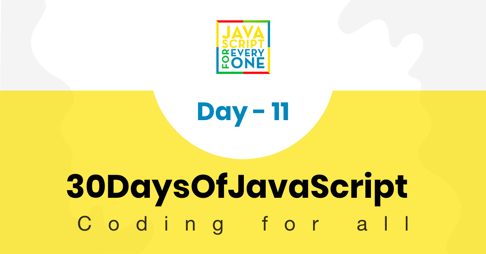

<div align="center">
  <h1> 30 Días de JavaScript: Desestructuración y Spreading</h1>
  <a class="header-badge" target="_blank" href="https://www.linkedin.com/in/asabeneh/">
  
  </a>
  <a class="header-badge" target="_blank" href="https://twitter.com/Asabeneh">
  
  </a>

<sub>Autor:
<a href="https://www.linkedin.com/in/asabeneh/" target="_blank">Asabeneh Yetayeh</a><br>
<small> Enero, 2020</small>
</sub>

</div>

[<< Día 10](../dia_10_Sets_y_Maps/dia_10_sets_y_maps.md) | [Día 12>>](../dia_12_Expresiones_Regulares/dia_12_expresiones_regulares.md)



- [Day 11](#día-11)
  - [Desestructuración y Spread](#desestructuración-y-spread)
    - [Desestructuración de Arrays](#desestructuración-de-arrays)
    - [Desestructuración durante la iteración](#desestructuración-durante-la-iteración)
    - [Desestructuración de objetos](#desestructuración-de-objetos)
    - [Renombrar durante la estructuración](#renombrar-durante-la-estructuración)
    - [Parámetro de objeto sin desestructuración](#parámetro-de-objeto-sin-desestructuración)
    - [Parámetro de objeto con desestructuración](#parámetro-de-objeto-con-desestructuración)
    - [Desestructuración del objeto durante la iteración](#desestructuración-del-objeto-durante-la-iteración)
    - [Operador Spread o Rest](#operador-spread-o-rest)
    - [Operador Spread para obtener el resto de elementos del array](#operador-spread-para-obtener-el-resto-de-elementos-del-array)
    - [Spread operator to copy array](#spread-operator-to-copy-array)
    - [Spread operator to copy object](#spread-operator-to-copy-object)
      - [Operador Spread con función flecha](#operador-spread-con-función-flecha)
  - [Ejercicios](#ejercicios)
    - [Ejercicios: Nivel 1](#ejercicios-nivel-1)
    - [Ejercicios: Nivel 2](#ejercicios-nivel-2)
    - [Ejercicios: Nivel 3](#ejercicios-nivel-3)

# Día 11

## Desestructuración y Spread

La desestructuración es una forma de desempaquetar arrays y objetos y asignarlos a una variable distinta.

### Desestructuración de Arrays

```js
const numbers = [1, 2, 3];
let [numOne, numTwo, numThree] = numbers;

console.log(numOne, numTwo, numThree);
```

```sh
  1 2 3
```

```js
const names = ["Asabeneh", "Brook", "David", "John"];
let [firstPerson, secondPerson, thirdPerson, fourthPerson] = names;

console.log(firstPerson, secondPerson, thirdPerson, fourthPerson);
```

```sh
Asabeneh Brook David John
```

```js
const scientificConstants = [2.72, 3.14, 9.81, 37, 100];
let [e, pi, gravity, bodyTemp, boilingTemp] = scientificConstants;

console.log(e, pi, gravity, bodyTemp, boilingTemp);
```

```sh
2.72 3.14 9.81 37 100
```

```js
const fullStack = [
  ["HTML", "CSS", "JS", "React"],
  ["Node", "Express", "MongoDB"],
];
const [frontEnd, backEnd] = fullStack;

console.log(frontEnd);
console.log(backEnd);
```

```sh
["HTML", "CSS", "JS", "React"]
["Node", "Express", "MongoDB"]
```

Si queremos omitir uno de los valores del array utilizamos una coma adicional. La coma ayuda a omitir el valor en ese índice específico.

```js
const numbers = [1, 2, 3];
let [numOne, , numThree] = numbers; //2 es omitido

console.log(numOne, numThree);
```

```sh
1 3
```

```js
const names = ["Asabeneh", "Brook", "David", "John"];
let [, secondPerson, , fourthPerson] = names; // primera y tercera persona es omitido

console.log(secondPerson, fourthPerson);
```

```sh
Brook John
```

Podemos utilizar el valor por defecto en caso de que el valor del array para ese índice sea undefined:

```js
const names = [undefined, "Brook", "David"];
let [
  firstPerson = "Asabeneh",
  secondPerson,
  thirdPerson,
  fourthPerson = "John",
] = names;

console.log(firstPerson, secondPerson, thirdPerson, fourthPerson);
```

```sh
Asabeneh Brook David John
```

No podemos asignar una variable a todos los elementos del array. Podemos desestructurar algunos de los primeros y podemos obtener los restantes como array utilizando el operador spread(...).

```js
const nums = [1, 2, 3, 4, 5, 6, 7, 8, 9, 10];
let [num1, num2, num3, ...rest] = nums;

console.log(num1, num2, num3);
console.log(rest);
```

```sh
1 2 3
[4, 5, 6, 7, 8, 9, 10]
```

### Desestructuración durante la iteración

```js
const countries = [
  ["Finland", "Helsinki"],
  ["Sweden", "Stockholm"],
  ["Norway", "Oslo"],
];

for (const [country, city] of countries) {
  console.log(country, city);
}
```

```sh
Finland Helsinki
Sweden Stockholm
Norway Oslo
```

```js
const fullStack = [
  ["HTML", "CSS", "JS", "React"],
  ["Node", "Express", "MongoDB"],
];

for (const [first, second, third] of fullStack) {
  console.log(first, second, third);
}
```

```sh
HTML CSS JS
Node Express MongoDB
```

### Desestructuración de objetos

Cuando desestructuremos el nombre de la variable que usamos para desestructurar debe ser exactamente el mismo que la clave o propiedad del objeto. Vea el ejemplo siguiente.

```js
const rectangle = {
  width: 20,
  height: 10,
  area: 200,
};
let { width, height, area, perimeter } = rectangle;

console.log(width, height, area, perimeter);
```

```sh
20 10 200 undefined
```

### Renombrar durante la estructuración

```js
const rectangle = {
  width: 20,
  height: 10,
  area: 200,
};
let { width: w, height: h, area: a, perimeter: p } = rectangle;

console.log(w, h, a, p);
```

```sh
20 10 200 undefined
```

Si la clave no se encuentra en el objeto, la variable se asignará a undefined. A veces la clave puede no estar en el objeto, en ese caso podemos dar un valor por defecto durante la declaración. Vea el ejemplo.

```js
const rectangle = {
  width: 20,
  height: 10,
  area: 200,
};
let { width, height, area, perimeter = 60 } = rectangle;

console.log(width, height, area, perimeter); //20 10 200 60
//Modifiquemos el objeto: anchura a 30 y perímetro a 80
```

```js
const rectangle = {
  width: 30,
  height: 10,
  area: 200,
  perimeter: 80,
};
let { width, height, area, perimeter = 60 } = rectangle;
console.log(width, height, area, perimeter); //30 10 200 80
```

Desestructuración de keys como parámetros de una función. Creemos una función que toma un objeto rectángulo y devuelve el perímetro de un rectángulo.

### Parámetro de objeto sin desestructuración

```js
// Sin desestructuración
const rect = {
  width: 20,
  height: 10,
};
const calculatePerimeter = (rectangle) => {
  return 2 * (rectangle.width + rectangle.height);
};

console.log(calculatePerimeter(rect)); // 60
//with destructuring
```

```js
//Otro ejemplo
const person = {
  firstName: "Asabeneh",
  lastName: "Yetayeh",
  age: 250,
  country: "Finland",
  job: "Instructor and Developer",
  skills: [
    "HTML",
    "CSS",
    "JavaScript",
    "React",
    "Redux",
    "Node",
    "MongoDB",
    "Python",
    "D3.js",
  ],
  languages: ["Amharic", "English", "Suomi(Finnish)"],
};
// Creemos una función que proporcione información sobre el objeto persona sin desestructurar

const getPersonInfo = (obj) => {
  const skills = obj.skills;
  const formattedSkills = skills.slice(0, -1).join(", ");
  const languages = obj.languages;
  const formattedLanguages = languages.slice(0, -1).join(", ");

  personInfo = `${obj.firstName} ${obj.lastName} lives in ${
    obj.country
  }. He is  ${obj.age} years old. He is an ${
    obj.job
  }. He teaches ${formattedSkills} and ${
    skills[skills.length - 1]
  }. He speaks ${formattedLanguages} and a little bit of ${languages[2]}.`;

  return personInfo;
};

console.log(getPersonInfo(person));
```

### Parámetro de objeto con desestructuración

```js
const calculatePerimeter = ({ width, height }) => {
  return 2 * (width + height);
};

console.log(calculatePerimeter(rect)); // 60
```

```js
// Creemos una función que proporcione información sobre el objeto persona con desestructuración
const getPersonInfo = ({
  firstName,
  lastName,
  age,
  country,
  job,
  skills,
  languages,
}) => {
  const formattedSkills = skills.slice(0, -1).join(", ");
  const formattedLanguages = languages.slice(0, -1).join(", ");

  personInfo = `${firstName} ${lastName} lives in ${country}. He is ${age} years old. He is an ${job}. He teaches ${formattedSkills} and ${
    skills[skills.length - 1]
  }. He speaks ${formattedLanguages} and a little bit of ${languages[2]}.`;

  return personInfo;
};
console.log(getPersonInfo(person));
/*
Asabeneh Yetayeh lives in Finland. He is  250 years old. He is an Instructor and Developer. He teaches HTML, CSS, JavaScript, React, Redux, Node, MongoDB, Python and D3.js. He speaks Amharic, English and a little bit of Suomi(Finnish)
*/
```

### Desestructuración del objeto durante la iteración

```js
const todoList = [
  {
    task: "Prepare JS Test",
    time: "4/1/2020 8:30",
    completed: true,
  },
  {
    task: "Give JS Test",
    time: "4/1/2020 10:00",
    completed: false,
  },
  {
    task: "Assess Test Result",
    time: "4/1/2020 1:00",
    completed: false,
  },
];

for (const { task, time, completed } of todoList) {
  console.log(task, time, completed);
}
```

```sh
Prepare JS Test 4/1/2020 8:30 true
Give JS Test 4/1/2020 10:00 false
Assess Test Result 4/1/2020 1:00 false
```

### Operador Spread o Rest

Cuando desestructuramos un array utilizamos el operador spread(...) para obtener el rest de elementos como array. Además utilizamos el operador spread para repartir los elementos del array en otro array.

### Operador Spread para obtener el resto de elementos del array

```js
const nums = [1, 2, 3, 4, 5, 6, 7, 8, 9, 10]
let [num1, num2, num3, ...rest] = nums
​
console.log(num1, num2, num3)
console.log(rest)
```

```sh
1 2 3
[4, 5, 6, 7, 8, 9, 10]
```

```js
const countries = [
  "Germany",
  "France",
  "Belgium",
  "Finland",
  "Sweden",
  "Norway",
  "Denmark",
  "Iceland",
];

let [gem, fra, , ...nordicCountries] = countries;

console.log(gem);
console.log(fra);
console.log(nordicCountries);
```

```sh
Germany
France
["Finland", "Sweden", "Norway", "Denmark", "Iceland"]
```

### Spread operator to copy array

```js
const evens = [0, 2, 4, 6, 8, 10];
const evenNumbers = [...evens];

const odds = [1, 3, 5, 7, 9];
const oddNumbers = [...odds];

const wholeNumbers = [...evens, ...odds];

console.log(evenNumbers);
console.log(oddNumbers);
console.log(wholeNumbers);
```

```sh
[0, 2, 4, 6, 8, 10]
[1, 3, 5, 7, 9]
[0, 2, 4, 6, 8, 10, 1, 3, 5, 7, 9]
```

```js
const frontEnd = ["HTML", "CSS", "JS", "React"];
const backEnd = ["Node", "Express", "MongoDB"];
const fullStack = [...frontEnd, ...backEnd];

console.log(fullStack);
```

```sh
["HTML", "CSS", "JS", "React", "Node", "Express", "MongoDB"]
```

### Spread operator to copy object

Podemos copiar un objeto utilizando un operador spread

```js
const user = {
  name: "Asabeneh",
  title: "Programmer",
  country: "Finland",
  city: "Helsinki",
};

const copiedUser = { ...user };
console.log(copiedUser);
```

```sh
{name: "Asabeneh", title: "Programmer", country: "Finland", city: "Helsinki"}
```

Modificar o cambiar el objeto mientras se copia

```js
const user = {
  name: "Asabeneh",
  title: "Programmer",
  country: "Finland",
  city: "Helsinki",
};

const copiedUser = { ...user, title: "instructor" };
console.log(copiedUser);
```

```sh
{name: "Asabeneh", title: "instructor", country: "Finland", city: "Helsinki"}
```

#### Operador Spread con función flecha

Siempre que queramos escribir una función flecha que tome un número ilimitado de argumentos, utilizaremos un operador spread. Si utilizamos un operador spread como parámetro, el argumento pasado cuando invocamos una función cambiará a un array.

```js
const sumAllNums = (...args) => {
  console.log(args);
};

sumAllNums(1, 2, 3, 4, 5);
```

```sh
[1, 2, 3, 4, 5]

```

```js
const sumAllNums = (...args) => {
  let sum = 0;
  for (const num of args) {
    sum += num;
  }
  return sum;
};

console.log(sumAllNums(1, 2, 3, 4, 5));
```

```sh
15

```

🌕 Has logrado bastante hasta ahora. Ahora, tu nivel de JavaScript es intermedio alto. ¡Sigue adelante! Acabas de completar los desafíos del día 11 y llevas 11 pasos de tu camino a la grandeza. Ahora haz algunos ejercicios para tu cerebro y para tus músculos.

## Ejercicios

### Ejercicios: Nivel 1

```js
const constants = [2.72, 3.14, 9.81, 37, 100];
const countries = ["Finland", "Estonia", "Sweden", "Denmark", "Norway"];
const rectangle = {
  width: 20,
  height: 10,
  area: 200,
  perimeter: 60,
};
const users = [
  {
    name: "Brook",
    scores: 75,
    skills: ["HTM", "CSS", "JS"],
    age: 16,
  },
  {
    name: "Alex",
    scores: 80,
    skills: ["HTM", "CSS", "JS"],
    age: 18,
  },
  {
    name: "David",
    scores: 75,
    skills: ["HTM", "CSS"],
    age: 22,
  },
  {
    name: "John",
    scores: 85,
    skills: ["HTML"],
    age: 25,
  },
  {
    name: "Sara",
    scores: 95,
    skills: ["HTM", "CSS", "JS"],
    age: 26,
  },
  {
    name: "Martha",
    scores: 80,
    skills: ["HTM", "CSS", "JS"],
    age: 18,
  },
  {
    name: "Thomas",
    scores: 90,
    skills: ["HTM", "CSS", "JS"],
    age: 20,
  },
];
```

1. Desestructurar y asignar los elementos del array de constantes para e, pi, gravedad, humanBodyTemp, waterBoilingTemp.
2. Desestructurar y asignar los elementos del array de países a fin, est, sw, den, nor
3. Desestructurar el objeto rectángulo por sus propiedades o keys.

### Ejercicios: Nivel 2

1. Iterar a través del array de usuarios y obtener todas las keys del objeto utilizando la desestructuración
2. Encuentra las personas que tienen menos de dos habilidades

### Ejercicios: Nivel 3

1. Desestructurar el objeto países imprimir nombre, capital, población e idiomas de todos los países
2. Un desarrollador junior estructura el nombre del estudiante, las habilidades y la puntuación en un array de arrays que puede no ser fácil de leer. Desestructure la siguiente matriz nombre a nombre, array de habilidades a habilidades, array de puntuaciones a puntuaciones, puntuación de JavaScript a jsScore y puntuación de React a reactScore variable en una línea.

```js
const student = ["David", ["HTM", "CSS", "JS", "React"], [98, 85, 90, 95]];
console.log(name, skills, jsScore, reactScore);
```

```sh
David (4) ["HTM", "CSS", "JS", "React"] 90 95
```

3. Escribe una función llamada _convertArrayToObject_ que pueda convertir el array en un objeto estructurado.

```js
const students = [
  ["David", ["HTM", "CSS", "JS", "React"], [98, 85, 90, 95]],
  ["John", ["HTM", "CSS", "JS", "React"], [85, 80, 85, 80]],
];

console.log(convertArrayToObject(students))[
  ({
    name: "David",
    skills: ["HTM", "CSS", "JS", "React"],
    scores: [98, 85, 90, 95],
  },
  {
    name: "John",
    skills: ["HTM", "CSS", "JS", "React"],
    scores: [85, 80, 85, 80],
  })
];
```

4. Copie el objeto estudiante a newStudent sin mutar el objeto original. En el nuevo objeto añade lo siguiente ?

- Añadir Bootstrap con el nivel 8 a los conjuntos de habilidades de front end
- Añadir Express con nivel 9 a los conjuntos de habilidades del back end
- Añadir SQL con nivel 8 a los conjuntos de habilidades de la base de datos
- Añadir SQL sin nivel a los conjuntos de habilidades de ciencia de datos

```js
const student = {
  name: "David",
  age: 25,
  skills: {
    frontEnd: [
      { skill: "HTML", level: 10 },
      { skill: "CSS", level: 8 },
      { skill: "JS", level: 8 },
      { skill: "React", level: 9 },
    ],
    backEnd: [
      { skill: "Node", level: 7 },
      { skill: "GraphQL", level: 8 },
    ],
    dataBase: [{ skill: "MongoDB", level: 7.5 }],
    dataScience: ["Python", "R", "D3.js"],
  },
};
```

La salida del objeto copiado debería tener este aspecto:

```js
    {
    name: 'David',
    age: 25,
    skills: {
      frontEnd: [
        {skill: 'HTML',level: 10},
        {skill: 'CSS',level: 8},
        {skill: 'JS',level: 8},
        {skill: 'React',level: 9},
        {skill: 'BootStrap',level: 8}
      ],
      backEnd: [
        {skill: 'Node',level: 7},
        {skill: 'GraphQL',level: 8},
        {skill: 'Express',level: 9}
      ],
      dataBase: [
        { skill: 'MongoDB',level: 7.5},
        { skill: 'SQL',level: 8}
      ],
      dataScience: ['Python','R','D3.js','SQL']
    }
  }

```

🎉 ¡FELICITACIONES! 🎉

[<< Day 10](../dia_10_Sets_y_Maps/dia_10_sets_y_maps.md) | [Day 12 >>](../dia_12_Expresiones_Regulares/dia_12_expresiones_regulares.md)
