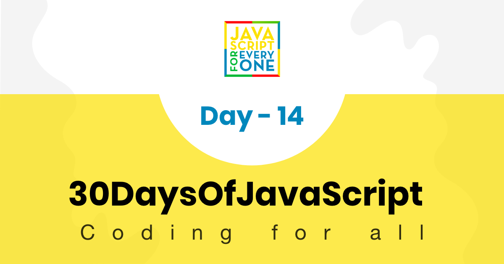

<div align="center">
  <h1> 30 Días de JavaScript: Manejo de Errores</h1>
  <a class="header-badge" target="_blank" href="https://www.linkedin.com/in/asabeneh/">
  
  </a>
  <a class="header-badge" target="_blank" href="https://twitter.com/Asabeneh">
  
  </a>

<sub>Autor:
<a href="https://www.linkedin.com/in/asabeneh/" target="_blank">Asabeneh Yetayeh</a><br>
<small> Enero, 2020</small>
</sub>

</div>

[<< Día 13](../dia_13_Metodos_del_Objeto_Console/dia_13_metodos_del_objeto_console.md) | [Día 15>>](..)



- [Día 14](#día-14)
  - [Manejo de Errores](#manejo-de-errores)
    - [Tipo de Error](#tipo-de-error)
  - [Ejercicios](#ejercicios)
    - [Ejercicios:Nivel 1](#ejerciciosnivel-1)
    - [Ejercicios: Nivel 2](#ejerciciosnivel-2)
    - [Ejercicios:Nivel 3](#ejerciciosnivel-3)

# Día 14

## Manejo de Errores

JavaScript es un lenguaje de tipado libre. Algunas veces obtendrá un error en tiempo de ejecución cuando intente acceder a una variable no definida o llamar a una función no definida, etc.

JavaScript, al igual que python o Java, proporciona un mecanismo de gestión de errores para capturar los errores en tiempo de ejecución mediante el bloque try-catch-finally.

```js
try {
  // código que puede arrojar un error
} catch (err) {
  // código a ejecutar si se produce un error
} finally {
  // código que se ejecutará independientemente de que se produzca un error o no
}
```

**try**: envuelve el código sospechoso que puede arrojar un error en un bloque try. La sentencia try nos permite definir un bloque de código para que se compruebe si hay errores mientras se ejecuta.

**catch**: escribe código para hacer algo en el bloque catch cuando se produce un error. El bloque catch puede tener parámetros que le darán información sobre el error. El bloque Catch se utiliza para registrar un error o mostrar mensajes específicos al usuario.

**finally**: El bloque finally se ejecutará siempre, independientemente de que se produzca un error. El bloque finally puede utilizarse para completar la tarea restante o para restablecer las variables que puedan haber cambiado antes de que se produzca el error en el bloque try.

**Example:**

```js
try {
  let lastName = "Yetayeh";
  let fullName = fistName + " " + lastName;
} catch (err) {
  console.log(err);
}
```

```sh
ReferenceError: fistName no está definido
    at <anonymous>:4:20
```

```js
try {
  let lastName = "Yetayeh";
  let fullName = fistName + " " + lastName;
} catch (err) {
  console.error(err); // podemos utilizar console.log() o console.error()
} finally {
  console.log("In any case I will be executed");
}
```

```sh
ReferenceError: fistName no está definido
    at <anonymous>:4:20
En cualquier caso se ejecutará
```

El bloque de captura toma un parámetro. Es habitual pasar e, err o error como parámetro al bloque catch. Este parámetro es un objeto y tiene las claves nombre y mensaje. Utilicemos el nombre y el mensaje.

```js
try {
  let lastName = "Yetayeh";
  let fullName = fistName + " " + lastName;
} catch (err) {
  console.log("Name of the error", err.name);
  console.log("Error message", err.message);
} finally {
  console.log("In any case I will be executed");
}
```

```sh
Name of the error ReferenceError
Error message fistName is not defined
In any case I will be executed
```

throw: la sentencia throw nos permite crear un error personalizado. Podemos pasar una cadena, un número, un booleano o un objeto. Utilice la sentencia throw para lanzar una excepción. Cuando se lanza una excepción, la expresión especifica el valor de la excepción. Cada una de las siguientes acciones lanza una excepción:

```js
throw "Error2"; // genera una excepción con un valor de cadena
throw 42; // genera una excepción con el valor 42
throw true; // genera una excepción con el valor true
throw new Error("Required"); // genera un objeto de error con el mensaje de Requerido
```

```js
const throwErrorExampleFun = () => {
  let message;
  let x = prompt("Enter a number: ");
  try {
    if (x == "") throw "empty";
    if (isNaN(x)) throw "not a number";
    x = Number(x);
    if (x < 5) throw "too low";
    if (x > 10) throw "too high";
  } catch (err) {
    console.log(err);
  }
};
throwErrorExampleFun();
```

### Tipo de Error

- ReferenceError: Se ha producido una referencia ilegal. Se lanza un ReferenceError si utilizamos una variable que no ha sido declarada.

```js
let firstName = "Asabeneh";
let fullName = firstName + " " + lastName;

console.log(fullName);
```

```sh
Uncaught ReferenceError: lastName is not defined
    at <anonymous>:2:35
```

- SyntaxError: Se ha producido un error de sintaxis

```js
let square = 2 x 2
console.log(square)

console.log('Hello, world")
```

```sh
Uncaught SyntaxError: Unexpected identifier
```

- TypeError: Se ha producido un error sobre el tipo

```js
let num = 10;
console.log(num.toLowerCase());
```

```sh
Uncaught TypeError: num.toLowerCase is not a function
    at <anonymous>:2:17
```

Estos son algunos de los errores más comunes a los que te puedes enfrentar cuando escribes un código. Entender los errores puede ayudarte a saber qué errores has cometido y te ayudará a depurar tu código rápidamente.

🌕 Usted es impecable. Ahora, sabes cómo manejar los errores y puedes escribir una aplicación robusta que maneje entradas inesperadas del usuario. Acabas de completar los desafíos del día 14 y llevas 14 pasos en tu camino hacia la grandeza. Ahora haz algunos ejercicios para tu cerebro y para tus músculos.

## Ejercicios

### Ejercicios:Nivel 1

Practica

### Ejercicios:Nivel 2

Practica

### Ejercicios:Nivel 3

Practica

🎉 ¡FELICITACIONES! 🎉

[<< Día 13](../dia_13_Metodos_del_Objeto_Console/dia_13_metodos_del_objeto_console.md) | [Día 15>>](..)
