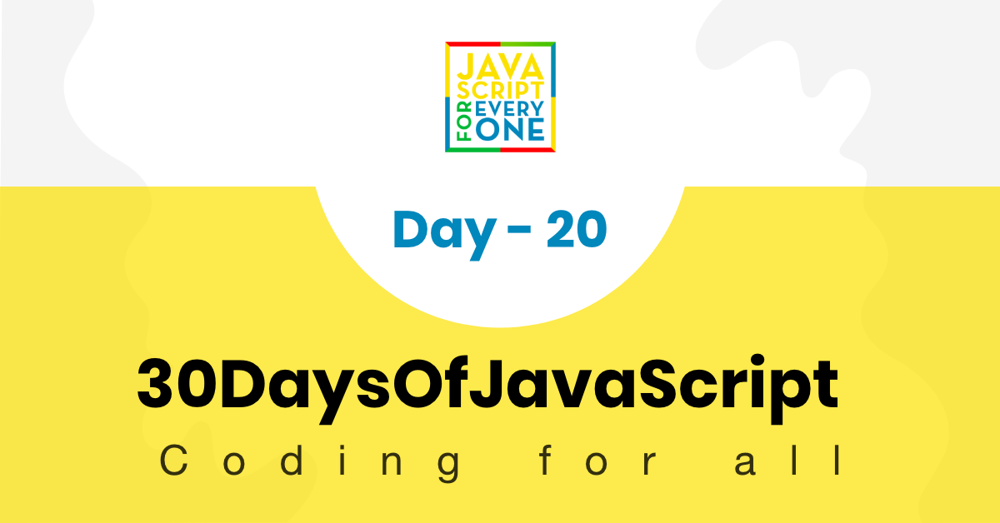

<div align="center">
  <h1> 30 Días de JavaScript: Escribiendo Códigos Limpios</h1>
  <a class="header-badge" target="_blank" href="https://www.linkedin.com/in/asabeneh/">
  
  </a>
  <a class="header-badge" target="_blank" href="https://twitter.com/Asabeneh">
  
  </a>

<sub>Autor:
<a href="https://www.linkedin.com/in/asabeneh/" target="_blank">Asabeneh Yetayeh</a><br>
<small> Enero, 2020</small>
</sub>

</div>

[<< Día 19](../dia_19_Closures/dia_19_closures.md) | [Día 21 >>](..)



- [Día 20](#día-20)
  - [Escribiendo código limpio](#escribiendo-código-limpio)
    - [Guía de estilo JavaScript](#guía-de-estilo-javascript)
    - [¿Por qué necesitamos una guía de estilo?](#¿por-qué-necesitamos-una-guía-de-estilo)
      - [Guía de estilo JavaScript de Airbnb](#guía-de-estilo-javascript-de-airbnb)
      - [Guía de estilo estándar de JavaScript](#guía-de-estilo-estándar-de-javascript)
      - [Guía de estilo JavaScript de Google](#guía-de-estilo-javascript-de-google)
    - [Convenciones de codificación en JavaScript](#convenciones-de-codificación-en-javascript)
      - [Convenciones usadas en 30DíasDeJavaScript](#convenciones-usadas-en-30díasdejavascript)
      - [Variables](#variables)
      - [Arrays](#arrays)
      - [Funciones](#funciones)
      - [Bucles](#bucles)
      - [Objetos](#objetos)
      - [Condicional](#condicional)
      - [Clases](#clases)

# Día 20

## Escribiendo código limpio

### Guía de estilo JavaScript

Una guía de estilo de JavaScript es un conjunto de normas que indica cómo debe escribirse y organizarse el código de JavaScript. En esta sección, hablaremos de las guías de JavaScript y de cómo escribir un código limpio.

JavaScript es un lenguaje de programación, como el lenguaje humano, tiene una sintaxis. La sintaxis de JavaScript debe escribirse siguiendo una determinada pauta de estilo para convencer y simplificar.

### ¿Por qué necesitamos una guía de estilo?

Has estado codificando solo durante mucho tiempo, pero ahora parece que trabajas en equipo. No importa de qué manera escribas tu código, siempre y cuando funcione, sin embargo, cuando trabajas en un equipo de 10, 20 o más desarrolladores en un proyecto y en la misma base de código, el código será desordenado y difícil de manejar si no hay ninguna guía a seguir.

Puede desarrollar sus propias directrices y convenciones o también puede adaptar directrices bien desarrolladas. Conozcamos las guías más comunes.

Guías de estilo de JavaScript más comunes

- Guía de estilo JavaScript de Airbnb
- Guía de estilo estándar de JavaScript
- Guía de estilo JavaScript de Google

#### Guía de estilo JavaScript de Airbnb

Airbnb tiene una de las guías de estilo JavaScript más populares de Internet. También cubre casi todos los aspectos de JavaScript y es adoptado por muchos desarrolladores y empresas. Puede consultar la [Guía de estilo de Airbnb](https://github.com/airbnb/javascript). Yo también recomendaría probarlo. Su estilo es muy fácil de usar y sencillo de entender.

#### Guía de estilo estándar de JavaScript

Esta guía no es tan popular como la de Airbnb, pero merece la pena echarle un vistazo. Han eliminado el punto y coma en su [guía de estilo](https://standardjs.com/).

#### Guía de estilo JavaScript de Google

No diré mucho sobre la guía de Google. No las he usado, más bien te sugiero que eches un vistazo desde este [link](https://google.github.io/styleguide/jsguide.html).

### Convenciones de codificación en JavaScript

En este desafío también utilizamos las convenciones y guías generales de codificación de JavaScript. Las convenciones de codificación son pautas de estilo de programación desarrolladas por un individuo, un equipo o una empresa.

Las convenciones de codificación ayudan:

- para escribir un código limpio
- para mejorar la legibilidad del código
- para mejorar la reutilización y el mantenimiento del código

Las convenciones de codificación incluyen

- Reglas de declaración y denominación de las variables
- Reglas de declaración y denominación de las funciones
- Reglas para el uso de espacios en blanco, sangría y comentarios
- Prácticas y principios de programación

#### Convenciones usadas en 30DíasDeJavaScript

En este reto seguimos la convención habitual de JavaScript pero he añadido también mi preferencia de escritura.

- Utilizamos camelCase para las variables y las funciones.
- Todos los nombres de las variables comienzan con una letra.
- Hemos optado por utilizar _const_ para las constantes, los arrays, los objetos y las funciones. En lugar de las comillas dobles, hemos optado por utilizar las comillas simples o backtick. Las comillas simples se están poniendo de moda.
- También hemos eliminado el punto y coma de nuestro código, pero es una cuestión de preferencia personal.
- Espacio alrededor de los operadores aritméticos, operadores de asignación y después de la coma
- Función de flecha en lugar de declaración de función
- Retorno explícito en lugar de implícito si la función es de una línea
- No hay coma final en el último valor de un objeto
- Preferimos este +=, -=, \*= /=, \*\*= en lugar de la versión más larga
- Cuando usamos console.log() es bueno imprimir con una cadena de etiquetas para identificar de dónde viene la consola

#### Variables

```js
let firstName = "Asabeneh";
let lastName = "Yetayeh";
let country = "Finland";
let city = "Helsinki";

const PI = Math.PI;
const gravity = 9.81;
```

#### Arrays

Hemos optado por hacer que los nombres de los arrays sean plurales

- names
- numbers
- countries
- languages
- skills
- fruits
- vegetables

```js
// arrays
const names = ["Asabeneh", "Mathias", "Elias", "Brook"];
const numbers = [0, 3.14, 9.81, 37, 98.6, 100];
const countries = ["Finland", "Denmark", "Sweden", "Norway", "Iceland"];
const languages = ["Amharic", "Arabic", "English", "French", "Spanish"];
const skills = ["HTML", "CSS", "JavaScript", "React", "Python"];
const fruits = ["banana", "orange", "mango", "lemon"];
const vegetables = ["Tomato", "Potato", "Cabbage", "Onion", "Carrot"];
```

#### Funciones

A estas alturas ya estás muy familiarizado con la declaración de funciones, la función de expresión, la función de flecha y la función anónima. En este reto tendemos a utilizar la función de flecha en lugar de otras funciones. La función flecha no sustituye a otras funciones. Además, las funciones de flecha y las declaraciones de función no son exactamente iguales. Por lo tanto, debes saber cuándo usarla y cuándo no. En otras secciones trataré la diferencia en detalle. Utilizaremos el retorno explícito en lugar del implícito si la función es de una sola línea.

```js
// función que devuelve el nombre completo de una persona
const printFullName = (firstName, lastName) => firstName + " " + lastName;

// función que calcula el cuadrado de un número
const square = (n) => n * n;

// una función que genera colores hexa al azar
const hexaColor = () => {
  const str = "0123456789abcdef";
  let hexa = "#";
  let index;
  for (let i = 0; i < 6; i++) {
    index = Math.floor(Math.random() * str.length);
    hexa += str[index];
  }
  return hexa;
};

// una función que muestra la fecha y la hora
const showDateTime = () => {
  const now = new Date();
  const year = now.getFullYear();
  const month = now.getMonth() + 1;
  const date = now.getDate();
  let hours = now.getHours();
  let minutes = now.getMinutes();
  if (hours < 10) {
    hours = "0" + hours;
  }
  if (minutes < 10) {
    minutes = "0" + minutes;
  }

  const dateMonthYear = date + "." + month + "." + year;
  const time = hours + ":" + minutes;
  const fullTime = dateMonthYear + " " + time;
  return fullTime;
};
```

La función `new Dat().toLocaleString()` también puede utilizarse para mostrar la fecha y hora actuales. Los métodos `toLocaleString()` toman diferentes argumentos. Puede aprender más sobre la fecha y la hora en este [link](https://developer.mozilla.org/en-US/docs/Web/JavaScript/Reference/Global_Objects/Date/toLocaleString).

#### Bucles

En estos retos cubrimos muchos tipos de bucles. El bucle regular for, el bucle while, el bucle do while, el bucle for of, el bucle forEach y el bucle for in.

Veamos cómo los utilizamos:

```js
for (let i = 0; i < n; i++) {
  console.log();
}

// declaración de una variable array
const names = ["Asabeneh", "Mathias", "Elias", "Brook"];

// iteración de un array mediante un bucle for regular
let len = names.length;
for (let i = 0; i < len; i++) {
  console.log(names[i].toUpperCase());
}

// iteración de un array mediante for of
for (const name of names) {
  console.log(name.toUpperCase());
}

// iteración de un array mediante forEach
names.forEach((name) => name.toUpperCase());

const person = {
  firstName: "Asabeneh",
  lastName: "Yetayeh",
  age: 250,
  country: "Finland",
  city: "Helsinki",
  skills: [
    "HTML",
    "CSS",
    "JavaScript",
    "React",
    "Node",
    "MongoDB",
    "Python",
    "D3.js",
  ],
  isMarried: true,
};
for (const key in person) {
  console.log(key);
}
```

#### Objetos

Declaramos el objeto literal con _const_.

```js
// declarando el objeto literal
const person = {
  firstName: "Asabeneh",
  lastName: "Yetayeh",
  age: 250,
  country: "Finland",
  city: "Helsinki",
  skills: [
    "HTML",
    "CSS",
    "JavaScript",
    "TypeScript",
    "React",
    "Node",
    "MongoDB",
    "Python",
    "D3.js",
  ],
  isMarried: true,
};
// iterar a través de las claves del objeto
for (const key in person) {
  console.log(key, person[key]);
}
```

#### Condicional

Hemos dicho if, if else, else, switch y operadores ternarios en los retos anteriores.

```js
// sintaxis
if (condition) {
  // esta parte del código se ejecuta para la condición de verdad
} else {
  // esta parte del código se ejecuta para una condición falsa
}
```

```js
// if else
let num = 3;
if (num > 0) {
  console.log(`${num} is a positive number`);
} else {
  console.log(`${num} is a negative number`);
}
//  3 is a positive number
```

```js
// if else if else if else

let a = 0;
if (a > 0) {
  console.log(`${a} is a positive number`);
} else if (a < 0) {
  console.log(`${a} is a negative number`);
} else if (a == 0) {
  console.log(`${a} is zero`);
} else {
  console.log(`${a} is not a number`);
}
```

```js
// Switch Más Ejemplos
let dayUserInput = prompt("What day is today ?");
let day = dayUserInput.toLowerCase();

switch (day) {
  case "monday":
    console.log("Today is Monday");
    break;
  case "tuesday":
    console.log("Today is Tuesday");
    break;
  case "wednesday":
    console.log("Today is Wednesday");
    break;
  case "thursday":
    console.log("Today is Thursday");
    break;
  case "friday":
    console.log("Today is Friday");
    break;
  case "saturday":
    console.log("Today is Saturday");
    break;
  case "sunday":
    console.log("Today is Sunday");
    break;
  default:
    console.log("It is not a week day.");
}
```

```js
// ternario

let isRaining = true;
isRaining
  ? console.log("You need a rain coat.")
  : console.log("No need for a rain coat.");
```

#### Clases

Declaramos la clase con CamelCase que empieza con mayúscula.

```js
// sintaxis
class ClassName {
  // el código va aquí
}
```

```js
// definir la clase
class Person {
  constructor(firstName, lastName) {
    console.log(this); // Compruebe el resultado desde aquí
    this.firstName = firstName;
    this.lastName = lastName;
  }
}
```

Sea cual sea la guía de estilo que sigas, sé coherente. Sigue algunos paradigmas de programación y patrones de diseño. Recuerda que si no escribes tu código en cierto orden o forma, será difícil leerlo. Así que hazte un favor a ti mismo o a alguien que vaya a leer tu código escribiendo código legible.

🌕 Eres ordenado. Ahora, has aprendido a escribir un código limpio, para que cualquiera que conozca el idioma inglés pueda entender tu código.Siempre estás progresando y llevas 20 pasos en tu camino hacia la grandeza.

🎉 ¡FELICITACIONES! 🎉

[<< Día 19](../dia_19_Closures/dia_19_closures.md) | [Día 21 >>](..)
