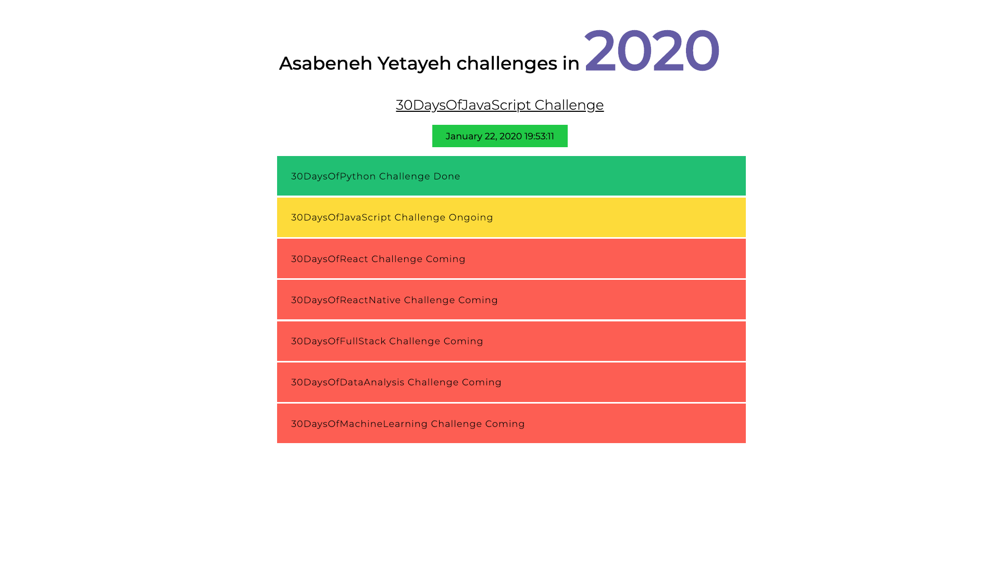

<div align="center">
  <h1> 30 Días de JavaScript: Document Object Model(DOM)</h1>
  <a class="header-badge" target="_blank" href="https://www.linkedin.com/in/asabeneh/">
  
  </a>
  <a class="header-badge" target="_blank" href="https://twitter.com/Asabeneh">
  
  </a>

<sub>Autor:
<a href="https://www.linkedin.com/in/asabeneh/" target="_blank">Asabeneh Yetayeh</a><br>
<small> Enero, 2020</small>
</sub>

</div>

[<< Día 20](../dia_20_Escribiendo_Codigos_Limpios/dia_20_escribiendo_codigos_limpios.md) | [Día 22 >>](..)


- [Día 21](#día-21)
  - [Document Object Model (DOM) - Día 1](#document-object-model-dom---día-1)
    - [Obtención del elemento](#obtención-del-elemento)
      - [Obtener elementos por nombre de etiqueta](#obtener-elementos-por-nombre-de-etiqueta)
      - [Obtener elementos por el nombre de la clase](#obtener-elementos-por-el-nombre-de-la-clase)
      - [Obtener un elemento por id](#obtener-un-elemento-por-id)
      - [Obtener elementos mediante métodos querySelector](#obtener-elementos-mediante-métodos-queryselector)
    - [Añadir atributo](#añadir-atributo)
      - [Añadir un atributo con setAttribute](#añadir-un-atributo-con-setattribute)
      - [Añadir atributo sin setAttribute](#añadir-atributo-sin-setattribute)
      - [Añadir una clase mediante classList](#añadir-una-clase-mediante-classlist)
      - [Eliminación de la clase mediante remove](#eliminación-de-la-clase-mediante-remove)
    - [Añadir texto a un elemento HTML](#añadir-texto-a-un-elemento-html)
      - [Añadir contenido de texto usando textContent](#añadir-contenido-de-texto-usando-textcontent)
      - [Añadir contenido de texto usando innerHTML](#añadir-contenido-de-texto-usando-innerhtml)
        - [textContent](#textcontent)
        - [innerHTML](#innerhtml)
    - [Añadir estilo](#añadir-estilo)
      - [Añadir estilo color](#añadir-estilo-color)
      - [Añadir estilo Background Color](#añadir-estilo-background-color)
      - [Añadir estilo Font Size](#añadir-estilo-font-size)
  - [Ejercicios](#ejercicios)
    - [Ejercicios: Nivel 1](#ejercicios-nivel-1)
    - [Ejercicios: Nivel 2](#ejercicios-nivel-2)
    - [Ejercicios: Nivel 3](#ejercicios-nivel-3)
      - [DOM: Mini proyecto 1](#dom-mini-proyecto-1)

# Día 21

## Document Object Model (DOM) - Día 1

El documento HTML está estructurado como un objeto JavaScript. Cada elemento HTML tiene diferentes propiedades que pueden ayudar a manipularlo. Es posible obtener, crear, añadir o eliminar elementos HTML mediante JavaScript. Compruebe los ejemplos siguientes. La selección de elementos HTML mediante JavaScript es similar a la selección mediante CSS. Para seleccionar un elemento HTML, utilizamos el nombre de la etiqueta, el id, el nombre de la clase u otros atributos.

### Obtención del elemento

Podemos acceder al elemento o elementos ya creados mediante JavaScript. Para acceder u obtener elementos utilizamos diferentes métodos. El código siguiente tiene cuatro elementos _h1_. Veamos los diferentes métodos para acceder a los elementos _h1_.

```html
<!DOCTYPE html>
<html lang="en">
  <head>
    <title>Document Object Model - (Modelo de objeto de documento)</title>
  </head>
  <body>
    <h1 class="title" id="first-title">First Title</h1>
    <h1 class="title" id="second-title">Second Title</h1>
    <h1 class="title" id="third-title">Third Title</h1>
    <h1></h1>
  </body>
</html>
```

#### Obtener elementos por nombre de etiqueta

**_getElementsByTagName()_**:toma un nombre de etiqueta como parámetro de cadena y este método devuelve un objeto HTMLCollection. Una HTMLCollection es un objeto tipo array de elementos HTML. La propiedad length proporciona el tamaño de la colección. Siempre que usamos este método accedemos a los elementos individuales usando el índice o después de hacer un bucle a través de cada elemento individual. Un HTMLCollection no soporta todos los métodos de los arrays, por lo que deberíamos utilizar un bucle for normal en lugar de forEach.

```js
// sintaxis
document.getElementsByTagName("tagname");
```

```js
const allTitles = document.getElementsByTagName("h1");

console.log(allTitles); //HTMLCollections
console.log(allTitles.length); // 4

for (let i = 0; i < allTitles.length; i++) {
  console.log(allTitles[i]); // imprime cada uno de los elementos de la HTMLCollection
}
```

#### Obtener elementos por el nombre de la clase

El método **_getElementsByClassName()_** devuelve un objeto HTMLCollection. Una HTMLCollection es una lista tipo array de elementos HTML. La propiedad length proporciona el tamaño de la colección. Es posible realizar un bucle a través de todos los elementos de HTMLCollection. Vea el siguiente ejemplo

```js
//sintaxis
document.getElementsByClassName("classname");
```

```js
const allTitles = document.getElementsByClassName("title");

console.log(allTitles); //HTMLCollections
console.log(allTitles.length); // 4

for (let i = 0; i < allTitles.length; i++) {
  console.log(allTitles[i]); // imprime cada uno de los elementos de la HTMLCollection
}
```

#### Obtener un elemento por id

**_getElementsById()_** tiene como objetivo un único elemento HTML. Pasamos el id sin # como argumento.

```js
//sintaxis
document.getElementById("id");
```

```js
let firstTitle = document.getElementById("first-title");
console.log(firstTitle); // <h1>First Title</h1>
```

#### Obtener elementos mediante métodos querySelector

El método _document.querySelector_ puede seleccionar un HTML o elementos HTML por nombre de etiqueta, por id o por nombre de clase.

**_querySelector_**: se puede utilizar para seleccionar elementos HTML por su nombre de etiqueta, id o clase. Si se utiliza el nombre de la etiqueta, sólo se selecciona el primer elemento.

```js
let firstTitle = document.querySelector("h1"); // seleccionar el primer elemento h1 disponible
let firstTitle = document.querySelector("#first-title"); // selecciona el id con first-title
let firstTitle = document.querySelector(".title"); // seleccionar el primer elemento disponible con clase title
```

**_querySelectorAll_**: se puede utilizar para seleccionar elementos html por su nombre de etiqueta o clase. Devuelve un nodeList que es un objeto tipo array que soporta métodos de array. Podemos utilizar **_bucle for_** o **_forEach_** para recorrer cada elemento de nodeList.

```js
const allTitles = document.querySelectorAll('h1') # selects all the available h1 elements in the page

console.log(allTitles.length) // 4
for (let i = 0; i < allTitles.length; i++) {
  console.log(allTitles[i])
}

allTitles.forEach(title => console.log(title))
const allTitles = document.querySelectorAll('.title') // lo mismo ocurre con la selección mediante la clase
```

### Añadir atributo

En la etiqueta de apertura de HTML se añade un atributo que proporciona información adicional sobre el elemento. Atributos HTML comunes: id, class, src, style, href, disabled, title, alt. Añadamos id y class para el cuarto título.

```js
const titles = document.querySelectorAll("h1");
titles[3].className = "title";
titles[3].id = "fourth-title";
```

#### Añadir un atributo con setAttribute

El método **_setAttribute()_** establece cualquier atributo html. Toma dos parámetros: el tipo de atributo y el nombre del atributo.
Agreguemos la clase y el atributo id para el cuarto título.

```js
const titles = document.querySelectorAll("h1");
titles[3].setAttribute("class", "title");
titles[3].setAttribute("id", "fourth-title");
```

#### Añadir atributo sin setAttribute

Podemos utilizar el método normal de configuración de objetos para establecer un atributo, pero esto no puede funcionar para todos los elementos. Algunos atributos son propiedades de los objetos del DOM y se pueden establecer directamente. Por ejemplo, id y class

```js
//otra forma de establecer un atributo
titles[3].className = "title";
titles[3].id = "fourth-title";
```

#### Añadir una clase mediante classList

El método classList es un buen método para añadir clases adicionales. No anula la clase original si existe una clase, sino que añade una clase adicional para el elemento.

```js
//otra forma de establecer un atributo: anexar la clase, no se sobrepone a
titles[3].classList.add("title", "header-title");
```

#### Eliminación de la clase mediante remove

De forma similar a la adición, también podemos eliminar la clase de un elemento. Podemos eliminar una clase específica de un elemento.

```js
//otra forma de establecer un atributo: anexar la clase, no se sobrepone a
titles[3].classList.remove("title", "header-title");
```

### Añadir texto a un elemento HTML

Un HTML es un bloque compuesto por una etiqueta de apertura, una etiqueta de cierre y un contenido de texto. Podemos añadir un contenido de texto utilizando la propiedad _textContent_ o \*innerHTML.

#### Añadir contenido de texto usando textContent

La propiedad _textContent_ se utiliza para añadir texto a un elemento HTML.

```js
const titles = document.querySelectorAll("h1");
titles[3].textContent = "Fourth Title";
```

#### Añadir contenido de texto usando innerHTML

La mayoría de la gente se confunde entre _textContent_ y _innerHTML_. _textContent_ está pensado para añadir texto a un elemento HTML, sin embargo innerHTML puede añadir un elemento o elementos de texto o HTML como hijo.

##### textContent

Asignamos la propiedad del objeto HTML _textContent_ a un texto

```js
const titles = document.querySelectorAll("h1");
titles[3].textContent = "Fourth Title";
```

##### innerHTML

Usamos la propiedad innerHTML cuando queremos reemplazar o un contenido hijo completamente nuevo a un elemento padre.
El valor que asignemos será una cadena de elementos HTML.

```html
<!DOCTYPE html>
<html lang="en">
  <head>
    <title>JavaScript para todos:DOM</title>
  </head>
  <body>
    <div class="wrapper">
      <h1>Asabeneh Yetayeh desafíos en 2020</h1>
      <h2>Reto 30DaysOfJavaScript</h2>
      <ul></ul>
    </div>
    <script>
      const lists = `
    <li>30DaysOfPython Challenge Done</li>
            <li>30DaysOfJavaScript Challenge Ongoing</li>
            <li>30DaysOfReact Challenge Coming</li>
            <li>30DaysOfFullStack Challenge Coming</li>
            <li>30DaysOfDataAnalysis Challenge Coming</li>
            <li>30DaysOfReactNative Challenge Coming</li>
            <li>30DaysOfMachineLearning Challenge Coming</li>`;
      const ul = document.querySelector("ul");
      ul.innerHTML = lists;
    </script>
  </body>
</html>
```

La propiedad innerHTML puede permitirnos también eliminar todos los hijos de un elemento padre. En lugar de utilizar removeChild() yo recomendaría el siguiente método.

```html
<!DOCTYPE html>
<html lang="en">
  <head>
    <title>JavaScript for Everyone:DOM</title>
  </head>
  <body>
    <div class="wrapper">
      <h1>Asabeneh Yetayeh challenges in 2020</h1>
      <h2>30DaysOfJavaScript Challenge</h2>
      <ul>
        <li>30DaysOfPython Challenge Done</li>
        <li>30DaysOfJavaScript Challenge Ongoing</li>
        <li>30DaysOfReact Challenge Coming</li>
        <li>30DaysOfFullStack Challenge Coming</li>
        <li>30DaysOfDataAnalysis Challenge Coming</li>
        <li>30DaysOfReactNative Challenge Coming</li>
        <li>30DaysOfMachineLearning Challenge Coming</li>
      </ul>
    </div>
    <script>
      const ul = document.querySelector("ul");
      ul.innerHTML = "";
    </script>
  </body>
</html>
```

### Añadir estilo

#### Añadir estilo Color

Añadamos un poco de estilo a nuestros títulos. Si el elemento tiene índice par le damos color verde sino rojo.

```js
const titles = document.querySelectorAll("h1");
titles.forEach((title, i) => {
  title.style.fontSize = "24px"; // todos los títulos tendrán un tamaño de letra de 24px
  if (i % 2 === 0) {
    title.style.color = "green";
  } else {
    title.style.color = "red";
  }
});
```

#### Añadir estilo Background Color

Añadamos un poco de estilo a nuestros títulos. Si el elemento tiene índice par le damos color verde sino rojo.

```js
const titles = document.querySelectorAll("h1");
titles.forEach((title, i) => {
  title.style.fontSize = "24px"; // todos los títulos tendrán un tamaño de letra de 24px
  if (i % 2 === 0) {
    title.style.backgroundColor = "green";
  } else {
    title.style.backgroundColor = "red";
  }
});
```

#### Añadir estilo Font Size

Añadamos algo de estilo a nuestros títulos. Si el elemento tiene índice par le damos 20px sino 30px

```js
const titles = document.querySelectorAll("h1");
titles.forEach((title, i) => {
  title.style.fontSize = "24px"; // todos los títulos tendrán un tamaño de letra de 24px
  if (i % 2 === 0) {
    title.style.fontSize = "20px";
  } else {
    title.style.fontSize = "30px";
  }
});
```

Como has notado, las propiedades de css cuando lo usamos en JavaScript va a ser un camelCase. Las siguientes propiedades CSS cambian de background-color a backgroundColor, font-size a fontSize, font-family a fontFamily, margin-bottom a marginBottom.

---

🌕 Ahora, estás completamente dotado de un súper poder, has completado la parte más importante y desafiante del desafío y en general de JavaScript. Has aprendido DOM y ahora tienes la capacidad de construir y desarrollar aplicaciones. Ahora haz algunos ejercicios para tu cerebro y para tus músculos.

## Ejercicios

### Ejercicios: Nivel 1

1. Crear un archivo index.html y poner cuatro elementos p: Obtenga el primer párrafo utilizando **_document.querySelector(tagname)_** y el nombre de la etiqueta
2. Obtener cada uno de los párrafos usando **_document.querySelector('#id')_** mediante su id
3. Obtener todos los p como nodeList usando **_document.querySelectorAll(tagname)_** por su nombre de etiqueta
4. Recorrer nodeList y obtener el contenido del texto de cada párrafo
5. Establecer un textContent para el párrafo del cuarto párrafo,**_Fourth Paragraph_**
6. Establezca los atributos id y class para todos los párrafos utilizando diferentes métodos de establecimiento de atributos

### Ejercicios: Nivel 2

1. Cambiar el estilo de cada párrafo mediante JavaScript (ej, color, fondo, borde, tamaño de la fuente, familia de la fuente)
1. Seleccione todos los párrafos y haga un bucle a través de cada uno de los elementos y dé al primer y tercer párrafo un color verde, y al segundo y cuarto párrafo un color rojo
1. Establecer textContent, id y class a cada párrafo

### Ejercicios: Nivel 3

#### DOM: Mini proyecto 1

1. Desarrolle la siguiente aplicación, utilice los siguientes elementos HTML para empezar. Obtendrá el mismo código en la carpeta de inicio. Aplique todos los estilos y la funcionalidad utilizando sólo JavaScript.

   - El color del año cambia cada 1 segundo
   - El color de fondo de la fecha y la hora cambia cada dos segundos
   - El reto completado tiene fondo verde
   - El desafío en curso tiene fondo amarillo
   - Los próximos retos tienen fondo rojo

```html
<!-- index.html -->
<!DOCTYPE html>
<html lang="en">
  <head>
    <title>JavaScript para todos: DOM</title>
  </head>
  <body>
    <div class="wrapper">
      <h1>Asabeneh Yetayeh retos en 2020</h1>
      <h2>Reto 30DaysOfJavaScript</h2>
      <ul>
        <li>Reto 30DaysOfPython Realizado</li>
        <li>Reto 30DaysOfJavaScript en curso</li>
        <li>Reto 30DaysOfReact próximamente</li>
        <li>Reto 30DaysOfFullStack próximamente</li>
        <li>Reto 30DaysOfDataAnalysis próximamente</li>
        <li>Reto 30DaysOfReactNative próximamente</li>
        <li>Reto 30DaysOfMachineLearning próximamente</li>
      </ul>
    </div>
  </body>
</html>
```




🎉 ¡FELICITACIONES! 🎉

[<< Día 20](../dia_20_Escribiendo_Codigos_Limpios/dia_20_escribiendo_codigos_limpios.md) | [Día 22 >>](..)
