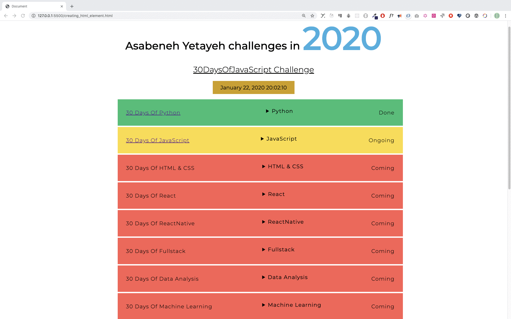

<div align="center">
  <h1> 30 Días de JavaScript: Manipulación del Objeto DOM </h1>
  <a class="header-badge" target="_blank" href="https://www.linkedin.com/in/asabeneh/">
  
  </a>
  <a class="header-badge" target="_blank" href="https://twitter.com/Asabeneh">
  
  </a>

<sub>Autor:
<a href="https://www.linkedin.com/in/asabeneh/" target="_blank">Asabeneh Yetayeh</a><br>
<small> Enero, 2020</small>
</sub>

</div>

[<< Día 21](../dia_21_DOM/dia_21_dom.md) | [Día 23 >>](..)


- [Día 22](#día-22)
  - [DOM(Document Object Model)-Día 2](#domdocument-object-model-día-2)
    - [Creando un elemento](#creando-un-elemento)
    - [Creación de elementos](#creación-de-elementos)
    - [Añadir un hijo a un elemento padre](#añadir-un-hijo-a-un-elemento-padre)
    - [Eliminar un elemento hijo de un nodo padre](#eliminar-un-elemento-hijo-de-un-nodo-padre)
  - [Ejercicios](#ejercicios)
    - [Ejercicios: Nivel 1](#ejercicios-nivel-1)
    - [Ejercicios: Nivel 2](#ejercicios-nivel-2)
    - [Ejercicios: Nivel 3](#ejercicios-nivel-3)

# Día 22

## DOM(Document Object Model)-Día 2

### Creando un elemento

Para crear un elemento HTML utilizamos el nombre de la etiqueta. La creación de un elemento HTML mediante JavaScript es muy sencilla y directa. Utilizamos el método _document.createElement()_. El método toma un nombre de etiqueta de elemento HTML como parámetro de cadena.

```js
// sintaxus
document.createElement("tagname");
```

```html
<!DOCTYPE html>
<html>
  <head>
    <title>Document Object Model:30 Days Of JavaScript</title>
  </head>

  <body>
    <script>
      let title = document.createElement("h1");
      title.className = "title";
      title.style.fontSize = "24px";
      title.textContent = "Creating HTML element DOM Day 2";

      console.log(title);
    </script>
  </body>
</html>
```

### Creación de elementos

Para crear múltiples elementos debemos utilizar el bucle. Usando el bucle podemos crear tantos elementos HTML como queramos.
Después de crear el elemento podemos asignar valor a las diferentes propiedades del objeto HTML.

```html
<!DOCTYPE html>
<html>
  <head>
    <title>Document Object Model:30 Days Of JavaScript</title>
  </head>

  <body>
    <script>
      let title;
      for (let i = 0; i < 3; i++) {
        title = document.createElement("h1");
        title.className = "title";
        title.style.fontSize = "24px";
        title.textContent = i;
        console.log(title);
      }
    </script>
  </body>
</html>
```

### Añadir un hijo a un elemento padre

Para ver un elemento creado en el documento HTML debemos añadirlo al padre como elemento hijo. Podemos acceder al cuerpo del documento HTML utilizando _document.body_. El _document.body_ soporta el método _appendChild()_. Vea el ejemplo siguiente.

```html
<!DOCTYPE html>
<html>
  <head>
    <title>Document Object Model:30 Days Of JavaScript</title>
  </head>

  <body>
    <script>
      // creación de múltiples elementos y anexión al elemento padre
      let title;
      for (let i = 0; i < 3; i++) {
        title = document.createElement("h1");
        title.className = "title";
        title.style.fontSize = "24px";
        title.textContent = i;
        document.body.appendChild(title);
      }
    </script>
  </body>
</html>
```

### Eliminar un elemento hijo de un nodo padre

Después de crear un HTML, es posible que queramos eliminar uno o varios elementos y podemos utilizar el método _removeChild()_.

**Ejemplo:**

```html
<!DOCTYPE html>
<html>

<head>
    <title>Document Object Model:30 Days Of JavaScript</title>
</head>

<body>
    <h1>Removing child Node</h1>
    <h2>Asabeneh Yetayeh challenges in 2020</h1>
    <ul>
        <li>30DaysOfPython Challenge Done</li>
        <li>30DaysOfJavaScript Challenge Done</li>
        <li>30DaysOfReact Challenge Coming</li>
        <li>30DaysOfFullStack Challenge Coming</li>
        <li>30DaysOfDataAnalysis Challenge Coming</li>
        <li>30DaysOfReactNative Challenge Coming</li>
        <li>30DaysOfMachineLearning Challenge Coming</li>
    </ul>

    <script>
        const ul = document.querySelector('ul')
        const lists = document.querySelectorAll('li')
        for (const list of lists) {
            ul.removeChild(list)

        }
    </script>
</body>

</html>
```

Como hemos visto en la sección anterior hay una forma mejor de eliminar todos los elementos HTML internos o hijos de un elemento padre utilizando el método _innerHTML_ propiedades.

```html
<!DOCTYPE html>
<html>

<head>
    <title>Document Object Model:30 Days Of JavaScript</title>
</head>

<body>
    <h1>Removing child Node</h1>
    <h2>Asabeneh Yetayeh challenges in 2020</h1>
    <ul>
        <li>30DaysOfPython Challenge Done</li>
        <li>30DaysOfJavaScript Challenge Done</li>
        <li>30DaysOfReact Challenge Coming</li>
        <li>30DaysOfFullStack Challenge Coming</li>
        <li>30DaysOfDataAnalysis Challenge Coming</li>
        <li>30DaysOfReactNative Challenge Coming</li>
        <li>30DaysOfMachineLearning Challenge Coming</li>
    </ul>

    <script>
        const ul = document.querySelector('ul')
        ul.innerHTML = ''
    </script>
</body>

</html>
```

El fragmento de código anterior borró todos los elementos hijos.

---

🌕 Eres muy especial, estás progresando cada día. Ahora, sabes cómo destruir un elemento DOM creado cuando es necesario. Aprendiste DOM y ahora tienes la capacidad de construir y desarrollar aplicaciones. Te quedan sólo ocho días para tu camino a la grandeza. Ahora haz algunos ejercicios para tu cerebro y para tus músculos.

## Ejercicios

### Ejercicios: Nivel 1

1. Crear un div contenedor en el documento HTML y crear 100 a 100 números dinámicamente y anexar al div contenedor.
   - El fondo de los números pares es verde
   - El fondo de los números impares es amarillo
   - El fondo de los números primos es rojo


### Ejercicios: Nivel 2

1. Utilice el array de países para mostrar todos los países. Vea el diseño


### Ejercicios: Nivel 3

Compruebe los requisitos de este proyecto a partir de ambas imágenes (jpg y gif). Todos los datos y el CSS se han implementado utilizando únicamente JavaScript. Los datos se encuentran en la carpeta de inicio del proyecto\*3. El botón desplegable se ha creado utilizando el [details\*](https://www.w3schools.com/tags/tag_details.asp) elemento HTML.




🎉 ¡FELICITACIONES! 🎉

[<< Día 21](../dia_21_DOM/dia_21_dom.md) | [Día 23 >>](..)
