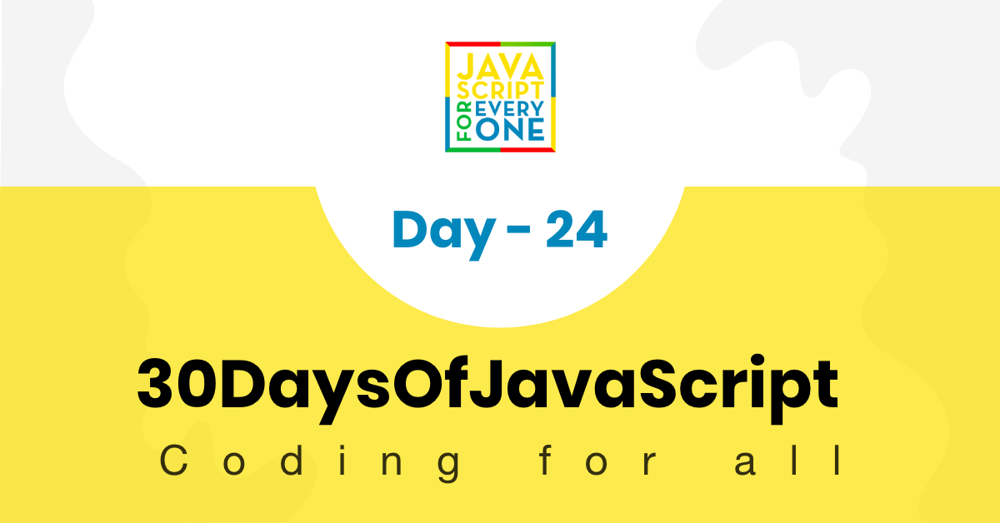

  <h1> 30 Días de JavaScript: Mini Proyecto Sistema Solar</h1>
  
  

Autor:
<a href="https://www.linkedin.com/in/asabeneh/" target="_blank">Asabeneh Yetayeh</a> 
<small> Enero, 2020</small>

[<< Día 23](../dia_23_Event_Listeners/dia_23_event_listeners.md) | [Día 25 >>](..)

- [Día 24](#día-24)
  - [Ejercicios](#ejercicios)
    - [Ejercicios: Nivel 1](#ejercicios-nivel-1)

# Día 24

## Ejercicios

### Ejercicios: Nivel 1

1. Desarrollar una pequeña aplicación que calcule el peso de un objeto en un determinado planeta. La imagen gif no está completa revisa el video en el archivo de inicio.

🎉 ¡FELICITACIONES! 🎉

[<< Día 23](../dia_23_Event_Listeners/dia_23_event_listeners.md) | [Día 25 >>](..)
