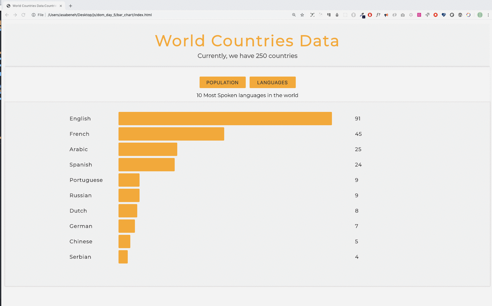

  <h1> 30 Días de JavaScript: Visualización de Datos de los Países del Mundo</h1>
  
  

Autor:
<a href="https://www.linkedin.com/in/asabeneh/" target="_blank">Asabeneh Yetayeh</a> 
<small> Enero, 2020</small>

[<< Día 24](../dia_24_Proyecto_Sistema_Solar/dia_24_proyecto_sistema_solar.md) | [Día 26 >>](../dia_26_Visualizacion_De_Datos_De_Los_Paises_Del_Mundo_2/dia_26_visualizacion_de_datos_de_los_paises_del_mundo_2.md)

- [Día 25](#día-25)
  - [Ejercicios](#ejercicios)
    - [Ejercicios: Nivel 1](#ejercicios-nivel-1)

# Día 25

## Ejercicios

### Ejercicios: Nivel 1

1. Visualiza los diez países más poblados y los diez idiomas más hablados del mundo usando DOM(HTML, CSS, JS)

🎉 ¡FELICITACIONES! 🎉

[<< Día 24](../dia_24_Proyecto_Sistema_Solar/dia_24_proyecto_sistema_solar.md) | [Día 26 >>](../dia_26_Visualizacion_De_Datos_De_Los_Paises_Del_Mundo_2/dia_26_visualizacion_de_datos_de_los_paises_del_mundo_2.md)
