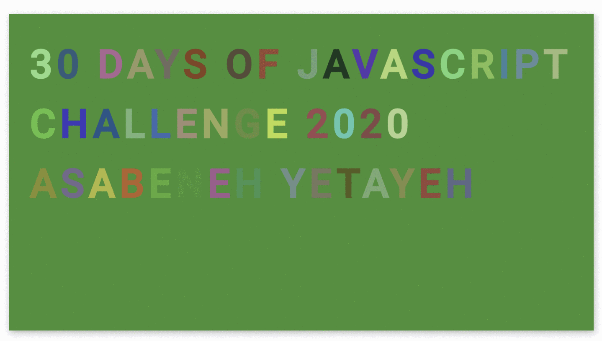

  <h1> 30 Días de JavaScript: Animación de Caracteres</h1>
  
  

Autor:
<a href="https://www.linkedin.com/in/asabeneh/" target="_blank">Asabeneh Yetayeh</a> 
<small> Enero, 2020</small>

[<< Día 28](../dia_28_Mini_Proyecto_Tabla_De_Posiciones/dia_28_mini_proyecto_tabla_de_posiciones.md) | [Día 30>>](../dia_30_Mini_Proyecto_Final/dia_30_mini_proyecto_final.md)

- [Día 29](#día-29)
  - [Ejercicios](#ejercicios)
    - [Ejercicios: Nivel 1](#ejercicios-nivel-1)

# Día 29

## Ejercicios

### Ejercicios: Nivel 1

1. Crea la siguiente animación utilizando (HTML, CSS, JS)

🎉 ¡FELICITACIONES! 🎉

[<< Día 28](../dia_28_Mini_Proyecto_Tabla_De_Posiciones/dia_28_mini_proyecto_tabla_de_posiciones.md) | [Día 30>>](../dia_30_Mini_Proyecto_Final/dia_30_mini_proyecto_final.md)
