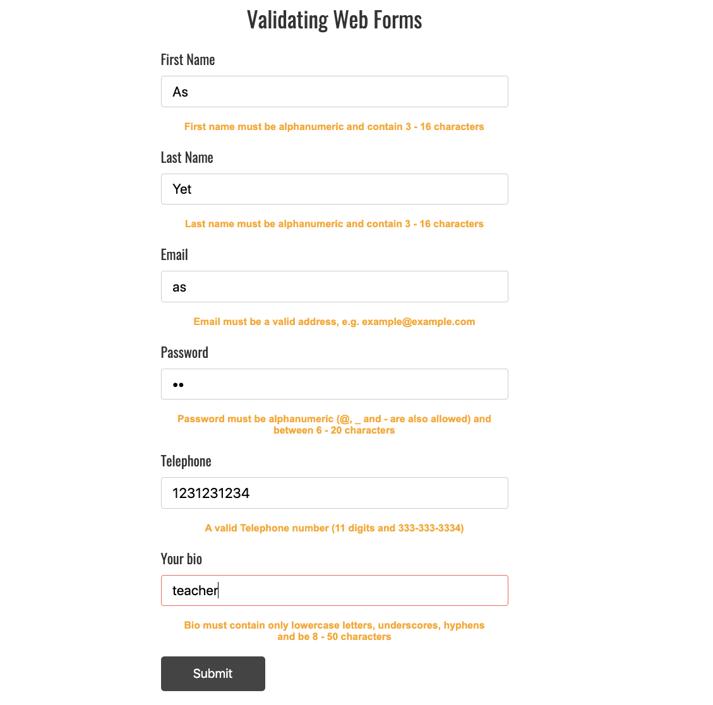

  <h1> 30 Días de JavaScript: Proyecto Final</h1>
  
  

Autor:
<a href="https://www.linkedin.com/in/asabeneh/" target="_blank">Asabeneh Yetayeh</a> 
<small> Enero, 2020</small>

<small>Apoya al <strong>autor</strong> para que cree más material educativo</small>    

[<< Día 29](../dia_29_Mini_Proyecto_Animacion_De_Caracteres/dia_29_mini_proyecto_animacion_de_caracteres.md)

- [Día 30](#día-30)
  - [Ejercicios](#ejercicios)
    - [Ejercicios: Nivel 1](#ejercicios-nivel-1)
  - [Testimonio](#testimonio)
  - [Apoyo](#apoyo)

# Día 30

## Ejercicios

### Ejercicios: Nivel 1

1. Crea la siguiente animación utilizando (HTML, CSS, JS)

2. Valide el siguiente formulario utilizando regex.

   

   

🌕 Tu viaje a la grandeza se ha completado con éxito. Has alcanzado un alto nivel de genialidad. Ahora, eres mucho más brillante que antes. Yo sabía lo que se necesita para llegar a este nivel y tú llegaste a este punto. Eres un verdadero héroe. Ahora, es el momento de celebrar tu éxito con un amigo o con la familia. Estoy deseando verte en otro reto.

## Testimonio

Ahora es el momento de apoyar al autor y expresar su opinión sobre el autor y 30DaysOfJavaScript. Puedes dejar tu testimonio en este [link](https://testimonify.herokuapp.com/)

## Apoyo

Puedes apoyar al autor para que produzca más material educativo

[<< Día 29](../dia_29_Mini_Proyecto_Animacion_De_Caracteres/dia_29_mini_proyecto_animacion_de_caracteres.md)
