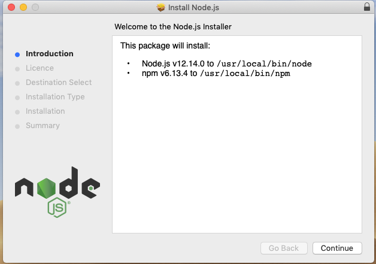
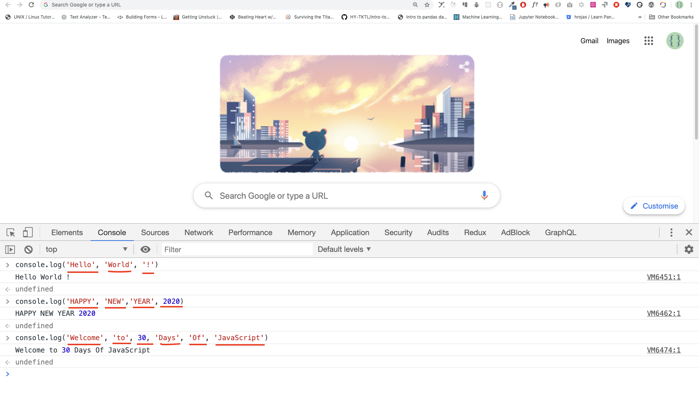
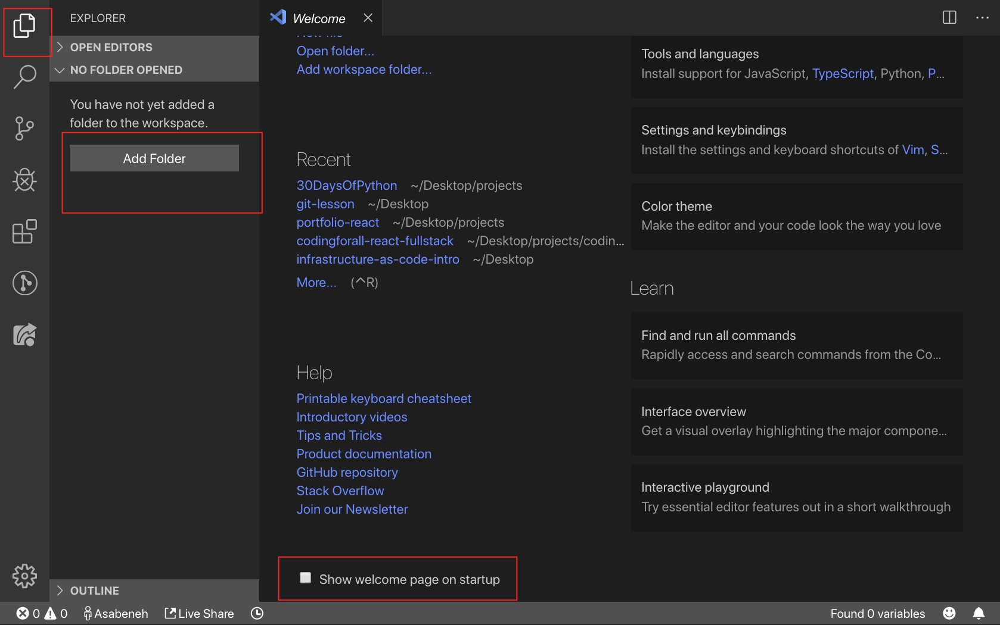
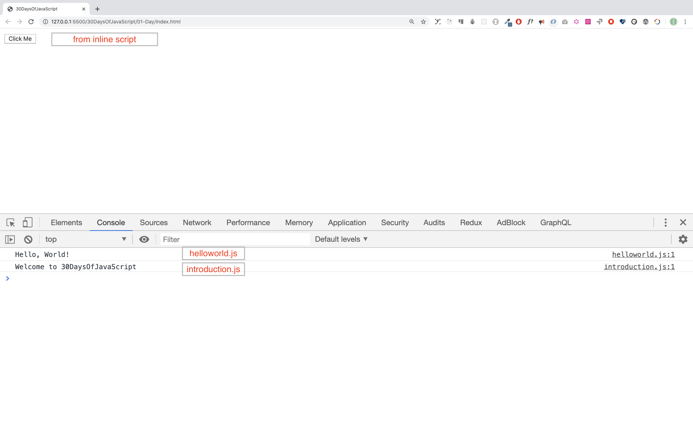

  <h1> 30 Días de JavaScript</h1>
  
  

  Autor:
  <a href="https://www.linkedin.com/in/asabeneh/" target="_blank">Asabeneh Yetayeh</a> 
  <small> Enero de 2020</small>
  

  

  🇬🇧 [English](../readMe.md)
  🇪🇸 [Spanish](./readme.md)
  🇷🇺 [Russian](../RU/README.md)

  

[📔Día 1](#día-1)
- [📔Día 1](#día-1)
  - [Introducción](#introducción)
  - [Requerimientos](#requerimientos)
  - [Preparación](#preparación)
    - [Instala Node.js](#instala-nodejs)
    - [Navegador](#navegador)
      - [Instalando Google Chrome](#instalando-google-chrome)
      - [Abriendo la consola de Google Chrome](#abriendo-la-consola-de-google-chrome)
      - [Escribiendo el código en la consola del navegador](#escribiendo-el-código-en-la-consola-del-navegador)
        - [Console.log](#consolelog)
        - [Console.log con múltiples argumentos](#consolelog-con-múltiples-argumentos)
        - [Comentario](#comentario)
        - [Sintaxis](#sintaxis)
      - [Aritmética](#aritmética)
    - [Editor de código](#editor-de-código)
      - [Instalando Visual Studio](#instalando-visual-studio)
      - [Cómo usar Visual Studio Code](#cómo-usar-visual-studio-code)
  - [Añadiendo JavaScript a una página web](#añadiendo-javascript-a-una-página-web)
    - [Script en línea](#script-en-línea)
    - [Script interno](#script-interno)
    - [Script externo](#script-externo)
    - [Múltiples Scripts externos](#múltiples-scripts-externos)
  - [Introducción a los tipos de datos](#introducción-a-los-tipos-de-datos)
    - [Números](#números)
    - [Cadenas de texto](#cadenas-de-texto)
    - [Booleanos](#booleanos)
    - [Undefined](#undefined)
    - [Null](#null)
  - [Comprobando los tipos de datos](#comprobando-los-tipos-de-datos)
  - [Comentarios](#comentarios)
    - [Variables](#variables)
- [💻 Día 1: Ejercicios](#-día-1-ejercicios)

# 📔Día 1

## Introducción

**Felicidades** por decidir participar en el desafío de 30 días de JavaScript. En este desafío aprenderás todo lo que necesitas para ser un programador de JavaScript y los conceptos generales de la programación. Al final obtendrás un certificado de 30 días de JavaScript. Únete al [grupo de telegram](https://t.me/ThirtyDaysOfJavaScript).

**30 días de JavaScript** es una guía tanto para principiantes como para desarrolladores avanzados. Bienvenido a JavaScript. Disfruto de usarlo y enseñarlo y espero que tú también. JavaScript es el lenguaje del navegador.

En este tutorial de paso a paso, aprenderás JavaScript, el lenguaje de programación más popular de la historia de la humanidad. Se usa para **agregar interactividad a las páginas web, para desarrollar aplicaciones móviles, aplicaciones de desktop, juegos** y ahora también puede ser usado para el **aprendizaje automático** (machine learning) e **inteligencia artificial** (AI). Su popularidad ha incrementado en años recientes, siendo el lenguaje predominante por cuatro años consecutivos y el más usado en GitHub.

## Requerimientos

Ningún conocimiento previo es requerido para el siguiente desafío. Solo necesitarás:

1. Motivación
2. Una computadora
3. Internet
4. Un navegador
5. Un editor de texto

## Preparación

Asumo que tienes motivación, un fuerte deseo de convertirte en un desarrollador, una computadora e internet. Si tienes todo esto, entonces lo tienes todo.

### Instala Node.js

Tal vez no lo necesites ahora pero si más adelante. Asi que instala [node.js](https://nodejs.org/en/)

Luego de que se descargue, haz doble click e instálalo

 

Puedes comprobar si se ha instalado correctamente abriendo la terminal del ordenador

    asabeneh $ node -v
    v12.14.0

Para el desafío estaremos utilizando la versión 12.14.0, la cual es la recomendada por Node.

### Navegador

Existen muchos navegadores disponibles. Sin embargo, recomiendo especialmente Google Chrome.

#### Instalando Google Chrome

Instala [Google Chrome](https://www.google.com/chrome/) si aún no lo tienes. Podemos escribir un pequeño código JavaScript en la consola del navegador, pero no utilizamos la consola para desarrollar aplicaciones.

#### Abriendo la consola de Google Chrome

Puedes abrir la consola de Google Chrome haciendo click en los tres puntos de la esquina superior derecha del navegador Chrome o utilizando un acceso directo. Yo prefiero usar los atajos.

Para abrir la consola Chrome usando un atajo.

    Mac
    Command+Option+I

    Windows:
    Ctl+Shift+I

Después de abrir la consola de Google Chrome, intenta explorar los botones marcados. Pasaremos la mayor parte del tiempo aquí. La consola es el lugar donde va el código de JavaScript. El motor de la Consola de Google V8 cambia tu código JavaScript a código de máquina. Escribamos un código JavaScript en la consola de Google Chrome:

#### Escribiendo el código en la consola del navegador

Podemos escribir cualquier código de JavaScript en la consola de Google o en la de cualquier navegador. Sin embargo, para este desafío, sólo nos centramos en la consola de Google Chrome. Abre la consola usando:

    Mac
    Comando+Opción+I

    Windows:
    Ctl+Mayúsculas+I

##### Console.log

Para escribir nuestro primer código de JavaScript, usamos una función incorporada, **console.log()**. Pasamos un argumento como datos de entrada, y la función muestra la salida. Pasamos 'Hola, Mundo' como datos de entrada o argumento en la función console.log().

    console.log('¡Hola, Mundo!')

##### Console.log con múltiples argumentos

El console.log(param1, param2, param3), puede tomar múltiples argumentos.

    console.log('Hola', 'Mundo', '!')
    console.log('FELIZ', 'AÑO', 'NUEVO', 2020)
    console.log('Bienvenido', 'a', 30, 'Días', 'de', 'JavaScript')

Como pueden ver, en el código del fragmento de arriba, console.log() puede tomar múltiples argumentos.

¡Felicidades! Escribiste tu primer código JavaScript usando _console.log()_.

##### Comentario

Podemos añadir comentarios a nuestro código. Los comentarios son muy importantes para hacer el código más legible y para dejar recordatorios en nuestro código. JavaScript no ejecuta la parte de comentarios de nuestro código. Cualquier texto que empiece con // en JavaScript es un comentario o cualquier cosa que encierre como esta /\* \*/ es un comentario.

**Ejemplo: Comentario en una sola línea**

    // Este es el primer comentario
    // Este es el segundo comentario
    // Soy un comentario de una sola línea

**Ejemplo: Comentario multilínea**

    /* Este es un comentario de varias líneas.

    Los comentarios multilínea pueden tomar múltiples líneas.

    JavaScript es el lenguaje de la web
    */

##### Sintaxis

JavaScript es un lenguaje de programación. Como resultado, tiene su sintaxis como otros lenguajes. Si no escribimos una sintaxis que JavaScript entienda, se producirán diferentes tipos de errores. Exploraremos diferentes tipos de errores de JavaScript más adelante. Por ahora, veamos los errores de sintaxis.

Cometí un error deliberado. Como resultado, la consola produce un error de sintaxis. En realidad, la sintaxis es muy informativa. Informa sobre el tipo de error que cometimos. Leyendo la guía de retroalimentación de errores, podemos corregir la sintaxis y arreglar el problema. El proceso de identificar y eliminar errores de un programa se llama 'debugging'. Corrijamos los errores:

    console.log("¡Hola, Mundo!")
    console.log('¡Hola, Mundo!')

Hasta ahora, hemos visto cómo mostrar el texto usando un console.log(). Si imprimimos texto o cadena usando console.log(), el texto tiene que estar entre comillas simples, dobles o 'backtick' (``). **Ejemplo:**

    console.log("¡Hola, Mundo!")
    console.log('¡Hola, Mundo!')
    console.log(`Hola, Mundo!`)

#### Aritmética

Ahora, practiquemos más la escritura de códigos JavaScript usando console.log() en la consola de Google Chrome para los tipos de datos numéricos. Además del texto, también podemos hacer cálculos matemáticos usando JavaScript. Hagamos los siguientes cálculos sencillos.

    console.log(2 + 3) // Adición
    console.log(3 - 2) // Sustracción
    console.log(2 * 3) // Multiplicación
    console.log(3 / 2) // División
    console.log(3 % 2) // Módulo - encontrar el resto
    console.log(3 ** 2) // Exponencial

### Editor de código

Podemos escribir nuestros códigos en la consola del navegador, pero no será para proyectos más grandes. En un entorno de trabajo real, los desarrolladores utilizan diferentes editores para escribir sus códigos. En este desafío de 30 días de JavaScript, usaremos Visual Studio Code.

#### Instalando Visual Studio

Visual Studio es un editor de texto de código abierto muy popular. Recomendaría descargarlo, pero si estás a favor de otros editores, siéntete libre de seguir con lo que tienes.

Si ya instalaste Visual Studio Code, empezaremos a usarlo.

#### Cómo usar Visual Studio Code

Abre Visual Studio Code haciendo doble clic en el ícono de Visual Studio. Cuando lo abras, obtendrás este tipo de interfaz. Intenta interactuar con los iconos etiquetados.

## Añadiendo JavaScript a una página web

JavaScript puede ser añadido a una página web de tres maneras diferentes:

- **_Script en línea ('Inline script')_**
- **_Script interno_**
- **_Script externo_**
- **_Múltiples scripts_**

Las siguientes secciones muestran diferentes formas de añadir código JavaScript a nuestra página web.

### Script en línea 

Crea una carpeta en tu escritorio y llámala 30DíasDeJS o en cualquier lugar y crea un archivo **_index.html_** en la carpeta del proyecto. Luego pega el siguiente código y ábrelo en un navegador, ya sea en [Chrome](https://www.google.com/chrome/).

    <!DOCTYPE html>
      <html>
       <head>
         <title>30DíasDeJS:Inline Script</title>
       </head>

       <body>
         <button onclick="alert('Bienvenido a 30DaysOfJavaScript!')">Hazme Click</button>
       </body>
    </html>

Ahora, escribiste tu primer inline script. Podemos crear un mensaje de alerta emergente usando la función integrada _alert()_.

### Script interno

El Script interno puede ser escrito en la cabecera del código _('head')_ o en el cuerpo _('body')_, pero es preferible ponerlo en el cuerpo del documento HTML. Primero, escribamos en la parte de la cabeza de la página.

    <!DOCTYPE html>
    <html>
        <head>
        <title>30DíasDeJS:Scripts Internos</title>
        
        </head>
        <body>
        </body>
    </html>

Así es como escribimos el guión interno la mayor parte del tiempo. Escribir el código de JavaScript en la sección del body es el lugar más recomendado. Abre la consola del navegador para ver la respuesta del console.log()

    <!DOCTYPE html>
    <html>
        <head>
         <title>30DíasDeJS:Scripts Internos</title>
        </head>
        <body>
        <button onclick="alert('Bienvenido a 30DaysOfJavaScript!');">Click Me</button>
        
        </body>
    </html>

Abre la consola del navegador para ver la respuesta del console.log()

### Script externo

Al igual que el script interno, el enlace del script externo puede estar en la cabecera del código ('head') o en el cuerpo ('body'), pero igualmente es recomendado ponerlo en el 'body'. Primero, debemos crear un archivo JavaScript externo con extensión .js. Cualquier archivo JavaScript termina con .js. Crea un archivo introduccion.js dentro del directorio del proyecto y escribe el siguiente código y enlaza este archivo .js en la parte inferior del cuerpo.

    console.log('Bienvenido a 30DaysOfJavaScript')

**Script externo en la cabecera**

    <!DOCTYPE html>
    <html>
        <head>
         <title>30DíasDeJS:Scripts Externos</title>
        
        </head>
        <body>
        </body>
        </html>

**Script externo en el cuerpo**

    <!DOCTYPE html>
    <html>
        <head>
         <title>30DíasDeJS:Scripts Externos</title>
        </head>
        <body>
        //Podría estar en la cabecera o en el cuerpo...
        // Aquí está el lugar recomendado para poner el script externo
        
        </body>
        </html>

Abre la consola del navegador para ver la respuesta del console.log()

### Múltiples Scripts externos

Podemos enlazar múltiples archivos externos de JavaScript a una página web. Crea un archivo holamundo.js dentro de la carpeta 30DiasDeJS y escribe el siguiente código.

    console.log('¡Hola, Mundo!')

    <!DOCTYPE html>
    <html>
        <cabeza>
        <título>Múltiples guiones externos</título>
        </cabeza>
        <cuerpo>

        
        
        </cuerpo>
    </html>

Tu archivo main.js debería estar por debajo de todos los otros scripts. Ten cuidado con tu ejercicio para entender esta línea.

## Introducción a los tipos de datos

En JavaScript y también en otros lenguajes de programación, hay diferentes tipos de datos. Los siguientes son los tipos de datos primitivos de JavaScript: _Cadenas de texto ('string'), Números, Booleanos, undefined, Null_ y _Symbol_.

### Números

- Enteros: Números enteros (negativos, cero y positivos) Ejemplo: ... -3, -2, -1, 0, 1, 2, 3 ...
- Float: Números decimales Ejemplo ... -3.5, -2.25, -1.0, 0.0, 1.1, 2.2, 3.5 ...

### Cadenas de texto

Una colección de uno o más carácteres entre comillas. **Ejemplo:**

    "Asabeneh"
    "Finlandia" 
    'JavaScript es un hermoso lenguaje de programación'.
    "Me encanta enseñar"
    "Espero que estés disfrutando del primer día"
    `También podemos crear una cadena usando un backtick`

### Booleanos

Un valor booleano es verdadero o falso. Cualquier comparación devuelve un valor booleano, que es verdadero o falso.

Un tipo de datos booleano es un valor Verdadero o Falso.

**Ejemplo:**

    true // si la luz está encendida, el valor es true
    falso // si la luz está apagada, el valor es Falso

### Undefined

En JavaScript, si no asignamos un valor a una variable, el valor es indefinido. Además, si una función no devuelve nada, devuelve undefined.

    let nombre;
    console.log(nombre); //no está definida, porque no está asignada a un valor todavía

### Null

Null en JavaScript significa un valor vacío/nulo.

    let valorVacio = null

## Comprobando los tipos de datos

Para comprobar el tipo de datos de un determinado valor, utilizamos el operador **'typeof'**. Véase el siguiente ejemplo.

    console.log(typeof 'Asabeneh') // string
    console.log(typeof 5) // número
    console.log(typeof true ) // boolean
    console.log(typeof null) // tipo de objeto
    console.log(typeof undefined) // undefined

## Comentarios

Los comentarios en JavaScript son similares a los de otros lenguajes de programación. Los comentarios son importantes para hacer tu código más legible. Hay dos maneras de comentar:

- _Comentario en una sola línea_
- _Comentario multilineal_

        // comentando el código mismo con un solo comentario
        // let nombre = 'Asabeneh'; comentario de una sola línea
        // let apellido = 'Yetayeh'; comentario de una sola línea

Comentario multilineal:

    /*
        let ubicación = 'Helsinki';
        let edad = 100;
        let casado = verdadero;
        Este es un comentario de varias líneas
     */

### Variables

Las variables son contenedores de datos. Las variables se utilizan para almacenar datos en una ubicación de memoria. Cuando se declara una variable, se reserva una ubicación de memoria. Cuando se asigna una variable a un valor (data), el espacio de memoria se llena con esos datos. Para declarar una variable, usamos palabras clave _var_, _let_ o _const_. Hablaremos más sobre var, let y const en detalle en otras secciones (ámbito). Por ahora, la explicación anterior es suficiente.

Para una variable que cambia en un momento diferente, usamos _let_. Si los datos no cambian en absoluto, usamos _const_. Por ejemplo, PI, nombre del país, gravedad no cambian, y podemos usar _const._

- El nombre de una variable en JavaScript no debe comenzar con un número.
- Un nombre de variable JavaScript no permite caracteres especiales excepto el signo de dólar y el guión bajo.
- Los nombres de las variables en JavaScript siguen una convención 'CamelCase'.
- El nombre de una variable no debe tener espacio entre palabras.

Los siguientes son ejemplos válidos de variables JavaScript.

Variables válidas en JavaScript:

    primerNombre
    apellido
    país
    ciudadCapital
    capital
    edad
    estaCasado

    nombre_de_pila
    apellido
    esta_casado
    ciudad_capital

    num1
    num_1
     _num_1
    $num1
    año2020
    año_2020

camelCase es convencional en JavaScript. En este material, usaremos variables de CamelCase.

Variables inválidas:

    primer-nombre
    1_numero
    num_#_1

Declaremos las variables con diferentes tipos de datos. Para declarar una variable, necesitamos usar la palabra clave let o const antes del nombre de la variable. Después del nombre de la variable, escribimos un signo igual (operador de asignación), y un valor.

    # Sintaxis
    let nombreDeLaVariable = valor

**Ejemplos: Variables**

    // Declarando diferentes variables de diferentes tipos de datos
    let nombre = 'Asabeneh' // nombre de una persona
    let apellido = 'Yetayeh' // apellido de una persona
    let pais = 'Finland' // país
    let ciudad = 'Helsinki' // ciudad capital
    let edad = 100 // edad en años
    let estaCasado = true

    console.log(nombre, apellido, país, ciudad, edad, estáCasado)

    Asabeneh Yetayeh Finlandia Helsinki 100 True

    // Declarando variables con valores numéricos
    let edad = 100 // edad en años
    const constante = 9,81 // gravedad terrestre en m/s2
    const puntoDeEbullición  = 100 // punto de ebullición del agua, temperatura en oC
    const PI = 3.14 // constante geométrica

    console.log(gravedad, punto de ebullición, PI)

    9.81 100 3.14

    // Las variables también pueden ser declaradas en una línea separada por una coma
    let nombre = 'Asabeneh', // nombre de una persona
    trabajo = 'profesor',
    viveEn = 'Finlandia';
    console.log(nombre, trabajo, viveEn);

    Asabeneh profesor de Finlandia

Cuando ejecutas los archivos en la carpeta Día_1 deberías obtener esto:

🌕 Eres increíble. Acabas de completar el desafío del día 1 y estás en camino a la grandeza. Ahora haz algunos ejercicios para tu cerebro y para tus músculos.

# 💻 Día 1: Ejercicios

1.  Escribe un comentario de una sola línea que diga _"los comentarios pueden hacer que el código sea legible"_

2.  Escribe otro comentario que diga, _"Bienvenido a 30DaysOfJavaScript"_

3.  Escribe un comentario multilínea que diga, _"Los comentarios pueden hacer el código legible, fácil de usar e informativo"_

4.  Crea un archivo variable.js y declarar variables y asignar tipos de datos string, booleanos, indefinidos y nulos

5.  Crea el archivo datatypes.js y utilizar el operador **_"typeof"_** de JavaScript para comprobar los diferentes tipos de datos. Comprueba el tipo de datos de cada variable

6.  Declara cuatro variables sin asignar valores

7.  Declara cuatro variables con valores asignados

8.  Declara variables para almacenar su nombre, apellido, estado civil, país y edad en múltiples líneas

9.  Declara variables para almacenar su nombre, apellido, estado civil, país y edad en una sola línea

10. Declara dos variables _miEdad_ y _tuEdad_ y asígneles valores iniciales y regístrese en la consola del navegador.

            Tengo 25 años.
            Tú tienes 30 años.

    🎉 ¡FELICIDADES! 🎉
