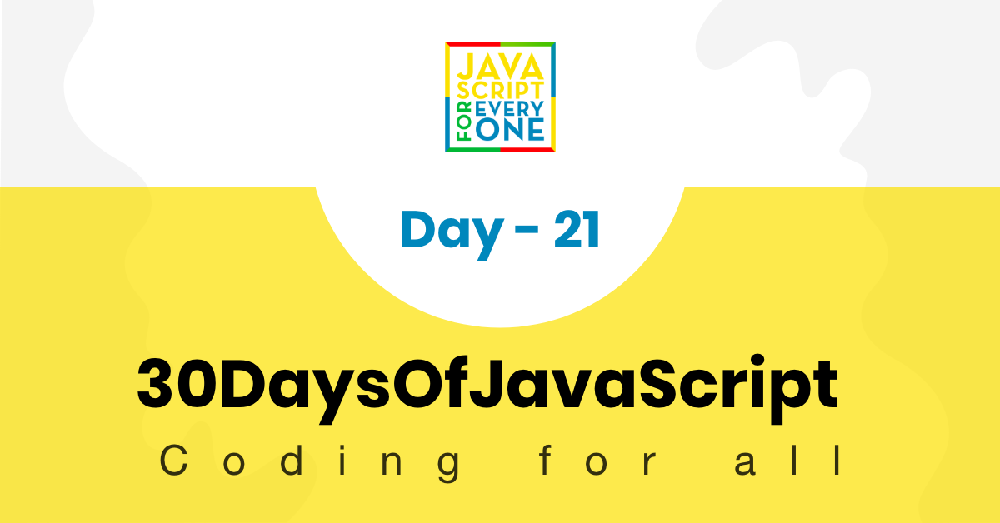

<div align="center">
  <h1> 30 Günde Javascript: Objects - Nesneler</h1>
  <a class="header-badge" target="_blank" href="https://www.linkedin.com/in/asabeneh/">
  
  </a>
  <a class="header-badge" target="_blank" href="https://twitter.com/Asabeneh">
  
  </a>

  <sub>Author:
  <a href="https://www.linkedin.com/in/asabeneh/" target="_blank">Asabeneh Yetayeh</a><br>
<sub>Çevirmen:
  <a href="https://github.com/alicangunduz" target="_blank">Ali Can Gündüz</a><br>
  <small> Ocak 2023</small>
  </sub>
</div>

[<< Gün 20](../20_Day_Writing_clean_codes/20_day_writing_clean_codes.md) | [Gün 22 >>](../22_Day_Manipulating_DOM_object/22_day_manipulating_DOM_object.md)



- [Day 21](#day-21)
  - [Belge Nesne Modeli (DOM) - Gün 21](#belge-nesne-modeli-dom---gün-21)
    - [Elementi al](#elementi-al)
      - [Etiket adına göre elementleri almak](#etiket-adına-göre-elementleri-almak)
      - [Sınıf adına göre elementleri almak](#sınıf-adına-göre-elementleri-almak)
      - [Id'ye göre bir elementi almak](#idye-göre-bir-elementi-almak)
      - [querySelector yöntemi kullanarak elementleri almak](#queryselector-yöntemi-kullanarak-elementleri-almak)
    - [Öznitelik eklemek](#öznitelik-eklemek)
      - [setAttribute() metodu kullanarak öznitelik ekleme](#setattribute-metodu-kullanarak-öznitelik-ekleme)
      - [SetAttribute olmadan öznitelik ekleme](#setattribute-olmadan-öznitelik-ekleme)
      - [classList kullanarak sınıf ekleme](#classlist-kullanarak-sınıf-ekleme)
      - [remove kullanarak sınıfı kaldırma](#remove-kullanarak-sınıfı-kaldırma)
      - [HTML elemanına metin ekleme](#html-elemanına-metin-ekleme)
      - [textContent kullanarak metin içeriği ekleme](#textcontent-kullanarak-metin-içeriği-ekleme)
      - [innerHTML kullanarak Metin İçeriği Ekleme](#innerhtml-kullanarak-metin-i̇çeriği-ekleme)
      - [Metin İçeriği](#metin-i̇çeriği)
        - [Inner HTML](#inner-html)
    - [Style elşeöe](#style-elşeöe)
      - [Style Rengi Ekleme](#style-rengi-ekleme)
      - [Arka plan rengi ekleme](#arka-plan-rengi-ekleme)
      - [Yazı tipi boyutu ekleme](#yazı-tipi-boyutu-ekleme)
  - [Egzersizler](#egzersizler)
    - [Egzersiz: Level 1](#egzersiz-level-1)
    - [Egzersiz: Level 2](#egzersiz-level-2)
    - [Egzersiz: Level 3](#egzersiz-level-3)
      - [DOM: Mini Proje 1](#dom-mini-proje-1)

# Day 21

## Belge Nesne Modeli (DOM) - Gün 21

HTML belgesi JavaScript nesnesi olarak yapılandırılmıştır. Her HTML elementi farklı özelliklere sahiptir ve bunları manipüle etmek için kullanılabilir. JavaScript kullanarak HTML elementlerini almak, oluşturmak, eklemek veya kaldırmak mümkündür. Örnekler aşağıda incelenebilir. JavaScript ile HTML elementi seçmek, CSS ile seçmek ile benzerdir. HTML elementini seçmek için etiket adı, id, sınıf adı veya diğer öznitelikler kullanılır.

### Elementi al

JavaScript kullanarak zaten oluşturulmuş elementlere veya elementlere erişebiliriz. Elementlere erişmek veya almak için farklı metodlar kullanırız. Aşağıdaki kodda dört _h1_ elementi var. _h1_ elementlerine erişmek için farklı metodları inceleyelim.

```html
<!DOCTYPE html>
  <html lang="en">
    <head>
      <title>Document Object Model</title>
    </head>
    <body>

     <h1 class='title' id='first-title'>First Title</h1>
     <h1 class='title' id='second-title'>Second Title</h1>
     <h1 class='title' id='third-title'>Third Title</h1>
     <h1></h1>

    </body>
  </html>
```

#### Etiket adına göre elementleri almak

**_getElementsByTagName():_** bir etiket adını dize olarak alan bir parametre alır ve bu yöntem bir HTMLCollection nesnesi döndürür. HTMLCollection bir HTML elementlerinin array benzeri bir nesnesidir. Uzunluk özelliği koleksiyonun boyutunu sağlar. Bu yöntemi kullandığımızda, index kullanarak veya her bir öğeyi tek tek geçerek bireysel elementlere erişiriz. HTMLCollection tüm dizi yöntemlerini desteklemez, bu yüzden forEach yerine düzenli for döngüsü kullanmalıyız.

```js
// syntax
document.getElementsByTagName('tagname')
```

```js
const allTitles = document.getElementsByTagName('h1')

console.log(allTitles) //HTMLCollections
console.log(allTitles.length) // 4

for (let i = 0; i < allTitles.length; i++) {
  console.log(allTitles[i]) // prints each elements in the HTMLCollection
}
```

#### Sınıf adına göre elementleri almak

**_getElementsByClassName()_** metodu bir HTMLCollection nesnesi döndürür. HTMLCollection, HTML elementlerinin dizi benzeri bir listesidir. Uzunluk özelliği koleksiyonun boyutunu sağlar. Tüm HTMLCollection elementlerini dolaşmak mümkündür. Örnek aşağıda gösterilmektedir.

```js
//syntax
document.getElementsByClassName('classname')
```

```js
const allTitles = document.getElementsByClassName('title')

console.log(allTitles) //HTMLCollections
console.log(allTitles.length) // 4

for (let i = 0; i < allTitles.length; i++) {
  console.log(allTitles[i]) // prints each elements in the HTMLCollection
}
```

#### Id'ye göre bir elementi almak

**_getElementsById()_** tek bir HTML elementine yönelir. Id'yi # olmadan bir argüman olarak geçiririz.

```js
//syntax
document.getElementById('id')
```

```js
let firstTitle = document.getElementById('first-title')
console.log(firstTitle) // <h1>First Title</h1>
```

#### querySelector yöntemi kullanarak elementleri almak

_document.querySelector_ yöntemi etiket adı, kimlik veya sınıf adına göre HTML veya HTML elementlerini seçebilir.

**_querySelector:_** etiket adı, kimlik veya sınıf tarafından seçilen HTML elementini seçmek için kullanılabilir. Etiket adı kullanılırsa, yalnızca ilk element seçilir.

```js
let firstTitle = document.querySelector('h1') // select the first available h1 element
let firstTitle = document.querySelector('#first-title') // select id with first-title
let firstTitle = document.querySelector('.title') // select the first available element with class title
```

**_querySelectorAll:_** etiket adı veya sınıf tarafından seçilen html elementlerini seçmek için kullanılabilir. Döndürülen nodeList bir dizi benzeri nesne olup, dizi yöntemlerini destekler. Her nodeList öğesini dolaşmak için **_for döngüsü_** veya **_forEach_** kullanabiliriz.

```js
const allTitles = document.querySelectorAll('h1') # selects all the available h1 elements in the page

console.log(allTitles.length) // 4
for (let i = 0; i < allTitles.length; i++) {
  console.log(allTitles[i])
}

allTitles.forEach(title => console.log(title))
const allTitles = document.querySelectorAll('.title') // the same goes for selecting using class
```

### Öznitelik eklemek

HTML açılır etiketinde bir öznitelik eklenir ve element hakkında ek bilgi verir. Yaygın HTML öznitelikleri: id, class, src, style, href,disabled, title, alt. Dördüncü başlık için id ve class ekleyelim.

```js
const titles = document.querySelectorAll('h1')
titles[3].className = 'title'
titles[3].id = 'fourth-title'
```

#### setAttribute() metodu kullanarak öznitelik ekleme

**_setattribute()_** metodu, herhangi bir html öznitelik ekler. İki parametre alır: öznitelik türü ve öznitelik adı.
Dördüncü başlık için class ve id özniteliği ekleyelim.

```js
const titles = document.querySelectorAll('h1')
titles[3].setAttribute('class', 'title')
titles[3].setAttribute('id', 'fourth-title')
```

#### SetAttribute olmadan öznitelik ekleme

Normalde bir nitelik atamak için normal nesne atama yöntemini kullanabiliriz ancak bu tüm elemanlar için geçerli olmayabilir. Bazı nitelikler DOM nesnesi özellikleridir ve direk olarak atanabilirler. Örneğin, id ve class gibi.

```js
//another way to setting an attribute
titles[3].className = 'title'
titles[3].id = 'fourth-title'
```

#### classList kullanarak sınıf ekleme

classList yöntemi ek sınıf eklemek için iyi bir yöntemdir. Eğer bir sınıf var ise, orijinal sınıfı geçersiz kılmaz, aksine eleman için ek sınıf ekler.

```js
//another way to setting an attribute: append the class, doesn't over ride
titles[3].classList.add('title', 'header-title')
```

#### remove kullanarak sınıfı kaldırma

Eklemeye benzer şekilde, bir elemandan sınıfı da kaldırabiliriz. Bir elemandan belirli bir sınıfı kaldırabiliriz.

```js
//another way to setting an attribute: append the class, doesn't over ride
titles[3].classList.remove('title', 'header-title')
```

#### HTML elemanına metin ekleme

HTML bir açılış etiketi, bir kapatma etiketi ve bir metin içeriğinden oluşur. Metin içeriğini _textContent_ özelliği veya \*innerHTML kullanarak ekleyebiliriz.

#### textContent kullanarak metin içeriği ekleme

_textContent_ özelliği HTML elemanına metin eklemek için kullanılır.

```js
const titles = document.querySelectorAll('h1')
titles[3].textContent = 'Fourth Title'
```

#### innerHTML kullanarak Metin İçeriği Ekleme

Birçok insan _textContent_ ve _innerHTML_ arasında karışır. _textContent_ bir HTML elemanına metin eklemek için tasarlanmıştır ancak innerHTML bir metin veya HTML elemanı veya elemanları bir çocuk olarak ekleyebilir.

#### Metin İçeriği

Biz bir metin atamak için *textContent* HTML nesne özelliğini kullanırız.

```js
const titles = document.querySelectorAll('h1')
titles[3].textContent = 'Fourth Title'
```

##### Inner HTML

Bir ebeveyn elemana tamamen yeni bir child içeriği eklemek veya değiştirmek istediğimizde innerHTML özelliğini kullanırız. Atadığımız değer HTML elemanlarından oluşan bir dizi olacaktır.

```html
<!DOCTYPE html>
<html lang="en">
  <head>
    <title>JavaScript for Everyone:DOM</title>
  </head>
  <body>
    <div class="wrapper">
        <h1>Asabeneh Yetayeh challenges in 2020</h1>
        <h2>30DaysOfJavaScript Challenge</h2>
        <ul></ul>
    </div>
    <script>
    const lists = `
    <li>30DaysOfPython Challenge Done</li>
            <li>30DaysOfJavaScript Challenge Ongoing</li>
            <li>30DaysOfReact Challenge Coming</li>
            <li>30DaysOfFullStack Challenge Coming</li>
            <li>30DaysOfDataAnalysis Challenge Coming</li>
            <li>30DaysOfReactNative Challenge Coming</li>
            <li>30DaysOfMachineLearning Challenge Coming</li>`
  const ul = document.querySelector('ul')
  ul.innerHTML = lists
    </script>
  </body>
</html>
```

innerHTML özelliği, bir üst elemanın tüm çocuklarını kaldırmamıza da olanak tanır. removeChild() kullanmak yerine aşağıdaki yöntemi tavsiye ederim.

```html
<!DOCTYPE html>
<html lang="en">
  <head>
    <title>JavaScript for Everyone:DOM</title>
  </head>
  <body>
    <div class="wrapper">
        <h1>Asabeneh Yetayeh challenges in 2020</h1>
        <h2>30DaysOfJavaScript Challenge</h2>
        <ul>
            <li>30DaysOfPython Challenge Done</li>
            <li>30DaysOfJavaScript Challenge Ongoing</li>
            <li>30DaysOfReact Challenge Coming</li>
            <li>30DaysOfFullStack Challenge Coming</li>
            <li>30DaysOfDataAnalysis Challenge Coming</li>
            <li>30DaysOfReactNative Challenge Coming</li>
            <li>30DaysOfMachineLearning Challenge Coming</li>
        </ul>
    </div>
    <script>
  const ul = document.querySelector('ul')
  ul.innerHTML = ''
    </script>
  </body>
</html>
```

### Style elşeöe

#### Style Rengi Ekleme

Başlıklarımıza biraz stil ekleyelim. Eğer elemanın indisi çift ise ona yeşil renk veririz, aksi halde kırmızı.

```js
const titles = document.querySelectorAll('h1')
titles.forEach((title, i) => {
  title.style.fontSize = '24px' // all titles will have 24px font size
  if (i % 2 === 0) {
    title.style.color = 'green'
  } else {
    title.style.color = 'red'
  }
})
```

#### Arka plan rengi ekleme

Başlıklarımıza biraz stil ekleyelim. Eğer elemanın indisi çift ise ona yeşil renk veririz, aksi halde kırmızı.

```js
const titles = document.querySelectorAll('h1')
titles.forEach((title, i) => {
  title.style.fontSize = '24px' // all titles will have 24px font size
  if (i % 2 === 0) {
    title.style.backgroundColor = 'green'
  } else {
    title.style.backgroundColor = 'red'
  }
})
```

#### Yazı tipi boyutu ekleme

Başlıklarımıza biraz stil ekleyelim. Eğer elemanın indisi çift ise ona 20px veririz, aksi halde 30px

```js
const titles = document.querySelectorAll('h1')
titles.forEach((title, i) => {
  title.style.fontSize = '24px' // all titles will have 24px font size
  if (i % 2 === 0) {
    title.style.fontSize = '20px'
  } else {
    title.style.fontSize = '30px'
  }
})
```

Fark etmişsinizdir, JavaScript içinde kullandığımızda css özellikleri camelCase olarak kullanılır. Aşağıdaki CSS özellikleri background-color'dan backgroundColor, font-size'dan fontSize, font-family'den fontFamily, margin-bottom'dan marginBottom şekilde değişir.

---

🌕 Şimdi, süper güçlerle tamamen şarj oldunuz, zorlu ve önemli en önemli kısmını tamamladınız ve genel olarak JavaScript ile. DOM öğrendiniz ve şimdi uygulamalar inşa etme ve geliştirme yeteneğiniz var. Şimdi beyniniz ve kaslarınız için bazı egzersizler yapın.

## Egzersizler

### Egzersiz: Level 1

1. index.html dosyası oluşturun ve yukarıdaki gibi dört p elemanı koyun: Etiket adını kullanarak **_document.querySelector(tagname)_** ile ilk paragrafı alın
2. id'lerine göre **_document.querySelector('#id')_** kullanarak her bir paragrafı alın
3. Etiket adlarına göre **_document.querySelectorAll(tagname)_** kullanarak tüm p elemanlarını nodeList olarak alın
4. nodeList içinde dolaşın ve her paragrafın metin içeriğini alın
5. Dördüncü paragrafta metin içeriği olarak **_Fourth Paragraph_** yerleştirin. 
6. Farklı özellik ayarlama yöntemlerini kullanarak tüm paragraflar için id ve sınıf özelliklerini ayarlayın

### Egzersiz: Level 2

1. JavaScript kullanarak her paragrafın stilini değiştirin (örn. renk, arka plan, sınır, yazı tipi boyutu, yazı tipi ailesi)
2. Tüm paragrafları seçin ve her elemanın içinde dolaşın ve ilk ve üçüncü paragrafı yeşil, ikinci ve dördüncü paragrafı kırmızı renkte verin
3. Her paragrafın içeriğini, id'sini ve sınıfını ayarlayın

### Egzersiz: Level 3

#### DOM: Mini Proje 1

1. Aşağıdaki uygulamayı geliştirin, başlamak için aşağıdaki HTML elemanlarını kullanın. Başlangıç klasöründe aynı kodu alacaksınız. Tüm stiller ve işlevsellikleri sadece JavaScript kullanarak uygulayın.

   - Yılın rengi her 1 saniyede değişiyor
   - Tarih ve saat arka plan rengi saniyede bir değişiyor
   - Tamamlanan meydan okuma arka planı yeşil
   - Devam eden meydan okuma arka planı sarı
   - Yaklaşan meydan okumaların arka planı kırmızı

```html
<!-- index.html -->
<!DOCTYPE html>
<html lang="en">
  <head>
    <title>JavaScript for Everyone:DOM</title>
  </head>
  <body>
    <div class="wrapper">
        <h1>Asabeneh Yetayeh challenges in 2020</h1>
        <h2>30DaysOfJavaScript Challenge</h2>
        <ul>
            <li>30DaysOfPython Challenge Done</li>
            <li>30DaysOfJavaScript Challenge Ongoing</li>
            <li>30DaysOfReact Challenge Coming</li>
            <li>30DaysOfFullStack Challenge Coming</li>
            <li>30DaysOfDataAnalysis Challenge Coming</li>
            <li>30DaysOfReactNative Challenge Coming</li>
            <li>30DaysOfMachineLearning Challenge Coming</li>
        </ul>
    </div>
  </body>
</html>
```


🎉 TEBRİKLER ! 🎉

[<< Gün 20](../Turkish/../20_Day_Writing_clean_codes/20_Day_writing_clean_codes.md) | [Gün 22 >>](../Turkish/../22_Day_Manipulating_DOM_object/22_day_manipulating_DOM_object.md)