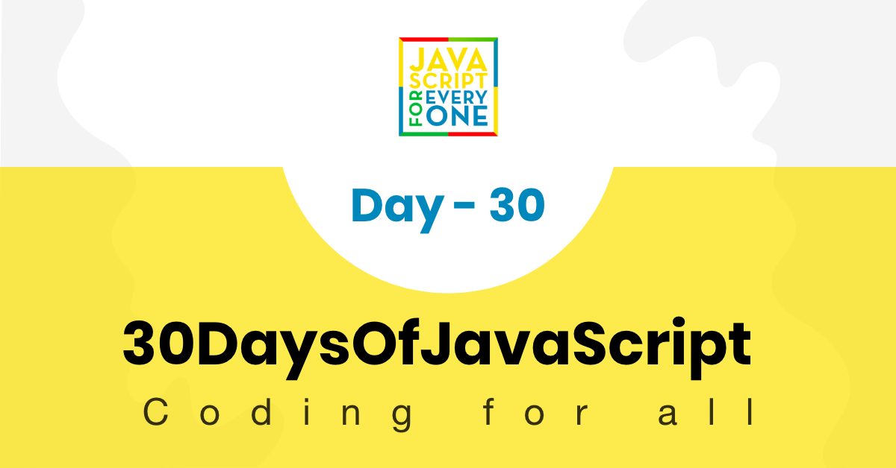
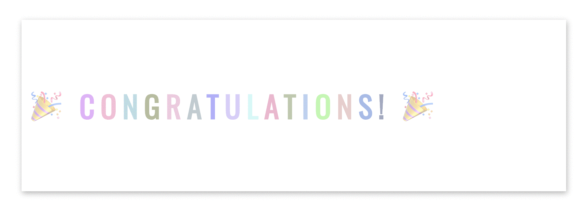

  <h1> 30 Days Of JavaScript: Final Projects</h1>
  
  

  Author:
  <a href="https://www.linkedin.com/in/asabeneh/" target="_blank">Asabeneh Yetayeh</a> 
Çevirmen:
  <a href="https://github.com/alicangunduz" target="_blank">Ali Can Gündüz</a> 
  <small> Mart 2023</small>
  

<small>Support the <strong>author</strong> to create more educational materials</small>    

[<< Gün 29](../29_Day_Mini_project_animating_characters/29_day_mini_project_animating_characters.md)

- [Gün 30](#gün-30)
  - [Egzersiz](#egzersiz)
    - [Egzersiz: Seviye 1](#egzersiz-seviye-1)
  - [Mükemmelsin](#mükemmelsin)
  - [Testimony](#testimony)
  - [Support](#support)

# Gün 30

## Egzersiz

### Egzersiz: Seviye 1

1. (HTML, CSS, JS) kullanarak aşağıdaki animasyonu oluşturun

2. Regex kullanarak aşağıdaki formu doğrulayın.

   

   

## Mükemmelsin

🌕 Harika bir başarıya imza attınız! Yücelik yolculuğunuzda sona geldiniz ve yüksek bir seviyeye ulaştınız. Artık öncekinden daha büyük ve daha güçlüsünüz. Bu seviyeye gelmenin ne kadar zor olduğunu biliyorum ve siz bu noktaya ulaşarak gerçek bir kahraman oldunuz. Şimdi ise başarınızı sevdiklerinizle kutlama zamanı geldi! Sizden başka zorluklarla dolu yeni bir yolculukta görüşmek üzere.

## Testimony

Now it is time support the author and  express your thoughts about the Author and 30DaysOfJavaScript. You can leave your testimonial on this [link](https://testimonify.herokuapp.com/)

## Destek

You can support the author to produce more educational materials

[<< Day 29](../29_Day_Mini_project_animating_characters/29_day_mini_project_animating_characters.md)  
