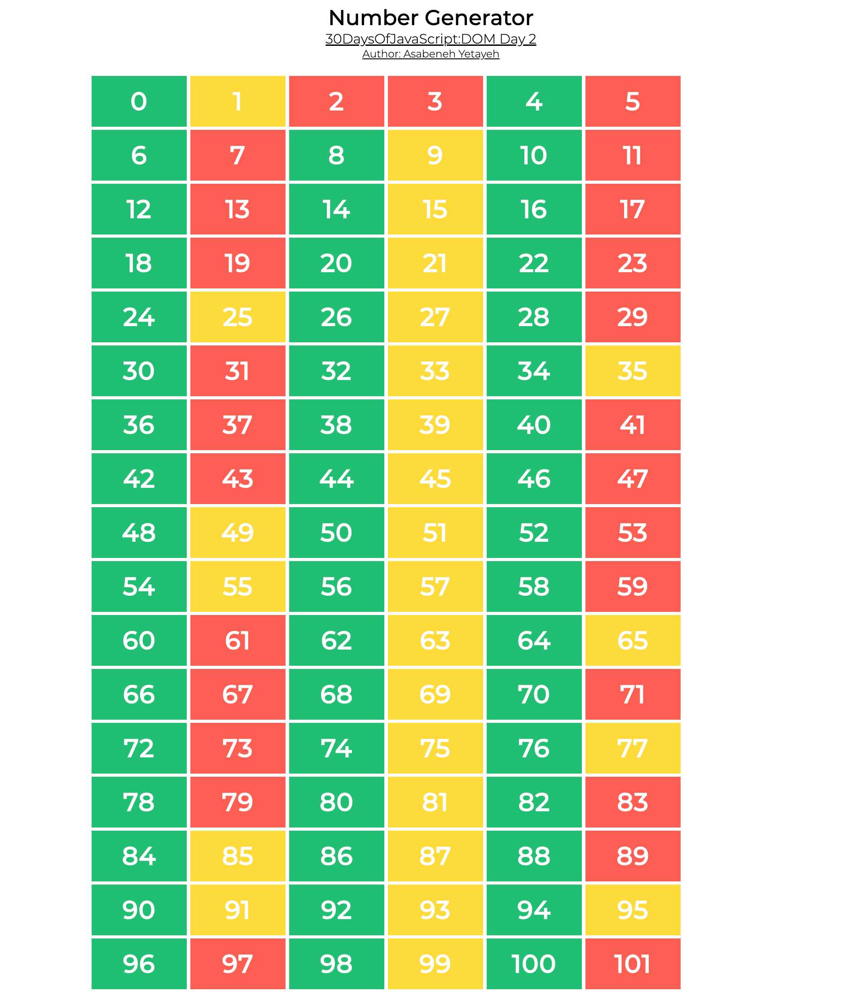
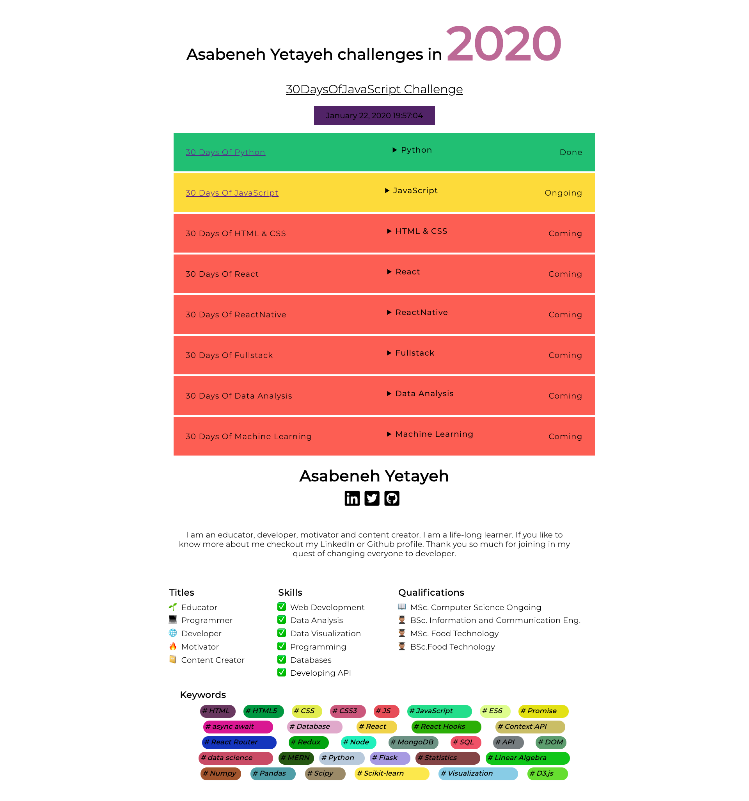

<div align="center">
  <h1> 30 Days Of JavaScript: Manipulating DOM Object</h1>
  <a class="header-badge" target="_blank" href="https://www.linkedin.com/in/asabeneh/">
  
  </a>
  <a class="header-badge" target="_blank" href="https://twitter.com/Asabeneh">
  
  </a>


  <sub>Author:
  <a href="https://www.linkedin.com/in/asabeneh/" target="_blank">Asabeneh Yetayeh</a><br>
<sub>Çevirmen:
  <a href="https://github.com/alicangunduz" target="_blank">Ali Can Gündüz</a><br>
  <small> Ocak 2023</small>
  </sub>

</div>

[<< Gün 21](../21_Day_DOM/21_day_dom.md) | [Gün 23 >>](../23_Day_Event_listeners/23_day_event_listeners.md)


- [Gün 22](#gün-22)
  - [DOM(Document Object Model)-Gün 2](#domdocument-object-model-gün-2)
    - [Element Oluşturma](#element-oluşturma)
    - [Element oluşturma](#element-oluşturma-1)
    - [Bir üst elemente child ekleme](#bir-üst-elemente-child-ekleme)
    - [Bir üst ebeveyn(kapsar element) bir child elementi kaldırma](#bir-üst-ebeveynkapsar-element-bir-child-elementi-kaldırma)
  - [Yukarıdaki kod parçacığı tüm child elementleri temizledi.](#yukarıdaki-kod-parçacığı-tüm-child-elementleri-temizledi)
  - [Egzersizler](#egzersizler)
    - [Egzersiz: Level 1](#egzersiz-level-1)
    - [Egzersiz: Level 2](#egzersiz-level-2)
    - [Egzersiz: Level 3](#egzersiz-level-3)

# Gün 22

## DOM(Document Object Model)-Gün 2

### Element Oluşturma

HTML element oluşturmak için etiket adını kullanırız. JavaScript kullanarak HTML element oluşturmak oldukça basittir . _document.createElement()_ metodunu kullanırız. Bu metod bir HTML element etiket adını string olarak alır.

```js
// syntax
document.createElement('tagname')
```

```html
<!DOCTYPE html>
<html>

<head>
    <title>Document Object Model:30 Days Of JavaScript</title>
</head>

<body>

    <script>
        let title = document.createElement('h1')
        title.className = 'title'
        title.style.fontSize = '24px'
        title.textContent = 'Creating HTML element DOM Day 2'

        console.log(title)
    </script>
</body>

</html>
```

### Element oluşturma

Birden fazla element oluşturmak için döngü kullanmalıyız. Döngü kullanarak istediğimiz kadar HTML elementi oluşturabiliriz.
Element oluşturduktan sonra, HTML nesnenin farklı özelliklerine değer atayabiliriz.

```html
<!DOCTYPE html>
<html>

<head>
    <title>Document Object Model:30 Days Of JavaScript</title>
</head>

<body>

    <script>
        let title
        for (let i = 0; i < 3; i++) {
            title = document.createElement('h1')
            title.className = 'title'
            title.style.fontSize = '24px'
            title.textContent = i
            console.log(title)
        }
    </script>
</body>

</html>
```

### Bir üst elemente child ekleme

Oluşturduğumuz elementi HTML'de görmek için, üst element olarak child olarak eklememiz gerekir. HTML'de body'sine *document.body* ile erişebiliriz. *document.body* *appendChild()* metodunu destekler. Aşağıdaki örneğe bakın.

```html
<!DOCTYPE html>
<html>

<head>
    <title>Document Object Model:30 Days Of JavaScript</title>
</head>

<body>

    <script>
        // creating multiple elements and appending to parent element
        let title
        for (let i = 0; i < 3; i++) {
            title = document.createElement('h1')
            title.className = 'title'
            title.style.fontSize = '24px'
            title.textContent = i
            document.body.appendChild(title)
        }
    </script>
</body>
</html>
```

### Bir üst ebeveyn(kapsar element) bir child elementi kaldırma

HTML oluşturduktan sonra, element veya elementleri kaldırmak isteyebiliriz ve *removeChild()* metodunu kullanabiliriz.

**Örnek:**

```html
<!DOCTYPE html>
<html>

<head>
    <title>Document Object Model:30 Days Of JavaScript</title>
</head>

<body>
    <h1>Removing child Node</h1>
    <h2>Asabeneh Yetayeh challenges in 2020</h1>
    <ul>
        <li>30DaysOfPython Challenge Done</li>
        <li>30DaysOfJavaScript Challenge Done</li>
        <li>30DaysOfReact Challenge Coming</li>
        <li>30DaysOfFullStack Challenge Coming</li>
        <li>30DaysOfDataAnalysis Challenge Coming</li>
        <li>30DaysOfReactNative Challenge Coming</li>
        <li>30DaysOfMachineLearning Challenge Coming</li>
    </ul>

    <script>
        const ul = document.querySelector('ul')
        const lists = document.querySelectorAll('li')
        for (const list of lists) {
            ul.removeChild(list)

        }
    </script>
</body>

</html>
```

Önceki bölümde gördüğümüz gibi, bir üst elementin tüm iç HTML elementlerini veya child elementleri *innerHTML* metodu ve özelliklerini kullanarak ortadan kaldırmak için daha iyi bir yol mevcut.

```html
<!DOCTYPE html>
<html>

<head>
    <title>Document Object Model:30 Days Of JavaScript</title>
</head>

<body>
    <h1>Removing child Node</h1>
    <h2>Asabeneh Yetayeh challenges in 2020</h1>
    <ul>
        <li>30DaysOfPython Challenge Done</li>
        <li>30DaysOfJavaScript Challenge Done</li>
        <li>30DaysOfReact Challenge Coming</li>
        <li>30DaysOfFullStack Challenge Coming</li>
        <li>30DaysOfDataAnalysis Challenge Coming</li>
        <li>30DaysOfReactNative Challenge Coming</li>
        <li>30DaysOfMachineLearning Challenge Coming</li>
    </ul>

    <script>
        const ul = document.querySelector('ul')
        ul.innerHTML = ''
    </script>
</body>

</html>
```

Yukarıdaki kod parçacığı tüm child elementleri temizledi.
---

🌕 Çok özel birisin, her gün ilerliyorsun. Şimdi, ihtiyaç duyduğunda oluşturulmuş bir DOM elementini nasıl yok edeceğini biliyorsun. DOM'u öğrendin ve şimdi uygulamaları inşa etme ve geliştirme becerisine sahipsin. Öğrenme yolunda sadece sekiz gün kaldı. Şimdi beynin ve kasların için bazı egzersizler yap.

## Egzersizler

### Egzersiz: Level 1

1. HTML belgesinde bir div kapsayıcısı oluşturun ve dinamik olarak 0 ila 100 sayılar oluşturun ve kapsayıcı div'e ekleyin.
   - Çift sayıların arka planı yeşil
   - Tek sayılar arka planı sarı
   - Prime numaraları arka planı kırmızı



### Egzersiz: Level 2

1. Ülkeler dizisini kullanarak tüm ülkeleri görüntüleyin. Tasarımı görün.


### Egzersiz: Level 3


Bu projenin gereksinimlerini jpg ve gif görüntülerinden her ikisinden de kontrol edin. Tüm veri ve CSS, yalnızca JavaScript kullanılarak uygulanmıştır. Veri starter klasörü proje_3'de bulunmaktadır. [*Açılır menü*](https://www.w3schools.com/tags/tag_details.asp) düğmesi detaylar HTML öğesi kullanılarak oluşturulmuştur.




🎉 Tebrikler ! 🎉

[<< Gün 21](../Turkish/../21_Day_DOM/21_day_dom.md) | [Gün 23 >>](../23_Day_Event_listeners/23_day_event_listeners.md)