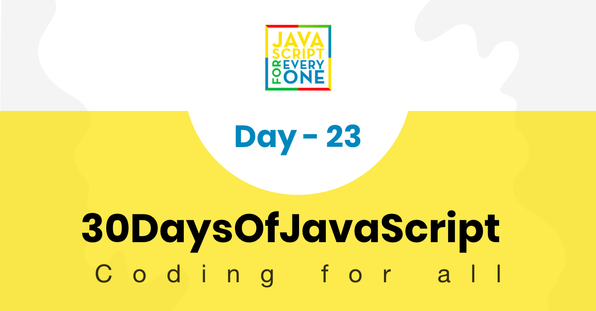

<div align="center">
  <h1> 30 Days Of JavaScript: Event Listeners</h1>
  <a class="header-badge" target="_blank" href="https://www.linkedin.com/in/asabeneh/">
  
  </a>
  <a class="header-badge" target="_blank" href="https://twitter.com/Asabeneh">
  
  </a>

<sub>Author:
<a href="https://www.linkedin.com/in/asabeneh/" target="_blank">Asabeneh Yetayeh</a><br>
<sub>Çevirmen:
<a href="https://github.com/alicangunduz" target="_blank">Ali Can Gündüz</a><br>
<small> Mart 2023</small>
</sub>

</div>

[<< Gün 22](../22_Day_Manipulating_DOM_object/22_day_manipulating_DOM_object.md) | [Gün 24 >>](../24_Day_Project_solar_system/24_day_project_solar_system.md)



-   [Gün 23](#gün-23)
    -   [DOM(Document Object Model)-Gün 3](#domdocument-object-model-gün-3)
        -   [Event Listeners](#event-listeners)
            -   [Tıklama](#tıklama)
            -   [Çift tıklama](#çift-tıklama)
            -   [Fare tıklaması](#fare-tıklaması)
        -   [Bir input öğesinden değer alma](#bir-input-öğesinden-değer-alma)
        -   [input değeri](#input-değeri)
            -   [input olayı ve change olayı](#input-olayı-ve-change-olayı)
            -   [blur olayı](#blur-olayı)
            -   [keypress, keydown ve keyup](#keypress-keydown-ve-keyup)
    -   [Egzersizler](#egzersizler)
        -   [Egzersizler: Seviye 1](#egzersizler-seviye-1)

# Gün 23

## DOM(Document Object Model)-Gün 3

### Event Listeners

Ortak HTML olayları: tıklama, değişiklik, fare üzerine gelme, fareyi elementin üzerinden çıkarma, tuşa basma, tuştan el çekme, yükleme.

Herhangi bir DOM nesnesine olay dinleyici yöntemi ekleyebiliriz. HTML öğelerinde farklı olay türlerini dinlemek için **addEventListener()** yöntemini kullanırız. _addEventListener()_ yöntemi, bir olay dinleyicisi ve geri çağırma işlevi olmak üzere iki argüman alır.

```js
selectedElement.addEventListener("eventlistner", function (e) {
    // olaydan sonra olmasını istediğiniz aktivite burada olacak
});
// or

selectedElement.addEventListener("eventlistner", (e) => {
    // olaydan sonra olmasını istediğiniz aktivite burada olacak
});
```

#### Tıklama

Bir öğeye olay dinleyicisi eklemek için önce öğeyi seçer, ardından **addEventListener()** yöntemini ekleriz. Olay dinleyicisi, olay türünü ve geri çağırma işlevlerini argüman olarak alır.

Aşağıdaki örnek tıklama türü olayın bir örneğidir.

**Örnek: Tıklama**

```html
<!DOCTYPE html>
<html>
    <head>
        <title>Document Object Model</title>
    </head>

    <body>
        <button>Click Me</button>

        <script>
            const button = document.querySelector("button");
            button.addEventListener("click", (e) => {
                console.log("e gives the event listener object:", e);
                console.log("e.target gives the selected element: ", e.target);
                console.log(
                    "e.target.textContent gives content of selected element: ",
                    e.target.textContent
                );
            });
        </script>
    </body>
</html>
```

Bir olay, doğrudan HTML öğesine satır içi komut dosyası olarak da eklenebilir.

**Örnek: onclick**

```html
<!DOCTYPE html>
<html>
    <head>
        <title>Document Object Model</title>
    </head>

    <body>
        <button onclick="clickMe()">Click Me</button>
        <script>
            const clickMe = () => {
                alert("We can attach event on HTML element");
            };
        </script>
    </body>
</html>
```

#### Çift tıklama

Bir öğeye olay dinleyicisi eklemek için önce öğeyi seçeriz, ardından **addEventListener()** yöntemini ekleriz. Olay dinleyicisi, olay türünü ve geri çağırma işlevlerini argüman olarak alır.

Aşağıdaki örnek, tıklama türü olayın bir örneğidir.

**Örnek: dblclick**

```html
<!DOCTYPE html>
<html>
    <head>
        <title>Document Object Model</title>
    </head>

    <body>
        <button>Click Me</button>
        <script>
            const button = document.querySelector("button");
            button.addEventListener("dblclick", (e) => {
                console.log("e gives the event listener object:", e);
                console.log("e.target gives the selected element: ", e.target);
                console.log(
                    "e.target.textContent gives content of selected element: ",
                    e.target.textContent
                );
            });
        </script>
    </body>
</html>
```

#### Fare tıklaması

Bir öğeye olay dinleyicisi eklemek için önce öğeyi seçeriz, ardından **addEventListener()** yöntemini ekleriz. Olay dinleyicisi, olay türünü ve geri çağırma işlevlerini argüman olarak alır.

Aşağıdaki örnek, tıklama türündeki bir olayın örneğidir.

**Örnek: mouseenter**

```html
<!DOCTYPE html>
<html>
    <head>
        <title>Document Object Model</title>
    </head>

    <body>
        <button>Click Me</button>
        <script>
            const button = document.querySelector("button");
            button.addEventListener("mouseenter", (e) => {
                console.log("e gives the event listener object:", e);
                console.log("e.target gives the selected element: ", e.target);
                console.log(
                    "e.target.textContent gives content of selected element: ",
                    e.target.textContent
                );
            });
        </script>
    </body>
</html>
```

Şimdiye kadar `addEventListener` yöntemini ve olay dinleyicisi nasıl ekleyeceğimizi öğrendiniz. Birçok olay dinleyicisi türü vardır ancak burada en önemli ve sık kullanılan olaylara odaklanacağız.

Olay listesi:

-   `click` - eleman tıklandığında
-   `dblclick` - eleman çift tıklandığında
-   `mouseenter` - fare noktası öğeye girdiğinde
-   `mouseleave` - fare işaretçisi öğeden ayrıldığında
-   `mousemove` - fare işaretçisi öğe üzerinde hareket ettiğinde
-   `mouseover` - fare işaretçisi öğe üzerinde hareket ettiğinde
-   `mouseout` - fare işaretçisi öğeden dışarı çıktığında
-   `input` - değer giriş alanına girildiğinde
-   `change` - giriş alanında değer değiştiğinde
-   `blur` - öğe odaklanmadığında
-   `keydown` - bir tuş düştüğünde
-   `keyup` - bir anahtar bittiğinde
-   `keypress` - herhangi bir tuşa bastığımızda
-   `onload` - tarayıcı bir sayfayı yüklemeyi bitirdiğinde

Yukarıdaki kod örneğindeki olay türünü değiştirerek yukarıdaki olay türlerini test edebilirsiniz.

### Bir input öğesinden değer alma

Genellikle form doldururuz ve formlar verileri işler. Form alanları, girdi HTML öğesi kullanılarak oluşturulur. İki girdi alanı, bir düğme ve bir `p` etiketi kullanarak bir kişinin vücut kitle indeksini hesaplamamıza izin veren küçük bir uygulama oluşturalım.

### input değeri

```html
<!DOCTYPE html>
<html>
    <head>
        <title>Document Object Model:30 Days Of JavaScript</title>
    </head>

    <body>
        <h1>Body Mass Index Calculator</h1>

        <input type="text" id="mass" placeholder="Mass in Kilogram" />
        <input type="text" id="height" placeholder="Height in meters" />
        <button>Calculate BMI</button>

        <script>
            const mass = document.querySelector("#mass");
            const height = document.querySelector("#height");
            const button = document.querySelector("button");

            let bmi;
            button.addEventListener("click", () => {
                bmi = mass.value / height.value ** 2;
                alert(`your bmi is ${bmi.toFixed(2)}`);
                console.log(bmi);
            });
        </script>
    </body>
</html>
```

#### input olayı ve change olayı

Yukarıdaki örnekte, iki girdi alanından verileri düğmeye tıklayarak almayı başardık. Ancak, düğmeye tıklamadan değer almak isterseniz, girdi alanına odaklandığında verileri hemen almak için _change_ veya _input_ olay türünü kullanabiliriz. Bunu nasıl ele alacağımızı görelim.

```html
<!DOCTYPE html>
<html>
    <head>
        <title>Document Object Model:30 Days Of JavaScript</title>
    </head>

    <body>
        <h1>Data Binding using input or change event</h1>

        <input type="text" placeholder="say something" />
        <p></p>

        <script>
            const input = document.querySelector("input");
            const p = document.querySelector("p");

            input.addEventListener("input", (e) => {
                p.textContent = e.target.value;
            });
        </script>
    </body>
</html>
```

#### blur olayı

_Input_ veya _change_ olaylarının aksine, `blur` olayı girdi alanına odaklı değilken meydana gelir.

```js
<!DOCTYPE html>
<html>

<head>
    <title>Document Object Model:30 Days Of JavaScript</title>
</head>

<body>
    <h1>Giving feedback using blur event</h1>

    <input type="text" id="mass" placeholder="say something" />
    <p></p>

    <script>
        const input = document.querySelector('input')
        const p = document.querySelector('p')

        input.addEventListener('blur', (e) => {
            p.textContent = 'Field is required'
            p.style.color = 'red'

        })
    </script>
</body>

</html>
```

#### keypress, keydown ve keyup

Farklı olay dinleyici türlerini kullanarak klavyenin tüm tuş numaralarına erişebiliriz. `KeyPress`'i kullanalım ve her klavye tuşunun keyCode'unu alalım.

```html
<!DOCTYPE html>
<html>
    <head>
        <title>Document Object Model:30 Days Of JavaScript</title>
    </head>

    <body>
        <h1>Key events: Press any key</h1>

        <script>
            document.body.addEventListener("keypress", (e) => {
                alert(e.keyCode);
            });
        </script>
    </body>
</html>
```

---

🌕 Sen çok özel birisin, her gün gelişiyorsun. Artık herhangi bir DOM olayını nasıl ele alacağını biliyorsun. Başarıya giden yolda yalnızca yedi günün kaldı. Şimdi tüm bunları pekiştirmen için alıştırma vakti!

## Egzersizler

### Egzersizler: Seviye 1

1. Üç farklı renkle çift, tek ve asal sayıları işaretleyen sayıları oluşturma. Aşağıdaki resme bakın.


1. Klavye kodunu dinleyici kullanarak oluşturma. Aşağıdaki resme bakın.


🎉 TEBRİKLER ! 🎉

[<< Gün 22](../22_Day_Manipulating_DOM_object/22_day_manipulating_DOM_object.md) | [Gün 24 >>](../24_Day_Project_solar_system/24_day_project_solar_system.md)
