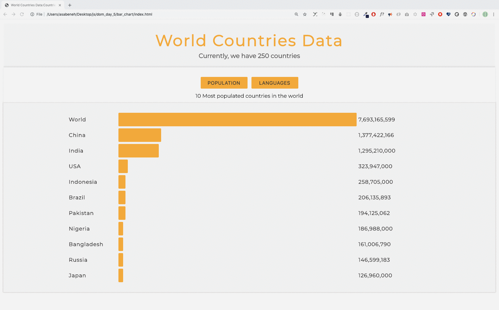
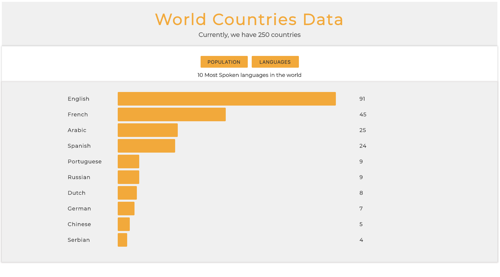

  <h1> 30 Days Of JavaScript: World Countries Data Visualization</h1>
  
  

  Author:
  <a href="https://www.linkedin.com/in/asabeneh/" target="_blank">Asabeneh Yetayeh</a> 
Çevirmen:
  <a href="https://github.com/alicangunduz" target="_blank">Ali Can Gündüz</a> 
  <small> Mart 2023</small>
  

[<< Gün 24](../24_Day_Project_solar_system/24_day_project_solar_system.md) | [Gün 26 >>](../26_Day_World_countries_data_visualization_2/26_day_world_countries_data_visualization_2.md)

- [Day 25](#day-25)
	- [Exercises](#exercises)
		- [Exercise: Level 1](#exercise-level-1)

# Gün 25

## Egzersiz

### Egzersiz: Seviye 1

1. Dünya'da en çok nüfusa sahip on ülkeyi ve en çok konuşulan on dilin görselleştirilmesi için DOM (HTML, CSS, JS) kullanarak küçük bir uygulama geliştirin.

🎉 TEBRİKLER ! 🎉

[<< Gün 24](../24_Day_Project_soloar_system/24_day_project_soloar_system.md) | [Gün 26 >>](../26_Day_World_countries_data_visualization_2/26_day_world_countries_data_visualization_2.md)
