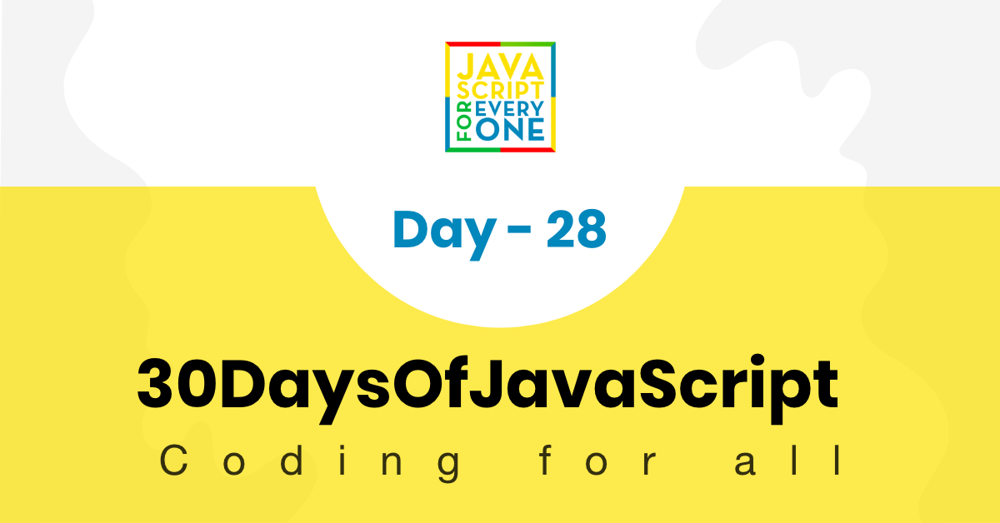

  <h1> 30 Days Of JavaScript</h1>
  
  

  Author:
  <a href="https://www.linkedin.com/in/asabeneh/" target="_blank">Asabeneh Yetayeh</a> 
Çevirmen:
  <a href="https://github.com/alicangunduz" target="_blank">Ali Can Gündüz</a> 
  <small> Mart 2023</small>
  

[<< Gün 27](../27_Day_Mini_project_portfolio/27_day_mini_project_portfolio.md) | [Gün 29>>](../29_Day_Mini_project_animating_characters/29_day_mini_project_animating_characters.md)

- [Day 28](#day-28)
  - [Exercises](#exercises)
    - [Exercise: Level 1](#exercise-level-1)

# Gün 28

## Egzersiz

### Egzersiz: Seviye 1

1. HTML, CSS ve JavaScript kullanarak aşağıdakini oluşturun.

🎉 TEBRİKLER ! 🎉

[<< Gün 27](../27_Day_Mini_project_portfolio/27_day_mini_project_portfolio.md) | [Gün 29>>](../29_Day_Mini_project_animating_characters/29_day_mini_project_animating_characters.md)