# 30 Days Of JavaScript

| # Day |                                                                      Konular                                                                       |
| ----- | :------------------------------------------------------------------------------------------------------------------------------------------------: |
| 01    |                                                                [Giriş](./readMe.md)                                                                |
| 02    |                                              [Veri Tipleri](./02_Day_Data_types/02_day_data_types.md)                                              |
| 03    |                           [Boolean, Operatörler, Tarih](./03_Day_Booleans_operators_date/03_booleans_operators_date.md)                            |
| 04    |                                              [Koşullar](./04_Day_Conditionals/04_day_conditionals.md)                                              |
| 05    |                                                    [Diziler](./05_Day_Arrays/05_day_arrays.md)                                                     |
| 06    |                                                     [Döngüler](./06_Day_Loops_Donguler/06_day_loops.md)                                                     |
| 07    |                                               [Fonksiyonlar](./07_Day_Functions/07_day_functions.md)                                               |
| 08    |                                                   [Nesneler](./08_Day_Objects/08_day_objects.md)                                                   |
| 09    |                          [Yüksek Dereceli Fonksiyonlar](./09_Day_Higher_order_functions/09_day_higher_order_functions.md)                          |
| 10    |                                       [Setler Ve Haritalar](./10_Day_Sets_and_Maps/10_day_Sets_and_Maps.md)                                        |
| 11    |                        [Yıkıcılar Ve Yapıcılar](./11_Day_Destructuring_and_spreading/11_day_destructuring_and_spreading.md)                        |
| 12    |                                   [Düzenli İfadeler](./12_Day_Regular_expressions/12_day_regular_expressions.md)                                   |
| 13    |                             [Consol Nesne Metodları](./13_Day_Console_object_methods/13_day_console_object_methods.md)                             |
| 14    |                                         [Hata Yönetimi](./14_Day_Error_handling/14_day_error_handling.md)                                          |
| 15    |                                                   [Sınıflar](./15_Day_Classes/15_day_classes.md)                                                   |
| 16    |                                                        [JSON](./16_Day_JSON/16_day_json.md)                                                        |
| 17    |                                            [Web Depoları](./17_Day_Web_storages/17_day_web_storages.md)                                            |
| 18    |                                                [Promise'ler](./18_Day_Promises/18_day_promises.md)                                                 |
| 19    |                                                  [Closure](./19_Day_Closures/19_day_closures.md)                                                   |
| 20    |                                   [Temiz Kod Yazımı](./20_Day_Writing_clean_codes/20_day_writing_clean_codes.md)                                   |
| 21    |                                                         [DOM](./21_Day_DOM/21_day_dom.md)                                                          |
| 22    |                              [Dom Manipülasyonu](./22_Day_Manipulating_DOM_object/22_day_manipulating_DOM_object.md)                               |
| 23    |                                     [Olay Tetikleyiciler](./23_Day_Event_listeners/23_day_event_listeners.md)                                      |
| 24    |                             [Mini Proje: Güneş Sistemi](./24_Day_Project_solar_system/24_day_project_solar_system.md)                              |
| 25    |  [Mini Proje: Dünya Ülkeleri Veri Görselleştirme 1](./25_Day_World_countries_data_visualization_1/25_day_world_countries_data_visualization_1.md)  |
| 26    | [Mini Project: Dünya Ülkeleri Veri Görselleştirme 2](./26_Day_World_countries_data_visualization_2/26_day_world_countries_data_visualization_2.md) |
| 27    |                              [Mini Proje: Portföy](./27_Day_Mini_project_portfolio/27_day_mini_project_portfolio.md)                               |
| 28    |                      [Mini Proje: Liderler Sıralaması](./28_Day_Mini_project_leaderboard/28_day_mini_project_leaderboard.md)                       |
| 29    |            [Mini Proje: Animasyon Karakterleri](./29_Day_Mini_project_animating_characters/29_day_mini_project_animating_characters.md)            |
| 30    |                                       [Son Proje](./30_Day_Mini_project_final/30_day_mini_project_final.md)                                        |

🧡🧡🧡 MUTLU KODLAMALAR 🧡🧡🧡

<div>
<h2>💖 Sponsorlar</h2>

<p>Açık kaynak katkılarımı ve <strong>30 Günlük Meydan Okuma Serisini</strong> destekleyen muhteşem sponsorlarımıza teşekkür ederiz!</p>

<h3>Mevcut Sponsor</h3>
<hr />
<div align="center">
  <a href="https://ref.wisprflow.ai/MPMzRGE" target="_blank" rel="noopener noreferrer">
    <picture>
      <!-- Dark mode -->
      <source media="(prefers-color-scheme: dark)" srcset="https://raw.githubusercontent.com/Asabeneh/asabeneh/master/images/Wispr_Flow-Logo-white.png" />
      <!-- Light mode (fallback) -->
      
    </picture>
  </a>

  <h1>
    <a href="https://ref.wisprflow.ai/MPMzRGE" target="_blank" rel="noopener noreferrer">
      Kodla konuş, Flow'da kal.
    </a>
  </h1>

  <h2>
    <a href="https://ref.wisprflow.ai/MPMzRGE" target="_blank" rel="noopener noreferrer">
      Flow, araçlarını sürekli kullanan geliştiriciler için tasarlanmıştır. Konuşun ve daha fazla bağlam sağlayın, daha iyi sonuçlar elde edin. 
    </a>
  </h2>
</div>


---

### 🙌 Sponsor Olun

**[GitHub Sponsors](https://github.com/sponsors/asabeneh)**'da sponsor olarak veya [PayPal](https://www.paypal.me/asabeneh) aracılığıyla bu projeyi destekleyebilirsiniz.

Büyük ya da küçük her katkı büyük bir fark yaratır. Desteğiniz için teşekkür ederiz! 🌟

---
>

<div align="center">
  <h1> 30 Günde JavaScript: Giriş</h1>
  <a class="header-badge" target="_blank" href="https://www.linkedin.com/in/asabeneh/">
  
  </a>
  <a class="header-badge" target="_blank" href="https://twitter.com/Asabeneh">
  
  </a>

<sub>Yazar:
<a href="https://www.linkedin.com/in/asabeneh/" target="_blank">Asabeneh Yetayeh</a><br>
<small> Ocak, 2020</small>
</sub>

<div>

🇬🇧 [English](./readMe.md)
🇪🇸 [Spanish](./Spanish/readme.md)
🇮🇹 [Italian](./Italian/readMe.md)
🇷🇺 [Russian](./RU/README.md)
🇹🇷 [Turkish](./Turkish/readMe.md)
🇦🇿 [Azerbaijan](./Azerbaijani/readMe.md)
🇰🇷 [Korean](./Korea/README.md)
🇻🇳 [Vietnamese](./Vietnamese/README.md)
🇵🇱 [Polish](./Polish/readMe.md)
🇧🇷 [Portuguese](./Portuguese/readMe.md)

</div>

</div>
</div>

[2. Gün >>](./02_Day_Data_types/02_day_data_types.md)

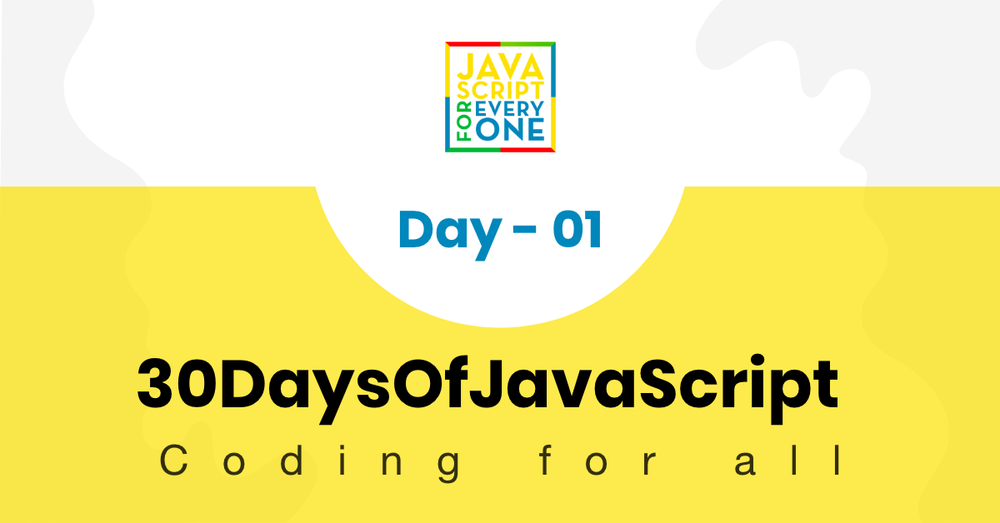

- [30 Günde JavaScript](#30-günde-javascript)
  - [🙌 Katkıda Bulunun](#-become-a-sponsor)
- [📔 1. Gün](#-1-gün)
  - [Giriş](#giriş)
  - [Gereksinimler](#gereksinimler)
  - [Kurulum](#kurulum)
    - [Node.js Kurulumu](#nodejs-kurulumu)
    - [Tarayıcı](#tarayıcı)
      - [Google Chrome Kurulumu](#google-chrome-kurulumu)
      - [Google Chrome Konsolu Açmak](#google-chrome-konsolu-açmak)
      - [Tarayıcı Konsolunda Kod Yazmak](#tarayıcı-konsolunda-kod-yazmak)
        - [Console.log](#consolelog)
        - [Çoklu Değişkenler ile Console.log ](#çoklu-değişkenler-ile-consolelog)
        - [Yorumlar](#yorumlar)
        - [Sözdizimi](#sözdizimi)
      - [Aritmetik İşlemler](#aritmetik-i̇şlemler)
    - [Kod Editörü](#kod-editörü)
      - [Visual Studio Code Kurulumu](#visual-studio-code-Kurulumu)
      - [Visual Studio Code Kullanımı](#visual-studio-code-kullanımı)
  - [Bir Web Sayfasında JavaScript Kodları Oluşturma](#bir-web-sayfasında-javascript-kodları-oluşturma)
    - [Satır İçi Oluşturma](#satır-İçi-oluşturma)
    - [Sayfa İçi Oluşturma](#dahili-oluşturma)
    - [Dış Dosyadan Oluşturma](#harici-oluşturma)
    - [Birden Fazla Dış Dosyadan Oluşturma](#çoklu-harici-oluşturma)
  - [Veri Türlerine Giriş](#veri-türlerine-giriş)
    - [Sayılar](#sayılar)
    - [String](#string)
    - [Boolean](#boolean)
    - [Tanımsız](#tanımsız)
    - [Null(Boş)](#nullboş)
  - [Veri Türlerini Konrol Etme](#veri-türlerini-kontrol-etme)
  - [Tekrardan Yorumlar](#tekrardan-yorumlar)
  - [Değişkenler](#değişkenler)
- [💻 1. Gün: Egzersizler](#-1-gün-egzersizler)

# 📔 1. Gün

## Giriş

30 günlük JavaScript programlama eğitimine katılmaya karar verdiğiniz için tebrikler. Bu eğitim, bir JavaScript programcısı olmak için ihtiyacınız olan her şeyi ve genel olarak programlamanın tüm kavramlarını öğreneceksiniz. Yarışmanın sonunda, 30GündeJavaScript programlama meydan okumasını tamamlama sertifikası alacaksınız. Sertifika almak için, etkileşimli ve ilgi çekici bir çevrimiçi eğitim platformu olan [DevOsome](https://www.devosome.com/)'a kaydolmanız gerekir.

Yardıma ihtiyacınız olursa veya başkalarına yardım etmek isterseniz, özel [Telegram grubuna](https://t.me/ThirtyDaysOfJavaScript) katılabilirsiniz.

**30GündeJavaScript** eğitimi, hem yeni başlayanlar hem de ileri düzey JavaScript geliştiricileri için bir rehberdir. JavaScript'e hoş geldiniz. JavaScript, web'in dilidir. JavaScript'i kullanmaktan ve öğretmekten keyif alıyorum ve umarım siz de öyle yaparsınız.

Bu adım adım JavaScript eğitiminde, insanlık tarihinin en popüler programlama dili olan JavaScript'i öğreneceksiniz. JavaScript, **_web sitelerine etkileşim eklemek_**, **_mobil uygulamalar_**, **_masaüstü uygulamaları_** ve **_oyunlar_** geliştirmek için kullanılır. Günümüzde JavaScript, **_sunucu tarafı programlama_**, **_makine öğrenimi_** ve **_yapay zeka_** için de kullanılabilir.

**_JavaScript (JS)_**, son yıllarda popülerliği artan ve son on yıldır önde gelen programlama dili olan ve GitHub'da en çok kullanılan programlama dilidir.

Bu eğitim, okunması kolay, konuşma Türkçesiyle yazılmış, ilgi çekici, motive edici ve aynı zamanda çok zorlayıcıdır. Bu zorluğu tamamlamak için çok zaman ayırmanız gerekir. Görsel öğrenen biriyseniz, [Washera](https://www.youtube.com/channel/UC7PNRuno1rzYPb1xLa4yktw) YouTube kanalından video dersleri alabilirsiniz. Kanalı abone olun, YouTube videolarına yorum yapın ve sorular sorun, proaktif olun, yazar sonunda sizi fark edecektir.

Yazar, bu eğitimle ilgili görüşlerinizi duymaktan memnuniyet duyar. 30GündeJavaScript eğitimi hakkındaki düşüncelerinizi paylaşarak yazara geri bildirimde bulunabilirsiniz. [Bu bağlantıdan](https://www.asabeneh.com/testimonials) görüşlerinizi paylaşabilirsiniz.

## Gereksinimler

Bu eğitimi tamamlamak için önceden programlama bilgisi gerekmez. Tek ihtiyacınız olan:

1. Motivasyon
2. Bir bilgisayar
3. İnternet
4. Bir tarayıcı
5. Bir kod editörü

## Kurulum

Geliştirici, bilgisayar ve internet uzmanı olmak için motivasyonunuz ve güçlü bir arzunuz olduğuna inanıyorum. Bunlara sahipseniz, başlamak için gereken her şeye sahipsiniz demektir.

### Node.js Kurulumu

Şu anda Node.js'ye ihtiyacınız olmayabilir, ancak ileride ihtiyacınız olabilir. [Node.js](https://nodejs.org/en/)'yi yükleyin.

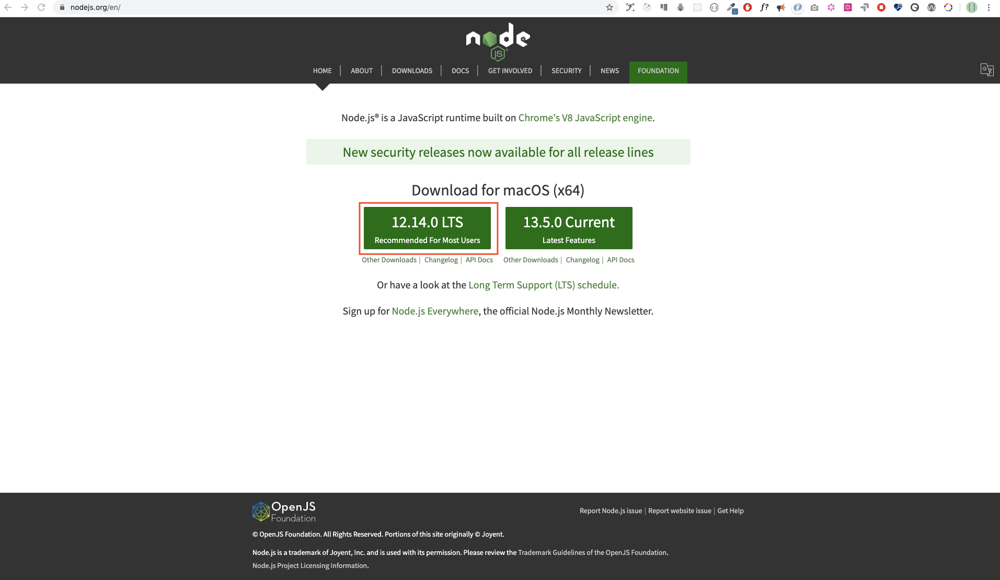

İndirdikten sonra çift tıklayın ve kurun.

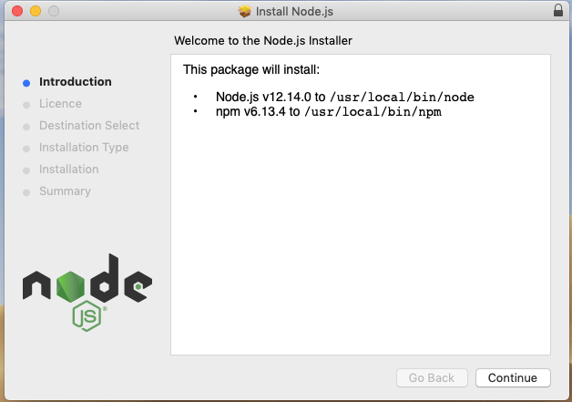

Cihaz terminalimizi veya komut istemini (cmd) açarak node'un yerel makinemize yüklü olup olmadığını kontrol edebiliriz.

```sh
asabeneh $ node -v
v12.14.0
```

Bu eğitimi hazırlarken Node sürüm 12.14.0 kullanıyordum, ancak şu anda indirilmesi önerilen Node.js sürümü v14.17.6'dır. Bu materyali kullandığınızda daha yüksek bir Node.js sürümüne sahip olabilirsiniz.

### Tarayıcı

Kullanabileceğiniz çok sayıda tarayıcı bulunmaktadır. Ancak, kesinlikle Google Chrome tarayıcısını kullanmanızı öneriyorum.

#### Google Chrome Kurulumu

[Google Chrome](https://www.google.com/chrome/) yükleyin. Tarayıcı konsoluna küçük JavaScript kodları yazabiliriz, ancak uygulamaları geliştirmek için tarayıcı konsolunu kullanmayız.

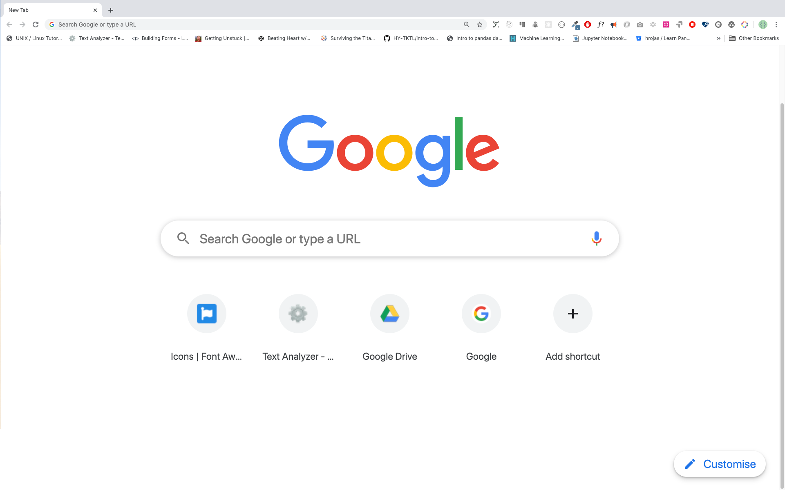

#### Google Chrome Konsolu Açmak

Tarayıcının sağ üst köşesindeki üç noktaya tıkladıktan sonra, _Diğer Araçlar -> Geliştirici Araçları_ öğesine ulaşarak veya F12 kısayolu kullanarak geliştirici araçlarını açabilirsiniz. Ben kısayolu kullanmayı tercih ediyorum.

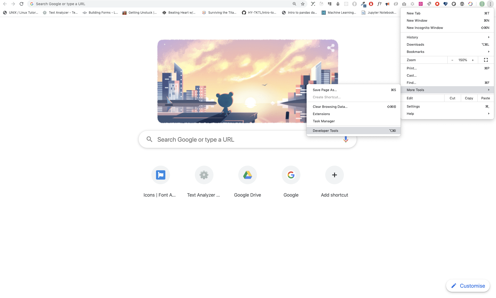

Geliştiri araçları kısmındaki consol sekmesine erişmek için aşağıdaki kısayolu kullanabilirsiniz.

```sh
Mac
Command+Option+J

Windows/Linux:
Ctl+Shift+J
```

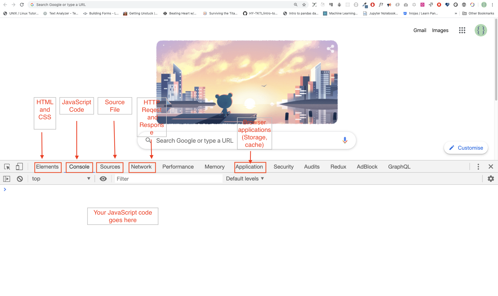

Google Chrome konsolunu açtıktan sonra görseldeki sekmeleri keşfetmeye çalışın. Zamanımızın çoğunu Konsolda geçireceğiz. Konsol, JavaScript kodlarımızı çalıştırabileceğimiz alandır. Google Console V8 motoru, JavaScript kodumuzu makine koduna Dönüştürerek makine ile iletişim kurmamızı sağlar. Google Chrome konsoluna bir JavaScript kodu yazalım:

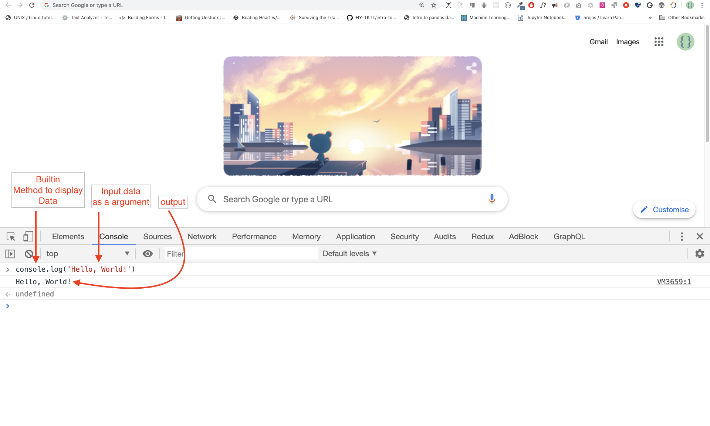

#### Tarayıcı Konsolunda Kod Yazmak

Google konsoluna veya herhangi bir tarayıcı konsoluna, herhangi bir JavaScript kodu yazabiliriz. Fakat, bu eğitimde yalnızca Google Chrome konsoluna odaklanacağız. Aşağıdaki kısa yolları kullanarak konsolunuzu açın:

```sh
Mac
Command+Option+I

Windows:
Ctl+Shift+I
```

##### Console.log

İlk JavaScript kodumuzu yazmak için, yerleşik bir fonksiyon olan **console.log()** fonksiyonunu kullandık. Çıktı ekranına `'Hello, World!'` cümlesini console.log() fonksiyonu kullanarak yazırdık.

```js
console.log("Hello, World!");
```

##### Çoklu Değişkenler ile Console.log

**console.log()** fonksiyonu virgülle ayrılmış birden fazla parametre alabilir. Kullanımı şu şekildedir:**`console.log(param1, param2, param3)`**

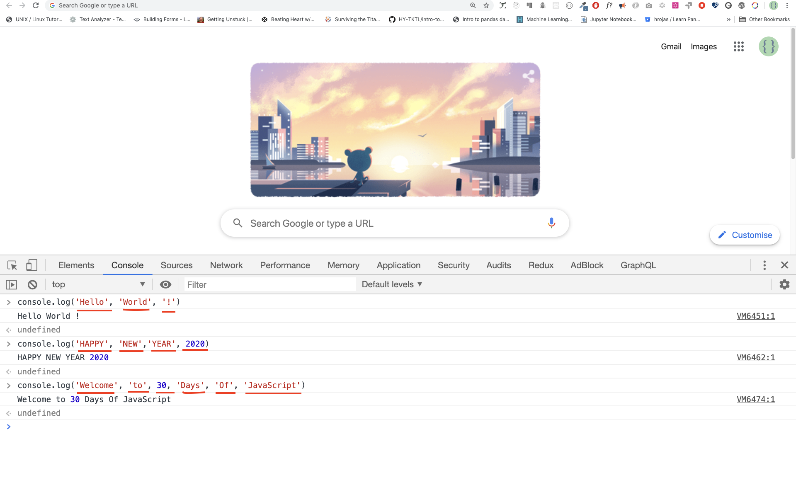

```js
console.log("Hello", "World", "!");
console.log("HAPPY", "NEW", "YEAR", 2020);
console.log("Welcome", "to", 30, "Days", "Of", "JavaScript");
```

Yukarıdaki kod parçacığından da görebileceğiniz gibi, _`console.log()`_ birden çok değişken veri türü alabilir.

Tebrikler! İlk JavaScript kodunuzu _`console.log()`_ kullanarak yazdınız.

##### Yorumlar

Kodumuza yorum ekleyebiliriz. Yorumlar, kodu daha okunabilir hale getirmek ve kodumuzda açıklamalar bırakmak için çok önemlidir. JavaScript, kodumuzun yorum bölümünü çalıştırmaz. JavaScript'te `//` ile başlayan satırlar ve `/*...*/` işaretler arasında yer alan herhangi metinler yorum olarak algılanır.

**Örnek: Tek Satırlı Açıklama**

```js
// Bu ilk yorum
// Bu ikinci yorum
// Ben tek satırlık bir yorumum
```

**Örnek: Çok Satırlı Açıklama**

```js
/*
 Bu çok satırlı bir yorumdur
 Çok satırlı yorumlar birden çok satır alabilir 
 JavaScript web'in dilidir  
 */
```

##### Sözdizimi

Programlama dilleri insan dillerine benzer. Türkçe veya diğer birçok dil, anlamlı bir mesaj iletmek için kelimeler, deyimler, cümleler, birleşik cümleler ve daha fazlasını kullanır. Sözdiziminin Türkçedeki anlamı, bir dilde cümleler oluşturmak için sözcüklerin dilbilgisi kurallarına göre dizilişi, sıralanışıdır. Sözdiziminin teknik tanımına baktığımızda, bir bilgisayar dilindeki ifadelerin yapısıdır. Programlama dillerinin kendilerine özgü sözdizimleri vardır. JavaScript bir programlama dilidir ve diğer programlama dilleri gibi kendi sözdizimine sahiptir. Kodlarımızı JavaScript'in anladığı sözdizimi kuralları çerçevesinde yazmaz isek, farklı türde hatalar ortaya çıkar. Farklı JavaScript hata türlerini daha sonra keşfedeceğiz ve açıklayacağız. Şimdilik sözdizimi hatalarını basitçe görelim.

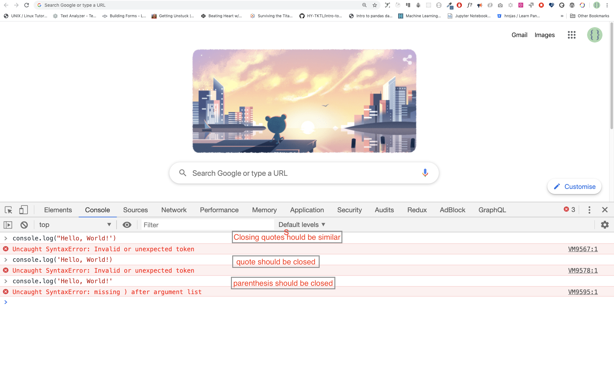

Görselde görülen şekilde kasıtlı olarak hatalar yaptım. Hatalar sonucunda konsol bize sözdizimi hataları verdi. Aslında, uyarı metinleri bilgilendiricidir. Ne tür bir hata yapıldığını bildiririrler. Bu hata mesajlarını okuyarak yapmış olduğumuz sözdizim hatasını düzeltebilir ve sorunları çözebiliriz. Bir programdaki hataları tanımlama ve kaldırma işlemine hata ayıklama denir(debugging). Hataları düzeltelim:

```js
console.log("Hello, World!");
console.log("Hello, World!");
```

Şimdiye kadar,_`console.log()`_ kullanarak metnin nasıl görüntüleneceğini gördük. Eğer _`console.log()`_ kullanarak metin yazdırmak istiyor isek, metni tek tırnak, çift tırnak veya ters tırnak işaretleri içiresine almamız gerekir.
**Örnek:**

```js
console.log("Hello, World!");
console.log("Hello, World!");
console.log(`Hello, World!`);
```

#### Aritmetik İşlemler

Şimdi, Google Chrome konsolunda sayı veri türleri için _`console.log()`_ kullanarak JavaScript kodları yazma konusunda daha fazla pratik yapalım.
JavaScript kullanarak matematiksel hesaplamalar da yapabiliriz. Aşağıdaki basit hesaplamaları yapalım.
Konsolda **_console.log()_** işlevi olmadan doğrudan işlemler yaptırabiliriz. Ancak, buna ilişkin kullanımlar, bu eğitimde açıklanmamıştır, çünkü eğitimimiz boyuncu biz bu fonksiyonları hep bir kod editöründe kullanacağız. Dilerseniz konsola doğrudan sayıları yazarak da işlemleri gerçekleştirebilirsiniz.

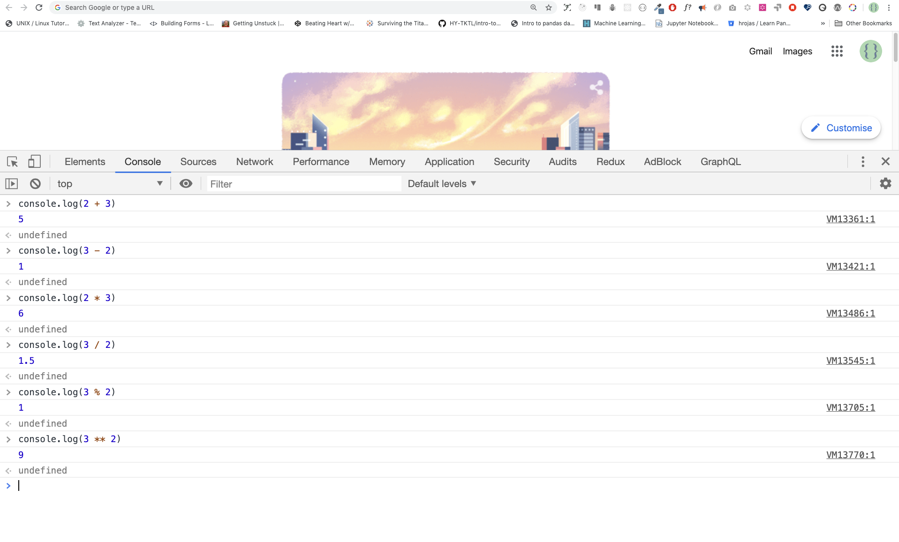

```js
console.log(2 + 3); // Toplama
console.log(3 - 2); // Çıkarma
console.log(2 * 3); // Çarpma
console.log(3 / 2); // Bölme
console.log(3 % 2); // Mod Alma
console.log(3 ** 2); // ;Üs Alma 3 ** 2 == 3 * 3
```

### Kod Editörü

Kodlarımızı tarayıcı konsoluna yazabiliriz, ancak daha büyük projeler için böyle bir şey yapmamız mümkün olamaz. Gerçek bir çalışma ortamında, geliştiriciler kodlarını yazmak için farklı kod düzenleyicileri kullanırlar. Bu 30günlükJavaScript eğitiminde Visual Studio Code editörünü kullanacağız.

#### Visual Studio Code Kurulumu

Çok popüler ve açık kaynak kodlu olan Visual Studio Code(Metin Düzenleyicisi)'u tavsiye ederim. [download Visual Studio Code](https://code.visualstudio.com/), Fakat başka editörler kullanıyorsanız, kullanıdığınız editör ile devam edebilirsin.


Visual Studio Code yüklediyseniz, kullanmaya başlayalım.

#### Visual Studio Code Kullanımı

Visual Studio Kodunu açtığınızda, görseldeki gibi bir arayüz açılacaktır. Görsellerde belrtilen simgelerle uğraşarak özellikleri hakkında deneyim edinebilirsiniz.

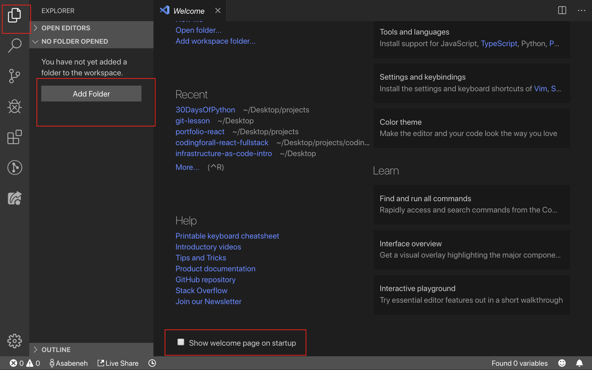

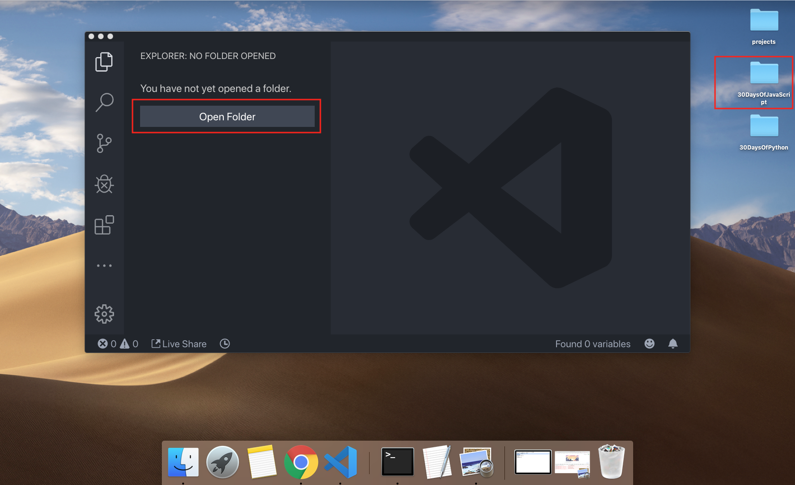

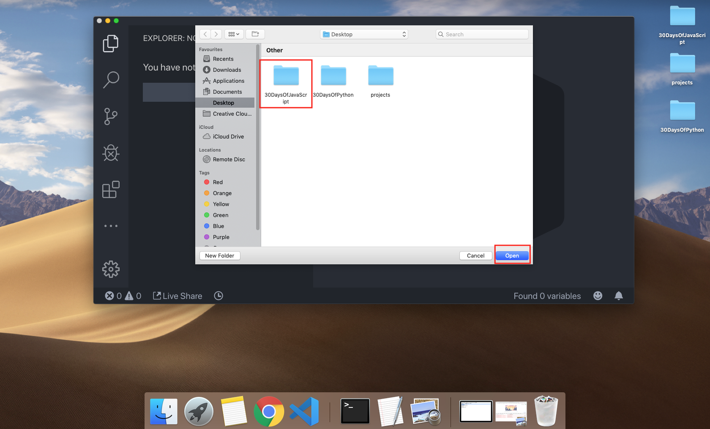

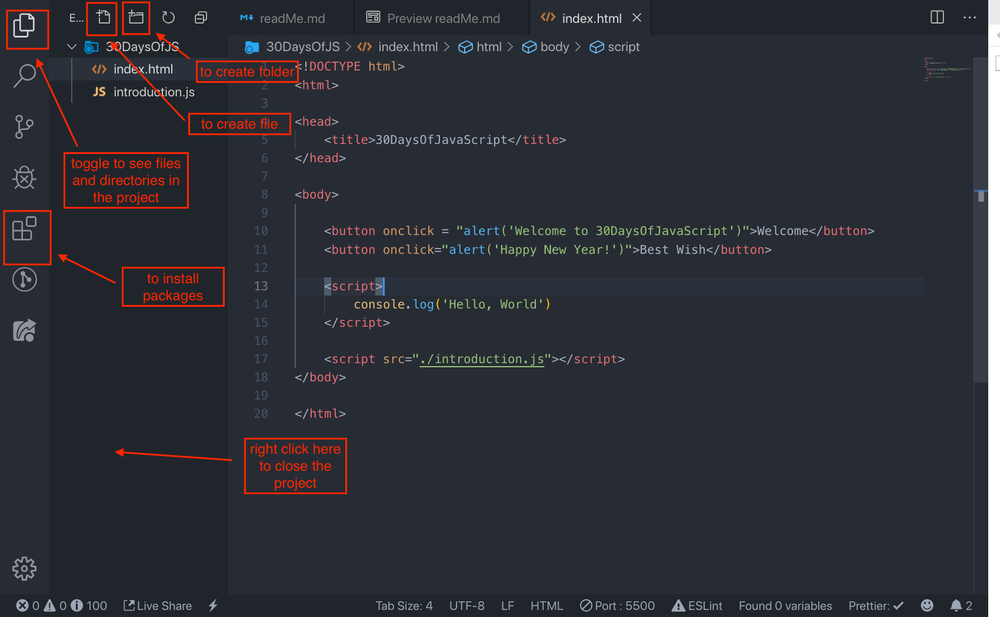

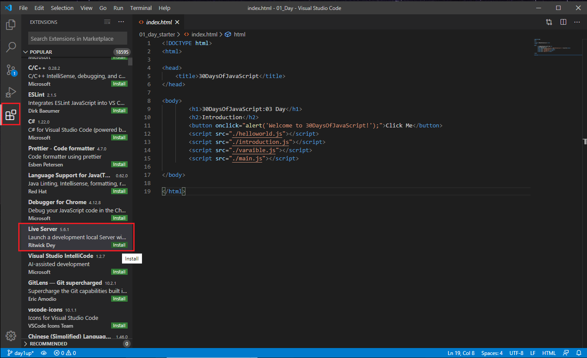

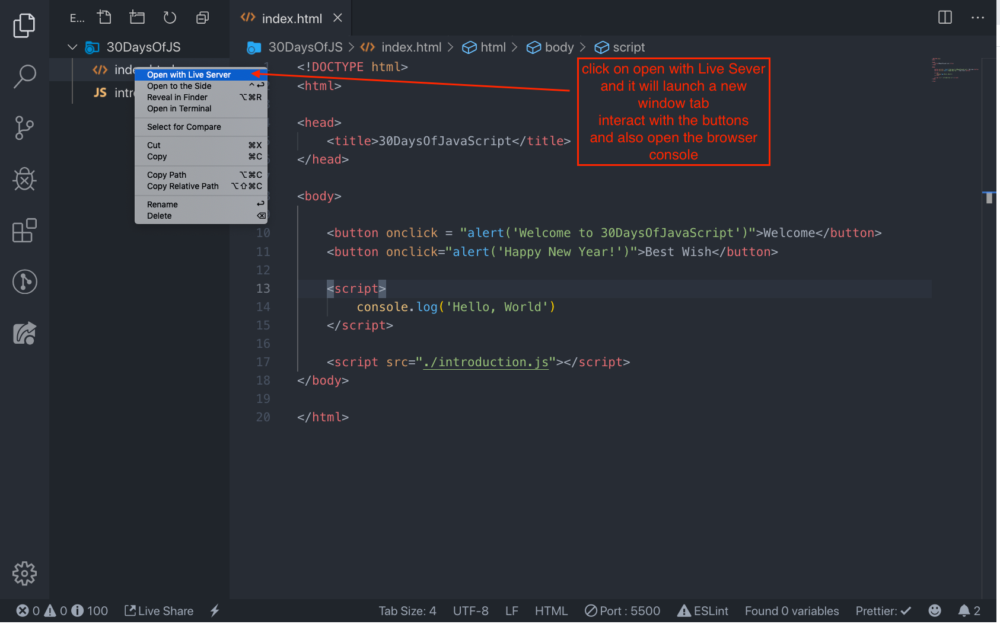

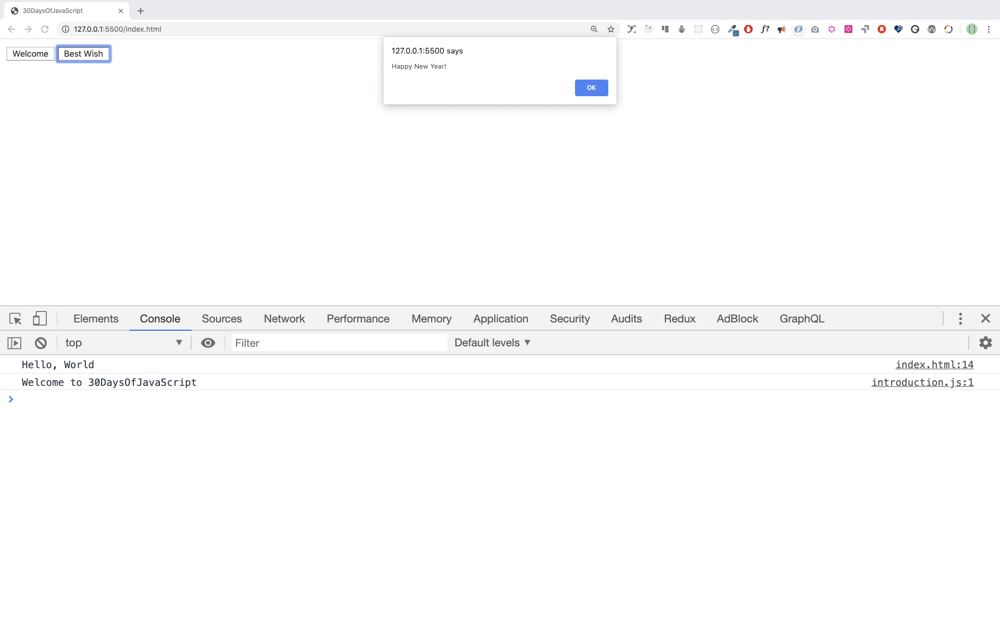

## Bir Web Sayfasında JavaScript Kodları Oluşturma

JavaScript bir web sayfasına üç farklı şekilde eklenebilir:

- **_Satır İçi oluşturma_**
- **_Dahili oluşturma_**
- **_Harici oluşturma_**
- **_Çoklu Harici oluşturma_**

Aşağıdaki bölümlerde web sayfanıza JavaScript kodu eklemenin farklı yolları gösterilmektedir.

### Satır İçi Oluşturma

Masaüstünüzde veya istediğiniz herhangi bir yerde, bir proje klasörü oluşturun. Klasör adına 30GundeJS adını verebilirsiniz, klasör içerisinde _`index.html`_ dosyası oluşturun. Sonrasında aşağıdaki kodu yapıştırın ve bu _.html_ uzantılı dosyayı [Chrome](https://www.google.com/chrome/) gibi bir tarayıcıda açın.

```html
<!DOCTYPE html>
<html lang="en">
  <head>
    <title>30DaysOfScript: Satır İçi script</title>
  </head>
  <body>
    <button onclick="alert('30GündeJavaScripte hoş geldiniz')">Bana Tıkla</button>
  </body>
</html>
```

Şimdi, ilk satır içi script dosyanızı yazdınız. JavaScript yerleşik fonksiyon olan _`alert ()`_  kullanarak,bir açılır uyarı mesajı oluşturabiliriz

### Dahili Oluşturma

Dahili scripti _`head`_ veya _`body`_ etiketleri arasına yazılabilir, ancak bunun HTML belgesinin body kısmına yazılması tercih edilir. Öncelikle sayfanın _`head`_ kısmına yazalım.

```html
<!DOCTYPE html>
<html lang="en">
  <head>
    <title>30GündeScript:Dahili Script</title>
    <script>
      console.log("30GündeJavaScript'e hoş geldiniz");
    </script>
  </head>
  <body></body>
</html>
```

Çoğu zaman dahili bir scripti bu şekilde yazarız. JavaScript kodunun, html sayfamızın _`body`_ kısmına yazılması en çok tercih edilen seçenektir. _`Console.log()`_ çıktısını görmek için tarayıcınızın konsolunu açınız.

```html
<!DOCTYPE html>
<html lang="en">
  <head>
    <title>30GündeScript:Dahili Script</title>
  </head>
  <body>
    <button onclick="alert('30GündeJavaScripte hoş geldiniz!');">
      Bana Tıkla
    </button>
    <script>
      console.log("30GündeJavaScript'e hoş geldiniz!");
    </script>
  </body>
</html>
```

_`console.log()`_ çıktısını görmek için tarayıcı konsolunu açın.

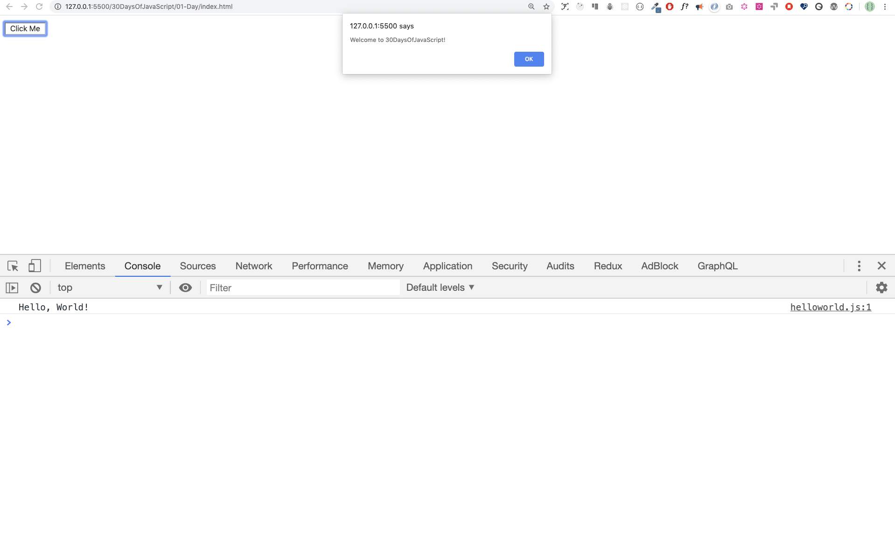

### Harici Oluşturma

Dahili scripte benzer şekilde, harici sicript bağlantısı da head etiketleri arasında veya body etiketleri arasında olabilir, ancak body etiketleri arasına eklenmesi tercih edilir.
Öncelikle '.js' uzantılı harici bir JavaScript dosyası oluşturmalıyız. '.js' uzantılı tüm dosyalar JavaScript dosyalarıdır. Proje klasörü içersine 'introdiction.js' adında bir dosya oluşturun ve içine aşağıdaki kodu yazın. Ardından bu oluşturduğunuz 'introdiction.js' dosyanızı, html sayfanızdaki head veya body etiketinin arasına ekleyerek, 'introdiction.js' adlı JavaScript dosyamızı tanıtalım.

```js
console.log("30GündeJavaScript'e hoş geldiniz!");
```

Harici script dosyasının _head_ etiketi arasında tanımlama:

```html
<!DOCTYPE html>
<html lang="en">
  <head>
    <title>30GündeJavaScript:Harici script</title>
    <script src="introdiction.js"></script>
  </head>
  <body></body>
</html>
```

Harici script dosyasının _body_ etiketi arasında tanımlama:

```html
<!DOCTYPE html>
<html lang="en">
  <head>
    <title>30GündeJavaScript:Harici script</title>
  </head>
  <body>
    <!-- JavaScript harici script linki, head veya body etiketleri arasında olabilir -->
    <!-- Body kapanış etiketinden önce harici Javascript dosyanızı eklemeniz önerilir  -->
    <script src="introdiction.js"></script>
  </body>
</html>
```

_`console.log()`_ çıktısını görmek için tarayıcı konsolunu açın.

### Çoklu Harici Oluşturma

Ayrıca birden çok harici JavaScript dosyasını da bir web sayfası içerisine bağlayabiliriz.
Oluşturduğumuz proje klasörü içerisine yeniden `helloworld.js` isimli bir JavaScript dosyası oluşturalım.

```js
console.log("Hello, World!");
```

```html
<!DOCTYPE html>
<html lang="en">
  <head>
    <title>Çoklu Harici Scriptler</title>
  </head>
  <body>
    <script src="./helloworld.js"></script>
    <script src="./introdiction.js"></script>
  </body>
</html>
```

_ana.js dosyanız, diğer tüm .js dosyalarınızın altında olmalıdır_. Derleme yapılırken satırlar yukarıdan aşağıya okunduğu için ana JavaScript dosyanınız en son okunması önem taşımaktadır.

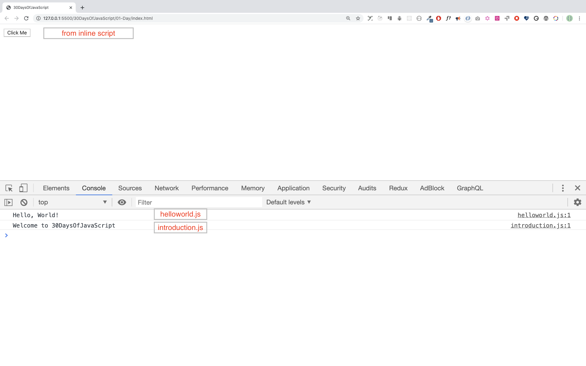

## Veri Türlerine Giriş

JavaScript'te ve diğer programlama dillerinde, farklı tiplerde veri türleri vardır. JavaScript ilkel veri tipleri şunlardır: _String(metin), Number(sayı), Boolean(T-F), undefined(tanımsız), NulL(boş)_, ve _Symbol(sembol)_.

### Sayılar

- Tam sayılar: Integer (sıfır dahil negatif ve pozitif)
  Örnek:
  ... -3, -2, -1, 0, 1, 2, 3 ...
- Ondalıklı sayılar: (Float / Decimal)
  Example
  ... -3.5, -2.25, -1.0, 0.0, 1.1, 2.2, 3.5 ...

### String

Tek tırnak, çift tırnak veya ters tırnak(backtick) arasında yer alan, bir veya daha fazla karakterden oluşan metinsel değerlerdir.(Her tür karakterleri içerisinde barındırabilir.)

**Örnek:**

```js
"a";
"Asabeneh";
'YusufAgca';
"Turkey-ATATÜRK";
'JavaScript güzel bir programlama dilidir';
"Öğrenmeyi seviyorum";
`Unutma, ayrıca bir ters tırnak kullanarak bir dize de oluşturabiliriz`;
("string veri türü, bir karakter kadar küçük, sayfalar kadar büyük olabilir.");
```

### Boolean

Boolean veri türü, yalnızca True(doğru) veya False(yanlış) bir değer alır-dönderir.

**Örnek:**

```js
true; // ışık yanıyorsa, değer doğrudur
false; // ışık kapalıysa, değer yanlıştır
```

### Tanımsız

JavaScript'te, bir değişkene bir değer atamaz isek, değeri undefined olarak alır. Buna ek olarak, bir fonksiyon hiçbir şey döndürmüyorsa, döndereceği tanım 'undefined' tır.

```js
let ismim;
console.log(ismim); // undefined, çünkü henüz değişkene bir değer atanmamış.
```

### Null(Boş)

JavaScript'te 'null' boş bir değer anlamına gelir.

```js
let bosDeger = null;
```

## Veri Türlerini Kontrol Etme

Bir değişkenin veri türünü kontrol etmek için **typeof** operatörünü kullanırız. Aşağıdaki örneğe bakın.

```js
console.log(typeof "Asabeneh"); // string
console.log(typeof 5); // number
console.log(typeof true); // boolean
console.log(typeof null); // object type
console.log(typeof undefined); // undefined
```

## Tekrardan Yorumlar

JavaScript'te yorum yapmanın diğer programlama dillerine benzer olduğunu unutmayın. Kodunuzu daha okunabilir hale getirmek için yorumlar önemlidir.
Yorum yapmanın iki yolu vardır:

- _Tek satırlı yorum_
- _Çok satırlı yorum_

```js
// Bu satırda istediğiniz yorumu bırakabilirsiniz.
// Bu fonksiyonun amacı sayıları hesaplar.
// İlerde kodunuzu rahat anlayabilmek için yorumlar bırakmaya özen gösterin.
```

Çok satırlı yorum:

```js
/*
  let konum = 'İstabul';
  let age = "34";
  let evliMi = true;
  Bu kısım çok satırlı yorum bloğudur.
*/
```

## Değişkenler

Değişkenlere veri _kapsayıcılar_ diyebiliriz. Unutmayınız ki değişkenler, verileri belleklerde(_Ram_) saklar. Bir değişken atandığında belleklerde kendisi için yer ayrılır. Bir değişkene bir değer(veri) atandığında, bellek alanı bu verilerle doldurulur. Değişken tanımlamak için, _var_, _let_, veya _const_ Anahtar kelimelerini(keywords) kullanırız.

Değişken değerinin kodumuzun farklı yerlerinde değiştirilmesi gerekiyorsa, _let_ kullanırız. Eğer değişken verisi hiçbir yerde değişmeyecek ise bu durumda _const_ kullanırız. Örneğin, Pi sayısı, ülke adları veya yerçekimi ivmesi gibi değişmeyen, sabit değerler için _const_ kullanırız. Bu eğitimde _var_ kullanmayacağız ve kullanmanızı tavsiye etmiyorum. Çok fazla sızıntısı olduğundan dolayı _var_  değişken tanımlayıcısını kullanmanız hatalara sebep olacaktır. Var, let ve const hakkında diğer bölümlerde(Scope) ayrıntılı olarak konuşacağız. Şimdilik, yukarıdaki açıklama işimizi görecektir.

Geçerli bir JavaScript değişken adı aşağıdaki kurallara uymalıdır:

- JavaScript değişken adı bir sayı ile başlamamalıdır.
- JavaScript değişken adı, dolar işareti ve alt çizgi dışında özel karakterlere izin vermez.(Türkçe karakterlere özellike dikkat ediniz.)
- JavaScript değişken adı, camelCase kuralına uymalı.
- JavaScript değişken adı sözcükler arasında boşluk olmamalıdır.

Aşağıda geçerli JavaScript değişkenlerine örnekler verilmiştir.

```js
ad;
soyAd;
ulke;
sehir;
anneAdi;
age;
evliMi;

soy_ad;
evli_mi;
anne_adi;

sayi1;
sayi_1;
_sayi_1;
$sayi1;
yil2020;
yil_2020;
```

Listenin ilk bölümünde belirtilen değişken isimleri JavaScript'te camelCase bildirim kuralına uyularak yazılmıştır. Bu eğitimde, camelCase değişken adı yazım kurallarını uygulayacağız.

Geçersiz değişken adlarına örnek:

```js
  first-name
  1_num
  num_#_1
```

Şimdi değişkenleri farklı veri tipleriyle birlikte tanımlayalım. Bir değişken tanımlamak için değişken adından önce _let_ veya _const_ anahtar kelimelerini kullanmamız gerekir. Değişken adının ardından eşittir işareti (atama operatörü) ve bir değer (atanmış veri) yazarız.

```js
// Sözdizimi
let degiskenAdi = degeri;
```

Değişkenin adı, farklı değer verilerini depolayabilir. Ayrıntılı örnekler için aşağıya bakın.

**Değişken tanımlama örnekleri**

```js
// Farklı veri türlerinin, farklı değişkenlerini tanımlama
let ad = "Yusuf"; // bir kişinin adı
let soyAd = 'Agca'; // bir kişinni soyadı
let ulke = "Türkiye"; // ülke
let sehir = "Ankara"; // başkent
let yas = 27; // yaş
let instagram = "@yusuffagcaa" // instagram adresi
let evliMi = false;

console.log(ad, soyAd, ulke, sehir, yas, instagram, evliMi);
```

```sh
Yusuf Agca Türkiye İstanbul 27 @yusuffagcaa false
```

```js
// Değişkenlere sayı değerleri tanımlama
let yas = 100; // yas
const yerCekim = 9.81; // m/s2 cinsinden yer çekimi değeri
const kaynamaNoktasi = 100; // °C cinsinden suyun kaynama noktası
const PI = 3.14; // geometrik sabit
console.log(yerCekim, kaynamaNoktasi, PI);
```

```sh
9.81 100 3.14
```

```js
// Birden fazla değişkenleri virgül ile ayırarak tek satırda tanımlayabiliriz. Ancak ayrı satırlarda tanımlamak, kodu daha okunabilir kıldığı için tavsiye ederim.
let isim = "YunusKaraman",
  is = "Lokmacı",
  konum = "Bagcılar";
console.log(isim, is, konum);
```

```sh
YunusKaraman Lokmacı Bagcılar
```

01-Day klasörü içindeki _index.html_ dosyasını tarayıcınızda açtığınızda, şu sonucu alıyor olacaksınız:

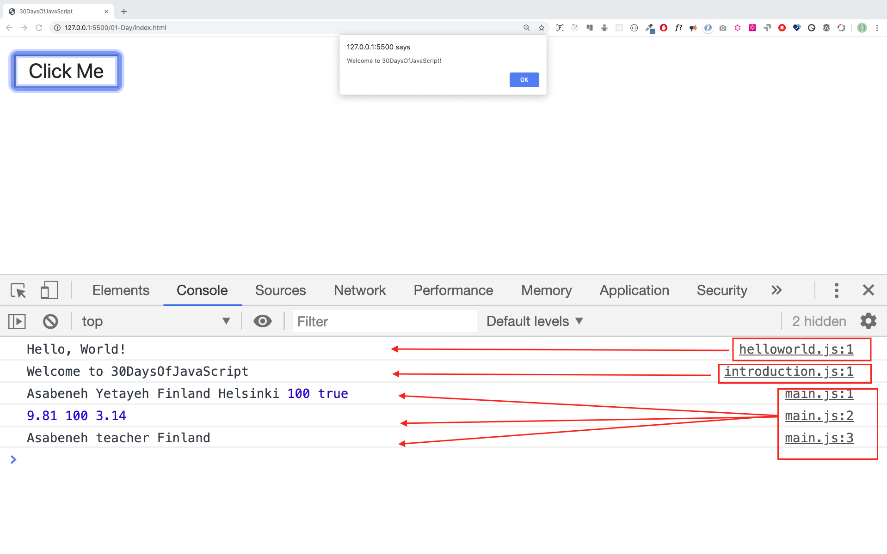

🌕 Harikasınız! 1. gün eğitimini tamamladınız ve mükemmel olma yolundasınız. Şimdi beyniniz ve kasınız için bazı egzersizler yapın.

# 💻 1. Gün: Egzersizler

1. _"Yorumlar kodu okunabilir hale getirmeye yardımcı olur"_ yazan tek satırlı bir yorum yazın
2. _"30GundeJavaScript eğitimine hoş geldiniz"_ yazan başka bir yorum satırı oluşturun
3. _"Yorumlar kodu okunabilir, yeniden kullanımı kolay ve bilgilendirici bir hale getirir."_ yazılı, birden çok satıra yayılmış çok satırlı bir yorum yazın

4. Bir degisken.js isimli dosya oluşturun ve bu _.js_ dosyasında string, boolean, undefined ve null veri türlerinde değişkenler oluşturun
5. Bir veriturleri.js isimli dosya oluşturun farklı veri türlerindeki verileri kontrol etmek için JavaScript **_typeof_** operatörünü kullanın. 
6. Herhangi bir değer ataması yapmadan dört adet değişken yazın
7. Oluşturduğunuz değişkenlere değer ataması yapın
8. Adınızı, soyadınızı, medeni durumunuzu, ülkenizi ve yaşınızı birden çok satırda olacak şekilde saklamak için değişkenleri ve değerlerini oluşturun
9. Adınızı, soyadınızı, medeni durumunuzu, ülkenizi ve yaşınızı tek bir satırda olacak şekilde saklamak için değişkenleri ve değerlerini oluşturun
10.  _benimYasim_ ve _seninYasin_ adlı iki değişken oluşturun ve bunlara aşağıdaki değerleri atayın. Ardından bunları tarayıcının konsolunda çalıştırın

```sh
Ben 25 Yaşındayım.
Sen 30 Yaşındasın.
```

🎉 TEBRİKLER  ! 🎉

[2. Gün >>](./02_Day_Data_types/02_day_data_types.md)
