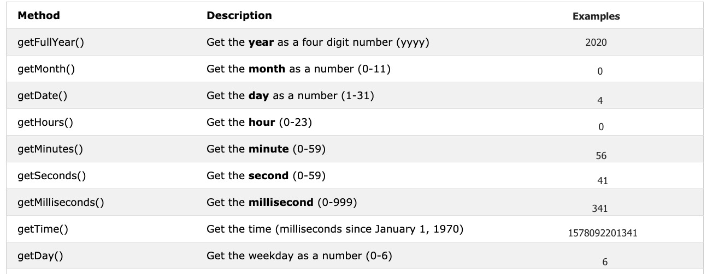

<div align="center">
  <h1> 30 Days Of JavaScript: Booleans, Operators, Date</h1>
  <a class="header-badge" target="_blank" href="https://www.linkedin.com/in/asabeneh/">
  
  </a>
  <a class="header-badge" target="_blank" href="https://twitter.com/Asabeneh">
  
  </a>

  <sub>Tác giả:
  <a href="https://www.linkedin.com/in/asabeneh/" target="_blank">Asabeneh Yetayeh</a><br>
  <small> Tháng 1, 2020</small>
  </sub>
</div>

[<< Ngày 2](../02_Day_Data_types/02_day_data_types.md) | [Ngày 4 >>](../04_Day_Conditionals/04_day_conditionals.md)


- [📔 Ngày 3](#-day-3)
	- [Booleans](#booleans)
		- [Giá trị đúng](#gia-tri-dung)
		- [Giá trị sai](#gia-tri-sai)
	- [Không xác định](#undefined)
	- [Giá trị không tồn tại](#null)
	- [Toán tử](#operators)
		- [Toán tử gán](#assignment-operators)
		- [Toán tử số học](#arithmetic-operators)
		- [Toán tử so sánh](#comparison-operators)
		- [Toán tử logic](#logical-operators)
		- [Toán tử tăng](#increment-operator)
		- [Toán tử giảm](#decrement-operator)
		- [Toán tử điều kiện](#ternary-operators)
		- [Độ ưu tiên của toán tử](#operator-precedence)
	- [Phương thức cửa sổ](#window-methods)
		- [Phương thức alert()](#window-alert-method)
		- [Phương thức prompt()](#window-prompt-method)
		- [Phương thức confirm()](#window-confirm-method)
	- [Đối tượng Date](#date-object)
		- [Tạo một đối tượng thời gian](#creating-a-time-object)
		- [Lấy giá trị năm](#getting-full-year)
		- [Lấy giá trị tháng](#getting-month)
		- [Lấy giá trị ngày](#getting-date)
		- [Lấy giá trị thứ trong tuần](#getting-day)
		- [Getting hours](#getting-hours)
		- [Getting minutes](#getting-minutes)
		- [Getting seconds](#getting-seconds)
		- [Getting time](#getting-time)
	- [💻 Ngày 3: Bài tập](#-day-3-exercises)
		- [Bài tập: Cấp độ 1](#exercises-level-1)
		- [Bài tập: Cấp độ 2](#exercises-level-2)
		- [Bài tập: Cấp độ 3](#exercises-level-3)

# 📔 Day 3

## Booleans


Dữ liệu boolean thể hiện một trong hai giá trị: True (đúng) hoặc False (sai). Giá trị của boolean sẽ là đúng (True) hoặc sai (False). Việc sử dụng các kiểu dữ liệu này sẽ rõ ràng khi bạn sử dụng toán tử so sánh. Bất kì phương thức so sánh nào đều sẽ trả về giá trị boolean đúng hoặc sai. 

**Ví dụ: Giá Trị Boolean**

```js
let isLightOn = true
let isRaining = false
let isHungry = false
let isMarried = true
let truValue = 4 > 3    // true
let falseValue = 4 < 3  // false
```

Chúng ta có thể thấy được boolean chỉ có giá trị đúng hoặc sai.

### Giá trị đúng

- Mọi số thực (dương và âm) đều mang giá trị đúng trừ 0
- Mọi chuỗi đều có giá trị đúng trừ chuỗi rỗng ('')
- Boolean đúng

### Giá trị sai

- 0
- 0n
- null
- Không xác định
- NaN
- Boolean sai
- '', "", ``, những chuỗi rỗng

Ghi nhớ những điều kiện để giá trị đúng sai sẽ có ích, bởi vì ở phần tiếp theo, chúng ta sẽ sử dụng chúng với điều kiện để đưa ra lựa chọn.

## Không xác định

Nếu chúng ta tạo một biến nhưng không gán một giá trị vào biến ấy, giá trị của biến ấy sẽ là *undefined*. Đồng thời, nếu một phương thức không trả một giá trị, phương thức ấy sẽ cho ra giá trị *underfined*

```js
let firstName
console.log(firstName) // Không xác định, bởi vì biến firstName chưa được gán giá trị
```

## Null

```js
let empty = null
console.log(empty) // -> null , nghĩa là không tồn tại
```

## Toán tử

### Toán tử gán

Dấu bằng trong JavaScript là một toán tử gán. Nó được dụng để gán giá trị vào biến

```js
let firstName = 'Asabeneh' // Gán giá trị 'Asabeneh' vào biến firstName
let country = 'Finland' // Gán giá trị 'Finland' vào biến country
```

Toán tử gán


### Toán tử số học

Toán tử số học là những phép tính toán.

- Phép cộng(+): a + b
- Phép trừ(-): a - b
- Phép nhân(*): a * b
- Phép chia(/): a / b
- Phép chia lấy dư(%): a % b
- Lũy thừa(**): a ** b

```js
let numOne = 4
let numTwo = 3
let sum = numOne + numTwo
let diff = numOne - numTwo
let mult = numOne * numTwo
let div = numOne / numTwo
let remainder = numOne % numTwo
let powerOf = numOne ** numTwo

console.log(sum, diff, mult, div, remainder, powerOf) // 7,1,12,1.33,1, 64

```

```js
const PI = 3.14
let radius = 100          // độ dài đơn vị mét

//Let us calculate area of a circle
const areaOfCircle = PI * radius * radius
console.log(areaOfCircle)  //  314 m


const gravity = 9.81      // đơn vị m/s2
let mass = 72             // đơn vị Kilogram

//Chúng ta sẽ tính khối lượng của đối tượng này
const weight = mass * gravity
console.log(weight)        // 706.32 N(Newton)

const boilingPoint = 100  // Nhiệt độ sôi của nước (oC)
const bodyTemp = 37       // Nhiệt độ cơ thể (oC)

// Nối chuỗi với số sử dụng phép nội suy chuỗi
/*
 The boiling point of water is 100 oC.
 Human body temperature is 37 oC.
 The gravity of earth is 9.81 m/s2.
 */
console.log(
  `The boiling point of water is ${boilingPoint} oC.\nHuman body temperature is ${bodyTemp} oC.\nThe gravity of earth is ${gravity} m / s2.`
)
```

### Toán tử so sánh

Trong lập trình, khi chúng ta so sánh 2 giá trị với nhau, chúng ta sẽ sử dụng toán tử so sánh. Toán tử so sánh giúp cho chúng ta biết giá trị 1 sẽ lớn hoặc hay nhỏ hơn hoặc bằng giá trị 2.


**Ví dụ: Toán tử so sánh**

```js
console.log(3 > 2)              // Đúng, bởi vì 3 lớn hơn 2
console.log(3 >= 2)             // Đúng, bởi vì 3 lớn hơn 2
console.log(3 < 2)              // Sai, bởi vì 3 lớn hơn 2
console.log(2 < 3)              // Đúng, bởi vì 2 bé hơn 3 
console.log(2 <= 3)             // Đúng, bởi vì 2 bé hơn 3
console.log(3 == 2)             // Sai, bởi vì 3 không bằng 2
console.log(3 != 2)             // Đúng, bởi vì 3 không bằng 2
console.log(3 == '3')           // Đúng, chỉ so sánh giá trị
console.log(3 === '3')          // Sai, so sánh cả giá trị lẫn kiểu dữ liệu
console.log(3 !== '3')          // Đúng, so sánh cả giá trị lẫn kiểu dữ liệu
console.log(3 != 3)             // Sai, chỉ so sánh giá trị
console.log(3 !== 3)            // Sai, so sánh cả giá trị lẫn kiểu dữ liệu
console.log(0 == false)         // Đúng, 2 giá trị tương đương nhau
console.log(0 === false)        // Sai, 2 giá trị không giống nhau hoàn toàn
console.log(0 == '')            // Đúng, giá trị tương đương nhau 
console.log(0 == ' ')           // Đúng, giá trị tương đương nhau
console.log(0 === '')           // Sai, 2 giá trị không giống nhau hoàn toàn
console.log(1 == true)          // Đúng, giá trị tương đương nhau
console.log(1 === true)         // Sai, 2 giá trị không giống nhau hoàn toàn
console.log(undefined == null)  // Đúng
console.log(undefined === null) // Sai
console.log(NaN == NaN)         // Sai, không bằng nhau
console.log(NaN === NaN)        // Sai
console.log(typeof NaN)         // Kiểu dữ liệu số

console.log('mango'.length == 'avocado'.length)  // Sai
console.log('mango'.length != 'avocado'.length)  // Đúng
console.log('mango'.length < 'avocado'.length)   // Đúng
console.log('milk'.length == 'meat'.length)      // Đúng
console.log('milk'.length != 'meat'.length)      // Sai
console.log('tomato'.length == 'potato'.length)  // Đúng
console.log('python'.length > 'dragon'.length)   // Sai
```

Hãy cố hiểu những so sánh trên theo logic, không nên học thuộc lòng bởi vì sẽ khó hơn.
Javascript là một ngôn ngữ lập trình lạ. Code Javascript sẽ chạy và đưa ra kết quả nhưng trừ khi bạn thật sự thành thạo ngôn ngữ này, kết quả sẽ không như mong đợi.

Theo như quy tắc ngón tay, nếu giá trị là không đúng với '==' thì cũng sẽ không đúng với '==='. Sử dụng '===' để so sánh sẽ an toàn hơn sử dụng '=='. Đường [link](https://dorey.github.io/JavaScript-Equality-Table/) sau đây bao gồm một dãy kết quả so sánh giữa các kiểu dữ liệu khác nhau.

### Toán tử Logic

Các ký hiệu sau đây là các toán tử logic thông dụng:
&& (và) , || (hoặc) và ! (phủ định). Toán tử && sẽ cho kết quả đúng khi cả hai đều kiện đều đúng. Toán tử || sẽ cho kết quả đúng khi một trong hai điều kiện đúng. Toán tử ! sẽ đảo ngược kết quả lại.

```js
// Ví dự toán tử &&

const check = 4 > 3 && 10 > 5         // đúng && đúng -> đúng
const check = 4 > 3 && 10 < 5         // đúng && sai -> sai
const check = 4 < 3 && 10 < 5         // sai && sai -> sai

// Ví dụ toán tử ||

const check = 4 > 3 || 10 > 5         // đúng  || đúng -> đúng
const check = 4 > 3 || 10 < 5         // đúng  || sai -> đúng
const check = 4 < 3 || 10 < 5         // sai || sai -> sai

//Ví dụ toán tử !

let check = 4 > 3                     // đúng
let check = !(4 > 3)                  // sai
let isLightOn = true
let isLightOff = !isLightOn           // sai
let isMarried = !false                // đúng
```

### Toán tử tăng

Trong JavaScipt chúng ta dùng toán tử tăng để tăng giá trị được chứa trong một biến. Toán tử tăng có thể nằm trước hoặc sau. Sau đây là ví dụ về cả 2 dạng:

1. Tăng nằm trước

```js
let count = 0
console.log(++count)        // 1
console.log(count)          // 1
```

1. Tăng nằm sau

```js
let count = 0
console.log(count++)        // 0
console.log(count)          // 1
```

Đa phần chúng ta sẽ dùng toán tử tăng nằm sau. Vì thế chúng ta nên nhớ cách sử dụng toán tử tăng nằm sau.

### Toán tử giảm

Trong Javascript chúng ta dùng toán tử giảm để giảm giá trị được chứa trong một biến. Toán tử giảm có thể nằm trước hoặc sau. Sau đây là ví dụ về cả 2 dạng:

1. Giảm nằm trước

```js
let count = 0
console.log(--count) // -1
console.log(count)  // -1
```

2. Giảm nằm sau

```js
let count = 0
console.log(count--) // 0
console.log(count)   // -1
```

### Toán tử điều kiện

Toán tử điều kiện cho chúng ta viết được điều kiện. Một cách khác để viết điều kiện là sử dụng toán tử điều kiện. Hãy xem các ví dụ sau:

```js
let isRaining = true
isRaining
  ? console.log('You need a rain coat.')
  : console.log('No need for a rain coat.')
isRaining = false

isRaining
  ? console.log('You need a rain coat.')
  : console.log('No need for a rain coat.')
```

```sh
You need a rain coat.
No need for a rain coat.
```

```js
let number = 5
number > 0
  ? console.log(`${number} is a positive number`)
  : console.log(`${number} is a negative number`)
number = -5

number > 0
  ? console.log(`${number} is a positive number`)
  : console.log(`${number} is a negative number`)
```

```sh
5 is a positive number
-5 is a negative number
```

### Độ ưu tiên toán tử

Nếu bạn muốn biết thêm về độ ưu tiên các toán tử hãy truy cập vào [link](https://developer.mozilla.org/en-US/docs/Web/JavaScript/Reference/Operators/Operator_Precedence)  này.

## Phương thức cửa sổ

### Hàm alert()

Như ở đầu đã thấy, hàm alert() hiện một cửa sổ cảnh báo với một tin nhắn cụ thể và một nút bấm với chữ 'OK'. Đây là một hàm có sẵn và có thể nhận tham số.

```js
alert(message)
```

```js
alert('Welcome to 30DaysOfJavaScript')
```

Đừng sử dụng hàm alert() quá nhiều bởi vì sẽ gây khó chịu cho người sử dụng. Chỉ nên dùng để kiểm tra.

### Hàm prompt()

Hàm prompt sẽ hiện một cửa sổ cho phép chúng ta nhập dữ liệu vào trong trình duyệt và dữ liệu sẽ được lưu vào một biến. Hàm prompt() nhận 2 tham số. Tham số thứ hai có thể có hoặc không.

```js
prompt('required text', 'optional text')
```

```js
let number = prompt('Enter number', 'number goes here')
console.log(number)
```

### Hàm confirm()

Hàm confirm() hiện một cửa sổ với một đoạn tin nhắn kèm theo một nút bấm 'OK' và nút bấm 'Cancel'.
Hàm confirm() thường được dùng để hỏi sự chấp thuận của người dùng trước khi thực hiện một hành động nào đó. Hàm confirm() nhận chuỗi làm tham số. Chọn nút 'OK' sẽ trả về giá trị đúng, còn nút 'Cancel' sẽ trả về giá trị sai.

```js
const agree = confirm('Are you sure you like to delete? ')
console.log(agree) // kết quả sẽ trả về đúng hoặc sai tùy vào nút người dùng chọn trong cửa sổ
```

Đây không phải là toàn bộ phương thức cửa sổ. Sẽ có một phần riêng biệt để đi sâu vào các phương thức cửa sổ.

## Đối tượng Date

Thời gian là một thứ quan trọng. Chúng ta muốn biết được thời gian của một hành động hoặc sự kiện gì đó. Trong Javascript, thời gian và ngày hiện tại được tạo ra sử dụng Đối tượng Date trong JavaScript. Đối tượng được tạo ra từ đối tượng Date sẽ có nhiều hàm giúp chúng ta trong việc xử lí thời gian và ngày. Những hàm được sử dụng để lấy được thông tin thời gian và ngày trong đối tượng Date đều bắt đầu với từ _get_.
 _getFullYear(), getMonth(), getDate(), getDay(), getHours(), getMinutes, getSeconds(), getMilliseconds(), getTime(), getDay()_



### Tạo một đối tượng thời gian

Sau khi tạo một đối tượng thời gian. Đối tượng đó sẽ cho chúng ta thông tin về thời gian. Đây là bước để tạo đối tượng thời gian.

```js
const now = new Date()
console.log(now) // Sat Jan 04 2020 00:56:41 GMT+0200 (Eastern European Standard Time)
```

Chúng ta đã tạo một đối tượng thời gian. Giờ chúng ta có thể lấy mọi thông tin liên quan đến thời gian từ đối tượng đã tạo bằng cách sử dụng các hàm _get_ trong bảng trên.

### Lấy năm

Lấy năm từ đối tượng thời gian

```js
const now = new Date()
console.log(now.getFullYear()) // 2020
```

### Lấy tháng

Lấy tháng từ đối tượng thời gian

```js
const now = new Date()
console.log(now.getMonth()) // 0, bởi vì đây là tháng Giêng, tháng(0-11)
```

### Lấy ngày

Lấy ngày trong tháng từ đối tượng thời gian

```js
const now = new Date()
console.log(now.getDate()) // 4, bởi vì ngày trong tháng là ngày bốn, ngày(1-31)
```

### Lấy thứ

Lấy thứ ngày trong tuần từ đối tượng thời gian

```js
const now = new Date()
console.log(now.getDay()) // 6, bởi vì hôm nay là thứ bảy
//  Chủ nhật là 0, thứ Hai là 1 và thứ bảy là 6
// Ngày trong tuần (0-6)
```

### Lấy giờ

Lấy giờ từ đối tượng thời gian

```js
const now = new Date()
console.log(now.getHours()) // 0, bời vì thời gian là 00:56:41
```

### Lấy phút

Lấy phút từ đối tượng thời gian

```js
const now = new Date()
console.log(now.getMinutes()) // 56, bời vì thời gian là 00:56:41
```

### Lấy giây

Lấy giây từ đối tượng thời gian

```js
const now = new Date()
console.log(now.getSeconds()) // 41, bời vì thời gian là 00:56:41
```

### Lấy thời gian

Phương thức này sẽ cho chúng ta thời gian theo giây tính từ ngày 1, tháng 1, năm 1970. Đây còn được gọi là thời gian Unix. Chúng ta có thể lấy thời gian Unix theo 2 cách sau:

1. Sử dụng hàm _getTime()_

```js
const now = new Date() //
console.log(now.getTime()) // 1578092201341, đây là số giây đã trôi qua kể từ ngày 1, tháng 1, năm 1970 đến 4 Tháng 1, 2020 00:56:41
```

1. Sử dụng hàm _Date.now()_

```js
const allSeconds = Date.now() //
console.log(allSeconds) // 1578092201341,đây là số giây đã trôi qua kể từ ngày 1, tháng 1, năm 1970 đến 4 Tháng 1, 2020 00:56:41

const timeInSeconds = new Date().getTime()
console.log(allSeconds == timeInSeconds) // đúng
```

Chúng ta sẽ điều chỉnh lại giá trị để có thể dễ đọc thời gian hơn

**Ví dụ:**

```js
const now = new Date()
const year = now.getFullYear() // Lấy năm
const month = now.getMonth() + 1 // Lấy tháng(0 - 11)
const date = now.getDate() // Lấy ngày (1 - 31)
const hours = now.getHours() // Lấy giờ (0 - 23)
const minutes = now.getMinutes() // Lấy phút (0 -59)

console.log(`${date}/${month}/${year} ${hours}:${minutes}`) // 4/1/2020 0:56
```

🌕  Bạn có năng lượng vô tận. Bạn vừa hoàn thành thử thách của ngày thứ 3 và bạn đã tiến được 3 bước trên con đường vươn tới sự vĩ đại. Bây giờ hãy làm một số bài tập để giúp cho trí não của bạn.

## 💻 Day 3: Bài tập

### Bài tập: Level 1

1. Khai báo biến firstName, lastName, country, city, age, isMarried, year và gán giá trị cho nó và sử dụng toán tử typeof để kiểm tra các kiểu dữ liệu khác nhau.
2. Kiểm tra xem kiểu dữ liệu của '10' có giống với 10
3. Kiểm tra parseInt('9.8') có bằng 10 không
4. Giá trị boolean có thể đúng hoặc sai
   1. Viết ba câu lệnh JavaScript cung cấp giá trị đúng.
   2. Viết ba câu lệnh JavaScript cung cấp giá trị sai.

5. Hãy tìm ra kết quả của các biểu thức so sánh sau không sử dụng console.log(). Sau khi làm xong, hãy xác nhận nó bằng console.log()
   1. 4 > 3
   2. 4 >= 3
   3. 4 < 3
   4. 4 <= 3
   5. 4 == 4
   6. 4 === 4
   7. 4 != 4
   8. 4 !== 4
   9. 4 != '4'
   10. 4 == '4'
   11. 4 === '4'
   12. Tìm độ dài của python và biệt ngữ và đưa ra một câu lệnh so sánh sai

6. Hãy tìm ra kết quả của các biểu thức so sánh sau không sử dụng console.log(). Sau khi làm xong, hãy xác nhận nó bằng console.log()
   1. 4 > 3 && 10 < 12
   2. 4 > 3 && 10 > 12
   3. 4 > 3 || 10 < 12
   4. 4 > 3 || 10 > 12
   5. !(4 > 3)
   6. !(4 < 3)
   7. !(false)
   8. !(4 > 3 && 10 < 12)
   9. !(4 > 3 && 10 > 12)
   10. !(4 === '4')
   11. Không có 'on' trong cả 2 từ dragon và python

7. Sử dụng đối tượng Date để làm các câu hỏi sau
   1. Năm nay là năm mấy?
   2. Tháng này là tháng mấy dưới dạng số?
   3. Hôm nay ngày mấy?
   4. Hôm nay là thứ mấy dưới dạng số?
   5. Bây giờ mấy giờ?
   6. Bây giờ mấy phút?
   7. Tìm số giây đã trôi qua kể từ ngày 1, tháng 1, năm 1970 đến bây giờ.

### Bài tập: Level 2

1. Viết một đoạn lệnh yêu cầu người dùng nhập độ dài đáy và chiều cao của hình tam giác và tính diện tích của tam giác ấy (diện tích = 0.5 x đáy x cao).

   ```sh
   Enter base: 20
   Enter height: 10
   The area of the triangle is 100
   ```

2. Viết một đoạn lệnh yêu cầu người dùng nhập độ dài cạnh a, cạnh b, cạnh c của hình tam giác và tính chu vi của tam giác ấy (chu vi = a + b + c).

   ```sh
   Enter side a: 5
   Enter side b: 4
   Enter side c: 3
   The perimeter of the triangle is 12
   ```

3. Yêu cầu nhập độ dài và độ rộng sau đó tính diện tích hình chữ nhật (diện tích = dài x rộng) và tính chu vi hình chữ nhật (chu vi = 2 x (dài + rộng).
4. Yêu cầu nhập bán kính r sau đó tính diện tích hình tròn (diện tích = pi x r x r) và tính chu vi hình tròn (chu vi = 2 x pi x r), lấy pi = 3.14.
5. Tính hệ số góc, tung độ gốc x và tung độ gốc y của phương trình y = 2x -2
6. Tung độ góc m = (y<sub>2</sub>-y<sub>1</sub>)/(x<sub>2</sub>-x<sub>1</sub>). Tìm tung độ góc giữa 2 điểm (2, 2) và (6, 10).
7. So sánh tung độ góc của câu 5 và câu 6.
8. Tính giá trị của y (y = x<sup>2</sup> + 6x + 9). Hãy thử sử dụng các giá trị x khác nhau và tìm ra giá trị x để y bằng 0.
9. Viết đoạn lệnh yêu cầu người dùng nhập thời gian và mức lương theo giờ. Tính lương của người đó?

    ```sh
    Enter hours: 40
    Enter rate per hour: 28
    Your weekly earning is 1120
    ```

10. Nếu độ dài tên bạn lớn hơn 7, hiển thị 'your name is long' nếu không, hiển thị 'your name is short'.
11. So sánh tên của bạn và họ của bạn, hiển thị kết quả theo cấu trúc sau.

    ```js
    let firstName = 'Asabeneh'
    let lastName = 'Yetayeh'
    ```

    ```sh
    Your first name, Asabeneh is longer than your family name, Yetayeh
    ```

12. Tạo 2 biến _myAge_ và _yourAge_ và gán giá trị vào 2 biến ấy. Hiển thị kết quả theo cấu trúc sau.

   ```js
   let myAge = 250
   let yourAge = 25
   ```

   ```sh
   I am 225 years older than you.
   ```

13. Yêu cầu người dùng nhập năm sinh. Nếu người dùng lớn hơn hoặc bằng 18, cho phép người dùng lái xe. Nếu không hiển thị số năm người dùng cần phải chờ để đủ 18.

    ```sh

    Enter birth year: 1995
    You are 25. You are old enough to drive

    Enter birth year: 2005
    You are 15. You will be allowed to drive after 3 years.
    ```

14. Viết đoạn lệnh yêu cầu người dùng nhập số năm. Tính số giây của số năm đã nhập.

   ```sh
   Enter number of years you live: 100
   You lived 3153600000 seconds.
   ```

15. Tạo các định dạng thời gian dễ đọc sử dụng đối tượng Date
   1. YYYY-MM-DD HH:mm
   2. DD-MM-YYYY HH:mm
   3. DD/MM/YYYY HH:mm

### Bài tập: Level 3

1. Tạo định dạng thời gian có thể đọc được bằng cách sử dụng đối tượng Date. Giờ và phút phải luôn có hai chữ số (7 giờ phải là 07 và 5 phút phải là 05 )
   1. YYY-MM-DD HH:mm eg. 20120-01-02 07:05

[<< Day 2](../02_Day_Data_types/02_day_data_types.md) | [Day 4 >>](../04_Day_Conditionals/04_day_conditionals.md)
