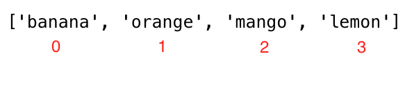

<div align="center">
  <h1> 30 Days Of JavaScript: Arrays</h1>
  <a class="header-badge" target="_blank" href="https://www.linkedin.com/in/asabeneh/">
  
  </a>
  <a class="header-badge" target="_blank" href="https://twitter.com/Asabeneh">
  
  </a>

  <sub>Tác giả:
  <a href="https://www.linkedin.com/in/asabeneh/" target="_blank">Asabeneh Yetayeh</a><br>
  <small> Tháng 1, 2020</small>
  </sub>
</div>

[<< Ngày 4](../04_Day_Conditionals/04_day_conditionals.md) | [Ngày 6 >>](../06_Day_Loops/06_day_loops.md)


- [📔 Ngày 5](#-ngày-5)
	- [Arrays](#arrays)
		- [Cách tạo mảng rỗng](#cách-tạo-mảng-rỗng)
		- [Cách tạo mảng với giá trị](#Cách-tạo-mảng-với-giá-trị)
		- [Tạo mảng bằng cách sử dụng phương thức split](#Tạo-mảng-bằng-cách-sử-dụng-phương-thức-split)
		- [Truy cập các phần tử trong mảng bằng giá trị index](#Truy-cập-các-phần-tử-trong-mảng-bằng-giá-trị-index)
		- [Sửa đổi phần tử trong mảng](#Sửa-đổi-phần-tử-trong-mảng)
		- [Các phương thức xử lý mảng](#Các-phương-thức-xử-lý-mảng)
			- [Hàm khởi tạo mảng](#Hàm-khởi-tạo-mảng)
			- [Tạo giá trị tĩnh với fill](#Tạo-giá-trị-tĩnh-với-fill)
			- [Nối các mảng với phương thức concat](#Nối-các-mảng-với-phương-thức-concat)
			- [Lấy độ dài của mảng](#Lấy-độ-dài-của-mảng)
			- [Lấy index của một phần tử trong mảng](#Lấy-index-của-một-phần-tử-trong-mảng)
			- [Lấy index cuối cùng của một phần tử trong mảng](#Lấy-index-cuối-cùng-của-một-phần-tử-trong-mảng)
			- [Kiểm tra mảng](#Kiểm-tra-mảng)
			- [Chuyển đổi mảng thành chuỗi](#Chuyển-đổi-mảng-thành-chuỗi)
			- [Nối các phần tử trong mảng](#Nối-các-phần-tử-trong-mảng)
			- [Cắt các phần tử trong mảng](#Cắt-các-phần-tử-trong-mảng)
			- [Phương thức splice trong mảng](#Phương-thức-splice-trong-mảng)
			- [Thêm một phần tử vào mảng bằng phương thức push](#Thêm-một-phần-tử-vào-mảng-bằng-phương-thức-push)
			- [Xóa phần tử cuối cùng bằng phương thức pop](#Xóa-phần-tử-cuối-cùng-bằng-phương-thức-pop)
			- [Xóa một phần tử đầu mảng](#Xóa-một-phần-tử-đầu-mảng)
			- [Thêm một phần tử đầu mảng](#Thêm-một-phần-tử-đầu-mảng)
			- [Đảo thứ tự mảng](#Đảo-thứ-tự-mảng)
			- [Sắp xếp các phần tử trong mảng](#Sắp-xếp-các-phần-tử-trong-mảng)
		- [Mảng của các mảng](#Mảng-của-các-mảng)
	- [💻 Bài tập](#-Bài-tập)
		- [Bài tập: Cấp độ 1](#Bài-tập-Cấp-độ-1)
		- [Bài tập: Cấp độ 2](#Bài-tập-Cấp-độ-2)
		- [Bài tập: Cấp độ 3](#Bài-tập-Cấp-độ-3)

# 📔 Ngày 5

## Arrays

Khác với biến, một mảng có thể lưu trữ _nhiều giá trị_. Mỗi giá trị trong một mảng có _index_ và mỗi index chỉ có _một địa chỉ tham chiếu trong bộ nhớ_. Mỗi giá trị có thể được truy cập bằng cách sử dụng _index_ của chúng. Index của một mảng bắt đầu từ _số không_, và index của phần tử cuối cùng ít hơn một đơn vị so với độ dài của mảng.

Một mảng là một tập hợp các kiểu dữ liệu khác nhau có thứ tự và có thể được thay đổi (có thể sửa đổi). Một mảng cho phép lưu trữ các phần tử trùng lặp và các kiểu dữ liệu khác nhau. Một mảng có thể trống hoặc có thể chứa các giá trị khác nhau về kiểu dữ liệu.

### Cách tạo một mảng rỗng

Trong JavaScript, chúng ta có thể tạo một mảng bằng nhiều cách khác nhau. Dưới đây là các cách để tạo một mảng.
Thường thì người ta sử dụng từ khóa _const_ thay vì _let_ để khai báo biến mảng. Nếu bạn sử dụng _const_ thì có nghĩa là bạn không sử dụng lại tên biến đó.

- Sử dụng constructor Array

```js
// syntax
const arr = Array()
// hoặc
// let arr = new Array()
console.log(arr) // []
```

- Sử dụng dấu ngoặc vuông([])

```js
// syntax
// Sử dụng dấu ngoặc vuông([])
const arr = []
console.log(arr)
```

### Cách tạo mảng với giá trị

Mảng với các gia trị ban đầu. Chúng ta sử dụng thuộc tính _length_ để tìm độ dài của chuỗi.

```js
const numbers = [0, 3.14, 9.81, 37, 98.6, 100] // mảng các số.
const fruits = ['banana', 'orange', 'mango', 'lemon'] // mảng trái cây
const vegetables = ['Tomato', 'Potato', 'Cabbage', 'Onion', 'Carrot'] // mảng rau củ
const animalProducts = ['milk', 'meat', 'butter', 'yoghurt'] // mảng các sản phẩm
const webTechs = ['HTML', 'CSS', 'JS', 'React', 'Redux', 'Node', 'MongDB'] // mảng các công nghệ web
const countries = ['Finland', 'Denmark', 'Sweden', 'Norway', 'Iceland'] // mảng các quốc gia.

// In ấn mảng và độ dài của mảng.

console.log('Numbers:', numbers)
console.log('Number of numbers:', numbers.length)

console.log('Fruits:', fruits)
console.log('Number of fruits:', fruits.length)

console.log('Vegetables:', vegetables)
console.log('Number of vegetables:', vegetables.length)

console.log('Animal products:', animalProducts)
console.log('Number of animal products:', animalProducts.length)

console.log('Web technologies:', webTechs)
console.log('Number of web technologies:', webTechs.length)

console.log('Countries:', countries)
console.log('Number of countries:', countries.length)
```

```sh
Numbers: [0, 3.14, 9.81, 37, 98.6, 100]
Number of numbers: 6
Fruits: ['banana', 'orange', 'mango', 'lemon']
Number of fruits: 4
Vegetables: ['Tomato', 'Potato', 'Cabbage', 'Onion', 'Carrot']
Number of vegetables: 5
Animal products: ['milk', 'meat', 'butter', 'yoghurt']
Number of animal products: 4
Web technologies: ['HTML', 'CSS', 'JS', 'React', 'Redux', 'Node', 'MongDB']
Number of web technologies: 7
Countries: ['Finland', 'Estonia', 'Denmark', 'Sweden', 'Norway']
Number of countries: 5
```

- Mảng có thể chứa các phần tử khác nhau về kiểu dữ liệu

```js
const arr = [
    'Asabeneh',
    250,
    true,
    { country: 'Finland', city: 'Helsinki' },
    { skills: ['HTML', 'CSS', 'JS', 'React', 'Python'] }
] // arr containing different data types
console.log(arr)
```

### Tạo mảng bằng cách sử dụng phương thức split.

Như chúng ta đã thấy ở phía trên, chúng ta có thể chia một chuỗi ở các vị trí khác nhau và chuyển nó thành một mảng. Xem thêm các ví dụ dưới đây.

```js
let js = 'JavaScript'
const charsInJavaScript = js.split('')

console.log(charsInJavaScript) // ["J", "a", "v", "a", "S", "c", "r", "i", "p", "t"]

let companiesString = 'Facebook, Google, Microsoft, Apple, IBM, Oracle, Amazon'
const companies = companiesString.split(',')

console.log(companies) // ["Facebook", " Google", " Microsoft", " Apple", " IBM", " Oracle", " Amazon"]
let txt =
  'I love teaching and empowering people. I teach HTML, CSS, JS, React, Python.'
const words = txt.split(' ')

console.log(words)
// văn bản có các ký tự đặc biệt, hãy nghĩ cách để chỉ lấy được các từ.
// ["I", "love", "teaching", "and", "empowering", "people.", "I", "teach", "HTML,", "CSS,", "JS,", "React,", "Python"]
```

### Truy cập các phần tử trong mảng bằng giá trị index

Chúng ta truy cập từng phần tử trong một mảng bằng cách sử dụng giá trị index của chúng. Index của một mảng bắt đầu từ 0. Hình ảnh dưới đây cho thấy rõ giá trị index của từng phần tử trong mảng.



```js
const fruits = ['banana', 'orange', 'mango', 'lemon']
let firstFruit = fruits[0] // we are accessing the first item using its index

console.log(firstFruit) // banana

secondFruit = fruits[1]
console.log(secondFruit) // orange

let lastFruit = fruits[3]
console.log(lastFruit) // lemon
// Giá trị index cuối có thể tính theo cách sau

let lastIndex = fruits.length - 1
lastFruit = fruits[lastIndex]

console.log(lastFruit)  // lemon
```

```js
const numbers = [0, 3.14, 9.81, 37, 98.6, 100]  // mảng các số

console.log(numbers.length)  // => để biết độ dài của mảng (mảng có 6 phần tử)
console.log(numbers)         // -> [0, 3.14, 9.81, 37, 98.6, 100]
console.log(numbers[0])      //  -> 0
console.log(numbers[5])      //  -> 100

let lastIndex = numbers.length - 1;
console.log(numbers[lastIndex]) // -> 100
```

```js
const webTechs = [
  'HTML',
  'CSS',
  'JavaScript',
  'React',
  'Redux',
  'Node',
  'MongoDB'
] // Danh sách các công nghệ web

console.log(webTechs)        // tất cả phẩn tử của mảng
console.log(webTechs.length) // => để biết độ dài của mảng (mảng có 7 phần tử)
console.log(webTechs[0])     //  -> HTML
console.log(webTechs[6])     //  -> MongoDB

let lastIndex = webTechs.length - 1
console.log(webTechs[lastIndex]) // -> MongoDB
```

```js
const countries = [
  'Albania',
  'Bolivia',
  'Canada',
  'Denmark',
  'Ethiopia',
  'Finland',
  'Germany',
  'Hungary',
  'Ireland',
  'Japan',
  'Kenya'
] // Danh sách các quốc gia

console.log(countries)      // -> tất cả phần tử trong mảng
console.log(countries[0])   //  -> Albania
console.log(countries[10])  //  -> Kenya

let lastIndex = countries.length - 1;
console.log(countries[lastIndex]) //  -> Kenya
```

```js
const shoppingCart = [
  'Milk',
  'Mango',
  'Tomato',
  'Potato',
  'Avocado',
  'Meat',
  'Eggs',
  'Sugar'
] // Danh sách các sản phẩm

console.log(shoppingCart) // -> tất cả phần tử trong mảng
console.log(shoppingCart[0]) //  -> Milk
console.log(shoppingCart[7]) //  -> Sugar

let lastIndex = shoppingCart.length - 1;
console.log(shoppingCart[lastIndex]) //  -> Sugar
```

### Sửa đổi phần tử trong mảng

Một mảng có thể thay đổi (có thể chỉnh sửa). Một khi một mảng đã được tạo, chúng ta có thể chỉnh sửa nội dung của các phần tử trong mảng.

```js
const numbers = [1, 2, 3, 4, 5]
numbers[0] = 10      // Đổi giá trị phần tử có index 0 thành 10
numbers[1] = 20      // Đổi giá trị phần tử có index 1 thành 20

console.log(numbers) // [10, 20, 3, 4, 5]

const countries = [
  'Albania',
  'Bolivia',
  'Canada',
  'Denmark',
  'Ethiopia',
  'Finland',
  'Germany',
  'Hungary',
  'Ireland',
  'Japan',
  'Kenya'
]

countries[0] = 'Afghanistan'  // Đổi Albania thành Afghanistan
let lastIndex = countries.length - 1
countries[lastIndex] = 'Korea' // Đổi Kenya thành Korea

console.log(countries)
```

```sh
["Afghanistan", "Bolivia", "Canada", "Denmark", "Ethiopia", "Finland", "Germany", "Hungary", "Ireland", "Japan", "Korea"]
```

### Các phương thức xử lý mảng

Có nhiều phương thức khác nhau để thao tác với một mảng. Đây là một số phương thức có sẵn để làm việc với mảng:_Array, length, concat, indexOf, slice, splice, join, toString, includes, lastIndexOf, isArray, fill, push, pop, shift, unshift_

#### Hàm khởi tạo mảng

Array:Sử dụng để tạo một mảng.

```js
const arr = Array() // Tạo một mảng rổng
console.log(arr)

const eightEmptyValues = Array(8) // tạo một mảng chứa 8 phần tử có giá trị rổng
console.log(eightEmptyValues) // [empty x 8]
```

#### Tạo giá trị tĩnh với fill

fill: Điền tất cả các phần tử của mảng với một giá trị tĩnh

```js
const arr = Array() // Tạo một mảng rổng
console.log(arr)

const eightXvalues = Array(8).fill('X') // Tạo mảng có 8 phần tử giá trị là 'X'
console.log(eightXvalues) // ['X', 'X','X','X','X','X','X','X']

const eight0values = Array(8).fill(0) // Tạo mảng có 8 phần tử giá trị là  '0'
console.log(eight0values) // [0, 0, 0, 0, 0, 0, 0, 0]

const four4values = Array(4).fill(4) // Tạo mảng có 4 phần tử giá trị là  '4'
console.log(four4values) // [4, 4, 4, 4]
```

#### Nối các mảng với phương thức conca

concat:Dùng để nối hai mảng.

```js
const firstList = [1, 2, 3]
const secondList = [4, 5, 6]
const thirdList = firstList.concat(secondList)

console.log(thirdList) // [1, 2, 3, 4, 5, 6]
```

```js
const fruits = ['banana', 'orange', 'mango', 'lemon']                 // mảng trái cây
const vegetables = ['Tomato', 'Potato', 'Cabbage', 'Onion', 'Carrot'] // mảng rau củ
const fruitsAndVegetables = fruits.concat(vegetables)                 // nối hai mảng lại

console.log(fruitsAndVegetables)
```

```sh
["banana", "orange", "mango", "lemon", "Tomato", "Potato", "Cabbage", "Onion", "Carrot"]
```

#### Lấy độ dài của mảng

Length:Để biết kích thước của mảng

```js
const numbers = [1, 2, 3, 4, 5]
console.log(numbers.length) // -> 5 là kích thước của mảng
```

#### Lấy index của một phần tử trong mảng

indexOf: Dùng để kiểm tra xem một phần tử có tồn tại trong mảng hay không. Nếu tồn tại nó sẽ trả về giá trị index của phần tử đó, nếu không nó sẽ trả về -1.

```js
const numbers = [1, 2, 3, 4, 5]

console.log(numbers.indexOf(5)) // -> 4
console.log(numbers.indexOf(0)) // -> -1
console.log(numbers.indexOf(1)) // -> 0
console.log(numbers.indexOf(6)) // -> -1
```

Kiểm tra xem phần tử có tồn tại trong mảng không.

- Kiểm tra các phần tử trong một danh sách.
  
```js
// Chúng ta hãy thử xem banana có tồn tại trong mảng

const fruits = ['banana', 'orange', 'mango', 'lemon']
let index = fruits.indexOf('banana')  // 0

if(index === -1){
   console.log('This fruit does not exist in the array')  
} else {
    console.log('This fruit does exist in the array')
}
// Phần tử này có tồn tại trong mảng

// Chúng ta cũng có thể sử dụng toán tử ba ngôi ở đây.
index === -1 ? console.log('This fruit does not exist in the array'): console.log('This fruit does exist in the array')

// Chúng ta hãy thử xem avocado có tồn tại trong mảng
let indexOfAvocado = fruits.indexOf('avocado')  // -1, if the element not found index is -1
if(indexOfAvocado === -1){
   console.log('This fruit does not exist in the array')  
} else {
    console.log('This fruit does exist in the array')
}
// Phần tử này có tồn tại trong mảng
```

#### Lấy index cuối cùng của một phần tử trong mảng

lastIndexOf: Trả giá trị index của phần tử cuối cùng trong mảng. Nếu không tồn tại, nó sẽ trả giá trị -1.

```js
const numbers = [1, 2, 3, 4, 5, 3, 1, 2]

console.log(numbers.lastIndexOf(2)) // 7
console.log(numbers.lastIndexOf(0)) // -1
console.log(numbers.lastIndexOf(1)) //  6
console.log(numbers.lastIndexOf(4)) //  3
console.log(numbers.lastIndexOf(6)) // -1
```

includes: Để kiểm tra xem phần tử có tồn tại trong mảng. Nếu có sẻ trả về true nếu không thì false.

```js
const numbers = [1, 2, 3, 4, 5]

console.log(numbers.includes(5)) // true
console.log(numbers.includes(0)) // false
console.log(numbers.includes(1)) // true
console.log(numbers.includes(6)) // false

const webTechs = [
  'HTML',
  'CSS',
  'JavaScript',
  'React',
  'Redux',
  'Node',
  'MongoDB'
] // Danh sách các công nghệ web

console.log(webTechs.includes('Node'))  // true
console.log(webTechs.includes('C'))     // false
```

#### Kiểm tra mảng

Array.isArray:để kiểm tra xem đối tượng có phải là mảng không

```js
const numbers = [1, 2, 3, 4, 5]
console.log(Array.isArray(numbers)) // true

const number = 100
console.log(Array.isArray(number)) // false
```

#### Chuyển đổi mảng thành chuỗi

toString:Chuyển đổi mảng thành chuỗi

```js
const numbers = [1, 2, 3, 4, 5]
console.log(numbers.toString()) // 1,2,3,4,5

const names = ['Asabeneh', 'Mathias', 'Elias', 'Brook']
console.log(names.toString()) // Asabeneh,Mathias,Elias,Brook
```

#### Nối các phần tử trong mảng

join: Phương thức join được sử dụng để nối các phần tử của mảng. Đối số mà chúng ta truyền vào phương thức join sẽ được nối vào trong mảng và trả về dưới dạng một chuỗi. Theo mặc định, phương thức join sẽ nối các phần tử bằng dấu phẩy, tuy nhiên chúng ta có thể truyền một ký tự khác để nối giữa các phần tử.

```js
const numbers = [1, 2, 3, 4, 5]
console.log(numbers.join()) // 1,2,3,4,5

const names = ['Asabeneh', 'Mathias', 'Elias', 'Brook']

console.log(names.join()) // Asabeneh,Mathias,Elias,Brook
console.log(names.join('')) //AsabenehMathiasEliasBrook
console.log(names.join(' ')) //Asabeneh Mathias Elias Brook
console.log(names.join(', ')) //Asabeneh, Mathias, Elias, Brook
console.log(names.join(' # ')) //Asabeneh # Mathias # Elias # Brook

const webTechs = [
  'HTML',
  'CSS',
  'JavaScript',
  'React',
  'Redux',
  'Node',
  'MongoDB'
] // danh sách công nghệ web

console.log(webTechs.join())       // "HTML,CSS,JavaScript,React,Redux,Node,MongoDB"
console.log(webTechs.join(' # '))  // "HTML # CSS # JavaScript # React # Redux # Node # MongoDB"
```

#### Cắt các phần tử trong mảng

Slice: Để cắt ra nhiều phần tử trong một khoảng, ta sử dụng phương thức slice(). Nó nhận hai tham số: vị trí bắt đầu và vị trí kết thúc hoặc không bao gồm vị trí kết thúc.

```js
  const numbers = [1,2,3,4,5]

  console.log(numbers.slice()) // -> [1, 2, 3, 4, 5], sao chép tất cả phần tử
  console.log(numbers.slice(0)) // -> [1, 2, 3, 4, 5], sao chép tất cả phần tử
  console.log(numbers.slice(0, numbers.length)) // [1, 2, 3, 4, 5],  sao chép tất cả phần tử
  console.log(numbers.slice(1,4)) // -> [2,3,4] // không bao gồm vị trí kết thúc
```

#### Phương thức splice trong mảng

Splice: Lấy ba tham số: vị trí bắt đầu, số lần xóa phần tử và các tử mới được thêm vào.

```js
  const numbers = [1, 2, 3, 4, 5]
  numbers.splice()
  console.log(numbers)                // ->[1, 2, 3, 4, 5],  sao chép tất cả phần tử

```

```js
  const numbers = [1, 2, 3, 4, 5]
	numbers.splice(0,1)
  console.log(numbers)            // loại bỏ giá trị đầu tiên
```

```js
  const numbers = [1, 2, 3, 4, 5, 6]
	numbers.splice(3, 3, 7, 8, 9)
  console.log(numbers.splice(3, 3, 7, 8, 9))  // -> [1, 2, 3, 7, 8, 9] //loại bỏ và thay thế 3 giá trị mới từ phần tử có index 3
```

#### Thêm một phần tử vào mảng bằng phương thức push

Push: Để thêm một phần tử vào cuối một mảng hiện có, chúng ta sử dụng phương thức push.

```js
// syntax
const arr  = ['item1', 'item2','item3']
arr.push('new item')
console.log(arr)
// ['item1', 'item2','item3','new item']
```

```js
const numbers = [1, 2, 3, 4, 5]
numbers.push(6)
console.log(numbers) // -> [1,2,3,4,5,6]

numbers.pop() // -> xóa phần tử ở cuối
console.log(numbers) // -> [1,2,3,4,5]
```

```js
let fruits = ['banana', 'orange', 'mango', 'lemon']
fruits.push('apple')
console.log(fruits)    // ['banana', 'orange', 'mango', 'lemon', 'apple']

fruits.push('lime')
console.log(fruits)   // ['banana', 'orange', 'mango', 'lemon', 'apple', 'lime']
```

#### Xóa phần tử cuối cùng bằng phương thức pop

pop: Xóa phần tử ở cuối

```js
const numbers = [1, 2, 3, 4, 5]
numbers.pop() // -> xóa phần tử ở cuối
console.log(numbers) // -> [1,2,3,4]
```

#### Xóa một phần tử đầu mảng

shift: Xóa một phần tử từ đầu mảng.

```js
const numbers = [1, 2, 3, 4, 5]
numbers.shift() // -> xóa phần tử ở đầu mảng
console.log(numbers) // -> [2,3,4,5]
```

#### Thêm một phần tử đầu mảng

unshift: Thêm một phần tử vào đầu mảng.

```js
const numbers = [1, 2, 3, 4, 5]
numbers.unshift(0) // -> thêm mới một phần tử vào đầu mảng
console.log(numbers) // -> [0,1,2,3,4,5]
```

#### Đảo thứ tự mảng

reverse: Đảo ngược thứ tự của mảng.

```js
const numbers = [1, 2, 3, 4, 5]
numbers.reverse() // -> đảo ngược mảng
console.log(numbers) // [5, 4, 3, 2, 1]

numbers.reverse()
console.log(numbers) // [1, 2, 3, 4, 5]
```

#### Sắp xếp các phần tử trong mảng

sort: Sắp xếp các phần tử của mảng theo thứ tự tăng dần. Phương thức sort cần một hàm callback, dưới đây là các ví dụ sort với hàm callback trong phần tiếp theo.

```js
const webTechs = [
  'HTML',
  'CSS',
  'JavaScript',
  'React',
  'Redux',
  'Node',
  'MongoDB'
]

webTechs.sort()
console.log(webTechs) // ["CSS", "HTML", "JavaScript", "MongoDB", "Node", "React", "Redux"]

webTechs.reverse() // sau khi sắp xếp chúng ta có thể đảo ngược vị trí trong mảng
console.log(webTechs) // ["Redux", "React", "Node", "MongoDB", "JavaScript", "HTML", "CSS"]
```

### Mảng của các mảng


Mảng có thể lưu trữ các kiểu dữ liệu khác nhau bao gồm một mảng. Hãy tạo một mảng của các mảng.

```js
const firstNums = [1, 2, 3]
const secondNums = [1, 4, 9]

const arrayOfArray =  [[1, 2, 3], [1, 2, 3]]
console.log(arrayOfArray[0]) // [1, 2, 3]

 const frontEnd = ['HTML', 'CSS', 'JS', 'React', 'Redux']
 const backEnd = ['Node','Express', 'MongoDB']
 const fullStack = [frontEnd, backEnd]
 console.log(fullStack)   // [["HTML", "CSS", "JS", "React", "Redux"], ["Node", "Express", "MongoDB"]]
 console.log(fullStack.length)  // 2
 console.log(fullStack[0])  // ["HTML", "CSS", "JS", "React", "Redux"]
 console.log(fullStack[1]) // ["Node", "Express", "MongoDB"]
```

🌕  Bạn đã cần cù và đạt được rất nhiều. Bạn vừa hoàn thành các thử thách của ngày 5 và đã tiến được 5 bước trong hành trình trở thành một người vĩ đại. Bây giờ hãy làm một ít bài tập cho não bộ và cơ thể của bạn.

## 💻 Bài tập

### Bài tập: Cấp độ 1

```js
const countries = [
  'Albania',
  'Bolivia',
  'Canada',
  'Denmark',
  'Ethiopia',
  'Finland',
  'Germany',
  'Hungary',
  'Ireland',
  'Japan',
  'Kenya'
]

const webTechs = [
  'HTML',
  'CSS',
  'JavaScript',
  'React',
  'Redux',
  'Node',
  'MongoDB'
]
```

1. Khai báo một mảng rỗng;
2. Khai báo một mảng có hơn 5 phần tử
3. Tìm độ dài của mảng của bạn
4. Lấy phần tử đầu tiên, phần tử giữa và phần tử cuối cùng của mảng
5. Khai báo một mảng được gọi là _mixedDataTypes_, đặt các loại dữ liệu khác nhau trong mảng và tìm độ dài của mảng. Kích thước mảng phải lớn hơn 5
6. Khai báo một biến mảng tên là itCompanies và gán các giá trị ban đầu Facebook, Google, Microsoft, Apple, IBM, Oracle và Amazon
7. In mảng bằng _console.log()_
8. In số lượng công ty trong mảng
9. In công ty đầu tiên, công ty giữa và công ty cuối cùng
10. In từng công ty trong mảng
11. Viết hoa tên các công ty và viết chúng ra
12. In mảng dưới dạng câu như: Facebook, Google, Microsoft, Apple, IBM,Oracle and Amazon are big IT companies.
13. Kiểm tra xem một công ty cụ thể có tồn tại trong mảng itCompanies.  Nếu tồn tại, trả lại công ty đó, ngược lại trả lại một công ty _không tìm thấy_
14. Lọc các công ty có hơn một 'o' mà không có phương thức filter
15. Sắp xếp mảng bằng phương thức _sort()_
16. Đảo ngược mảng bằng phương thức _reverse()_
17. Cắt ra 3 công ty đầu tiên khỏi mảng
18. Cắt ra công ty hoặc các công ty IT ở giữa khỏi mảng
19. Cắt ra công ty hoặc các công ty IT ở giữa khỏi mảng
20. Xóa công ty IT đầu tiên khỏi mảng
21. Xóa công ty IT ở giữa khỏi mảng
22. Xóa công ty IT cuối cùng khỏi mảng
23. Xóa tất cả các công ty IT

### Bài tập: Cấp độ 2

1. Tạo một file riêng tên countries.js và lưu trữ mảng countries vào file này, tạo một file riêng tên web_techs.js và lưu trữ mảng webTechs vào file này. Truy cập vào cả hai file trong file main.js
1. Đầu tiên loại bỏ tất cả các dấu chấm câu và chuyển đổi chuỗi thành mảng và đếm số từ trong mảng.

    ```js
    let text =
    'I love teaching and empowering people. I teach HTML, CSS, JS, React, Python.'
    console.log(words)
    console.log(words.length)
    ```

    ```sh
    ["I", "love", "teaching", "and", "empowering", "people", "I", "teach", "HTML", "CSS", "JS", "React", "Python"]
  
    13
    ```

1.  Trong mảng shopping cart sau thêm, xóa và chỉnh sửa các mặt hàng

    ```js
    const shoppingCart = ['Milk', 'Coffee', 'Tea', 'Honey']
    ```

   - thêm 'Meat' vào đầu giỏ hàng của bạn nếu nó chưa được thêm trước đó
   - thêm Sugar vào cuối giỏ hàng của bạn nếu nó chưa được thêm trước đó
   - xóa 'Honey' nếu bạn dị ứng với mật ong
   - sửa Tea thành 'Green Tea'
1. Trong mảng quốc gia, kiểm tra xem 'Ethiopia' có tồn tại trong mảng không, nếu có, in ra 'ETHIOPIA'. Nếu không tồn tại, thêm nó vào danh sách các quốc gia.
1. Trong mảng webTechs, kiểm tra xem Sass có tồn tại trong mảng không và nếu có in ra 'Sass is a CSS preprocessS'. Nếu không tồn tại, thêm Sass vào mảng và in ra mảng đó.
1. Ghép nối hai biến sau đây và lưu nó vào một biến fullStack.

    ```js
    const frontEnd = ['HTML', 'CSS', 'JS', 'React', 'Redux']
    const backEnd = ['Node','Express', 'MongoDB']
  
    console.log(fullStack)
    ```

    ```sh
    ["HTML", "CSS", "JS", "React", "Redux", "Node", "Express", "MongoDB"]
    ```

### Bài tập: Cấp độ 3

1. Dưới đây là mảng chứ tuổi của 10 học sinh

    ```js
    const ages = [19, 22, 19, 24, 20, 25, 26, 24, 25, 24]
    ```

    - Sắp xếp mảng và tìm giá trị tuổi nhỏ nhất và lớn nhất
    - Tìm tuổi trung bình (tổng các giá trị chia cho số lượng các giá trị)
    - Tìm phạm vi tuổi (giá trị lớn nhất trừ giá trị nhỏ nhất)
    - Find the range of the ages(max minus min)
    - So sánh giá trị của (giá trị nhỏ nhất - giá trị trung bình) và (giá trị lớn nhất - giá trị trung bình), sử dụng phương thức _abs()_
1.Cắt 10 quốc gia đầu tiên từ [countries array](https://github.com/Asabeneh/30DaysOfJavaScript/tree/master/data/countries.js)
1. Tìm quốc gia hoặc các quốc gia ở giữa mảng [countries array](https://github.com/Asabeneh/30DaysOfJavaScript/tree/master/data/countries.js)
2. Chia mảng quốc gia thành hai mảng bằng nhau nếu nó có số phần tử chẵn. Nếu mảng quốc gia không chẵn, cho một quốc gia nữa vào nửa đầu tiên.
  
🎉 CHÚC MỪNG ! 🎉

[<< Day 4](../04_Day_Conditionals/04_day_Conditionals.md) | [Day 6 >>](../06_Day_Loops/06_day_loops.md)
