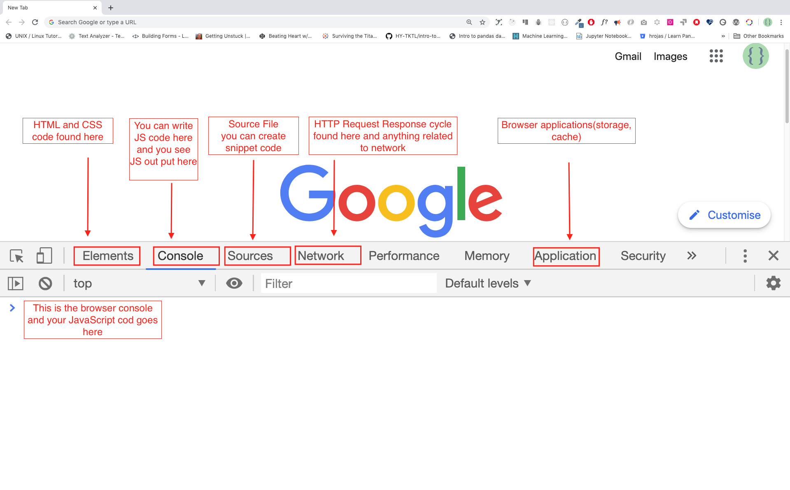

<div align="center">
  <h1> 30天的JavaScript之旅</h1>
  <a class="header-badge" target="_blank" href="https://www.linkedin.com/in/asabeneh/">
  
  </a>
  <a class="header-badge" target="_blank" href="https://twitter.com/Asabeneh">
  
  </a>

  <sub>Autor:
  <a href="https://www.linkedin.com/in/asabeneh/" target="_blank">Asabeneh Yetayeh</a><br>
  <small> Enero de 2020</small>
  </sub>

  <div>

  🇬🇧 [English](../readMe.md)
  🇪🇸 [Spanish](../Spanish/readme.md)
  🇷🇺 [Russian](../RU/README.md)
  ᴢʜ [Chinese](./README.md)

  </div>
</div>


- [30天的JavaScript之旅](#30-days-of-javascript)
- [📔 第一天](#-day-1)
  - [简介](#简介)
  - [必要条件](#必要条件)
  - [设置](#设置)
    - [安装 Node.js](#安装-nodejs)
    - [浏览器](#浏览器)
      - [安装chrome浏览器](#安装chrome浏览器)
      - [打开chrome浏览器控制台](#打开chrome浏览器控制台)
      - [在浏览器控制台上写代码](#在浏览器控制台上写代码)
        - [Console.log](#consolelog)
        - [带有多个参数的Console.log](带有多个参数的console.log)
        - [注释](#注释)
        - [语法](#语法)
      - [运算](#运算)
    - [代码编辑器](#代码编辑器)
      - [安装 Visual Studio Code](#安装-visual-studio-code)
      - [如何使用 Visual Studio Code](#如何使用-visual-studio-code)
  - [将JavaScript添加到网页中](#将javascript添加到网页中)
    - [内嵌式脚本](#内嵌式脚本)
    - [内部脚本](#内部脚本)
    - [外部脚本](#外部脚本)
    - [Multiple External Scripts](#multiple-external-scripts)
  - [Introduction to Data types](#introduction-to-data-types)
    - [Numbers](#numbers)
    - [Strings](#strings)
    - [Booleans](#booleans)
    - [Undefined](#undefined)
    - [Null](#null)
  - [Checking Data Types](#checking-data-types)
  - [Comments Again](#comments-again)
  - [Variables](#variables)
- [💻 Day 1: Exercises](#-day-1-exercises)

# 📔 第一天

## 简介


**祝贺**您决定参加为期30天的 JavaScript 编程挑战。在这个挑战中，你将学到成为一名 JavaScript 程序员所需要的一切，总的来说，就是整个编程的概念。在挑战的最后，你将获得一个 30DaysOfJavaScript 编程挑战完成证书。如果你需要帮助或者你想帮助别人，你可以加入[电报组](https://t.me/ThirtyDaysOfJavaScript)。

**A 30DaysOfJavaScript** 挑战是为初学者和高级 JavaScript 开发人员提供的指南。欢迎来到 JavaScript 。JavaScript 是网络的语言。我喜欢使用和教授JavaScript，我希望你也会这样做。

在这个循序渐进的 JavaScript 挑战中，你将学习人类历史上最流行的编程语言--JavaScript。

JavaScript被用来 **_为网站增加互动性，开发移动应用、桌面应用、游戏_**，如今  JavaScript 还可以被用于 **_机器学习_** 和 **_人工智能_**。
近年来，**_JavaScript（JS）_** 越来越受欢迎，并连续六年成为领先的编程语言。
连续6年成为领先的编程语言，并且是 Github 上使用最多的编程语言。

## 必要条件

遵循这一挑战，不需要事先了解编程知识。你只需要:

1. 积极性
2. 电脑
3. 互联网
4. 浏览器
5. 代码编辑器

## 设置

我相信你有成为一名开发者的动机和强烈愿望。一台电脑和互联网。如果你有这些，那么你就有一切可以开始的东西。

### 安装 Node.js

你现在可能不需要node.js，但你以后可能需要它。
安装 [node.js](https://nodejs.org/en/).


下载后，双击并安装


我们可以通过打开设备终端或命令提示符来检查 node 是否安装在我们的本地机器上。

```sh
asabeneh $ node -v
v12.14.0
```

制作本教程时，我使用的是12.14.0版本的 node，但现在 node.js 的推荐下载版本是12.17.0。

### 浏览器

现在有很多浏览器。然而，我强烈推荐谷歌浏览器。

#### 安装chrome浏览器

如果你还没有 [chrome浏览器](https://www.google.com/chrome/)，请安装。我们可以在浏览器控制台编写小的 JavaScript 代码，但我们不使用浏览器控制台来开发应用程序。


#### 打开chrome浏览器控制台

你可以通过点击浏览器右上角的三个点，选择 _更多工具->开发工具_ 或使用键盘快捷键来打开浏览器控制台。我更喜欢使用快捷键。


使用键盘快捷方式打开 Chrome 浏览器的控制台。

```sh
Mac
Command+Option+J

Windows/Linux:
Ctl+Shift+J
```



在你打开 chrome 浏览器的控制台后，尝试探索标记的按钮。我们将在控制台中花费大部分时间。控制台是你的 JavaScript 代码所处的地方。Google Console V8 引擎会将你的 JavaScript 代码变成机器代码。
让我们在 chrome 浏览器的控制台写一段 JavaScript 代码:


#### 在浏览器控制台上写代码

我们可以在 Chrome 控制台或任何浏览器控制台编写任何JavaScript代码。但是，在这个挑战中，我们只关注谷歌浏览器的控制台。用以下方法打开控制台:

```sh
Mac
Command+Option+I

Windows:
Ctl+Shift+I
```

##### Console.log

为了编写我们的第一段 JavaScript 代码，我们使用了一个内置函数**console.log()**。我们传递了一个参数作为输入数据，然后函数显示输出。我们在 console.log() 函数中传递了'Hello, World'作为输入数据或参数。

```js
console.log('Hello, World!')
```

##### 带有多个参数的 Console.log

**conole.log()**函数可以接受用逗号分隔的多个参数。其语法如下：**console.log(param1, param2, param3)**


```js
console.log('Hello', 'World', '!')
console.log('HAPPY', 'NEW', 'YEAR', 2020)
console.log('Welcome', 'to', 30, 'Days', 'Of', 'JavaScript')
```

正如你从上面的代码片段中看到的，_console.log()_ 可以接受多个参数。

祝贺你! 你用 _console.log()_ 写了你的第一段JavaScript代码。

##### 注释

我们在代码中添加注释。注释是非常重要的，它可以使代码更有可读性，也可以在我们的代码中留下备注。JavaScript 不会执行我们代码中的注释部分。在 JavaScript 中，任何以 `//` 开头的文本行都是注释，任何像这样被括起来的`/* * */`也是注释。

**示例: 单行注释**

// This is the first comment  
 // This is the second comment  
 // I am a single line comment

**示例: 多行注释**

/*
This is a multiline comment  
 Multiline comments can take multiple lines  
 JavaScript is the language of the web  
 */

##### 语法

编程语言与人类语言相似。英语或许多其他语言使用单词、短语、句子、复合句子和其他更多的东西来传达一个有意义的信息。句法的英文含义是 _在一种语言中对单词和短语的安排，以创造良好的句子_。语法的技术定义是 _计算机语言中的语句结构_ 编程语言有语法。 JavaScript 是一种编程语言，和其他编程语言一样，它有自己的语法。如果我们不写一个 JavaScript 能理解的语法，它就会产生不同类型的错误。我们将在后面探讨不同类型的 JavaScript 错误。现在，让我们来看看语法错误。


我故意犯了一个错误。结果，控制台提出了语法错误。实际上，语法的信息量很大。它告知了所犯错误的类型。通过阅读错误反馈准则，我们可以纠正语法并解决问题。识别和消除程序中的错误的过程被称为调试。让我们来解决这些错误:

```js
console.log('Hello, World!')
console.log('Hello, World!')
```

So far, we saw how to display text using the _console.log()_. If we are printing text or string using _console.log()_, the text has to be inside the single quotes, double quotes, or a backtick quotes.
到目前为止，我们看到了如何使用 _console.log()_ 来显示文本。如果我们使用 _console.log()_ 打印文本或字符串，文本必须在单引号、双引号或反斜线引号内。
**示例:**

```js
console.log('Hello, World!')
console.log('Hello, World!')
console.log(`Hello, World!`)
```

#### 运算

现在，让我们多练习一下在 chrome 控制台使用 _console.log()_ 来编写数字数据类型的 JavaScript 代码。
除了文字之外，我们还可以用 JavaScript 进行数学计算。让我们来做以下简单的计算。
控制台可以直接接受参数，不需要**_console.log()_**函数。然而，在这个介绍中包括了它，因为这个挑战大部分是在文本编辑器中进行的，在那里必须使用该函数。你可以直接使用控制台的指令进行游戏。


```js
console.log(2 + 3) // Addition
console.log(3 - 2) // Subtraction
console.log(2 * 3) // Multiplication
console.log(3 / 2) // Division
console.log(3 % 2) // Modulus - finding remainder
console.log(3 ** 2) // Exponentiation 3 ** 2 == 3 * 3
```

### 代码编辑器

我们可以在浏览器的控制台上写代码，但对于较大的项目来说，这是不可能的。在真实的工作环境中，开发人员会使用不同的代码编辑器来编写代码。在这个30天 JavaScript 挑战中，我们将使用 Visual Studio Code。

#### 安装 Visual Studio Code

Visual studio code是一个非常流行的开源文本编辑器。我建议使用[Visual Studio Code](https://code.visualstudio.com/)，但如果你赞成使用其他编辑器，请随意使用你的东西。


如果你安装了Visual Studio Code，让我们开始使用它。

#### 如何使用 Visual Studio Code

通过双击Visual Studio Code的图标来打开它。当你打开它时，你会得到这样的界面。试着与标记的图标互动。


## 将JavaScript添加到网页中

可以通过三种不同的方式将JavaScript添加到网页上:

- **_Inline script_**
- **_Internal script_**
- **_External script_**
- **_Multiple External scripts_**

以下部分显示了将 JavaScript 代码添加到你的网页的不同方法。

### 内嵌式脚本

在你的桌面或任何位置创建一个项目文件夹，命名为30DaysOfJS，并在项目文件夹中创建一个**_index.html_**文件。然后粘贴以下代码并在浏览器中打开，例如[Chrome](https://www.google.com/chrome/)。

```html
<!DOCTYPE html>
<html>
  <head>
    <title>30DaysOfScript:Inline Script</title>
  </head>
  <body>
    <button onclick="alert('Welcome to 30DaysOfJavaScript!')">Click Me</button>
  </body>
</html>
```

现在，你刚刚写了你的第一个内嵌脚本。我们可以使用 _alert()_ 内置函数创建一个弹出式警报信息。

### 内部脚本

内部脚本可以写在 _head_ 或 _body_ 中，但最好把它放在HTML文档的body中。
首先，让我们写在页面的头部部分。

```html
<!DOCTYPE html>
<html>
  <head>
    <title>30DaysOfScript:Internal Script</title>
    <script>
      console.log('Welcome to 30DaysOfJavaScript')
    </script>
  </head>
  <body></body>
</html>
```

大多数时候，我们就是这样写内部脚本的。将JavaScript代码写在正文部分是最理想的选择。打开浏览器的控制台，看看 console.log() 的输出情况

```html
<!DOCTYPE html>
<html>
  <head>
    <title>30DaysOfScript:Internal Script</title>
  </head>
  <body>
    <button onclick="alert('Welcome to 30DaysOfJavaScript!');">Click Me</button>
    <script>
      console.log('Welcome to 30DaysOfJavaScript')
    </script>
  </body>
</html>
```

打开浏览器的控制台，查看 console.log() 的输出。


### 外部脚本

与内部脚本类似，外部脚本链接可以放在标题或正文中，但最好放在正文中。
首先，我们应该创建一个扩展名为 .js 的外部 JavaScript 文件。。所有以.js结尾的文件都是JavaScript文件。在你的项目目录内创建一个名为 introduction.js 的文件，并写下以下代码，在正文的底部链接这个 .js 文件。

```js
console.log('Welcome to 30DaysOfJavaScript')
```

外部脚本在 _head_ 中:

```html
<!DOCTYPE html>
<html>
  <head>
    <title>30DaysOfJavaScript:External script</title>
    <script src="introduction.js"></script>
  </head>
  <body></body>
</html>
```

外部脚本在 _body_ 中:

```html
<!DOCTYPE html>
<html>
  <head>
    <title>30DaysOfJavaScript:External script</title>
  </head>
  <body>
    //it could be in the header or in the body // Here is the recommended place
    to put the external script
    <script src="introduction.js"></script>
  </body>
</html>
```

打开浏览器控制台，查看 console.log() 的输出。

### Multiple External Scripts

We can also link multiple external JavaScript files to a web page.
Create a helloworld.js file inside the 30DaysOfJS folder and write the following code.

```js
console.log('Hello, World!')
```

```html
<!DOCTYPE html>
<html>
  <head>
    <title>Multiple External Scripts</title>
  </head>
  <body>
    <script src="./helloworld.js"></script>
    <script src="./introduction.js"></script>
  </body>
</html>
```

_Your main.js file should be below all other scripts_. It is very important to remember this.


## Introduction to Data types

In JavaScript and also other programming languages, there are different kinds of data types. The following are JavaScript primitive data types:_String, Number, Boolean, undefined, Null_, and _Symbol_.

### Numbers

- Integers: Integer (negative, zero and positive) numbers
  Example:
  ... -3, -2, -1, 0, 1, 2, 3 ...
- Float-point numbers: Decimal number
  Example
  ... -3.5, -2.25, -1.0, 0.0, 1.1, 2.2, 3.5 ...

### Strings

A collection of one or more characters between two single quotes, double quotes, or backticks.
**Example:**

```js
'Asabeneh'
'Finland'
'JavaScript is a beautiful programming language'
'I love teaching'
'I hope you are enjoying the first day'`We can also create a string using a backtick`
;('A string could be just as small as one character as big as many pages')
```

### Booleans

A boolean value is either True or False. Any comparisons return a boolean value, which is either true or false.

A boolean data type is either a true or false value.

**Example:**

```js
true // if the light on ,the value is true
false // if the light off, the value is false
```

### Undefined

In JavaScript, if we don't assign a value to a variable, the value is undefined. In addition to that, if a function is not returning anything, it returns undefined.

```js
let firstName
console.log(firstName) //not defined, because it is not assigned to a value yet
```

### Null

Null in JavaScript means an empty value.

```js
let emptyValue = null
```

## Checking Data Types

To check the data type of a certain variable, we use the **typeof** operator. See the following example.

```js
console.log(typeof 'Asabeneh') // string
console.log(typeof 5) // number
console.log(typeof true) // boolean
console.log(typeof null) // object type
console.log(typeof undefined) // undefined
```

## Comments Again

Remember that commenting in JavaScript is similar to other programming languages. Comments are important in making your code more readable.
There are two ways of commenting:

- _Single line commenting_
- _Multiline commenting_

```js
// commenting the code itself with a single comment
// let firstName = 'Asabeneh'; single line comment
// let lastName = 'Yetayeh'; single line comment
```

Multiline commenting:

```js
/*
    let location = 'Helsinki';
    let age = 100;
    let isMarried = true;
    This is a Multiple line comment
    */
```

## Variables

Variables are _containers_ of data. Variables are used to _store_ data in a memory location. When a variable is declared, a memory location is reserved. When a variable is assigned to a value (data), the memory space will be filled with that data. To declare a variable, we use _var_, _let_, or _const_ keywords.

For a variable that changes at a different time, we use _let_. If the data does not change at all, we use _const_. For example, PI, country name, gravity do no change, and we can use _const_. We will not use var in this challenge and I don't recommend you to use it. It is error prone way of declaring variable it has lots of leak. We will talk more about var, let, and const in detail in other sections (scope). For now, the above explanation is enough.

A valid JavaScript variable name must follow the following rules:

- A JavaScript variable name should not begin with a number.
- A JavaScript variable name does not allow special characters except dollar sign and underscore.
- A JavaScript variable name follows a camelCase convention.
- A JavaScript variable name should not have space between words.

The following are examples of valid JavaScript variables.

```js
firstName
lastName
country
city
capitalCity
age
isMarried

first_name
last_name
is_married
capital_city

num1
num_1
_num_1
$num1
year2020
year_2020
```

The first and second variables on the list follows the camelCase convention of declaring in JavaScrip. In this material, we will use camelCase variables.

Example of invalid variables:

```sh
  first-name
  1_num
  num_#_1
```

Let us declare variables with different data types. To declare a variable, we need to use _let_ or _const_ keyword before the variable name. Following the variable name, we write an equal sign (assignment operator), and a value(assigned data).

```js
// Syntax
let nameOfVariable = value
```

**Examples of declared variables**

```js
// Declaring different variables of different data types
let firstName = 'Asabeneh' // first name of a person
let lastName = 'Yetayeh' // last name of a person
let country = 'Finland' // country
let city = 'Helsinki' // capital city
let age = 100 // age in years
let isMarried = true

console.log(firstName, lastName, country, city, age, isMarried)
```

```sh
Asabeneh Yetayeh Finland Helsinki 100 True
```

```js
// Declaring variables with number values
let age = 100 // age in years
const gravity = 9.81 // earth gravity  in m/s2
const boilingPoint = 100 // water boiling point, temperature in oC
const PI = 3.14 // geometrical constant

console.log(gravity, boilingPoint, PI)
```

```sh
9.81 100 3.14
```

```js
// Variables can also be declaring in one line separated by comma
let name = 'Asabeneh', // name of a person
  job = 'teacher',
  live = 'Finland'
console.log(name, job, live)
```

```sh
Asabeneh teacher Finland
```

When you run _index.html_ file in the 01-Day folder you should get this:


🌕 You are amazing! You have just completed day 1 challenge and you are on your way to greatness. Now do some exercises for your brain and muscle.

# 💻 Day 1: Exercises

1. Write a single line comment which says, _comments can make code readable_
2. Write another single comment which says, _Welcome to 30DaysOfJavaScript_
3. Write a multiline comment which says, _comments can make code readable, easy to reuse_
   _and informative_

4. Create a variable.js file and declare variables and assign string, boolean, undefined and null data types
5. Create datatypes.js file and use the JavaScript **_typeof_** operator to check different data types. Check the data type of each variable
6. Declare four variables without assigning values
7. Declare four variables with assigned values
8. Declare variables to store your first name, last name, marital status, country and age in multiple lines
9. Declare variables to store your first name, last name, marital status, country and age in a single line
10. Declare two variables _myAge_ and _yourAge_ and assign them initial values and log to the browser console.

```sh
I am 25 years old.
You are 30 years old.
```

🎉 CONGRATULATIONS ! 🎉

[Day 2 >>](./02_Day_Data_types/02_day_data_types.md)
