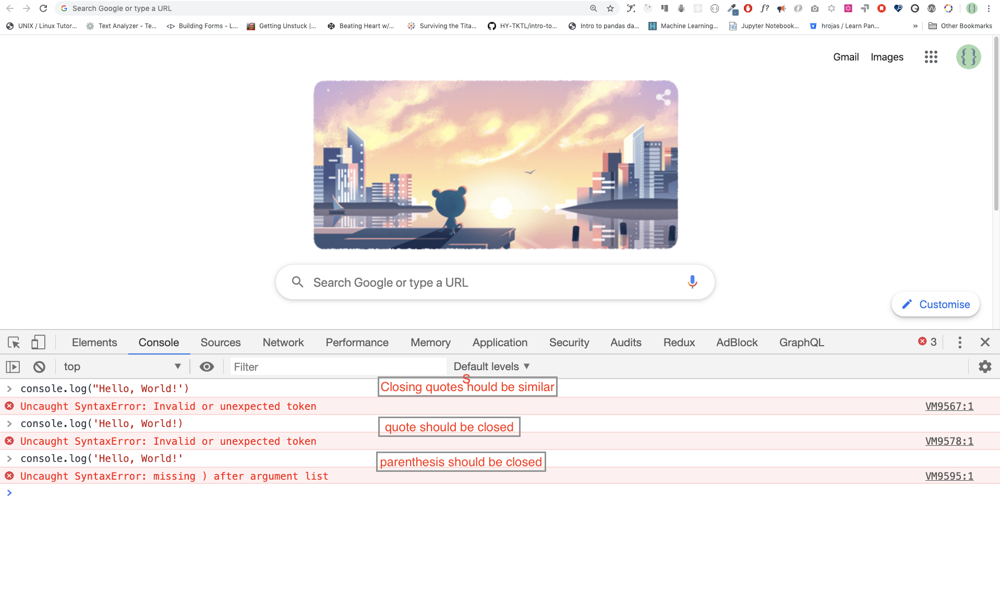
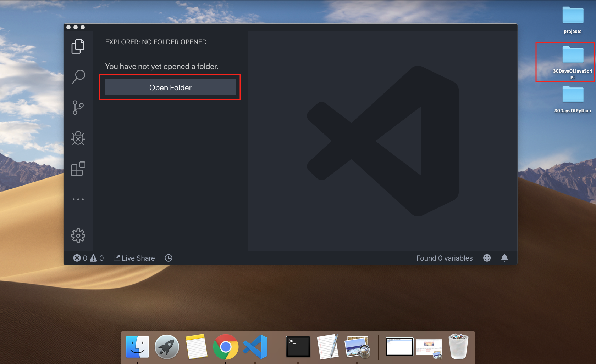

<div align="center">
  <h1> 30天的JavaScript之旅</h1>
  <a class="header-badge" target="_blank" href="https://www.linkedin.com/in/asabeneh/">
  
  </a>
  <a class="header-badge" target="_blank" href="https://twitter.com/Asabeneh">
  
  </a>

  <sub>Autor:
  <a href="https://www.linkedin.com/in/asabeneh/" target="_blank">Asabeneh Yetayeh</a><br>
  <small> Enero de 2020</small>
  </sub>

  <div>

  🇬🇧 [English](../readMe.md)
  🇪🇸 [Spanish](../Spanish/readme.md)
  🇷🇺 [Russian](../RU/README.md)
  ᴢʜ [Chinese](./README.md)

  </div>
</div>


- [30天的JavaScript之旅](#30天的JavaScript之旅)
- [📔 第一天](#-day-1)
  - [简介](#简介)
  - [必要条件](#必要条件)
  - [设置](#设置)
    - [安装 Node.js](#安装-nodejs)
    - [浏览器](#浏览器)
      - [安装chrome浏览器](#安装chrome浏览器)
      - [打开chrome浏览器控制台](#打开chrome浏览器控制台)
      - [在浏览器控制台上写代码](#在浏览器控制台上写代码)
        - [Console.log](#consolelog)
        - [带有多个参数的Console.log](#带有多个参数的consolelog)
        - [注释](#注释)
        - [语法](#语法)
      - [运算](#运算)
    - [代码编辑器](#代码编辑器)
      - [安装 Visual Studio Code](#安装-visual-studio-code)
      - [如何使用 Visual Studio Code](#如何使用-visual-studio-code)
  - [将JavaScript添加到网页中](#将javascript添加到网页中)
    - [内嵌式脚本](#内嵌式脚本)
    - [内部脚本](#内部脚本)
    - [外部脚本](#外部脚本)
    - [多个外部脚本](#多个外部脚本)
  - [数据类型介绍](#数据类型介绍)
    - [数值](#数值)
    - [字符串](#字符串)
    - [布尔值](#布尔值)
    - [Undefined](#undefined)
    - [Null](#null)
  - [检测数据类型](#检测数据类型)
  - [再次强调注释](#再次强调注释)
  - [变量](#变量)
- [💻 Day 1: 练习](#-day-1-练习)

# 📔 第一天

## 简介


**祝贺**您决定参加为期30天的 JavaScript 编程挑战。在这个挑战中，你将学到成为一名 JavaScript 程序员所需要的一切，总的来说，就是整个编程的概念。在挑战的最后，你将获得一个 30DaysOfJavaScript 编程挑战完成证书。如果你需要帮助或者你想帮助别人，你可以加入[电报组](https://t.me/ThirtyDaysOfJavaScript)。

**A 30DaysOfJavaScript** 挑战是为初学者和高级 JavaScript 开发人员提供的指南。欢迎来到 JavaScript 。JavaScript 是网络的语言。我喜欢使用和教授JavaScript，我希望你也会这样做。

在这个循序渐进的 JavaScript 挑战中，你将学习人类历史上最流行的编程语言--JavaScript。

JavaScript被用来 **_为网站增加互动性，开发移动应用、桌面应用、游戏_**，如今  JavaScript 还可以被用于 **_机器学习_** 和 **_人工智能_**。
近年来，**_JavaScript（JS）_** 越来越受欢迎，并连续六年成为领先的编程语言。
连续6年成为领先的编程语言，并且是 Github 上使用最多的编程语言。

## 必要条件

遵循这一挑战，不需要事先了解编程知识。你只需要:

1. 积极性
2. 电脑
3. 互联网
4. 浏览器
5. 代码编辑器

## 设置

我相信你有成为一名开发者的动机和强烈愿望。一台电脑和互联网。如果你有这些，那么你就有一切可以开始的东西。

### 安装 Node.js

你现在可能不需要node.js，但你以后可能需要它。
安装 [node.js](https://nodejs.org/en/).


下载后，双击并安装


我们可以通过打开设备终端或命令提示符来检查 node 是否安装在我们的本地机器上。

```sh
asabeneh $ node -v
v12.14.0
```

制作本教程时，我使用的是12.14.0版本的 node，但现在 node.js 的推荐下载版本是12.17.0。

### 浏览器

现在有很多浏览器。然而，我强烈推荐谷歌浏览器。

#### 安装chrome浏览器

如果你还没有 [chrome浏览器](https://www.google.com/chrome/)，请安装。我们可以在浏览器控制台编写小的 JavaScript 代码，但我们不使用浏览器控制台来开发应用程序。


#### 打开chrome浏览器控制台

你可以通过点击浏览器右上角的三个点，选择 _更多工具->开发工具_ 或使用键盘快捷键来打开浏览器控制台。我更喜欢使用快捷键。


使用键盘快捷方式打开 Chrome 浏览器的控制台。

```sh
Mac
Command+Option+J

Windows/Linux:
Ctl+Shift+J
```


在你打开 chrome 浏览器的控制台后，尝试探索标记的按钮。我们将在控制台中花费大部分时间。控制台是你的 JavaScript 代码所处的地方。Google Console V8 引擎会将你的 JavaScript 代码变成机器代码。
让我们在 chrome 浏览器的控制台写一段 JavaScript 代码:


#### 在浏览器控制台上写代码

我们可以在 Chrome 控制台或任何浏览器控制台编写任何JavaScript代码。但是，在这个挑战中，我们只关注谷歌浏览器的控制台。用以下方法打开控制台:

```sh
Mac
Command+Option+I

Windows:
Ctl+Shift+I
```

##### Console.log

为了编写我们的第一段 JavaScript 代码，我们使用了一个内置函数**console.log()**。我们传递了一个参数作为输入数据，然后函数显示输出。我们在 console.log() 函数中传递了'Hello, World'作为输入数据或参数。

```js
console.log('Hello, World!')
```

##### 带有多个参数的Console.log

**conole.log()**函数可以接受用逗号分隔的多个参数。其语法如下：**console.log(param1, param2, param3)**


```js
console.log('Hello', 'World', '!')
console.log('HAPPY', 'NEW', 'YEAR', 2020)
console.log('Welcome', 'to', 30, 'Days', 'Of', 'JavaScript')
```

正如你从上面的代码片段中看到的，_console.log()_ 可以接受多个参数。

祝贺你! 你用 _console.log()_ 写了你的第一段JavaScript代码。

##### 注释

我们在代码中添加注释。注释是非常重要的，它可以使代码更有可读性，也可以在我们的代码中留下备注。JavaScript 不会执行我们代码中的注释部分。在 JavaScript 中，任何以 `//` 开头的文本行都是注释，任何像这样被括起来的`/* * */`也是注释。

**示例: 单行注释**

// This is the first comment  
 // This is the second comment  
 // I am a single line comment

**示例: 多行注释**

/*
This is a multiline comment  
 Multiline comments can take multiple lines  
 JavaScript is the language of the web  
 */

##### 语法

编程语言与人类语言相似。英语或许多其他语言使用单词、短语、句子、复合句子和其他更多的东西来传达一个有意义的信息。句法的英文含义是 _在一种语言中对单词和短语的安排，以创造良好的句子_。语法的技术定义是 _计算机语言中的语句结构_ 编程语言有语法。 JavaScript 是一种编程语言，和其他编程语言一样，它有自己的语法。如果我们不写一个 JavaScript 能理解的语法，它就会产生不同类型的错误。我们将在后面探讨不同类型的 JavaScript 错误。现在，让我们来看看语法错误。



我故意犯了一个错误。结果，控制台提出了语法错误。实际上，语法的信息量很大。它告知了所犯错误的类型。通过阅读错误反馈准则，我们可以纠正语法并解决问题。识别和消除程序中的错误的过程被称为调试。让我们来解决这些错误:

```js
console.log('Hello, World!')
console.log('Hello, World!')
```

到目前为止，我们看到了如何使用 _console.log()_ 来显示文本。如果我们使用 _console.log()_ 打印文本或字符串，文本必须在单引号、双引号或反斜线引号内。
**示例:**

```js
console.log('Hello, World!')
console.log('Hello, World!')
console.log(`Hello, World!`)
```

#### 运算

现在，让我们多练习一下在 chrome 控制台使用 _console.log()_ 来编写数字数据类型的 JavaScript 代码。
除了文字之外，我们还可以用 JavaScript 进行数学计算。让我们来做以下简单的计算。
控制台可以直接接受参数，不需要**_console.log()_**函数。然而，在这个介绍中包括了它，因为这个挑战大部分是在文本编辑器中进行的，在那里必须使用该函数。你可以直接使用控制台的指令进行游戏。


```js
console.log(2 + 3) // Addition
console.log(3 - 2) // Subtraction
console.log(2 * 3) // Multiplication
console.log(3 / 2) // Division
console.log(3 % 2) // Modulus - finding remainder
console.log(3 ** 2) // Exponentiation 3 ** 2 == 3 * 3
```

### 代码编辑器

我们可以在浏览器的控制台上写代码，但对于较大的项目来说，这是不可能的。在真实的工作环境中，开发人员会使用不同的代码编辑器来编写代码。在这个30天 JavaScript 挑战中，我们将使用 Visual Studio Code。

#### 安装 Visual Studio Code

Visual studio code是一个非常流行的开源文本编辑器。我建议使用[Visual Studio Code](https://code.visualstudio.com/)，但如果你赞成使用其他编辑器，请随意使用你的东西。


如果你安装了Visual Studio Code，让我们开始使用它。

#### 如何使用 Visual Studio Code

通过双击Visual Studio Code的图标来打开它。当你打开它时，你会得到这样的界面。试着与标记的图标互动。





## 将JavaScript添加到网页中

可以通过三种不同的方式将JavaScript添加到网页上:

- **_Inline script_**
- **_Internal script_**
- **_External script_**
- **_Multiple External scripts_**

以下部分显示了将 JavaScript 代码添加到你的网页的不同方法。

### 内嵌式脚本

在你的桌面或任何位置创建一个项目文件夹，命名为30DaysOfJS，并在项目文件夹中创建一个**_index.html_**文件。然后粘贴以下代码并在浏览器中打开，例如[Chrome](https://www.google.com/chrome/)。

```html
<!DOCTYPE html>
<html>
  <head>
    <title>30DaysOfScript:Inline Script</title>
  </head>
  <body>
    <button onclick="alert('Welcome to 30DaysOfJavaScript!')">Click Me</button>
  </body>
</html>
```

现在，你刚刚写了你的第一个内嵌脚本。我们可以使用 _alert()_ 内置函数创建一个弹出式警报信息。

### 内部脚本

内部脚本可以写在 _head_ 或 _body_ 中，但最好把它放在HTML文档的body中。
首先，让我们写在页面的头部部分。

```html
<!DOCTYPE html>
<html>
  <head>
    <title>30DaysOfScript:Internal Script</title>
    <script>
      console.log('Welcome to 30DaysOfJavaScript')
    </script>
  </head>
  <body></body>
</html>
```

大多数时候，我们就是这样写内部脚本的。将JavaScript代码写在正文部分是最理想的选择。打开浏览器的控制台，看看 console.log() 的输出情况

```html
<!DOCTYPE html>
<html>
  <head>
    <title>30DaysOfScript:Internal Script</title>
  </head>
  <body>
    <button onclick="alert('Welcome to 30DaysOfJavaScript!');">Click Me</button>
    <script>
      console.log('Welcome to 30DaysOfJavaScript')
    </script>
  </body>
</html>
```

打开浏览器的控制台，查看 console.log() 的输出。


### 外部脚本

与内部脚本类似，外部脚本链接可以放在标题或正文中，但最好放在正文中。
首先，我们应该创建一个扩展名为 .js 的外部 JavaScript 文件。。所有以.js结尾的文件都是JavaScript文件。在你的项目目录内创建一个名为 introduction.js 的文件，并写下以下代码，在正文的底部链接这个 .js 文件。

```js
console.log('Welcome to 30DaysOfJavaScript')
```

外部脚本在 _head_ 中:

```html
<!DOCTYPE html>
<html>
  <head>
    <title>30DaysOfJavaScript:External script</title>
    <script src="introduction.js"></script>
  </head>
  <body></body>
</html>
```

外部脚本在 _body_ 中:

```html
<!DOCTYPE html>
<html>
  <head>
    <title>30DaysOfJavaScript:External script</title>
  </head>
  <body>
    //it could be in the header or in the body // Here is the recommended place
    to put the external script
    <script src="introduction.js"></script>
  </body>
</html>
```

打开浏览器控制台，查看 console.log() 的输出。

### 多个外部脚本

我们还可以将多个外部 JavaScript 文件链接到一个网页上。
在30DaysOfJS文件夹内创建一个helloworld.js文件，并编写以下代码。

```js
console.log('Hello, World!')
```

```html
<!DOCTYPE html>
<html>
  <head>
    <title>Multiple External Scripts</title>
  </head>
  <body>
    <script src="./helloworld.js"></script>
    <script src="./introduction.js"></script>
  </body>
</html>
```

_你的 main.js 文件应该在所有其他脚本的下面_。记住这一点是非常重要的。


## 数据类型介绍

在 JavaScript 和其他编程语言中，有不同种类的数据类型。以下是 JavaScript 的原始数据类型：_String, Number, Boolean, undefined, Null_, and _Symbol_。

### 数值

- Integers: 整数（负数、零数和正数）。
  例如:
  ... -3, -2, -1, 0, 1, 2, 3 ...
- Float-point numbers: 小数点后的数字
  例如:
  ... -3.5, -2.25, -1.0, 0.0, 1.1, 2.2, 3.5 ...

### 字符串

两个单引号、双引号或反斜线之间的一个或多个字符的集合。
**例如:**

```js
'Asabeneh'
'Finland'
'JavaScript is a beautiful programming language'
'I love teaching'
'I hope you are enjoying the first day'`We can also create a string using a backtick`
;('A string could be just as small as one character as big as many pages')
```

### 布尔值

一个布尔值要么是真，要么是假。任何比较都会返回一个布尔值，即真或假。

布尔数据类型是一个真或假的值。

**例如:**

```js
true // if the light on ,the value is true
false // if the light off, the value is false
```

### Undefined

在 JavaScript中，如果我们不给一个变量赋值，这个值就是未定义的。除此之外，如果一个函数没有返回任何东西，它就会返回 undefined。

```js
let firstName
console.log(firstName) //not defined, because it is not assigned to a value yet
```

### Null

在 JavaScript 中，Null意味着一个空值。

```js
let emptyValue = null
```

## 检测数据类型

为了检测某个变量的数据类型，我们使用**typeof**操作符。请看下面的例子。

```js
console.log(typeof 'Asabeneh') // string
console.log(typeof 5) // number
console.log(typeof true) // boolean
console.log(typeof null) // object type
console.log(typeof undefined) // undefined
```

## 再次强调注释

记住，JavaScript 中的注释与其他编程语言类似。注释对于使你的代码更具有可读性非常重要。
有两种注释的方式。

- _单行注释_
- _多行注释_

```js
// commenting the code itself with a single comment
// let firstName = 'Asabeneh'; single line comment
// let lastName = 'Yetayeh'; single line comment
```

多行注释:

```js
/*
    let location = 'Helsinki';
    let age = 100;
    let isMarried = true;
    This is a Multiple line comment
    */
```

## 变量

变量是数据的 _容器_。变量是用来将数据 _存储_ 在内存位置的。当一个变量被声明时，一个内存位置被保留。当一个变量被分配到一个值（数据）时，内存空间将被该数据填满。为了声明一个变量，我们使用 _var_、_let_ 或 _const_ 等关键字。

对于一个在不同时间变化的变量，我们使用 _let_。如果数据完全没有变化，我们使用 _const_。例如，PI、国家名称、重力都没有变化，我们可以使用 _const_。在这个挑战中，我们不会使用 var，我也不建议你使用它。它是一种容易出错的声明变量的方式，有很多漏洞。我们将在其他章节（范围）中详细讨论 var、let 和 const 的问题。现在，上面的解释已经足够了。

一个有效的JavaScript变量名必须遵循以下规则:

- 一个 JavaScript 变量名不应该以数字开头。
- 除了美元符号和下划线之外，JavaScript 变量名称不允许使用特殊字符。
- 一个 JavaScript 变量名遵循驼峰命名。
- 一个 JavaScript 变量的名称不应该在单词之间有空格。

以下是有效的 JavaScript 变量的例子。

```js
firstName
lastName
country
city
capitalCity
age
isMarried

first_name
last_name
is_married
capital_city

num1
num_1
_num_1
$num1
year2020
year_2020
```

列表中的第一个和第二个变量遵循在 JavaScrip 中变量声明采用 `小驼峰` 惯例。在本材料中，我们将使用 `小驼峰` 变量。

无效变量的例子:

```sh
  first-name
  1_num
  num_#_1
```


让我们来声明不同数据类型的变量。要声明一个变量，我们需要在变量名称前使用 _let_  或 _const_ 关键字。在变量名称后面，我们写一个等号（赋值运算符），和一个值（分配的数据）。

```js
// Syntax
let nameOfVariable = value
```

**声明变量的例子**

```js
// 声明不同数据类型的不同变量
let firstName = 'Asabeneh' // 人名
let lastName = 'Yetayeh' // 姓氏
let country = 'Finland' // 国家
let city = 'Helsinki' // 首都
let age = 100 // 年龄
let isMarried = true

console.log(firstName, lastName, country, city, age, isMarried)
```

```sh
Asabeneh Yetayeh Finland Helsinki 100 True
```

```js
// 声明具有数值的变量
let age = 100 // 年龄
const gravity = 9.81 // 地心引力 m/s2
const boilingPoint = 100 // 水的沸点，维度为 oC
const PI = 3.14 // 几何常量

console.log(gravity, boilingPoint, PI)
```

```sh
9.81 100 3.14
```

```js
// 变量也可以在一行中声明，用逗号隔开
let name = 'Asabeneh', // name of a person
  job = 'teacher',
  live = 'Finland'
console.log(name, job, live)
```

```sh
Asabeneh teacher Finland
```

当你运行01-Day文件夹中的 _index.html_ 文件时，你应该得到这个结果:


🌕 你真了不起! 你刚刚完成了第一天的挑战，你正在走向伟大的道路上。现在为你的大脑和肌肉做一些练习。

# 💻 Day 1: 练习

1. 写一个单行注释，上面写着：_注释可以使代码变得可读_
2. 再写一条注释，内容是：_欢迎来到30DaysOfJavaScript_。
3. 写一个多行注释，说：_注释可以使代码可读，易于重复使用_
   _和信息量大_。
4. 创建一个 variable.js 文件，声明变量并指定字符串、布尔值、undefined 和 null 的数据类型
5. 重新创建 datatypes.js 文件，并使用 JavaScript **_typeof_** 操作符来检查不同的数据类型。检查每个变量的数据类型
6. 声明四个变量而不赋值
7. 声明四个变量，并分配数值
8. 声明变量，在多行中存储你的名字、姓氏、婚姻状况、国家和年龄。
9. 声明变量，在一行中存储你的名字、姓氏、婚姻状况、国家和年龄。
10. 声明两个变量 _myAge_ 和 _yourAge_，给它们分配初始值并记录到浏览器控制台。

```sh
I am 25 years old.
You are 30 years old.
```

🎉 恭喜您 ! 🎉

[Day 2 >>](./02_Day_Data_types/02_day_data_types.md)
